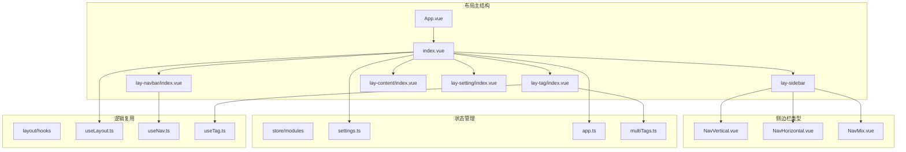
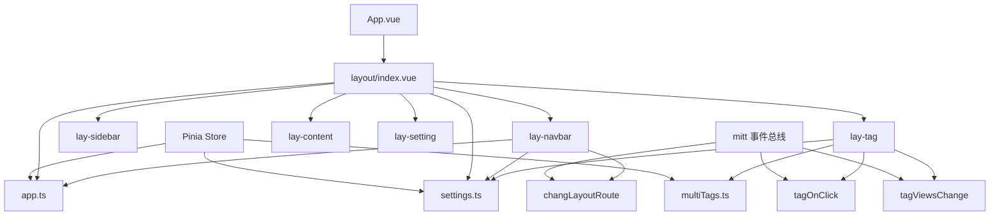
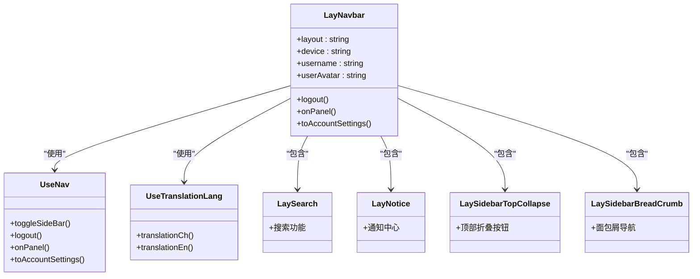
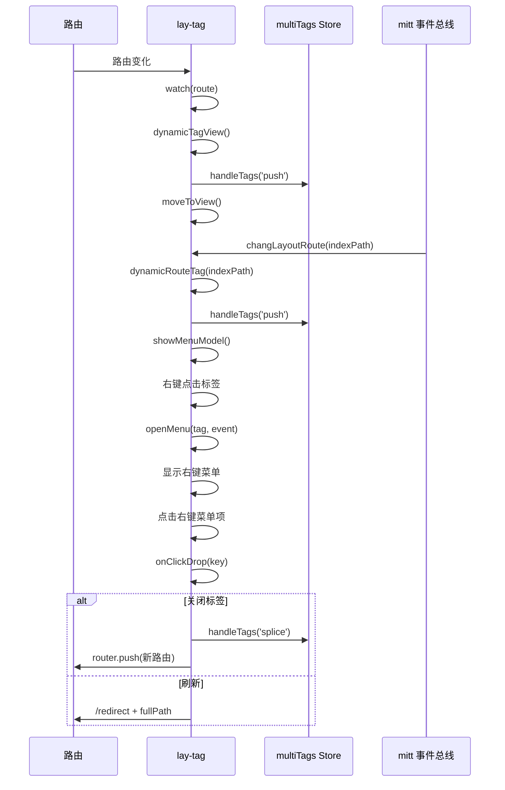
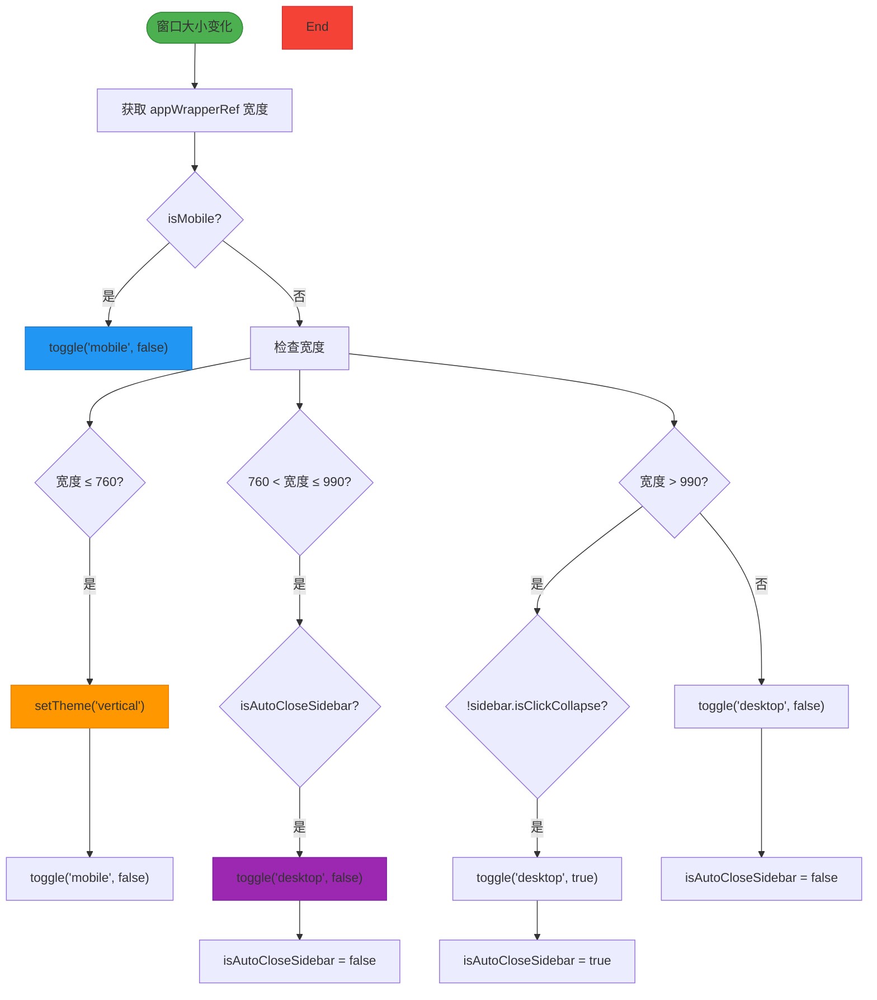
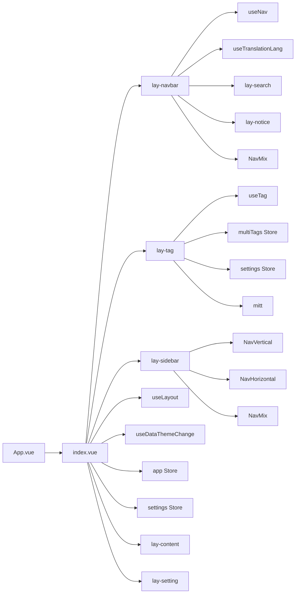

# 布局组件

<cite>
**本文档引用文件**  
- [App.vue](file://web/src/App.vue)
- [index.vue](file://web/src/layout/index.vue)
- [lay-navbar/index.vue](file://web/src/layout/components/lay-navbar/index.vue)
- [lay-tag/index.vue](file://web/src/layout/components/lay-tag/index.vue)
- [lay-sidebar/NavVertical.vue](file://web/src/layout/components/lay-sidebar/NavVertical.vue)
- [lay-sidebar/NavHorizontal.vue](file://web/src/layout/components/lay-sidebar/NavHorizontal.vue)
- [useLayout.ts](file://web/src/layout/hooks/useLayout.ts)
- [useNav.ts](file://web/src/layout/hooks/useNav.ts)
- [useTag.ts](file://web/src/layout/hooks/useTag.ts)
- [settings.ts](file://web/src/store/modules/settings.ts)
- [app.ts](file://web/src/store/modules/app.ts)
- [multiTags.ts](file://web/src/store/modules/multiTags.ts)
</cite>

## 目录
1. [简介](#简介)
2. [项目结构](#项目结构)
3. [核心组件](#核心组件)
4. [架构概述](#架构概述)
5. [详细组件分析](#详细组件分析)
6. [依赖分析](#依赖分析)
7. [性能考虑](#性能考虑)
8. [故障排除指南](#故障排除指南)
9. [结论](#结论)

## 简介
本文件详细描述了 `vue-pure-admin-all` 项目的布局组件架构。重点分析了侧边栏（lay-sidebar）、导航栏（lay-navbar）、标签页（lay-tag）、通知中心（lay-notice）和设置面板（lay-setting）的实现机制。文档解释了 App.vue 如何集成 layout 组件，以及 layout 内部各子组件的组织关系与通信模式。同时涵盖响应式设计、主题适配、动态配置能力、props/events/插槽使用方法、状态管理策略及自定义扩展指南。

## 项目结构
`vue-pure-admin-all` 的布局系统位于 `web/src/layout` 目录下，采用模块化设计，将不同功能区域拆分为独立组件，并通过 hooks 和 store 进行状态管理与逻辑复用。

**图源**  
- [App.vue](file://web/src/App.vue)
- [index.vue](file://web/src/layout/index.vue)
- [lay-sidebar](file://web/src/layout/components/lay-sidebar)
- [hooks](file://web/src/layout/hooks)
- [store/modules](file://web/src/store/modules)

**本节来源**  
- [web/src/layout](file://web/src/layout)
- [web/src/App.vue](file://web/src/App.vue)

## 核心组件
布局系统由多个核心组件构成，包括 `lay-navbar`（导航栏）、`lay-tag`（标签页）、`lay-sidebar`（侧边栏）、`lay-content`（内容区）和 `lay-setting`（设置面板）。这些组件通过 Pinia store 和 mitt 事件总线进行状态同步与通信。`useLayout`、`useNav` 和 `useTag` 等组合式函数封装了通用逻辑，实现了响应式布局切换、菜单控制和标签管理等功能。

**本节来源**  
- [index.vue](file://web/src/layout/index.vue)
- [useLayout.ts](file://web/src/layout/hooks/useLayout.ts)
- [useNav.ts](file://web/src/layout/hooks/useNav.ts)
- [useTag.ts](file://web/src/layout/hooks/useTag.ts)

## 架构概述
整个布局系统以 `App.vue` 为根容器，通过 `<router-view />` 渲染 `layout/index.vue`。`index.vue` 作为布局主组件，根据当前设备类型和用户配置，动态渲染垂直、水平或混合布局。各子组件通过 Pinia store（如 `app`、`settings`）共享状态，并利用 `mitt` 事件总线进行跨组件通信（如标签页刷新、布局切换）。

**图源**  
- [App.vue](file://web/src/App.vue)
- [index.vue](file://web/src/layout/index.vue)
- [settings.ts](file://web/src/store/modules/settings.ts)
- [app.ts](file://web/src/store/modules/app.ts)
- [multiTags.ts](file://web/src/store/modules/multiTags.ts)

## 详细组件分析

### 导航栏 (lay-navbar) 分析
`lay-navbar` 组件位于页面顶部，包含面包屑、搜索框、国际化、全屏、通知、用户信息和设置入口。其行为根据当前布局模式（vertical、horizontal、mix）和设备类型（桌面/移动）动态调整。

#### 组件关系图

**图源**  
- [lay-navbar/index.vue](file://web/src/layout/components/lay-navbar/index.vue)
- [useNav.ts](file://web/src/layout/hooks/useNav.ts)
- [useTranslationLang.ts](file://web/src/layout/hooks/useTranslationLang.ts)

**本节来源**  
- [lay-navbar/index.vue](file://web/src/layout/components/lay-navbar/index.vue)

### 标签页 (lay-tag) 分析
`lay-tag` 组件实现多标签页管理，支持标签滚动、右键菜单、关闭操作、内容区全屏等功能。标签状态由 `multiTags` store 统一管理，通过 `mitt` 事件监听路由变化。

#### 标签页交互流程

**图源**  
- [lay-tag/index.vue](file://web/src/layout/components/lay-tag/index.vue)
- [multiTags.ts](file://web/src/store/modules/multiTags.ts)

**本节来源**  
- [lay-tag/index.vue](file://web/src/layout/components/lay-tag/index.vue)

### 侧边栏 (lay-sidebar) 分析
侧边栏提供 `NavVertical`（垂直）、`NavHorizontal`（水平）和 `NavMix`（混合）三种模式，通过 `useLayout` hook 和 `app` store 控制展开/折叠状态。移动端通过遮罩层实现菜单收起。

#### 响应式布局切换逻辑

**图源**  
- [index.vue](file://web/src/layout/index.vue)
- [useLayout.ts](file://web/src/layout/hooks/useLayout.ts)

**本节来源**  
- [index.vue](file://web/src/layout/index.vue)

## 依赖分析
布局组件依赖于多个内部模块和外部库，形成清晰的依赖关系网。

**图源**  
- [index.vue](file://web/src/layout/index.vue)
- [lay-navbar/index.vue](file://web/src/layout/components/lay-navbar/index.vue)
- [lay-tag/index.vue](file://web/src/layout/components/lay-tag/index.vue)
- [store/modules](file://web/src/store/modules)
- [layout/hooks](file://web/src/layout/hooks)

**本节来源**  
- [web/src/layout](file://web/src/layout)
- [web/src/store/modules](file://web/src/store/modules)

## 性能考虑
布局系统在性能方面进行了多项优化：
- 使用 `useResizeObserver` 替代频繁的 `window.onresize` 事件，减少重排重绘。
- 标签页滚动采用 `requestAnimationFrame` 实现平滑滚动动画。
- 通过 `mitt` 事件总线解耦组件通信，避免深层 prop 传递。
- 利用 Pinia store 集中管理状态，确保数据一致性并减少重复计算。
- 组件按需加载，结合 Vue 的 `<keep-alive>` 机制提升多标签页切换体验。

## 故障排除指南
常见问题及解决方案：

| 问题现象 | 可能原因 | 解决方案 |
|--------|--------|--------|
| 移动端菜单无法关闭 | 遮罩层点击事件未绑定 | 检查 `app-mask` 的 `@click` 事件是否调用 `toggleSideBar` |
| 标签页右键菜单不显示 | `visible` 状态未正确更新 | 检查 `openMenu` 函数中 `nextTick` 后 `visible.value = true` 是否执行 |
| 布局未随窗口大小自动切换 | `useResizeObserver` 未正确监听 | 确认 `appWrapperRef` 已正确绑定到根元素 |
| 国际化切换无效 | `locale` 状态未同步 | 检查 `useTranslationLang` 中的 `translationCh`/`translationEn` 是否更新了 `locale` |
| 标签页无法滚动 | `translateX` 计算错误 | 检查 `moveToView` 函数中 `scrollbarDomWidth` 和 `tabDomWidth` 的计算逻辑 |

**本节来源**  
- [index.vue](file://web/src/layout/index.vue)
- [lay-tag/index.vue](file://web/src/layout/components/lay-tag/index.vue)
- [lay-navbar/index.vue](file://web/src/layout/components/lay-navbar/index.vue)

## 结论
`vue-pure-admin-all` 的布局组件设计精良，采用组合式 API 和模块化架构，实现了高内聚、低耦合的组件体系。通过 Pinia 管理全局状态，`mitt` 实现事件通信，`useResizeObserver` 优化性能，构建了一个响应式、可配置、易扩展的管理后台布局框架。开发者可基于现有 hooks 和 store 快速定制个性化布局，满足多样化业务需求。