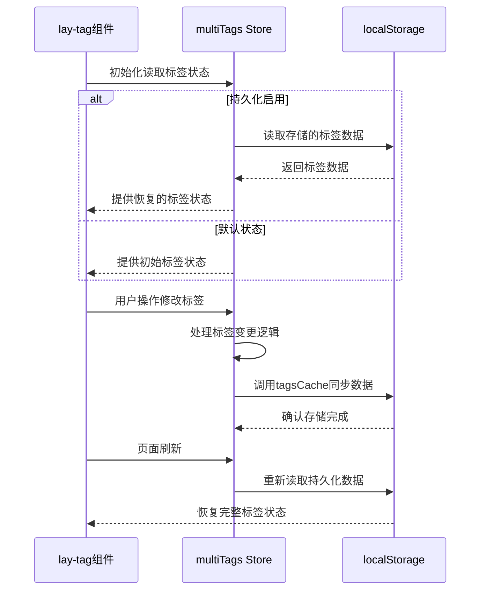
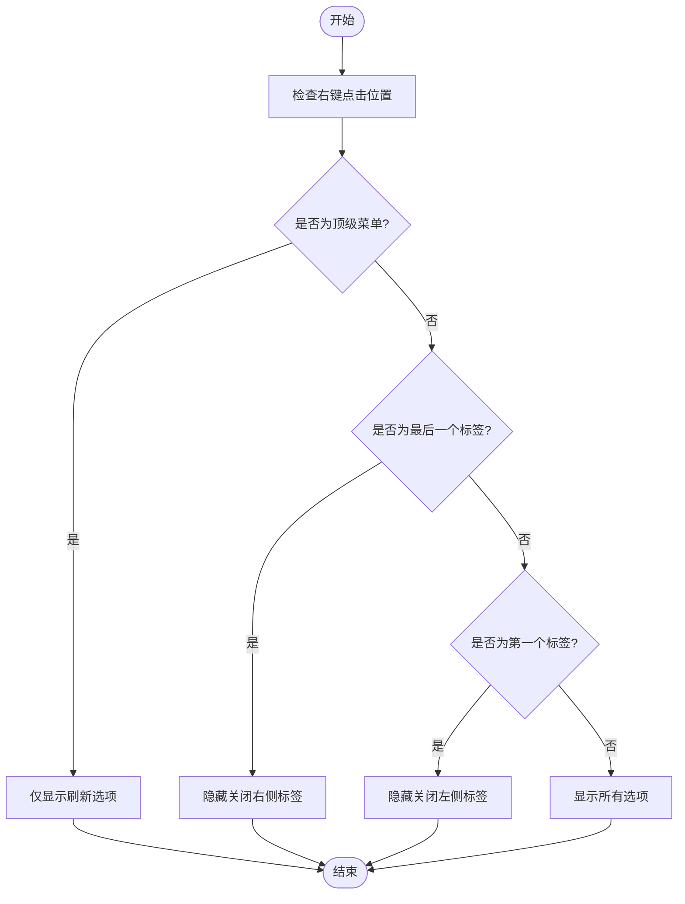

# 标签页

<cite>
**Referenced Files in This Document**   
- [index.vue](file://web/src/layout/components/lay-tag/index.vue)
- [TagChrome.vue](file://web/src/layout/components/lay-tag/components/TagChrome.vue)
- [multiTags.ts](file://web/src/store/modules/multiTags.ts)
- [useTag.ts](file://web/src/layout/hooks/useTag.ts)
- [index.ts](file://web/src/config/index.ts)
</cite>

## 目录
1. [标签管理机制](#标签管理机制)
2. [浏览器标签式视觉效果](#浏览器标签式视觉效果)
3. [状态同步与持久化](#状态同步与持久化)
4. [交互功能实现](#交互功能实现)
5. [配置与扩展](#配置与扩展)

## 标签管理机制

lay-tag组件实现了完整的标签页管理功能，包括标签的添加、关闭、切换等核心操作。组件通过Pinia状态管理库中的multiTags模块来维护标签页状态，确保标签数据的一致性和可追踪性。

当用户导航到新页面时，系统会自动调用`handleTags("push")`方法将新路由信息添加到标签列表中。在添加前，系统会进行多重检查：验证标签是否已存在、检查路由的query和params参数是否相等、确认动态路由的最大打开数量限制等，避免重复标签的产生。

标签的关闭操作提供了多种方式：关闭当前标签、关闭左侧标签、关闭右侧标签、关闭其他标签和关闭全部标签。这些操作通过`handleTags("splice")`方法实现，根据不同的关闭策略计算出需要删除的标签索引范围，并从状态中移除相应标签。

**Section sources**
- [index.vue](file://web/src/layout/components/lay-tag/index.vue#L212-L263)
- [multiTags.ts](file://web/src/store/modules/multiTags.ts#L82-L115)

## 浏览器标签式视觉效果

TagChrome.vue组件通过SVG技术实现了浏览器标签式的视觉效果。组件使用SVG的`<symbol>`元素定义了标签的几何形状，通过`<use>`元素复用这些形状，创建出逼真的浏览器标签外观。

标签的视觉设计采用了左右对称的结构，左侧和右侧分别使用独立的SVG符号，通过CSS的`scale(-1, 1)`变换实现镜像效果。这种设计确保了标签在不同位置都能保持一致的视觉风格。标签的背景通过`<svg>`元素的`width`和`height`属性控制，与父容器保持100%的尺寸匹配。

在lay-tag组件中，当`showModel`设置为"chrome"时，会渲染TagChrome组件作为标签背景，同时显示标签标题和关闭按钮。这种设计不仅提供了美观的视觉效果，还保持了良好的用户体验。

```mermaid
svg
<svg class="w-full h-full">
<defs>
<symbol id="geometry-left" viewBox="0 0 214 36">
<path d="M17 0h197v36H0v-2c4.5 0 9-3.5 9-8V8c0-4.5 3.5-8 8-8z" />
</symbol>
<symbol id="geometry-right" viewBox="0 0 214 36">
<use xlink:href="#geometry-left" />
</symbol>
<clipPath>
<rect width="100%" height="100%" x="0" />
</clipPath>
</defs>
<svg width="51%" height="100%">
<use
xlink:href="#geometry-left"
width="214"
height="36"
fill="currentColor"
/>
</svg>
<g transform="scale(-1, 1)">
<svg width="51%" height="100%" x="-100%" y="0">
<use
xlink:href="#geometry-right"
width="214"
height="36"
fill="currentColor"
/>
</svg>
</g>
</svg>
```

**Diagram sources**
- [TagChrome.vue](file://web/src/layout/components/lay-tag/components/TagChrome.vue#L1-L34)

**Section sources**
- [TagChrome.vue](file://web/src/layout/components/lay-tag/components/TagChrome.vue#L1-L34)
- [index.vue](file://web/src/layout/components/lay-tag/index.vue#L597-L638)

## 状态同步与持久化

标签页的状态管理通过Pinia的multiTags模块实现，该模块与组件状态保持实时同步。multiTags模块不仅存储当前打开的标签页信息，还支持标签状态的持久化功能。

持久化功能由`multiTagsCache`配置项控制，当该配置启用时，标签状态会被存储在浏览器的localStorage中。系统使用`responsiveStorageNameSpace()`函数生成存储键名，确保不同环境下的存储隔离。在页面刷新或重新打开时，系统会从localStorage中读取之前的标签状态，实现状态的自动恢复。

状态同步机制通过`tagsCache`方法实现，该方法在标签状态发生变化时被调用，将最新的标签数据同步到持久化存储中。同时，组件在初始化时会检查`multiTagsCache`配置，决定是从持久化存储中恢复状态还是使用默认的初始状态。



**Diagram sources**
- [multiTags.ts](file://web/src/store/modules/multiTags.ts#L44-L84)
- [index.ts](file://web/src/config/index.ts#L48-L55)

**Section sources**
- [multiTags.ts](file://web/src/store/modules/multiTags.ts#L1-L48)
- [index.ts](file://web/src/config/index.ts#L48-L55)

## 交互功能实现

### 拖拽排序功能

标签页支持拖拽排序功能，用户可以通过拖拽标签来重新排列它们的顺序。该功能通过监听鼠标事件和触摸事件实现，当用户开始拖拽时，系统会记录起始位置和当前标签，随着鼠标移动实时计算新的位置，并在释放时更新标签的顺序。

拖拽过程中，系统会添加"grabbing"光标样式，提示用户当前处于拖拽状态。同时，通过`requestAnimationFrame`实现平滑的动画效果，确保用户体验流畅。

### 右键菜单操作

标签页支持丰富的右键菜单操作，包括刷新、关闭当前标签、关闭左侧标签、关闭右侧标签、关闭其他标签和内容区全屏等。右键菜单的显示逻辑会根据当前标签的位置和状态动态调整：

- 当右键菜单为顶级菜单或具有fixedTag属性时，只显示刷新选项
- 当当前路由是所有路由中的最后一个时，不显示"关闭右侧标签"选项
- 当只有两个标签时，不显示"关闭其他标签"选项
- 当前路由为顶级菜单时，禁用所有关闭操作

菜单的位置计算考虑了容器边界，确保菜单不会超出可视区域。

### 激活状态视觉反馈

系统为当前激活的标签提供了明显的视觉反馈。通过`linkIsActive`计算属性判断当前路由与标签路径的匹配关系，为匹配的标签添加"is-active"类名。同时，鼠标悬停时会触发动画效果，通过`onMouseenter`和`onMouseleave`方法切换"schedule-in"和"schedule-out"类名，实现平滑的过渡动画。



**Diagram sources**
- [index.vue](file://web/src/layout/components/lay-tag/index.vue#L431-L468)
- [useTag.ts](file://web/src/layout/hooks/useTag.ts#L150-L180)

**Section sources**
- [index.vue](file://web/src/layout/components/lay-tag/index.vue#L431-L468)
- [useTag.ts](file://web/src/layout/hooks/useTag.ts#L150-L180)

## 配置与扩展

### 状态恢复逻辑

标签页在页面刷新后的状态恢复逻辑由`multiTagsCache`配置项控制。当该配置启用时，系统会在应用初始化时从localStorage中读取之前保存的标签状态。恢复过程发生在multiTags模块的state初始化阶段，通过`storageLocal().getItem()`方法获取存储的数据。

如果持久化存储中存在标签数据，则使用这些数据作为初始状态；否则，使用默认的初始标签集合，包括固定标签和具有fixedTag属性的路由。这种设计确保了用户在刷新页面后能够恢复到之前的工作状态。

### 显示/隐藏控制

标签页的显示和隐藏行为可以通过配置进行控制。系统使用`hideTabs`配置项来决定是否显示标签栏，该配置存储在localStorage中，支持用户偏好设置的持久化。同时，`showModel`配置项控制标签的显示风格，支持"smart"（灵动模式）和"card"（卡片模式）等多种样式。

### 自定义扩展方法

系统提供了多种自定义标签样式和交互行为的扩展方法：

1. **样式扩展**：通过SCSS变量和CSS类名自定义标签外观，支持修改颜色、字体、间距等视觉属性
2. **行为扩展**：通过事件总线(emitter)监听和触发自定义事件，如"tagOnClick"事件可用于在标签切换时执行特定逻辑
3. **功能扩展**：通过`tagsViews`数组添加自定义右键菜单项，支持扩展新的操作功能
4. **动画扩展**：通过修改CSS过渡属性自定义标签切换和悬停动画效果

这些扩展机制使得标签组件具有良好的可定制性，能够满足不同应用场景的需求。

**Section sources**
- [multiTags.ts](file://web/src/store/modules/multiTags.ts#L111-L144)
- [index.ts](file://web/src/config/index.ts#L30-L47)
- [useTag.ts](file://web/src/layout/hooks/useTag.ts#L200-L248)