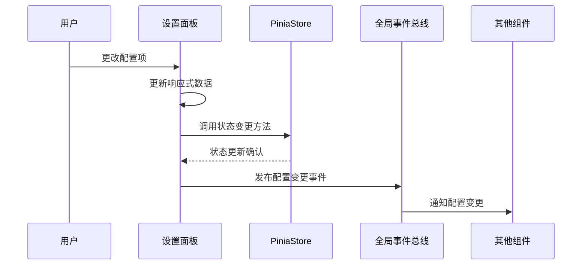
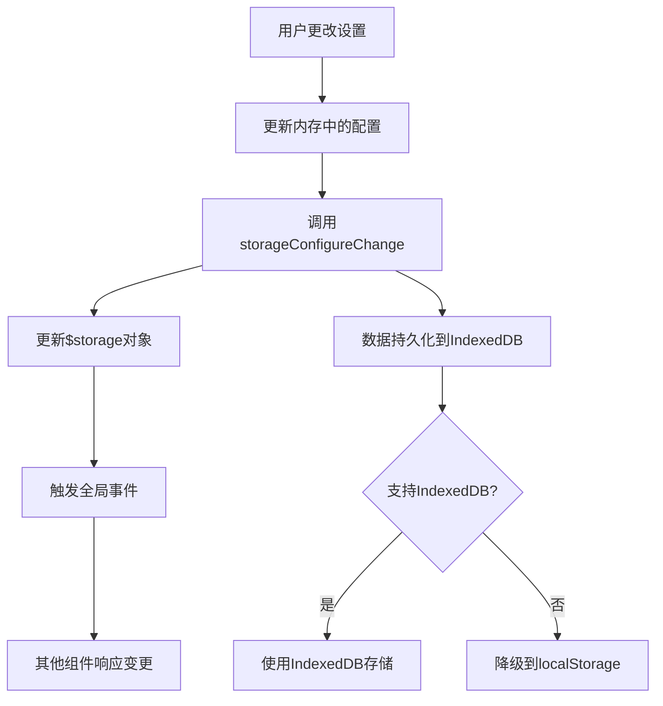
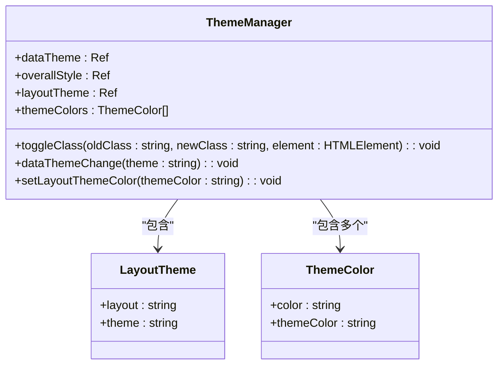

# 设置面板

<cite>
**本文档中引用的文件**
- [index.vue](file://web/src/layout/components/lay-setting/index.vue)
- [settings.ts](file://web/src/store/modules/settings.ts)
- [theme.scss](file://web/src/style/theme.scss)
- [index.ts](file://web/src/utils/localforage/index.ts)
</cite>

## 目录
1. [简介](#简介)
2. [核心功能](#核心功能)
3. [UI配置项详解](#ui配置项详解)
4. [状态管理与双向绑定](#状态管理与双向绑定)
5. [本地存储集成](#本地存储集成)
6. [主题颜色动态切换机制](#主题颜色动态切换机制)
7. [交互行为与事件流](#交互行为与事件流)
8. [扩展自定义设置项指南](#扩展自定义设置项指南)
9. [结论](#结论)

## 简介
`lay-setting` 组件是 vue-pure-admin-all 项目中的全局设置面板，提供用户界面配置的集中管理入口。该组件允许用户实时调整系统外观和行为，包括主题颜色、布局模式、暗黑模式、标签页显示等关键设置项。所有配置均支持实时预览和持久化存储，确保用户体验的一致性和个性化。

**Section sources**
- [index.vue](file://web/src/layout/components/lay-setting/index.vue#L1-L638)

## 核心功能
设置面板实现了以下核心功能：
- 主题风格切换（亮色、暗色、跟随系统）
- 多种主题颜色选择
- 布局模式切换（垂直、水平、混合）
- 页面宽度模式设置（固定、自定义）
- 标签页样式选择（灵动、卡片、浏览器标签式）
- 界面显示控制（灰色模式、色弱模式、隐藏标签页、隐藏页脚、显示Logo、标签页缓存）
- 配置的实时预览与持久化存储

**Section sources**
- [index.vue](file://web/src/layout/components/lay-setting/index.vue#L1-L638)

## UI配置项详解
设置面板提供了丰富的UI配置选项，分为以下几个主要类别：

### 整体风格
支持三种整体风格模式：
- **亮色模式**：使用浅色背景和深色文字
- **暗色模式**：使用深色背景和浅色文字
- **跟随系统**：根据操作系统主题自动切换

### 主题颜色
提供多种预设主题颜色，包括：
- 道奇蓝（default）
- 深紫罗兰色（saucePurple）
- 深粉色（pink）
- 猩红色（dusk）
- 橙红色（volcano）
- 绿宝石（mingQing）
- 酸橙绿（auroraGreen）

### 布局模式
支持三种布局模式：
- **垂直布局**：侧边栏在左侧，内容区在右侧
- **水平布局**：导航栏在顶部，内容区在下方
- **混合布局**：顶部显示一级菜单，左侧显示二级菜单

### 页面宽度
提供两种页面宽度模式：
- **固定宽度**：页面宽度固定，内容居中显示
- **自定义宽度**：可手动设置页面宽度（1280-1600px）

### 标签页样式
支持三种标签页显示样式：
- **灵动模式**：简洁的标签页样式
- **卡片模式**：卡片式标签页
- **浏览器标签式**：类似浏览器标签的样式

### 界面显示
可控制以下界面元素的显示：
- 灰色模式开关
- 色弱模式开关
- 标签页显示开关
- 页脚显示开关
- Logo显示开关
- 标签页缓存开关

**Section sources**
- [index.vue](file://web/src/layout/components/lay-setting/index.vue#L1-L638)

## 状态管理与双向绑定
设置面板通过Pinia状态管理与组件实现双向绑定，确保配置状态的一致性。

### Store模块集成
组件通过以下方式与状态管理模块集成：
- 使用 `useAppStoreHook()` 获取应用状态
- 使用 `useMultiTagsStoreHook()` 获取多标签状态
- 使用 `useDataThemeChange()` 处理主题变化

### 双向绑定实现
通过Vue的响应式系统实现配置项的双向绑定：
- 使用 `reactive()` 创建响应式配置对象
- 使用 `v-model` 实现表单控件与数据的双向绑定
- 使用 `computed()` 计算属性处理派生状态



**Diagram sources**
- [index.vue](file://web/src/layout/components/lay-setting/index.vue#L1-L638)
- [settings.ts](file://web/src/store/modules/settings.ts#L1-L36)

**Section sources**
- [index.vue](file://web/src/layout/components/lay-setting/index.vue#L1-L638)
- [settings.ts](file://web/src/store/modules/settings.ts#L1-L36)

## 本地存储集成
设置面板通过 `localforage` 实现配置的持久化存储，确保用户设置在页面刷新后仍然保留。

### 存储机制
- 使用 `useGlobal()` 获取全局存储对象 `$storage`
- 配置存储在 `configure` 和 `layout` 两个主要对象中
- 支持设置过期时间（可选）

### 存储结构
```typescript
$storage = {
  configure: {
    grey: boolean,
    weak: boolean,
    hideTabs: boolean,
    showLogo: boolean,
    showModel: string,
    hideFooter: boolean,
    multiTagsCache: boolean,
    stretch: number | boolean
  },
  layout: {
    layout: string,
    theme: string,
    darkMode: boolean,
    sidebarStatus: boolean,
    epThemeColor: string,
    themeColor: string,
    overallStyle: string
  }
}
```

### 存储操作
- `storageConfigureChange()`：更新配置并持久化
- 自动监听存储变化并同步UI状态



**Diagram sources**
- [index.vue](file://web/src/layout/components/lay-setting/index.vue#L1-L638)
- [index.ts](file://web/src/utils/localforage/index.ts#L1-L110)

**Section sources**
- [index.vue](file://web/src/layout/components/lay-setting/index.vue#L1-L638)
- [index.ts](file://web/src/utils/localforage/index.ts#L1-L110)

## 主题颜色动态切换机制
设置面板通过CSS变量和HTML属性实现主题颜色的动态切换。

### CSS变量机制
- 在 `theme.scss` 文件中定义不同主题的CSS变量
- 使用 `html[data-theme]` 属性选择器应用主题
- 通过JavaScript动态修改 `document.documentElement` 的 `data-theme` 属性

### 样式热更新
- 主题切换时，仅修改HTML元素的属性
- CSS变量自动应用新的颜色值
- 无需重新加载页面或组件



**Diagram sources**
- [index.vue](file://web/src/layout/components/lay-setting/index.vue#L1-L638)
- [theme.scss](file://web/src/style/theme.scss#L1-L96)

**Section sources**
- [index.vue](file://web/src/layout/components/lay-setting/index.vue#L1-L638)
- [theme.scss](file://web/src/style/theme.scss#L1-L96)

## 交互行为与事件流
设置面板通过事件总线实现组件间的通信和状态同步。

### 事件流
- 使用 `mitt` 实现全局事件总线
- 配置变更时发布相应事件
- 其他组件监听事件并更新自身状态

### 主要事件
- `tagViewsChange`：标签页显示状态变更
- `tagViewsShowModel`：标签页样式变更
- `logoChange`：Logo显示状态变更

### 生命周期处理
- `onBeforeMount`：初始化系统配置
- `onUnmounted`：清理事件监听器
- `watch`：监听存储变化并同步UI

**Section sources**
- [index.vue](file://web/src/layout/components/lay-setting/index.vue#L1-L638)

## 扩展自定义设置项指南
开发者可以按照以下步骤扩展自定义设置项：

### 新增配置项
1. 在 `$storage.configure` 中添加新的配置属性
2. 在 `settings` 响应式对象中初始化该属性
3. 创建相应的UI控件（如开关、下拉框等）

### 添加UI控件
```vue
<li>
  <span class="dark:text-white">新配置项名称</span>
  <el-switch
    v-model="settings.newSetting"
    inline-prompt
    :active-text="t('buttons.pureOpenText')"
    :inactive-text="t('buttons.pureCloseText')"
    @change="newSettingChange"
  />
</li>
```

### 实现变更处理
```typescript
function newSettingChange(value) {
  storageConfigureChange("newSetting", value);
  // 其他业务逻辑
}
```

### 更新状态管理
如果需要，可以在Pinia store中添加相应的状态和变更方法。

**Section sources**
- [index.vue](file://web/src/layout/components/lay-setting/index.vue#L1-L638)

## 结论
`lay-setting` 组件通过完善的架构设计和实现，提供了强大的全局配置管理功能。组件采用响应式编程、状态管理、事件驱动等现代前端技术，实现了配置的实时预览和持久化存储。其模块化的设计使得功能扩展和维护变得简单，为开发者提供了良好的二次开发基础。