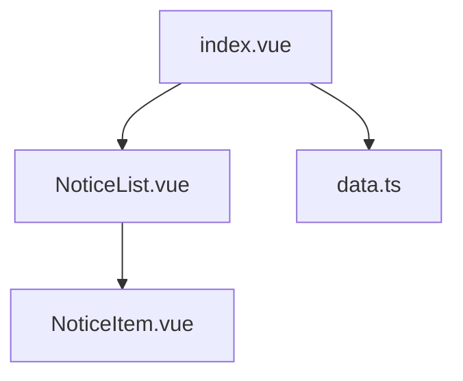
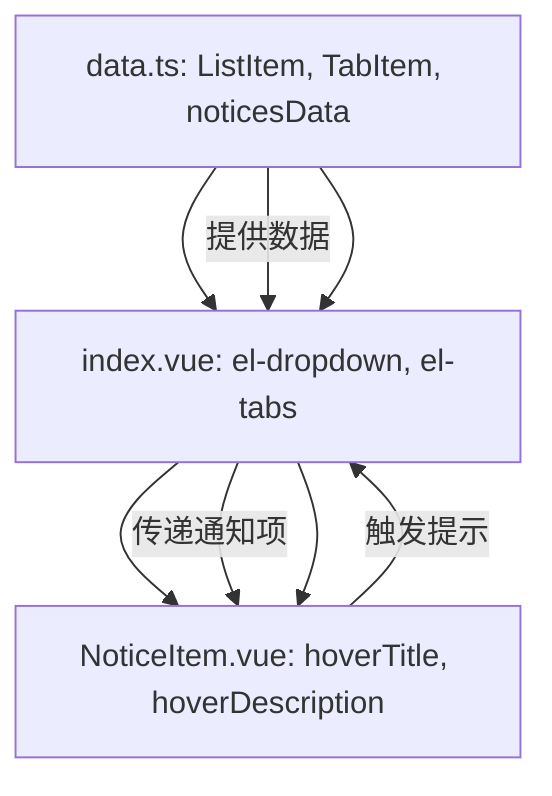
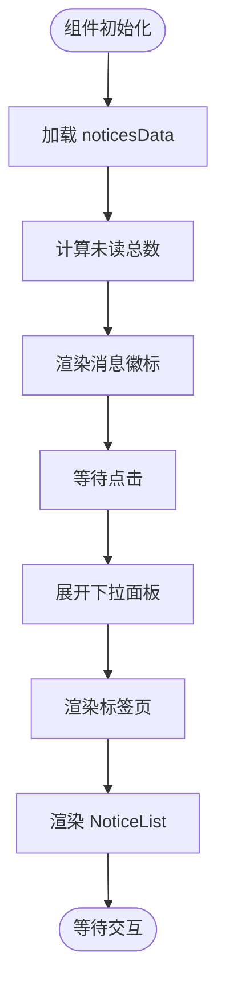
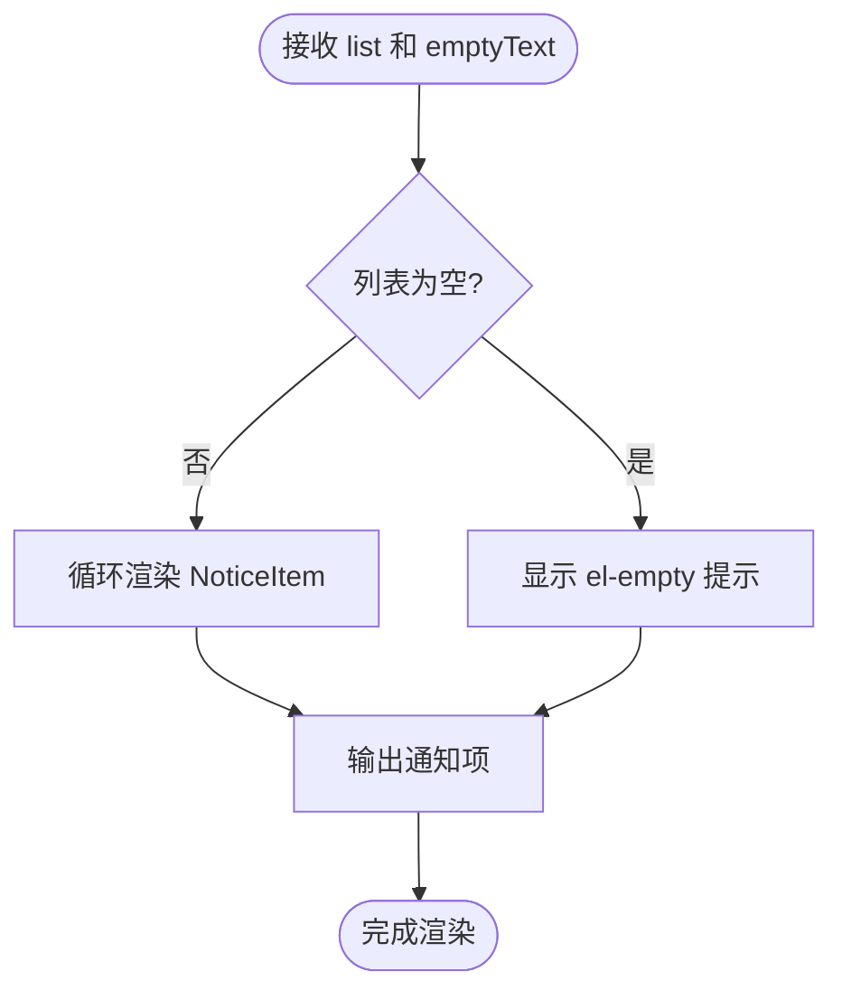
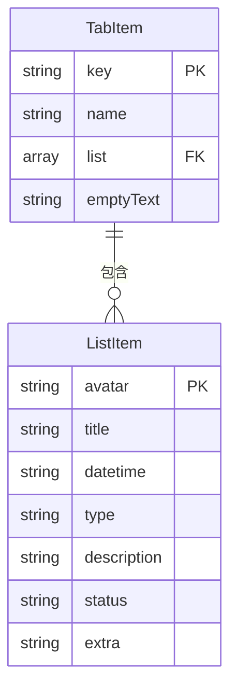

# 通知中心

<cite>
**本文档引用文件**  
- [index.vue](file://web/src/layout/components/lay-notice/index.vue)
- [data.ts](file://web/src/layout/components/lay-notice/data.ts)
- [NoticeList.vue](file://web/src/layout/components/lay-notice/components/NoticeList.vue)
- [NoticeItem.vue](file://web/src/layout/components/lay-notice/components/NoticeItem.vue)
- [mitt.ts](file://web/src/utils/mitt.ts)
</cite>

## 目录
1. [简介](#简介)
2. [项目结构](#项目结构)
3. [核心组件](#核心组件)
4. [架构概览](#架构概览)
5. [详细组件分析](#详细组件分析)
6. [依赖分析](#依赖分析)
7. [性能考虑](#性能考虑)
8. [故障排除指南](#故障排除指南)
9. [结论](#结论)

## 简介
`lay-notice` 组件是 vue-pure-admin-all 项目中的通知中心模块，提供消息通知的展示、分类、交互和状态管理功能。该组件支持未读消息计数、多标签分类展示、滚动加载、内容省略与提示、动态标签渲染等特性，并通过国际化支持多语言。组件结构清晰，采用模块化设计，便于扩展和维护。

## 项目结构
通知中心组件位于 `src/layout/components/lay-notice` 目录下，包含主组件、子组件和数据模型文件。



**图示来源**  
- [index.vue](file://web/src/layout/components/lay-notice/index.vue)
- [NoticeList.vue](file://web/src/layout/components/lay-notice/components/NoticeList.vue)
- [NoticeItem.vue](file://web/src/layout/components/lay-notice/components/NoticeItem.vue)
- [data.ts](file://web/src/layout/components/lay-notice/data.ts)

**本节来源**  
- [index.vue](file://web/src/layout/components/lay-notice/index.vue)
- [data.ts](file://web/src/layout/components/lay-notice/data.ts)

## 核心组件
`lay-notice` 的核心功能由 `index.vue`、`NoticeList.vue` 和 `NoticeItem.vue` 三个组件构成，分别负责通知入口、列表渲染和单项展示。数据模型定义在 `data.ts` 中，通过接口 `ListItem` 和 `TabItem` 规范通知结构。

**本节来源**  
- [index.vue](file://web/src/layout/components/lay-notice/index.vue#L1-L98)
- [NoticeList.vue](file://web/src/layout/components/lay-notice/components/NoticeList.vue#L1-L24)
- [NoticeItem.vue](file://web/src/layout/components/lay-notice/components/NoticeItem.vue#L1-L177)
- [data.ts](file://web/src/layout/components/lay-notice/data.ts#L1-L99)

## 架构概览
通知中心采用分层架构，由数据层、展示层和交互层组成。数据层定义通知模型和初始数据；展示层通过 `el-dropdown`、`el-tabs` 和 `el-scrollbar` 实现下拉面板、标签页和滚动容器；交互层通过 `NoticeItem` 处理鼠标悬停提示和内容截断检测。



**图示来源**  
- [data.ts](file://web/src/layout/components/lay-notice/data.ts#L1-L99)
- [index.vue](file://web/src/layout/components/lay-notice/index.vue#L1-L98)
- [NoticeItem.vue](file://web/src/layout/components/lay-notice/components/NoticeItem.vue#L1-L177)

## 详细组件分析

### 主组件分析 (index.vue)
`index.vue` 是通知中心的入口组件，使用 `el-dropdown` 实现点击展开通知面板。通过 `noticesData` 初始化通知数据，并计算未读总数。使用 `el-tabs` 实现分类展示，标签名称动态绑定国际化文本和消息数量。



**图示来源**  
- [index.vue](file://web/src/layout/components/lay-notice/index.vue#L1-L98)

**本节来源**  
- [index.vue](file://web/src/layout/components/lay-notice/index.vue#L1-L98)

### NoticeList 组件分析
`NoticeList.vue` 负责渲染通知列表，接收 `list` 和 `emptyText` 作为 props。当列表为空时显示 `el-empty` 提示，否则通过 `v-for` 循环渲染多个 `NoticeItem`。该组件实现了条件渲染和空状态处理。



**图示来源**  
- [NoticeList.vue](file://web/src/layout/components/lay-notice/components/NoticeList.vue#L1-L24)

**本节来源**  
- [NoticeList.vue](file://web/src/layout/components/lay-notice/components/NoticeList.vue#L1-L24)

### NoticeItem 组件分析
`NoticeItem.vue` 是通知项的展示单元，处理标题和描述的截断检测与提示显示。通过 `hoverTitle` 检测标题是否溢出，通过 `hoverDescription` 动态创建元素计算描述文本宽度，判断是否超过两行。支持头像、时间、额外标签（带状态色）的渲染。

```mermaid
classDiagram
class NoticeItem {
+noticeItem : ListItem
-titleRef : Ref
-titleTooltip : Ref
-descriptionRef : Ref
-descriptionTooltip : Ref
+tooltipEffect : string
+isMobile : boolean
+hoverTitle() : void
+hoverDescription(event, desc) : void
}
NoticeItem --> ListItem : "使用"
ListItem : +avatar : string
ListItem : +title : string
ListItem : +datetime : string
ListItem : +type : string
ListItem : +description : string
ListItem : +status? : "primary"|"success"|"warning"|"info"|"danger"
ListItem : +extra? : string
```

**图示来源**  
- [NoticeItem.vue](file://web/src/layout/components/lay-notice/components/NoticeItem.vue#L1-L177)
- [data.ts](file://web/src/layout/components/lay-notice/data.ts#L1-L99)

**本节来源**  
- [NoticeItem.vue](file://web/src/layout/components/lay-notice/components/NoticeItem.vue#L1-L177)
- [data.ts](file://web/src/layout/components/lay-notice/data.ts#L1-L99)

### 数据模型分析
`data.ts` 定义了通知系统的数据结构，包括 `ListItem` 和 `TabItem` 接口，以及初始数据 `noticesData`。`ListItem` 包含头像、标题、时间、类型、描述、状态和额外信息；`TabItem` 包含键、名称、列表和空文本。数据支持国际化 `$t`。



**图示来源**  
- [data.ts](file://web/src/layout/components/lay-notice/data.ts#L1-L99)

**本节来源**  
- [data.ts](file://web/src/layout/components/lay-notice/data.ts#L1-L99)

## 依赖分析
通知中心组件依赖多个外部模块和内部工具。通过 `vue-i18n` 实现国际化，`element-plus` 提供 UI 组件，`@/plugins/i18n` 封装翻译方法，`@pureadmin/utils` 提供设备检测。全局事件总线 `mitt` 用于跨组件通信。

```mermaid
graph LR
A[lay-notice] --> B[vue-i18n]
A --> C[element-plus]
A --> D[@/plugins/i18n]
A --> E[@pureadmin/utils]
A --> F[mitt]
F --> G[全局事件通信]
```

**图示来源**  
- [index.vue](file://web/src/layout/components/lay-notice/index.vue#L1-L98)
- [NoticeItem.vue](file://web/src/layout/components/lay-notice/components/NoticeItem.vue#L1-L177)
- [mitt.ts](file://web/src/utils/mitt.ts#L1-L21)

**本节来源**  
- [index.vue](file://web/src/layout/components/lay-notice/index.vue#L1-L98)
- [NoticeItem.vue](file://web/src/layout/components/lay-notice/components/NoticeItem.vue#L1-L177)
- [mitt.ts](file://web/src/utils/mitt.ts#L1-L21)

## 性能考虑
组件在性能方面进行了优化：使用 `v-if` 和 `v-else` 实现条件渲染，避免不必要的 DOM 操作；通过 `nextTick` 确保 DOM 更新后执行尺寸检测；使用 `ref` 精确控制元素引用；CSS 中使用 `scoped` 避免样式污染。描述截断检测采用动态创建元素方式，虽有性能开销但确保准确性。

## 故障排除指南
常见问题包括：通知不显示（检查 `noticesData` 数据格式）、提示不出现（检查 `hoverDescription` 计算逻辑）、国际化失效（检查 `$t` 导入和语言包）。可通过浏览器开发者工具检查组件 props、data 和事件绑定状态。

**本节来源**  
- [index.vue](file://web/src/layout/components/lay-notice/index.vue#L1-L98)
- [NoticeItem.vue](file://web/src/layout/components/lay-notice/components/NoticeItem.vue#L1-L177)
- [data.ts](file://web/src/layout/components/lay-notice/data.ts#L1-L99)

## 结论
`lay-notice` 组件实现了功能完整、结构清晰的通知中心，支持分类展示、未读计数、内容截断提示和国际化。通过模块化设计和合理的数据流管理，具备良好的可维护性和扩展性。未来可集成 WebSocket 或轮询机制实现实时通知更新，并通过 `mitt` 事件总线与其他模块通信。