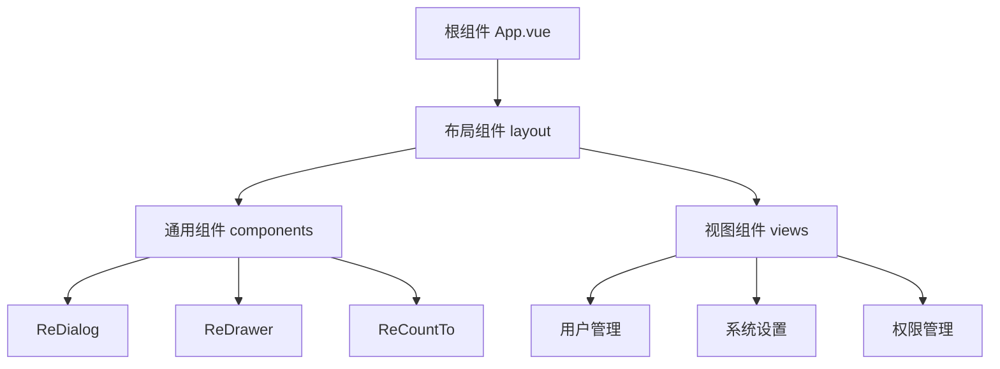
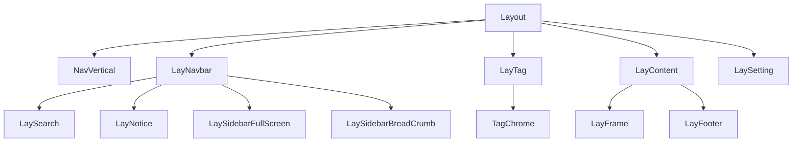
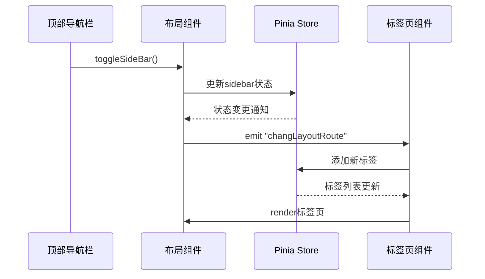

# 组件架构

<cite>
**本文档引用文件**  
- [App.vue](file://web/src/App.vue)
- [index.vue](file://web/src/layout/index.vue)
- [lay-navbar/index.vue](file://web/src/layout/components/lay-navbar/index.vue)
- [lay-tag/index.vue](file://web/src/layout/components/lay-tag/index.vue)
- [lay-content/index.vue](file://web/src/layout/components/lay-content/index.vue)
- [useNav.ts](file://web/src/layout/hooks/useNav.ts)
- [useTag.ts](file://web/src/layout/hooks/useTag.ts)
- [app.ts](file://web/src/store/modules/app.ts)
- [multiTags.ts](file://web/src/store/modules/multiTags.ts)
- [router/index.ts](file://web/src/router/index.ts)
</cite>

## 目录
1. [项目结构概述](#项目结构概述)
2. [组件分层设计](#组件分层设计)
3. [根组件集成](#根组件集成)
4. [布局组件结构](#布局组件结构)
5. [组件通信与状态管理](#组件通信与状态管理)
6. [组件复用设计原则](#组件复用设计原则)

## 项目结构概述

vue-pure-admin-all项目采用基于Vue3的组件化架构设计，整体结构清晰，分为三大核心组件层级：布局组件（layout）、通用组件（components）和视图组件（views）。项目通过Pinia进行状态管理，使用Vue Router实现路由控制，形成了完整的前端架构体系。

**Section sources**
- [App.vue](file://web/src/App.vue)
- [index.vue](file://web/src/layout/index.vue)

## 组件分层设计

项目采用三层组件架构模式，实现了关注点分离和职责清晰化：

1. **布局组件（layout）**：位于`src/layout`目录，负责整体页面布局结构，包含侧边栏、导航栏、标签页等全局UI元素
2. **通用组件（components）**：位于`src/components`目录，提供可复用的UI组件，如对话框、抽屉、计数器等
3. **视图组件（views）**：位于`src/views`目录，实现具体业务功能页面，如用户管理、系统设置等

这种分层设计使得组件职责明确，便于维护和扩展。

**Diagram sources**
- [App.vue](file://web/src/App.vue)
- [index.vue](file://web/src/layout/index.vue)

## 根组件集成

`App.vue`作为应用的根组件，主要负责集成Element Plus的配置提供者，并挂载全局使用的通用组件。通过`el-config-provider`组件设置国际化语言环境，同时引入`ReDialog`和`ReDrawer`作为全局可用的对话框和抽屉组件。

根组件通过`router-view`渲染当前路由对应的视图组件，实现了路由驱动的页面切换机制。在组件生命周期中，通过`beforeCreate`钩子检查应用版本，实现了生产环境下的版本更新检测功能。

**Section sources**
- [App.vue](file://web/src/App.vue)

## 布局组件结构

布局组件`layout/index.vue`是整个应用的骨架，采用响应式设计，能够适配不同设备。其内部结构包含多个子组件，形成完整的布局体系：

- **NavVertical**：垂直侧边栏导航
- **LayNavbar**：顶部导航栏
- **LayTag**：标签页组件
- **LayContent**：主要内容区域
- **LaySetting**：系统设置面板

布局组件通过`useLayout`和`useDataThemeChange`等自定义Hook管理布局状态和主题切换，利用`useResizeObserver`监听窗口大小变化，实现移动端和桌面端的自动适配。

**Diagram sources**
- [index.vue](file://web/src/layout/index.vue)
- [lay-navbar/index.vue](file://web/src/layout/components/lay-navbar/index.vue)
- [lay-tag/index.vue](file://web/src/layout/components/lay-tag/index.vue)
- [lay-content/index.vue](file://web/src/layout/components/lay-content/index.vue)

## 组件通信与状态管理

项目采用多种机制实现组件间的通信和状态管理：

### 状态管理
通过Pinia实现全局状态管理，主要包含：
- **app store**：管理侧边栏展开状态、设备类型、布局模式等
- **multiTags store**：管理标签页状态，支持标签页的增删改查
- **settings store**：管理应用配置，如主题、布局等

### 通信机制
1. **事件总线**：使用mitt库创建事件总线`emitter`，实现跨组件通信
2. **Props/Emits**：父子组件间通过props传递数据，通过emits触发事件
3. **Provide/Inject**：跨层级组件间共享数据
4. **Vuex-like状态管理**：通过Pinia store实现全局状态共享

标签页组件通过监听`changLayoutRoute`事件动态更新标签，侧边栏通过`toggleSideBar`方法控制展开/折叠状态，形成了完整的组件交互体系。

**Diagram sources**
- [useNav.ts](file://web/src/layout/hooks/useNav.ts)
- [useTag.ts](file://web/src/layout/hooks/useTag.ts)
- [app.ts](file://web/src/store/modules/app.ts)
- [multiTags.ts](file://web/src/store/modules/multiTags.ts)

## 组件复用设计原则

项目在组件设计上遵循了多项复用原则，确保组件的可维护性和可扩展性：

### 通用组件设计
通用组件采用`Re`前缀命名，如`ReDialog`、`ReDrawer`等，通过`index.ts`导出组件，便于统一导入。组件设计注重灵活性，通过props提供丰富的配置选项，满足不同场景需求。

### Hook复用
将可复用的逻辑封装为自定义Hook，如`useNav`、`useTag`等，这些Hook封装了组件的状态管理和业务逻辑，可以在多个组件间共享。

### 样式复用
通过SCSS变量和mixin实现样式复用，确保UI风格的一致性。组件样式采用scoped作用域，避免样式污染。

### 配置驱动
通过`config/index.ts`集中管理应用配置，组件根据配置动态调整行为，提高了系统的可配置性和可维护性。

这些设计原则使得项目组件具有高度的复用性，开发者可以轻松扩展和定制UI组件，满足不同的业务需求。

**Section sources**
- [index.vue](file://web/src/layout/index.vue)
- [useNav.ts](file://web/src/layout/hooks/useNav.ts)
- [useTag.ts](file://web/src/layout/hooks/useTag.ts)
- [router/index.ts](file://web/src/router/index.ts)