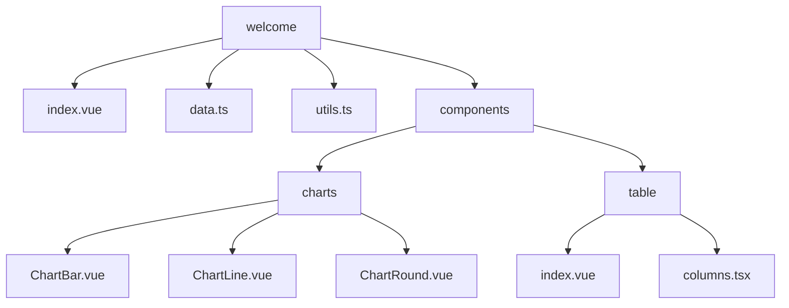
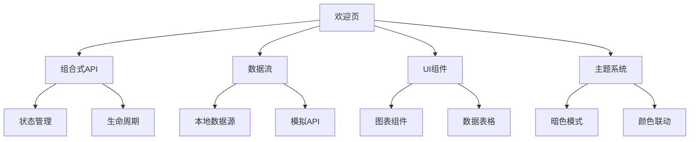
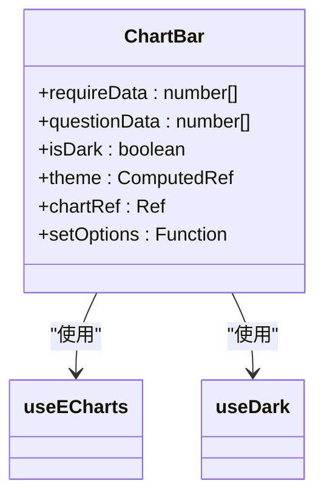
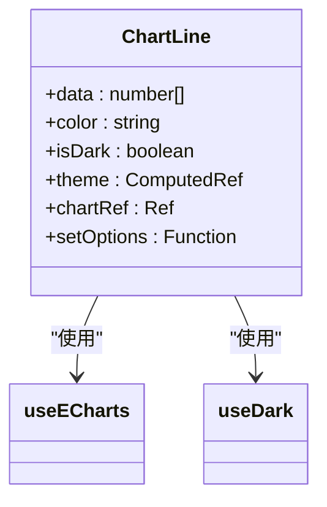
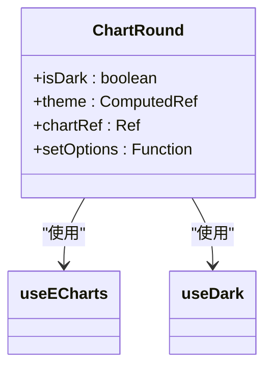
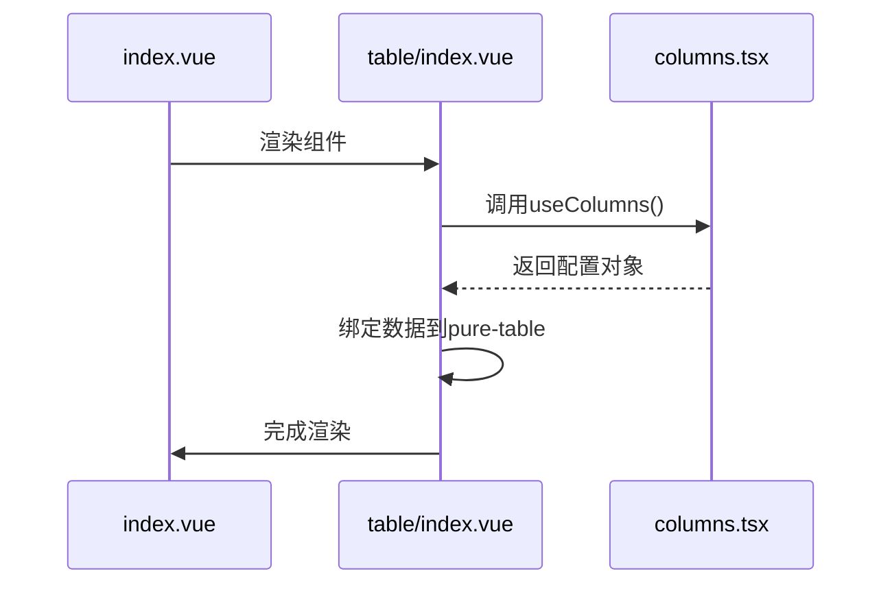
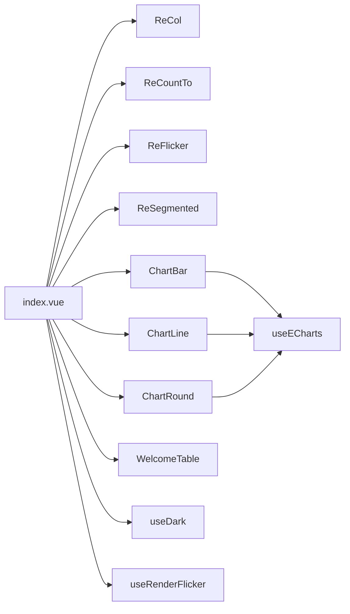

# 欢迎页

<cite>
**本文档引用文件**  
- [index.vue](file://web/src/views/welcome/index.vue)
- [data.ts](file://web/src/views/welcome/data.ts)
- [utils.ts](file://web/src/views/welcome/utils.ts)
- [ChartBar.vue](file://web/src/views/welcome/components/charts/ChartBar.vue)
- [ChartLine.vue](file://web/src/views/welcome/components/charts/ChartLine.vue)
- [ChartRound.vue](file://web/src/views/welcome/components/charts/ChartRound.vue)
- [table/index.vue](file://web/src/views/welcome/components/table/index.vue)
- [columns.tsx](file://web/src/views/welcome/components/table/columns.tsx)
</cite>

## 目录
1. [介绍](#介绍)
2. [项目结构](#项目结构)
3. [核心组件](#核心组件)
4. [架构概览](#架构概览)
5. [详细组件分析](#详细组件分析)
6. [依赖分析](#依赖分析)
7. [性能考虑](#性能考虑)
8. [故障排除指南](#故障排除指南)
9. [结论](#结论)

## 介绍
欢迎页是 vue-pure-admin-all 管理系统中的核心仪表盘页面，集成多种可视化组件，展示关键业务指标。该页面采用现代化的 Vue 3 组合式 API 架构，结合 ECharts 图表库和 Pinia 状态管理，实现数据驱动的动态展示。页面包含柱状图、折线图、饼图等多种图表组件，以及功能丰富的数据表格，支持响应式布局和主题联动，为用户提供直观的数据概览体验。

## 项目结构
欢迎页位于 `web/src/views/welcome` 目录下，采用模块化设计，各组件职责分明。主入口文件 `index.vue` 负责页面整体布局和组件集成，`data.ts` 提供模拟数据，`utils.ts` 封装通用工具函数。图表组件集中于 `components/charts` 子目录，表格相关逻辑位于 `components/table` 子目录，实现了关注点分离的良好实践。

**Diagram sources**
- [index.vue](file://web/src/views/welcome/index.vue#L1-L278)
- [data.ts](file://web/src/views/welcome/data.ts#L1-L135)

**Section sources**
- [index.vue](file://web/src/views/welcome/index.vue#L1-L278)
- [data.ts](file://web/src/views/welcome/data.ts#L1-L135)

## 核心组件
欢迎页的核心功能由多个可复用组件构成。`ChartBar.vue`、`ChartLine.vue` 和 `ChartRound.vue` 分别实现柱状图、折线图和环形图，均基于 ECharts 封装，通过 `useECharts` 工具函数实现图表初始化和主题适配。`table/index.vue` 组件集成 `pure-table`，通过 `useColumns` 函数配置列定义和数据源，实现数据表格的展示与交互。

**Section sources**
- [ChartBar.vue](file://web/src/views/welcome/components/charts/ChartBar.vue#L1-L109)
- [ChartLine.vue](file://web/src/views/welcome/components/charts/ChartLine.vue#L1-L63)
- [ChartRound.vue](file://web/src/views/welcome/components/charts/ChartRound.vue#L1-L74)
- [table/index.vue](file://web/src/views/welcome/components/table/index.vue#L1-L72)

## 架构概览
欢迎页采用典型的 Vue 3 组合式 API 架构，通过 `script setup` 语法糖简化代码结构。页面通过 `useDark` 钩子函数监听主题变化，实现图表和界面元素的暗色模式适配。数据流清晰，从 `data.ts` 获取模拟数据，通过组件属性传递给图表和表格，实现了数据驱动的视图更新。

**Diagram sources**
- [index.vue](file://web/src/views/welcome/index.vue#L1-L278)
- [utils.ts](file://web/src/views/welcome/utils.ts#L1-L7)

## 详细组件分析

### 图表组件分析
欢迎页的图表组件基于 ECharts 实现，通过 `useECharts` 工具函数进行封装，确保了代码的复用性和一致性。每个图表组件都独立管理自己的 ECharts 实例，通过 `watch` 监听数据变化，实现动态更新。

#### 柱状图组件

**Diagram sources**
- [ChartBar.vue](file://web/src/views/welcome/components/charts/ChartBar.vue#L1-L109)

#### 折线图组件

**Diagram sources**
- [ChartLine.vue](file://web/src/views/welcome/components/charts/ChartLine.vue#L1-L63)

#### 环形图组件

**Diagram sources**
- [ChartRound.vue](file://web/src/views/welcome/components/charts/ChartRound.vue#L1-L74)

**Section sources**
- [ChartBar.vue](file://web/src/views/welcome/components/charts/ChartBar.vue#L1-L109)
- [ChartLine.vue](file://web/src/views/welcome/components/charts/ChartLine.vue#L1-L63)
- [ChartRound.vue](file://web/src/views/welcome/components/charts/ChartRound.vue#L1-L74)

### 数据表格分析
数据表格组件采用组合式函数 `useColumns` 进行配置管理，实现了逻辑与模板的分离。该函数返回表格所需的所有配置项，包括列定义、数据列表、分页配置和加载状态。

**Diagram sources**
- [table/index.vue](file://web/src/views/welcome/components/table/index.vue#L1-L72)
- [columns.tsx](file://web/src/views/welcome/components/table/columns.tsx#L1-L105)

**Section sources**
- [table/index.vue](file://web/src/views/welcome/components/table/index.vue#L1-L72)
- [columns.tsx](file://web/src/views/welcome/components/table/columns.tsx#L1-L105)

## 依赖分析
欢迎页依赖多个核心模块和第三方库。通过 `@pureadmin/utils` 提供的 `useDark`、`useECharts` 等工具函数，实现了主题管理和图表渲染。`ReCountTo` 组件用于数字滚动动画，`ReFlicker` 用于动态图标渲染。这些依赖关系确保了功能的完整性和代码的可维护性。

**Diagram sources**
- [index.vue](file://web/src/views/welcome/index.vue#L1-L278)
- [utils.ts](file://web/src/views/welcome/utils.ts#L1-L7)

**Section sources**
- [index.vue](file://web/src/views/welcome/index.vue#L1-L278)
- [utils.ts](file://web/src/views/welcome/utils.ts#L1-L7)

## 性能考虑
欢迎页在性能方面进行了多项优化。通过 `v-motion` 指令实现组件的渐进式加载动画，提升用户体验。表格数据采用分页显示，避免一次性渲染大量数据。图表组件在数据变化时通过 `watch` 进行精确更新，避免不必要的重绘。建议在实际项目中，对于大型数据集，可进一步实现数据懒加载和组件按需渲染。

**Section sources**
- [index.vue](file://web/src/views/welcome/index.vue#L1-L278)
- [table/index.vue](file://web/src/views/welcome/components/table/index.vue#L1-L72)

## 故障排除指南
当欢迎页出现显示异常时，可按以下步骤排查：首先检查 `data.ts` 中的数据格式是否正确；其次确认 ECharts 是否正确初始化，查看浏览器控制台是否有相关错误；然后检查主题切换是否正常工作，验证 `useDark` 钩子函数的返回值；最后确认表格分页功能是否正常，检查 `onCurrentChange` 回调函数的执行情况。

**Section sources**
- [data.ts](file://web/src/views/welcome/data.ts#L1-L135)
- [table/index.vue](file://web/src/views/welcome/components/table/index.vue#L1-L72)

## 结论
欢迎页作为 vue-pure-admin-all 的核心仪表盘，展示了现代化前端开发的最佳实践。其模块化的设计、清晰的数据流和丰富的可视化功能，为开发者提供了优秀的参考范例。通过深入理解其架构和实现细节，开发者可以快速定制和扩展功能，满足不同业务场景的需求。