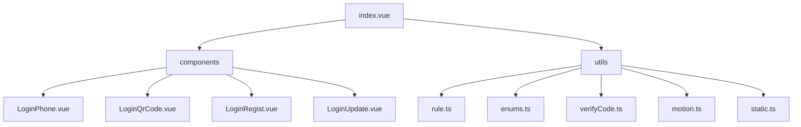
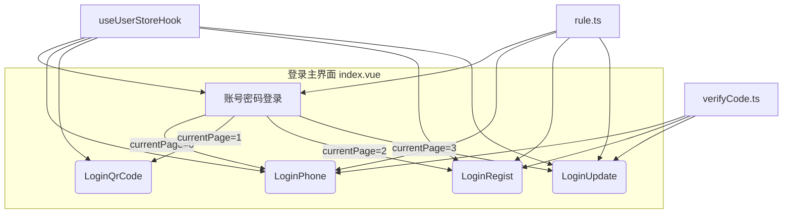
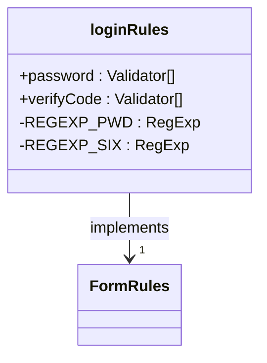
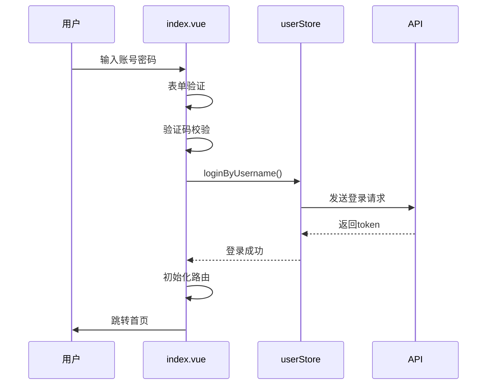
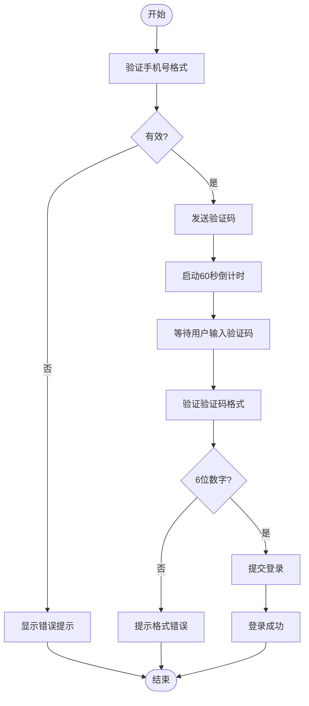
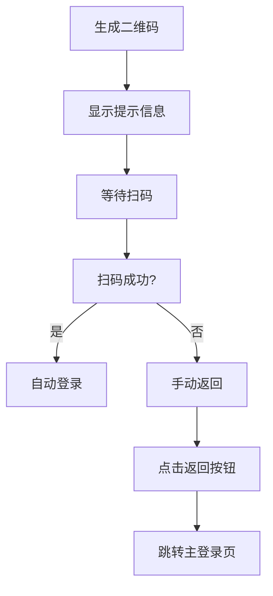
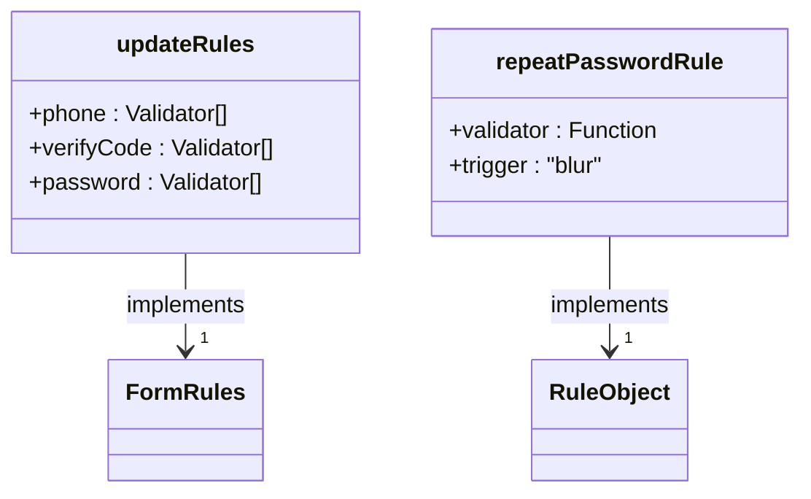
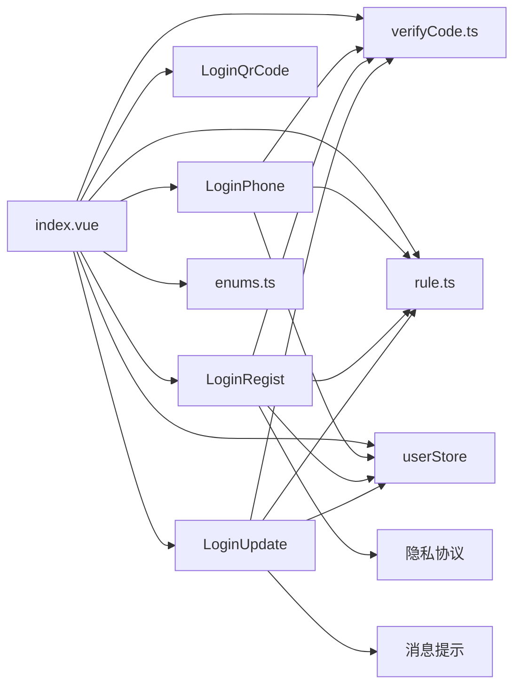

# 登录页

<cite>
**本文档引用文件**  
- [index.vue](file://web/src/views/login/index.vue)
- [rule.ts](file://web/src/views/login/utils/rule.ts)
- [enums.ts](file://web/src/views/login/utils/enums.ts)
- [verifyCode.ts](file://web/src/views/login/utils/verifyCode.ts)
- [LoginPhone.vue](file://web/src/views/login/components/LoginPhone.vue)
- [LoginQrCode.vue](file://web/src/views/login/components/LoginQrCode.vue)
- [LoginRegist.vue](file://web/src/views/login/components/LoginRegist.vue)
- [LoginUpdate.vue](file://web/src/views/login/components/LoginUpdate.vue)
</cite>

## 目录
1. [简介](#简介)
2. [项目结构](#项目结构)
3. [核心组件](#核心组件)
4. [架构概览](#架构概览)
5. [详细组件分析](#详细组件分析)
6. [依赖分析](#依赖分析)
7. [性能考虑](#性能考虑)
8. [故障排除指南](#故障排除指南)
9. [结论](#结论)

## 简介
本项目为 `vue-pure-admin-all` 的登录页面模块，实现了多方式登录功能，包括账号密码、手机验证码、二维码扫描、用户注册和密码找回。该模块采用组件化设计，结合 Vue 3 的 Composition API 和 Element Plus 表单验证机制，具备良好的可扩展性和可维护性。

## 项目结构
登录模块位于 `web/src/views/login` 目录下，采用清晰的分层结构组织代码，包含主入口文件、子组件、工具函数和状态管理逻辑。

**Diagram sources**  
- [index.vue](file://web/src/views/login/index.vue)
- [components](file://web/src/views/login/components)
- [utils](file://web/src/views/login/utils)

**Section sources**
- [index.vue](file://web/src/views/login/index.vue#L1-L377)

## 核心组件
登录模块的核心由主组件 `index.vue` 驱动，通过 `currentPage` 状态控制不同登录方式的切换。各子组件通过 Vuex Store 中的 `userStore` 进行状态同步，实现统一的状态管理。

**Section sources**
- [index.vue](file://web/src/views/login/index.vue#L1-L377)
- [enums.ts](file://web/src/views/login/utils/enums.ts#L1-L35)

## 架构概览
整个登录模块采用基于状态驱动的组件切换机制，通过 `currentPage` 控制显示不同的登录界面。

**Diagram sources**  
- [index.vue](file://web/src/views/login/index.vue#L1-L377)
- [rule.ts](file://web/src/views/login/utils/rule.ts#L1-L127)
- [verifyCode.ts](file://web/src/views/login/utils/verifyCode.ts#L1-L51)

## 详细组件分析

### 账号密码登录分析
主登录界面支持账号密码登录，集成图形验证码验证，并提供“记住我”功能。

#### 表单验证规则

**Diagram sources**  
- [rule.ts](file://web/src/views/login/utils/rule.ts#L1-L127)

#### 登录流程序列图

**Diagram sources**  
- [index.vue](file://web/src/views/login/index.vue#L1-L377)
- [user.ts](file://web/src/store/modules/user.ts)

**Section sources**
- [index.vue](file://web/src/views/login/index.vue#L1-L377)

### 手机验证码登录分析
`LoginPhone.vue` 组件实现手机号+短信验证码登录模式。

#### 组件职责
- 手机号格式验证（使用 `isPhone` 工具函数）
- 验证码发送倒计时控制（通过 `useVerifyCode`）
- 提交表单并模拟登录流程

**Diagram sources**  
- [LoginPhone.vue](file://web/src/views/login/components/LoginPhone.vue#L1-L108)
- [verifyCode.ts](file://web/src/views/login/utils/verifyCode.ts#L1-L51)

**Section sources**
- [LoginPhone.vue](file://web/src/views/login/components/LoginPhone.vue#L1-L108)

### 二维码登录分析
`LoginQrCode.vue` 组件提供二维码登录功能。

#### 实现机制
- 使用 `ReQrcode` 组件生成二维码
- 二维码内容为固定测试文本（可扩展为动态 token）
- 提供返回按钮跳转回主登录页

**Diagram sources**  
- [LoginQrCode.vue](file://web/src/views/login/components/LoginQrCode.vue#L1-L28)

**Section sources**
- [LoginQrCode.vue](file://web/src/views/login/components/LoginQrCode.vue#L1-L28)

### 注册与找回密码分析
`LoginRegist.vue` 和 `LoginUpdate.vue` 分别实现用户注册和密码找回功能。

#### 共用逻辑
- 使用相同的表单验证规则 `updateRules`
- 都需要手机号+验证码验证身份
- 密码二次确认机制
- 倒计时验证码发送

**Diagram sources**  
- [rule.ts](file://web/src/views/login/utils/rule.ts#L1-L127)
- [LoginRegist.vue](file://web/src/views/login/components/LoginRegist.vue#L1-L197)
- [LoginUpdate.vue](file://web/src/views/login/components/LoginUpdate.vue#L1-L156)

**Section sources**
- [rule.ts](file://web/src/views/login/utils/rule.ts#L1-L127)
- [LoginRegist.vue](file://web/src/views/login/components/LoginRegist.vue#L1-L197)
- [LoginUpdate.vue](file://web/src/views/login/components/LoginUpdate.vue#L1-L156)

## 依赖分析
登录模块依赖多个内部和外部组件，形成清晰的依赖关系网。

**Diagram sources**  
- [index.vue](file://web/src/views/login/index.vue#L1-L377)
- [components](file://web/src/views/login/components)
- [utils](file://web/src/views/login/utils)
- [store](file://web/src/store/modules/user.ts)

## 性能考虑
- 使用 `debounce` 防抖处理回车登录事件，避免重复提交
- 图形验证码组件按需加载，减少初始渲染负担
- 动画效果通过 `Motion` 组件延迟加载，提升首屏性能
- 所有子组件采用懒加载方式，仅在需要时渲染

## 故障排除指南
常见问题及解决方案：

| 问题现象 | 可能原因 | 解决方案 |
|--------|--------|--------|
| 图形验证码不显示 | 图片资源路径错误 | 检查 `static.ts` 中的 `bg` 路径 |
| 验证码校验失败 | 大小写敏感或过期 | 确保输入与显示完全一致 |
| 登录按钮无响应 | 表单验证未通过 | 检查必填项和格式要求 |
| 倒计时无法重新发送 | 定时器未清除 | 调用 `useVerifyCode().end()` 清理状态 |
| 国际化文本不更新 | locale 未正确设置 | 检查 `useTranslationLang` 的调用 |

**Section sources**
- [index.vue](file://web/src/views/login/index.vue#L1-L377)
- [rule.ts](file://web/src/views/login/utils/rule.ts#L1-L127)
- [verifyCode.ts](file://web/src/views/login/utils/verifyCode.ts#L1-L51)

## 结论
`vue-pure-admin-all` 的登录模块采用现代化的 Vue 3 技术栈，实现了功能完整、结构清晰、易于扩展的多方式登录系统。通过组件化设计和统一的状态管理，保证了代码的可维护性和可测试性。建议后续可扩展 OAuth2 第三方登录、生物识别登录等更多认证方式。