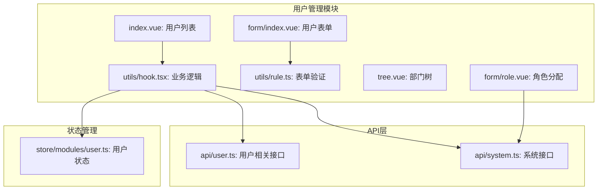
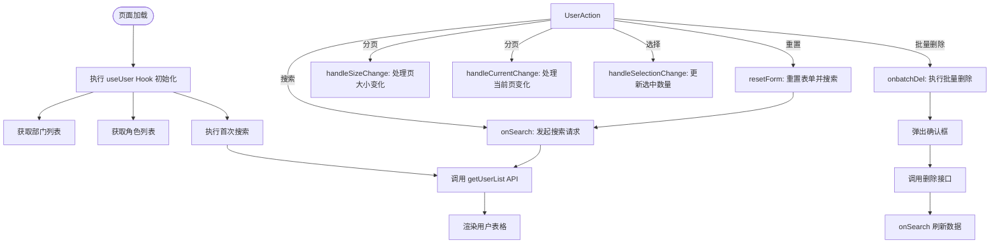
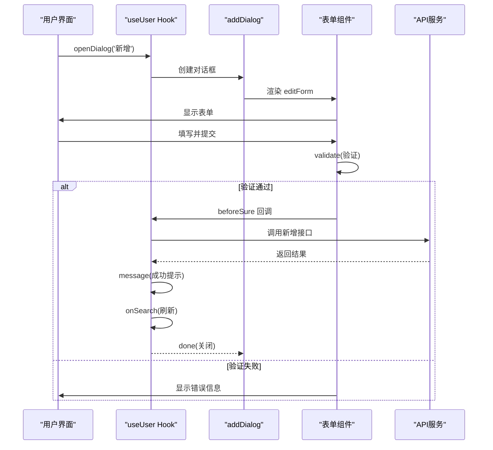
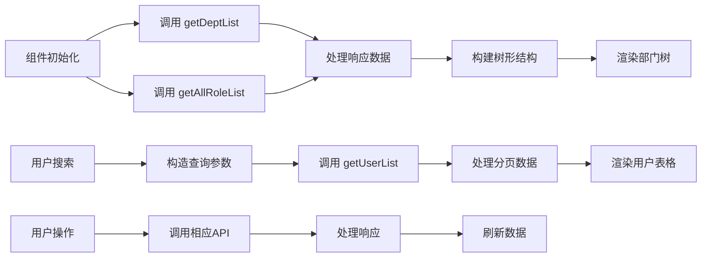
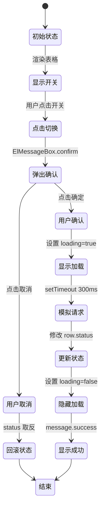
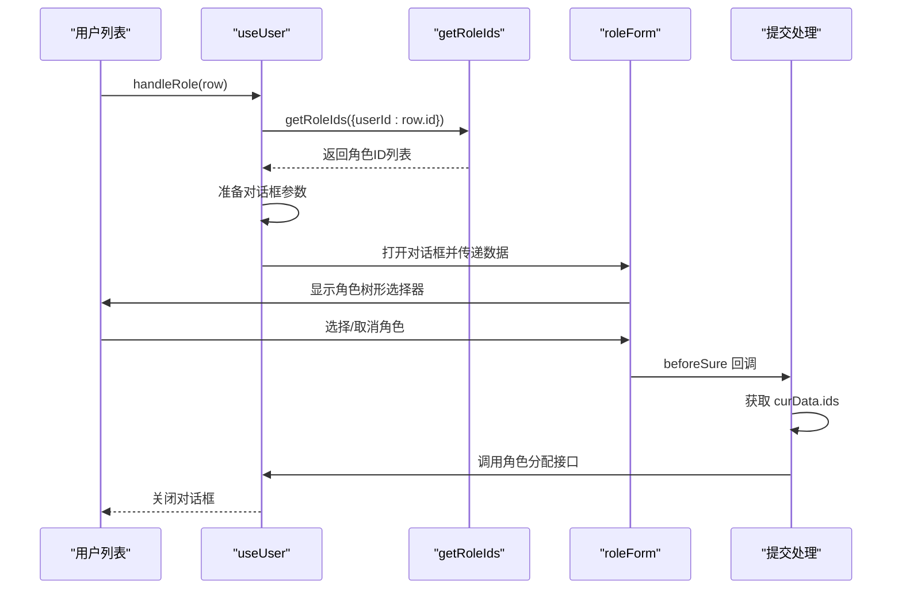

# 用户管理

<cite>
**本文档引用文件**  
- [index.vue](file://web/src/views/system/user/index.vue)
- [form/index.vue](file://web/src/views/system/user/form/index.vue)
- [utils/hook.tsx](file://web/src/views/system/user/utils/hook.tsx)
- [utils/rule.ts](file://web/src/views/system/user/utils/rule.ts)
- [api/user.ts](file://web/src/api/user.ts)
- [api/system.ts](file://web/src/api/system.ts)
- [store/modules/user.ts](file://web/src/store/modules/user.ts)
</cite>

## 目录
1. [项目结构](#项目结构)
2. [用户列表页面实现](#用户列表页面实现)
3. [用户表单动态渲染与验证](#用户表单动态渲染与验证)
4. [CRUD操作与状态管理集成](#crud操作与状态管理集成)
5. [前后端数据交互模式](#前后端数据交互模式)
6. [用户状态切换与权限控制](#用户状态切换与权限控制)
7. [角色分配组件设计与数据联动](#角色分配组件设计与数据联动)

## 项目结构



**图示来源**  
- [index.vue](file://web/src/views/system/user/index.vue)
- [hook.tsx](file://web/src/views/system/user/utils/hook.tsx)
- [system.ts](file://web/src/api/system.ts)

## 用户列表页面实现

用户列表页面采用左右布局结构，左侧为部门树形选择器，右侧为用户数据表格。页面支持分页、搜索、状态筛选和批量操作功能。

数据表格通过 `PureTableBar` 组件封装，支持列显隐控制和刷新功能。表格包含用户编号、头像、用户名、昵称、性别、部门、手机号、状态和创建时间等字段。

搜索功能支持按用户名称、手机号码和状态进行筛选。状态筛选提供“已开启”和“已关闭”两个选项。重置按钮可清空所有搜索条件并刷新数据。

批量操作通过表格上方的提示栏实现，显示当前选中项数量，并提供“取消选择”和“批量删除”功能。批量删除前会弹出确认对话框。



**图示来源**  
- [index.vue](file://web/src/views/system/user/index.vue#L1-L275)
- [hook.tsx](file://web/src/views/system/user/utils/hook.tsx#L43-L534)

**本节来源**  
- [index.vue](file://web/src/views/system/user/index.vue#L1-L275)
- [hook.tsx](file://web/src/views/system/user/utils/hook.tsx#L43-L534)

## 用户表单动态渲染与验证

用户表单（form/index.vue）采用响应式设计，支持新增和编辑两种模式。表单字段根据操作类型动态显示，例如在新增时显示密码字段，编辑时隐藏。

表单使用 `el-form` 组件进行布局，通过 `re-col` 实现响应式栅格系统。主要字段包括：
- 用户昵称、用户名、密码（仅新增）
- 手机号、邮箱
- 性别选择（男/女）
- 归属部门（级联选择器）
- 用户状态（开关）
- 备注（文本域）

表单验证规则在 `rule.ts` 文件中定义，使用 `reactive` 创建响应式规则对象。验证规则包括：
- 用户昵称、用户名、密码：必填项
- 手机号：使用 `isPhone` 工具函数进行格式校验
- 邮箱：使用 `isEmail` 工具函数进行格式校验

验证触发方式为 `blur`，即失去焦点时触发。自定义验证器在值为空时不进行校验，非空时检查格式正确性。

```mermaid
classDiagram
class FormProps {
+title : string
+higherDeptOptions : Array
+parentId : number
+nickname : string
+username : string
+password : string
+phone : string
+email : string
+sex : string
+status : number
+remark : string
}
class RuleForm {
-formRules : FormRules
-newFormInline : Ref~FormProps~
-ruleFormRef : Ref
+getRef() : any
}
class ValidationRules {
+nickname : RequiredRule
+username : RequiredRule
+password : RequiredRule
+phone : CustomValidator
+email : CustomValidator
}
RuleForm --> FormProps : "使用"
RuleForm --> ValidationRules : "引用"
ValidationRules --> "isPhone" : "调用"
ValidationRules --> "isEmail" : "调用"
```

**图示来源**  
- [form/index.vue](file://web/src/views/system/user/form/index.vue#L1-L176)
- [rule.ts](file://web/src/views/system/user/utils/rule.ts#L1-L40)

**本节来源**  
- [form/index.vue](file://web/src/views/system/user/form/index.vue#L1-L176)
- [rule.ts](file://web/src/views/system/user/utils/rule.ts#L1-L40)

## CRUD操作与状态管理集成

用户CRUD操作在 `hook.tsx` 文件中通过 `useUser` Hook 进行封装。该Hook接收表格和树形组件的引用，返回所有必要的数据和方法。

新增/编辑操作通过 `openDialog` 函数实现，使用 `addDialog` 组件创建模态框。模态框内容渲染 `editForm` 组件，并传递表单数据。提交前进行表单验证，验证通过后执行相应业务逻辑。

删除操作分为单个删除和批量删除：
- 单个删除：点击操作栏删除按钮，弹出确认框后执行
- 批量删除：基于表格选中行，获取ID列表后批量删除

上传头像功能集成 `ReCropperPreview` 组件，支持图片裁剪。重置密码功能包含密码强度检测，使用 `zxcvbn` 库评估密码强度，并通过进度条可视化显示。

所有操作完成后都会调用 `onSearch` 刷新数据列表，确保视图同步。



**图示来源**  
- [hook.tsx](file://web/src/views/system/user/utils/hook.tsx#L43-L534)
- [form/index.vue](file://web/src/views/system/user/form/index.vue#L1-L176)

**本节来源**  
- [hook.tsx](file://web/src/views/system/user/utils/hook.tsx#L43-L534)

## 前后端数据交互模式

前后端数据交互通过 `http` 请求工具进行封装。用户管理相关API定义在 `system.ts` 文件中：

- `getUserList`: 获取用户列表（POST /user）
- `getDeptList`: 获取部门列表（POST /dept）
- `getAllRoleList`: 获取所有角色列表（GET /list-all-role）
- `getRoleIds`: 获取用户角色ID列表

API调用返回标准化的响应结构，包含 `success` 状态和 `data` 数据体。数据体中包含分页信息（total, pageSize, currentPage）和列表数据。

在 `useUser` Hook 的 `onMounted` 钩子中，同时发起部门列表和角色列表的请求，确保表单和树形组件的数据准备就绪。

数据流模式遵循：
1. 组件初始化 → 调用API获取基础数据
2. 用户操作 → 构造请求参数 → 调用API
3. API响应 → 更新本地状态 → 刷新视图



**图示来源**  
- [system.ts](file://web/src/api/system.ts#L22-L49)
- [hook.tsx](file://web/src/views/system/user/utils/hook.tsx#L43-L534)

**本节来源**  
- [system.ts](file://web/src/api/system.ts#L22-L49)
- [hook.tsx](file://web/src/views/system/user/utils/hook.tsx#L43-L534)

## 用户状态切换与权限控制

用户状态切换通过表格中的 `el-switch` 组件实现。开关的 `cellRenderer` 中集成了加载状态管理（`switchLoadMap`），在状态切换时显示加载动画。

状态切换逻辑在 `onChange` 函数中实现：
1. 弹出确认对话框，提示用户要执行的操作（启用/停用）
2. 用户确认后，设置对应行的加载状态为true
3. 模拟API调用延迟（setTimeout）
4. 完成后更新状态并显示成功提示
5. 如果用户取消，回滚状态变更

权限控制主要体现在操作按钮的显示逻辑上。虽然当前实现为演示版本，但已预留了权限判断的结构。例如，删除、重置密码等敏感操作都通过确认对话框进行二次确认。



**图示来源**  
- [hook.tsx](file://web/src/views/system/user/utils/hook.tsx#L104-L135)

**本节来源**  
- [hook.tsx](file://web/src/views/system/user/utils/hook.tsx#L104-L135)

## 角色分配组件设计与数据联动

角色分配功能通过 `handleRole` 函数实现。点击“分配角色”按钮时：
1. 先调用 `getRoleIds` API 获取该用户已分配的角色ID列表
2. 打开角色分配对话框，传递用户信息和角色选项
3. 对话框渲染 `roleForm` 组件，显示角色树形选择器

角色数据联动机制：
- 全局角色列表：在 `useUser` 初始化时通过 `getAllRoleList` 获取
- 用户已有角色：通过 `getRoleIds` 接口按用户ID查询
- 数据绑定：将角色选项和用户已有角色ID传递给 `roleForm` 组件

提交时，获取当前选中的角色ID列表，结合用户信息调用角色分配接口完成更新。

该设计实现了角色管理模块与用户管理模块的数据共享，避免了重复请求，提高了数据一致性。



**图示来源**  
- [hook.tsx](file://web/src/views/system/user/utils/hook.tsx#L447-L480)
- [form/role.vue](file://web/src/views/system/user/form/role.vue)

**本节来源**  
- [hook.tsx](file://web/src/views/system/user/utils/hook.tsx#L447-L480)