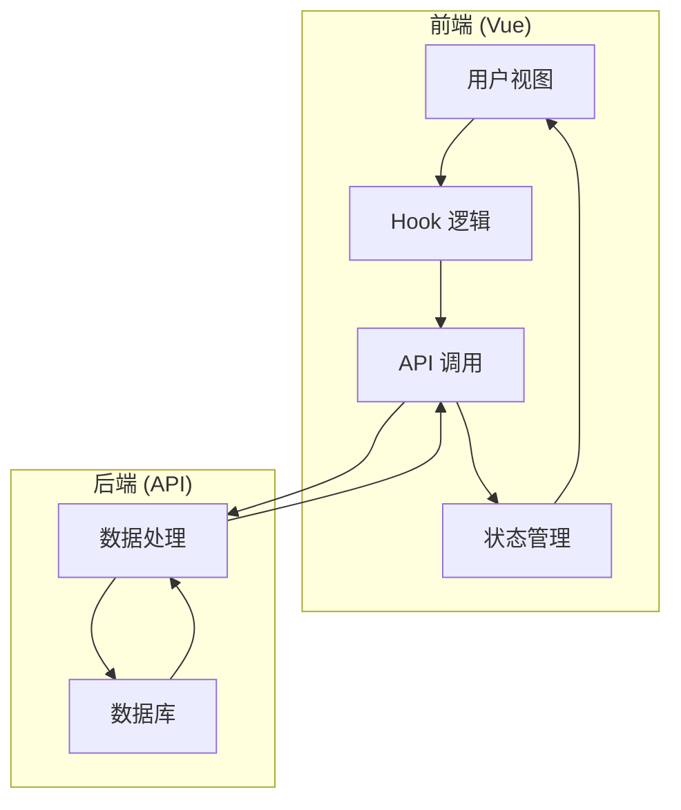
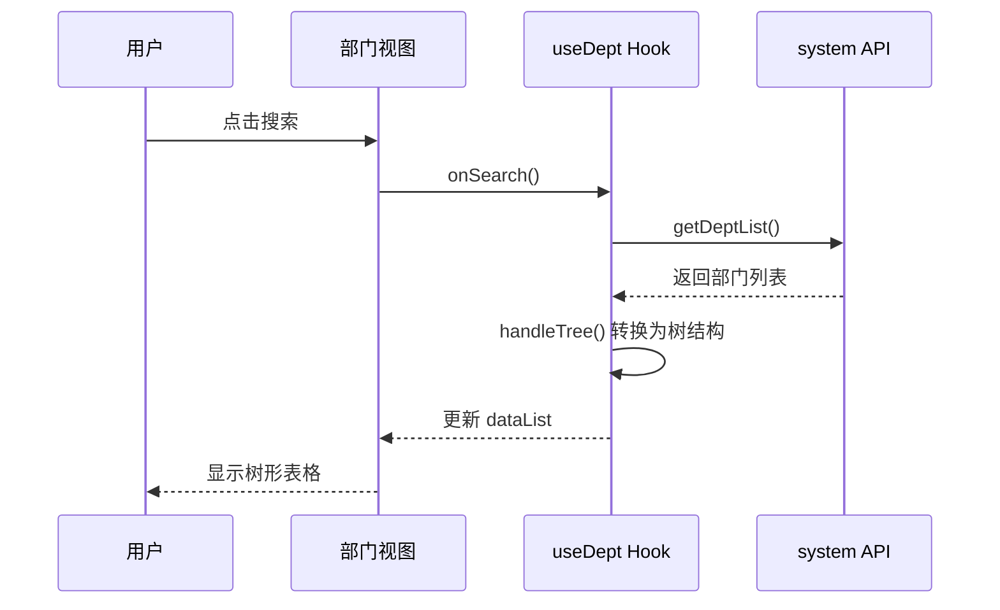
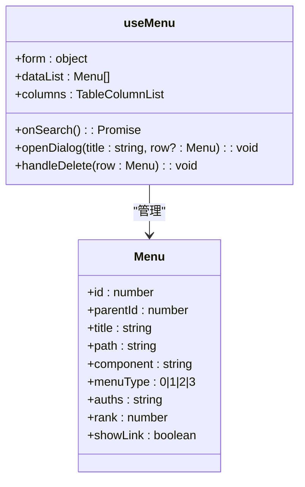
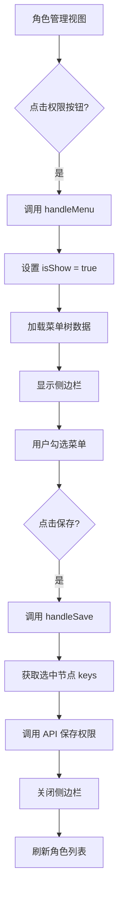
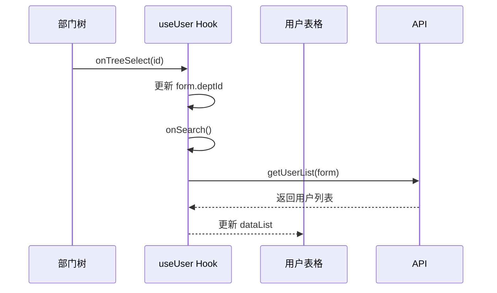
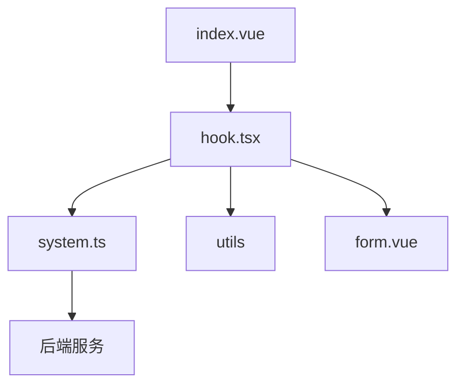

# 系统管理视图

<cite>
**本文档引用文件**  
- [system.ts](file://web/src/api/system.ts)
- [hook.tsx](file://web/src/views/system/dept/utils/hook.tsx)
- [hook.tsx](file://web/src/views/system/menu/utils/hook.tsx)
- [hook.tsx](file://web/src/views/system/role/utils/hook.tsx)
- [hook.tsx](file://web/src/views/system/user/utils/hook.tsx)
- [index.vue](file://web/src/views/system/dept/index.vue)
- [index.vue](file://web/src/views/system/menu/index.vue)
- [index.vue](file://web/src/views/system/role/index.vue)
- [index.vue](file://web/src/views/system/user/index.vue)
- [form.vue](file://web/src/views/system/dept/form.vue)
- [form.vue](file://web/src/views/system/menu/form.vue)
- [form.vue](file://web/src/views/system/role/form.vue)
- [index.vue](file://web/src/views/system/user/form/index.vue)
- [role.vue](file://web/src/views/system/user/form/role.vue)
- [tree.vue](file://web/src/views/system/user/tree.vue)
- [types.ts](file://web/src/views/system/dept/utils/types.ts)
- [types.ts](file://web/src/views/system/menu/utils/types.ts)
- [types.ts](file://web/src/views/system/role/utils/types.ts)
- [types.ts](file://web/src/views/system/user/utils/types.ts)
</cite>

## 目录
1. [简介](#简介)
2. [项目结构](#项目结构)
3. [核心组件](#核心组件)
4. [架构概览](#架构概览)
5. [详细组件分析](#详细组件分析)
6. [依赖分析](#依赖分析)
7. [性能考量](#性能考量)
8. [故障排除指南](#故障排除指南)
9. [结论](#结论)

## 简介
本文件深入解析 `vue-pure-admin-all` 项目中系统管理模块的实现机制，涵盖用户、部门、角色、菜单四大核心管理页面。文档详细阐述了各视图组件的数据表格展示、分页处理、搜索过滤和批量操作功能，分析了表单组件的动态渲染、校验规则与提交逻辑，并揭示了菜单树与权限系统的联动机制及前后端数据交互模式。

## 项目结构
系统管理模块位于 `web/src/views/system` 目录下，包含 `dept`（部门）、`menu`（菜单）、`role`（角色）、`user`（用户）四个子模块，每个模块均包含 `index.vue`（主视图）、`form.vue`（表单组件）和 `utils` 目录（工具函数与类型定义）。`hooks.ts` 文件提供跨模块的公共逻辑封装。

**文档来源**
- [system.ts](file://web/src/api/system.ts)
- [index.vue](file://web/src/views/system/dept/index.vue)
- [index.vue](file://web/src/views/system/menu/index.vue)
- [index.vue](file://web/src/views/system/role/index.vue)
- [index.vue](file://web/src/views/system/user/index.vue)

## 核心组件
系统管理模块的核心组件包括基于 `pure-table` 的数据表格、`ReDialog` 弹窗组件、`RePureTableBar` 工具栏以及通过 `hook.tsx` 封装的 CRUD 操作和状态管理逻辑。这些组件共同实现了数据的展示、交互和持久化。

**文档来源**
- [index.vue](file://web/src/views/system/dept/index.vue)
- [index.vue](file://web/src/views/system/menu/index.vue)
- [index.vue](file://web/src/views/system/role/index.vue)
- [index.vue](file://web/src/views/system/user/index.vue)
- [hook.tsx](file://web/src/views/system/dept/utils/hook.tsx)
- [hook.tsx](file://web/src/views/system/menu/utils/hook.tsx)
- [hook.tsx](file://web/src/views/system/role/utils/hook.tsx)
- [hook.tsx](file://web/src/views/system/user/utils/hook.tsx)

## 架构概览
系统管理模块采用典型的前后端分离架构，前端通过组合式 API 和自定义 Hook 封装业务逻辑，实现视图与逻辑的解耦。数据流遵循“视图触发 -> Hook 处理 -> API 调用 -> 状态更新 -> 视图刷新”的模式。

**图表来源**
- [hook.tsx](file://web/src/views/system/dept/utils/hook.tsx)
- [hook.tsx](file://web/src/views/system/menu/utils/hook.tsx)
- [hook.tsx](file://web/src/views/system/role/utils/hook.tsx)
- [hook.tsx](file://web/src/views/system/user/utils/hook.tsx)
- [system.ts](file://web/src/api/system.ts)

## 详细组件分析

### 部门管理分析
部门管理页面 (`dept/index.vue`) 展示部门树形结构，支持按名称和状态搜索。其核心逻辑由 `useDept` Hook 封装，负责数据获取、搜索过滤和弹窗操作。`getDeptList` API 返回一维数组，前端通过 `handleTree` 工具函数将其转换为树结构。

**图表来源**
- [index.vue](file://web/src/views/system/dept/index.vue)
- [hook.tsx](file://web/src/views/system/dept/utils/hook.tsx)
- [system.ts](file://web/src/api/system.ts)

**文档来源**
- [index.vue](file://web/src/views/system/dept/index.vue)
- [hook.tsx](file://web/src/views/system/dept/utils/hook.tsx)
- [form.vue](file://web/src/views/system/dept/form.vue)

### 菜单管理分析
菜单管理页面 (`menu/index.vue`) 与部门管理类似，但菜单类型 (`menuType`) 决定了其展示方式和操作权限。`useMenu` Hook 中的 `getMenuType` 函数根据类型返回对应的标签样式和文本。删除操作会提示用户注意下级菜单的级联删除。

**图表来源**
- [index.vue](file://web/src/views/system/menu/index.vue)
- [hook.tsx](file://web/src/views/system/menu/utils/hook.tsx)
- [types.ts](file://web/src/views/system/menu/utils/types.ts)

**文档来源**
- [index.vue](file://web/src/views/system/menu/index.vue)
- [hook.tsx](file://web/src/views/system/menu/utils/hook.tsx)
- [form.vue](file://web/src/views/system/menu/form.vue)

### 角色管理分析
角色管理页面 (`role/index.vue`) 的特点是集成了菜单权限分配功能。当用户点击“权限”按钮时，会显示一个侧边栏，内嵌一个 `el-tree-v2` 组件用于选择菜单权限。`useRole` Hook 通过 `isShow` 状态控制侧边栏的显示，并通过 `treeRef` 访问树组件实例进行权限的勾选和保存。

**图表来源**
- [index.vue](file://web/src/views/system/role/index.vue)
- [hook.tsx](file://web/src/views/system/role/utils/hook.tsx)

**文档来源**
- [index.vue](file://web/src/views/system/role/index.vue)
- [hook.tsx](file://web/src/views/system/role/utils/hook.tsx)
- [form.vue](file://web/src/views/system/role/form.vue)

### 用户管理分析
用户管理页面 (`user/index.vue`) 结构最为复杂，左侧为部门树 (`tree.vue`)，右侧为用户表格。`useUser` Hook 接收 `tableRef` 和 `treeRef` 作为参数，实现了树与表格的联动。选择部门树中的节点会触发 `onTreeSelect`，进而更新 `form.deptId` 并重新搜索用户列表。

**图表来源**
- [index.vue](file://web/src/views/system/user/index.vue)
- [hook.tsx](file://web/src/views/system/user/utils/hook.tsx)
- [tree.vue](file://web/src/views/system/user/tree.vue)

**文档来源**
- [index.vue](file://web/src/views/system/user/index.vue)
- [hook.tsx](file://web/src/views/system/user/utils/hook.tsx)
- [form/index.vue](file://web/src/views/system/user/form/index.vue)
- [form/role.vue](file://web/src/views/system/user/form/role.vue)

## 依赖分析
系统管理模块的依赖关系清晰。各 `index.vue` 视图文件依赖其对应的 `hook.tsx` 文件来获取数据和操作方法。`hook.tsx` 文件则依赖 `api/system.ts` 进行网络请求，并依赖 `utils` 工具函数进行数据处理。`form.vue` 组件通过 `ReDialog` 被 `hook.tsx` 动态渲染。

**图表来源**
- [system.ts](file://web/src/api/system.ts)
- [hook.tsx](file://web/src/views/system/dept/utils/hook.tsx)
- [hook.tsx](file://web/src/views/system/menu/utils/hook.tsx)
- [hook.tsx](file://web/src/views/system/role/utils/hook.tsx)
- [hook.tsx](file://web/src/views/system/user/utils/hook.tsx)

**文档来源**
- [system.ts](file://web/src/api/system.ts)
- [hook.tsx](file://web/src/views/system/dept/utils/hook.tsx)
- [hook.tsx](file://web/src/views/system/menu/utils/hook.tsx)
- [hook.tsx](file://web/src/views/system/role/utils/hook.tsx)
- [hook.tsx](file://web/src/views/system/user/utils/hook.tsx)

## 性能考量
该模块在性能方面有以下考量：
1.  **数据懒加载**：部门和用户管理的树形结构在 `onMounted` 钩子中异步加载，避免阻塞主页面渲染。
2.  **防抖与节流**：虽然当前代码未显式使用，但 `onSearch` 等频繁触发的函数是防抖的理想候选。
3.  **虚拟滚动**：对于大型列表，`pure-table` 组件可能支持虚拟滚动以优化渲染性能。
4.  **状态管理**：使用 `reactive` 和 `ref` 进行细粒度的状态管理，避免不必要的组件重渲染。

## 故障排除指南
1.  **表格数据不显示**：检查 `onSearch` 函数是否被正确调用，确认 `getXXXList` API 是否返回了预期数据。
2.  **弹窗无法打开**：检查 `addDialog` 调用是否正确，确认 `contentRenderer` 返回的组件是否存在且路径正确。
3.  **树形结构不正确**：确保后端返回的数据格式符合 `handleTree` 函数的要求（包含 `id` 和 `parentId` 字段）。
4.  **权限分配不生效**：检查 `handleSave` 函数中获取选中节点的方法（如 `getCheckedKeys()`）是否正确，并确认 API 调用参数无误。

**文档来源**
- [hook.tsx](file://web/src/views/system/dept/utils/hook.tsx)
- [hook.tsx](file://web/src/views/system/menu/utils/hook.tsx)
- [hook.tsx](file://web/src/views/system/role/utils/hook.tsx)
- [hook.tsx](file://web/src/views/system/user/utils/hook.tsx)
- [system.ts](file://web/src/api/system.ts)

## 结论
`vue-pure-admin-all` 的系统管理模块通过精心设计的 Hook 模式，实现了高度的代码复用和逻辑解耦。其架构清晰，功能完整，为用户、部门、角色、菜单的管理提供了直观且高效的界面。通过深入理解其数据流和组件交互，开发者可以轻松地进行功能扩展和维护。