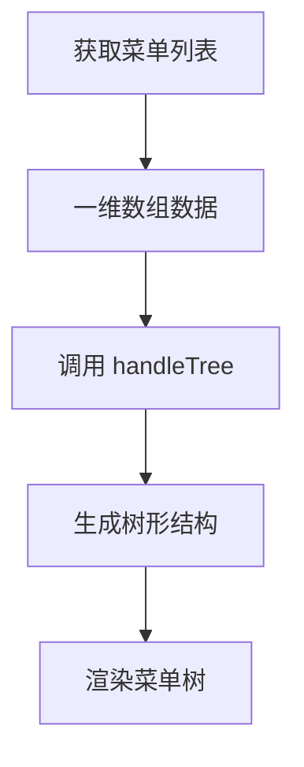
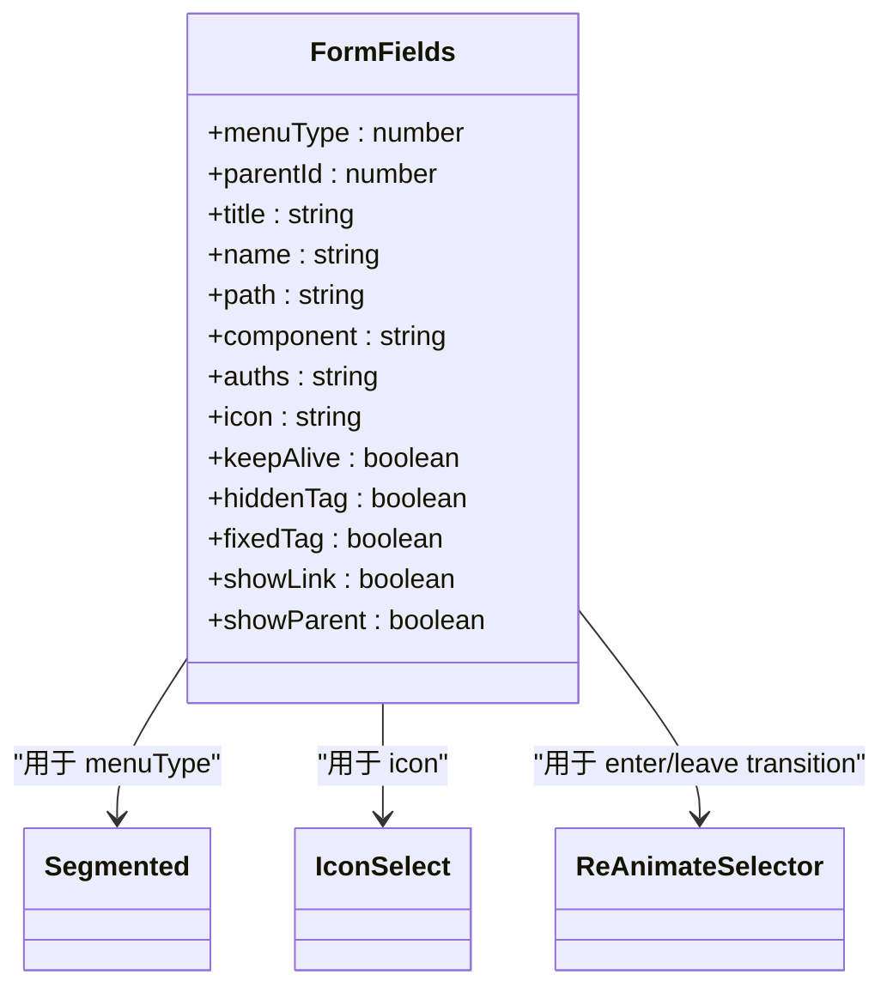
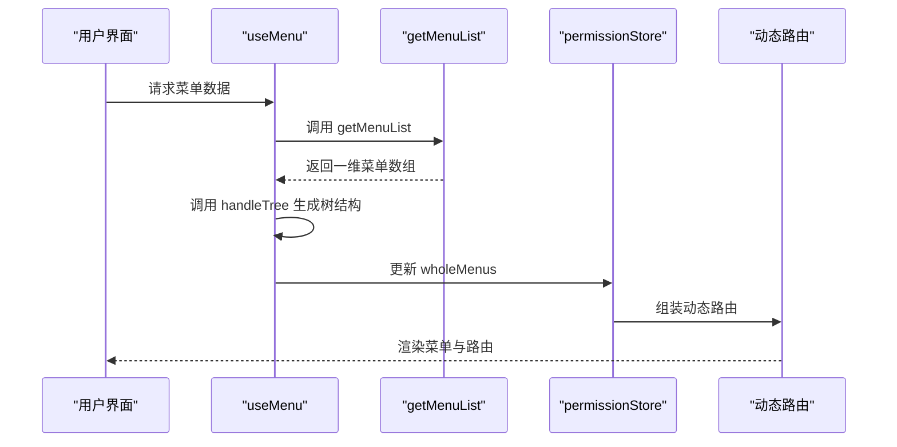
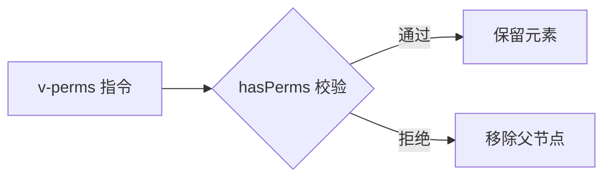

# 菜单管理

<cite>
**本文档引用文件**  
- [form.vue](file://web/src/views/system/menu/form.vue)
- [hook.tsx](file://web/src/views/system/menu/utils/hook.tsx)
- [remaining.ts](file://web/src/router/modules/remaining.ts)
- [permission.ts](file://web/src/store/modules/permission.ts)
- [index.ts](file://web/src/directives/perms/index.ts)
- [tree.ts](file://web/src/utils/tree.ts)
- [Select.vue](file://web/src/components/ReIcon/src/Select.vue)
</cite>

## 目录
1. [简介](#简介)
2. [菜单树形结构与可视化编辑](#菜单树形结构与可视化编辑)
3. [菜单表单实现逻辑](#菜单表单实现逻辑)
4. [菜单CRUD操作与动态路由生成](#菜单crud操作与动态路由生成)
5. [权限校验与v-perms指令](#权限校验与v-perms指令)
6. [国际化与多级缓存机制](#国际化与多级缓存机制)
7. [结论](#结论)

## 简介
`vue-pure-admin-all` 的菜单管理模块提供了一套完整的前端菜单配置系统，支持树形结构的可视化编辑、权限控制、动态路由生成和国际化展示。该模块通过 `form.vue` 实现菜单配置表单，利用 `hook.tsx` 封装增删改查逻辑，并结合 `remaining.ts` 和 `permission.ts` 实现前端路由的动态组装与权限过滤。同时，系统通过 `v-perms` 指令实现按钮级权限控制，并集成图标选择器和多语言支持，形成完整的菜单管理体系。

**Section sources**
- [form.vue](file://web/src/views/system/menu/form.vue#L1-L342)
- [hook.tsx](file://web/src/views/system/menu/utils/hook.tsx#L1-L225)

## 菜单树形结构与可视化编辑

菜单管理模块采用树形结构展示菜单层级关系，支持节点拖拽排序、层级调整和类型切换（目录/菜单/按钮）。树形结构由 `handleTree` 工具函数将一维数组转换为嵌套结构，确保父子关系正确映射。

在 `hook.tsx` 中，`useMenu` 函数通过 `getMenuList` 获取菜单数据后，调用 `handleTree` 构建树形结构并赋值给 `dataList`，供前端组件渲染使用。树形控件支持搜索、展开/折叠等交互功能，提升用户体验。

**Diagram sources**
- [hook.tsx](file://web/src/views/system/menu/utils/hook.tsx#L60-L70)
- [tree.ts](file://web/src/utils/tree.ts#L150-L188)

## 菜单表单实现逻辑

`form.vue` 是菜单配置的核心表单组件，采用 `el-form` 实现字段输入与校验，支持多种菜单类型（目录、菜单、外链、按钮）的差异化配置。

表单字段包括：
- **菜单类型**：通过 `Segmented` 组件切换，控制后续字段显示逻辑
- **上级菜单**：使用 `el-cascader` 实现层级选择，支持国际化标题展示
- **路由配置**：包含路径、名称、组件路径、重定向等字段，仅在非按钮类型时显示
- **权限标识**：按钮类型专属字段，用于权限校验
- **图标选择**：集成 `IconSelect` 组件，支持 Element Plus、Remix Icon 等多种图标库
- **显示控制**：如缓存、标签页隐藏、父级显示等开关配置

表单通过 `v-show` 动态控制字段可见性，确保不同菜单类型仅展示相关配置项。

**Diagram sources**
- [form.vue](file://web/src/views/system/menu/form.vue#L1-L342)
- [Select.vue](file://web/src/components/ReIcon/src/Select.vue#L1-L268)

**Section sources**
- [form.vue](file://web/src/views/system/menu/form.vue#L1-L342)
- [enums.ts](file://web/src/views/system/menu/utils/enums.ts)

## 菜单CRUD操作与动态路由生成

`hook.tsx` 中的 `useMenu` 函数封装了菜单的增删改查操作，并通过 `addDialog` 打开表单弹窗，实现新增与编辑功能。表单提交前进行校验，成功后刷新菜单列表。

前端路由的动态生成由 `remaining.ts` 和 `permission.ts` 共同完成：
1. `remaining.ts` 定义动态路由模块
2. `permission.ts` 中的 `usePermissionStore` 存储权限菜单
3. `handleWholeMenus` 方法将静态路由与动态路由合并，并过滤无权限项
4. 最终生成的菜单用于侧边栏渲染和路由守卫

动态路由生成流程如下：

**Diagram sources**
- [hook.tsx](file://web/src/views/system/menu/utils/hook.tsx#L1-L225)
- [permission.ts](file://web/src/store/modules/permission.ts#L1-L74)
- [remaining.ts](file://web/src/router/modules/remaining.ts)

**Section sources**
- [hook.tsx](file://web/src/views/system/menu/utils/hook.tsx#L1-L225)
- [permission.ts](file://web/src/store/modules/permission.ts#L1-L74)

## 权限校验与v-perms指令

系统通过 `v-perms` 指令实现按钮级权限控制。该指令在 `directives/perms/index.ts` 中定义，接收权限标识数组，调用 `hasPerms` 方法校验当前用户是否具备相应权限。

若用户无权限，指令会自动移除对应 DOM 元素，实现无痕隐藏。权限标识与后端 API 权限保持一致，确保前后端权限体系统一。

**Diagram sources**
- [index.ts](file://web/src/directives/perms/index.ts#L1-L15)
- [auth.ts](file://web/src/utils/auth.ts)

**Section sources**
- [index.ts](file://web/src/directives/perms/index.ts#L1-L15)

## 国际化与多级缓存机制

菜单支持国际化展示，通过 `transformI18n` 函数对菜单标题进行翻译处理，在树形渲染和搜索时均保持多语言一致性。

系统采用多级缓存机制提升性能：
- **页面缓存**：通过 `keepAlive` 字段控制 `keep-alive` 缓存
- **标签页缓存**：`fixedTag` 实现标签页固定
- **状态缓存**：`cachePageList` 在 `permission.ts` 中管理缓存页面名称
- **操作去抖**：`debounce` 防止频繁操作导致状态不一致

缓存操作由 `cacheOperate` 方法统一管理，支持添加、删除、刷新三种模式，并监听标签页变化自动清理无效缓存。

**Section sources**
- [form.vue](file://web/src/views/system/menu/form.vue#L1-L342)
- [permission.ts](file://web/src/store/modules/permission.ts#L50-L70)

## 结论

`vue-pure-admin-all` 的菜单管理模块设计合理、功能完整，实现了从菜单配置、权限控制到动态路由生成的全流程管理。通过组件化设计和状态管理，确保了系统的可维护性和扩展性。建议在实际使用中注意权限标识的统一管理，避免前后端不一致问题，并合理使用缓存机制提升用户体验。