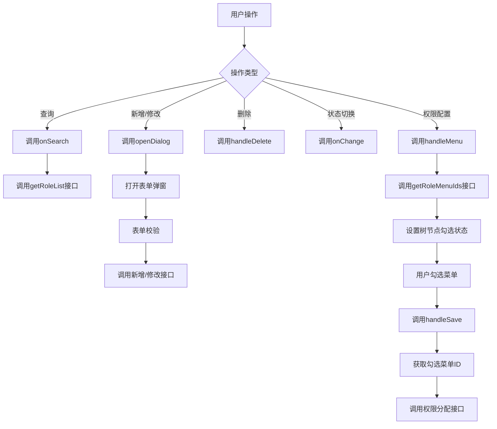
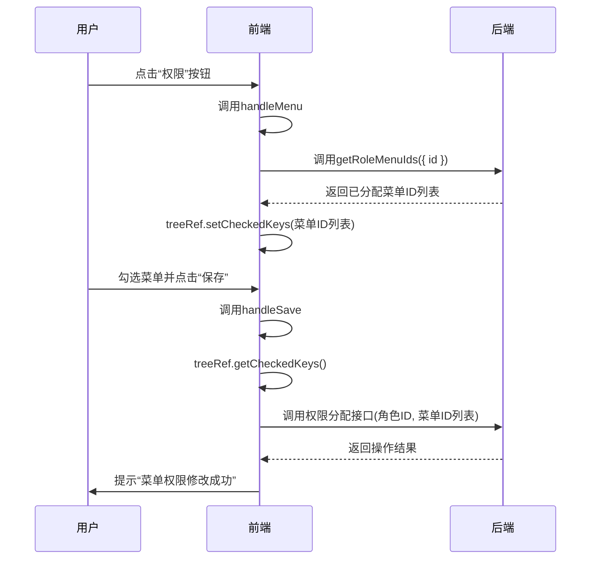

# 角色管理

<cite>
**本文档引用文件**  
- [index.vue](file://web/src/views/system/role/index.vue)
- [form.vue](file://web/src/views/system/role/form.vue)
- [hook.tsx](file://web/src/views/system/role/utils/hook.tsx)
- [system.ts](file://web/src/api/system.ts)
- [types.ts](file://web/src/views/system/role/utils/types.ts)
- [rule.ts](file://web/src/views/system/role/utils/rule.ts)
</cite>

## 目录
1. [简介](#简介)
2. [角色列表数据展示与状态管理](#角色列表数据展示与状态管理)
3. [角色表单权限选择器实现](#角色表单权限选择器实现)
4. [hook.tsx中的CRUD与权限分配逻辑](#hooktsx中的crud与权限分配逻辑)
5. [API接口与数据提交流程](#api接口与数据提交流程)
6. [角色与用户、菜单的多对多关系管理](#角色与用户菜单的多对多关系管理)
7. [角色权限继承与覆盖机制](#角色权限继承与覆盖机制)

## 简介
本模块实现系统中角色的全生命周期管理，包括角色的增删改查、权限配置、状态切换等功能。角色作为权限控制的核心载体，通过与用户和菜单的关联，实现细粒度的访问控制。系统采用组合式API与响应式数据流，结合Element Plus组件库，构建高效、可维护的角色管理界面。

## 角色列表数据展示与状态管理

角色列表通过`PureTableBar`组件进行封装，支持分页、搜索、重置等交互功能。数据展示采用`pure-table`组件，列定义在`hook.tsx`中通过`columns`变量声明，包含角色编号、名称、标识、状态、备注、创建时间及操作列。

状态管理采用`reactive`与`ref`结合的方式，`dataList`存储角色列表数据，`loading`控制加载状态，`pagination`管理分页信息。状态切换通过`el-switch`组件实现，配合`switchLoadMap`实现按钮级别的加载状态控制，提升用户体验。

角色状态显示逻辑通过`cellRenderer`自定义渲染器实现，将数值状态（1/0）映射为“已启用”/“已停用”文本，并通过`onChange`方法在用户操作时弹出确认框，防止误操作。

**Section sources**
- [index.vue](file://web/src/views/system/role/index.vue#L1-L345)
- [hook.tsx](file://web/src/views/system/role/utils/hook.tsx#L14-L317)

## 角色表单权限选择器实现

角色表单（form.vue）用于新增和修改角色基本信息，包括角色名称、标识和备注。表单通过`el-form`组件实现，使用`formRules`进行字段校验。

权限选择器在用户点击“权限”按钮时触发，通过`handleMenu`方法打开权限配置面板。该面板使用`el-tree-v2`组件展示菜单树，支持复选、搜索、展开/折叠、全选/全不选及父子节点联动等功能。

菜单权限树的勾选联动逻辑由`el-tree-v2`的`check-strictly`属性控制。当`isLinkage`为`true`时，`check-strictly`为`false`，实现父子节点勾选联动；反之则独立选择。树节点数据通过`getRoleMenu`接口获取，初始勾选状态由`getRoleMenuIds`接口返回的菜单ID列表决定。

**Section sources**
- [form.vue](file://web/src/views/system/role/form.vue#L1-L56)
- [index.vue](file://web/src/views/system/role/index.vue#L1-L345)
- [hook.tsx](file://web/src/views/system/role/utils/hook.tsx#L14-L317)

## hook.tsx中的CRUD与权限分配逻辑

`hook.tsx`文件通过`useRole`函数封装了角色管理模块的核心逻辑，采用组合式API组织代码，提升可读性与复用性。

### CRUD操作
- **查询**：`onSearch`方法调用`getRoleList`接口，根据表单条件加载角色列表，并更新分页信息。
- **新增/修改**：`openDialog`方法通过`addDialog`打开表单弹窗，表单提交前通过`beforeSure`钩子进行校验，校验通过后执行相应业务逻辑并刷新列表。
- **删除**：`handleDelete`方法在确认后执行删除操作，并提示用户删除成功。
- **状态切换**：`onChange`方法在用户切换角色状态时弹出确认框，确认后更新状态并提示。

### 权限分配逻辑
- **权限加载**：`handleMenu`方法在打开权限面板时，调用`getRoleMenuIds`获取当前角色已分配的菜单ID，并通过`treeRef.value.setCheckedKeys`设置树节点的勾选状态。
- **权限保存**：`handleSave`方法通过`treeRef.value.getCheckedKeys()`获取当前勾选的菜单ID，准备提交数据。
- **树节点过滤**：`onQueryChanged`与`filterMethod`配合实现树节点的实时搜索过滤功能。

**Diagram sources**
- [hook.tsx](file://web/src/views/system/role/utils/hook.tsx#L14-L317)

**Section sources**
- [hook.tsx](file://web/src/views/system/role/utils/hook.tsx#L14-L317)

## API接口与数据提交流程

角色管理模块通过`system.ts`文件中的API函数与后端进行数据交互，所有请求通过`http.request`方法发送。

### 主要API接口
- `getRoleList`：获取角色列表，HTTP方法为POST，路径为`/role`。
- `getRoleMenu`：获取菜单权限树数据，HTTP方法为POST，路径为`/role-menu`。
- `getRoleMenuIds`：根据角色ID获取已分配的菜单ID列表，HTTP方法为POST，路径为`/role-menu-ids`。

### 数据提交流程
1. 用户在界面执行操作（如新增角色、分配权限）。
2. 前端调用对应的处理函数（如`openDialog`、`handleSave`）。
3. 处理函数调用相应的API函数（如`getRoleList`、`getRoleMenuIds`）。
4. API函数通过`http.request`发送请求至后端。
5. 后端处理请求并返回结果。
6. 前端根据返回结果更新UI状态（如刷新列表、提示成功信息）。

**Diagram sources**
- [system.ts](file://web/src/api/system.ts#L37-L84)
- [hook.tsx](file://web/src/views/system/role/utils/hook.tsx#L14-L317)

**Section sources**
- [system.ts](file://web/src/api/system.ts#L37-L84)
- [hook.tsx](file://web/src/views/system/role/utils/hook.tsx#L14-L317)

## 角色与用户、菜单的多对多关系管理

在系统权限模型中，角色与用户、菜单之间存在多对多关系：
- 一个用户可拥有多个角色，一个角色可被多个用户拥有。
- 一个角色可拥有多个菜单权限，一个菜单可被多个角色拥有。

这种关系通过中间表实现：
- `user_role`表关联用户与角色。
- `role_menu`表关联角色与菜单。

在前端，这种关系通过以下方式管理：
- **用户-角色**：在用户管理模块中，通过角色选择器为用户分配角色。
- **角色-菜单**：在角色管理模块中，通过菜单权限树为角色分配菜单权限。

角色作为权限的集合，用户通过拥有角色间接获得菜单访问权限。这种设计实现了权限的集中管理，降低了用户与菜单直接关联的复杂性。

**Section sources**
- [hook.tsx](file://web/src/views/system/role/utils/hook.tsx#L14-L317)
- [system.ts](file://web/src/api/system.ts#L37-L84)

## 角色权限继承与覆盖机制

本系统当前版本未实现显式的角色权限继承机制（如父子角色），所有角色的权限均为独立配置。每个角色的菜单权限通过`role_menu`表直接关联，互不影响。

权限覆盖机制体现在：
- 当用户拥有多个角色时，其最终权限为所有角色权限的并集。
- 若不同角色对同一菜单的访问权限不同（如一个角色有访问权，另一个无），系统通常采用“或”逻辑，即只要有一个角色有权限，用户即可访问。

此机制确保了权限分配的灵活性，但需注意避免权限过度分配。未来可通过引入角色优先级或权限冲突解决策略来增强控制能力。

**Section sources**
- [hook.tsx](file://web/src/views/system/role/utils/hook.tsx#L14-L317)
- [system.ts](file://web/src/api/system.ts#L37-L84)