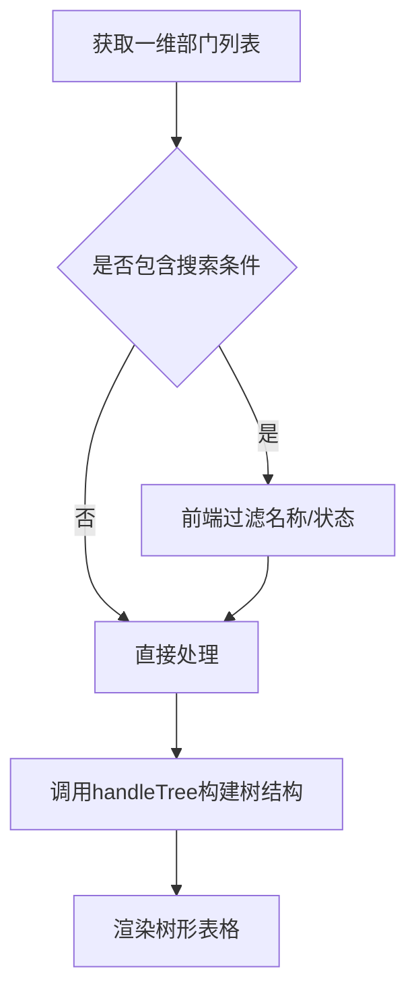
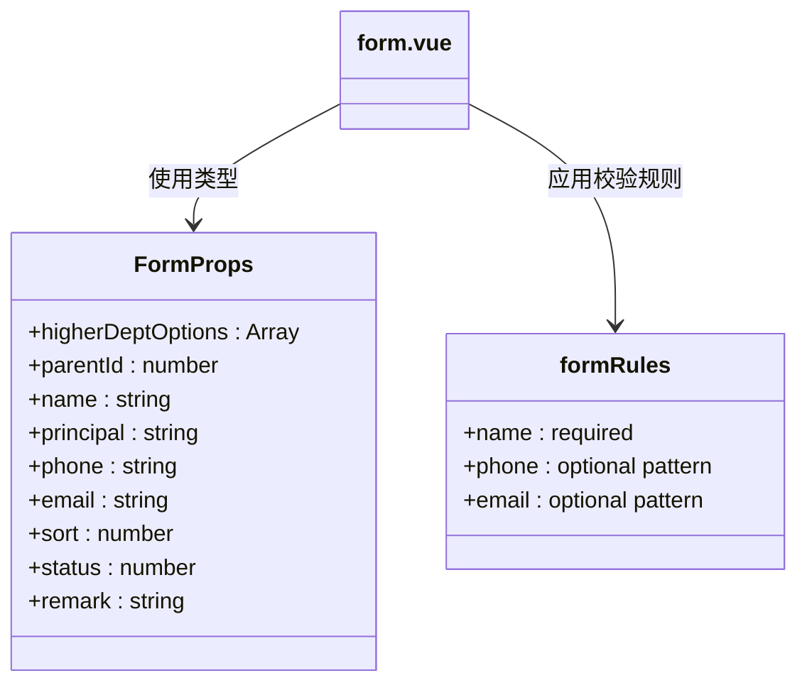
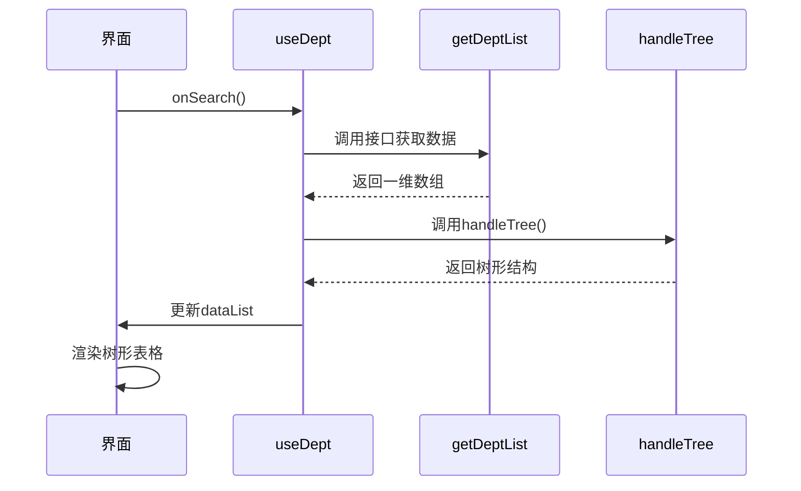

# 部门管理

<cite>
**本文档引用文件**  
- [index.vue](file://web/src/views/system/dept/index.vue)
- [form.vue](file://web/src/views/system/dept/form.vue)
- [hook.tsx](file://web/src/views/system/dept/utils/hook.tsx)
- [system.ts](file://web/src/api/system.ts)
- [tree.ts](file://web/src/utils/tree.ts)
</cite>

## 目录
1. [简介](#简介)
2. [部门树形结构实现机制](#部门树形结构实现机制)
3. [部门表单父子节点关联与排序功能](#部门表单父子节点关联与排序功能)
4. [部门增删改查操作封装分析](#部门增删改查操作封装分析)
5. [树形数据前后端传输格式与处理方式](#树形数据前后端传输格式与处理方式)
6. [部门与用户、角色的关联关系及权限分配作用](#部门与用户角色的关联关系及权限分配作用)
7. [部门排序与层级调整的UI交互设计与技术实现](#部门排序与层级调整的ui交互设计与技术实现)

## 简介
本模块为 `vue-pure-admin-all` 系统中的部门管理功能，提供完整的组织架构管理能力。系统通过树形结构展示部门层级关系，支持部门的新增、修改、删除、搜索和状态管理，并结合表单组件实现父子部门选择、排序设置等核心功能。所有操作通过统一的 Hook 封装进行逻辑处理，确保代码复用性和可维护性。

## 部门树形结构实现机制

### 树节点渲染
部门树形结构基于 `el-table` 组件的树形表格功能实现，通过配置 `row-key="id"` 和 `default-expand-all` 属性启用树形展示模式。数据源 `dataList` 经过 `handleTree` 工具函数处理后形成嵌套的树结构，`children` 字段用于表示子节点集合。

节点内容通过 `pure-table` 组件的插槽机制自定义渲染，包括部门名称、状态标签、创建时间、备注信息及操作按钮组。其中状态字段使用 `cellRenderer` 渲染为 `el-tag` 标签，以视觉化方式呈现启用/停用状态。

### 展开/折叠交互
展开与折叠功能由 `el-table` 内置支持，用户点击行前的展开图标即可切换子节点的显示状态。由于设置了 `default-expand-all`，页面加载时所有节点默认展开，提升初始可视性。

### 层级关系维护
层级关系通过后端返回的一维数组结构构建，每个节点包含 `id` 和 `parentId` 字段。前端使用 `handleTree` 函数将扁平数据转换为树形结构，依据 `parentId` 匹配父节点与子节点的关系，递归构建完整的组织树。



**Diagram sources**  
- [index.vue](file://web/src/views/system/dept/index.vue#L1-L172)
- [hook.tsx](file://web/src/views/system/dept/utils/hook.tsx#L50-L75)
- [tree.ts](file://web/src/utils/tree.ts#L150-L188)

**Section sources**  
- [index.vue](file://web/src/views/system/dept/index.vue#L1-L172)
- [hook.tsx](file://web/src/views/system/dept/utils/hook.tsx#L50-L75)

## 部门表单父子节点关联与排序功能

### 父子节点关联逻辑
在 `form.vue` 中，上级部门通过 `el-cascader` 级联选择器实现选择功能。该组件接收 `higherDeptOptions` 参数，其数据来源于当前部门树的克隆副本，并经过 `formatHigherDeptOptions` 处理，自动为状态为“停用”的部门添加 `disabled` 属性，防止其被选为上级部门。

选择器配置 `checkStrictly: true` 允许任意节点可选，不限于叶子节点，符合组织架构中可将任意部门设为上级的需求。`emitPath: false` 确保仅返回选中节点的 `id` 值，简化数据结构。

### 排序功能
排序字段通过 `el-input-number` 数字输入框实现，限定范围为 0 到 9999，步长由组件默认控制。排序值用于控制同一层级下部门的显示顺序，数值越小排序越靠前。该字段在新增或编辑时由用户手动输入，前端无自动排序逻辑，依赖后端按 `sort` 字段进行排序返回。



**Diagram sources**  
- [form.vue](file://web/src/views/system/dept/form.vue#L1-L139)
- [types.ts](file://web/src/views/system/dept/utils/types.ts)

**Section sources**  
- [form.vue](file://web/src/views/system/dept/form.vue#L1-L139)
- [rule.ts](file://web/src/views/system/dept/utils/rule.ts)

## 部门增删改查操作封装分析

### Hook 封装机制
`useDept` Hook 在 `hook.tsx` 中定义，集中管理所有部门相关的业务逻辑，包括数据获取、搜索、重置、弹窗打开、删除处理等。通过 `reactive` 和 `ref` 管理表单、加载状态、列配置和数据列表，实现响应式数据绑定。

### 树形数据处理策略
`onSearch` 方法中调用 `getDeptList()` 获取原始数据后，使用 `handleTree()` 将一维数组转换为树结构。此过程基于 `id` 和 `parentId` 字段进行映射，构建出具有 `children` 属性的嵌套对象，供 `el-table` 直接消费。

对于上级部门选项的处理，`formatHigherDeptOptions` 递归遍历树结构，根据 `status` 字段动态添加 `disabled` 属性，实现禁用项的逻辑控制，体现了前端对后端数据的二次加工能力。



**Diagram sources**  
- [hook.tsx](file://web/src/views/system/dept/utils/hook.tsx#L1-L178)
- [tree.ts](file://web/src/utils/tree.ts#L150-L188)

**Section sources**  
- [hook.tsx](file://web/src/views/system/dept/utils/hook.tsx#L1-L178)

## 树形数据前后端传输格式与处理方式

### 前后端传输格式
后端通过 `/dept` 接口返回部门数据，请求方式为 POST，响应结构遵循统一的 `Result` 类型：
```ts
type Result = {
  success: boolean;
  data?: Array<any>;
};
```
其中 `data` 为一维数组，每个对象包含 `id`、`parentId`、`name`、`sort`、`status` 等字段，用于前端构建树形结构。

### 前端处理流程
前端在 `onSearch` 中调用 `getDeptList()` 获取数据后，立即调用 `handleTree()` 进行转换。该函数通过建立 `parentId` 映射表，将所有子节点归集到对应父节点的 `children` 数组中，最终生成完整的树结构。

搜索功能在前端实现，通过 `form.name` 和 `form.status` 对已加载的树形数据进行过滤，避免频繁请求后端，提升交互响应速度。

**Section sources**  
- [system.ts](file://web/src/api/system.ts#L70-L73)
- [hook.tsx](file://web/src/views/system/dept/utils/hook.tsx#L60-L75)

## 部门与用户、角色的关联关系及权限分配作用

虽然当前部门模块未直接展示与用户、角色的关联界面，但从系统整体架构看，部门作为组织单元，通常与用户归属和角色分配密切相关。用户隶属于某个部门，而角色定义了权限集合，部门级别的权限控制可通过“部门+角色”组合实现数据范围权限（如仅查看本部门数据）。

未来扩展中，可在用户管理模块中增加“所属部门”字段，在角色授权时支持按部门维度分配可操作的数据范围，从而实现细粒度的权限管理体系。

**Section sources**  
- [system.ts](file://web/src/api/system.ts#L50-L68)

## 部门排序与层级调整的UI交互设计与技术实现

### UI交互设计
- **排序**：在表单中提供数字输入框，允许用户输入 0-9999 范围内的整数，数值越小排序越靠前。
- **层级调整**：通过“新增”按钮或在操作列点击“新增”链接时，传入当前行的 `id` 作为 `parentId`，实现将新部门添加为该部门的子部门。
- **新增上级部门**：在级联选择器中可选择任意非禁用部门作为上级，支持跨层级调整。

### 技术实现
- 排序值通过 `v-model="newFormInline.sort"` 双向绑定，提交时随表单一同发送。
- 层级关系通过 `parentId` 字段维护，新增时若指定 `parentId`，则新节点成为其子节点；若为 0 或空，则作为根节点。
- 弹窗中通过 `openDialog('新增', { parentId: row.id } as any)` 传递父级 ID，初始化表单时自动填充上级部门选择器。

该设计保证了组织结构的灵活性，支持动态调整部门隶属关系和显示顺序，满足企业组织架构变更需求。

**Section sources**  
- [form.vue](file://web/src/views/system/dept/form.vue#L1-L139)
- [hook.tsx](file://web/src/views/system/dept/utils/hook.tsx#L100-L150)