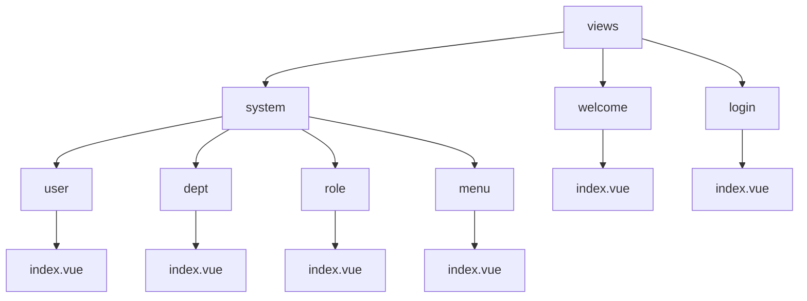
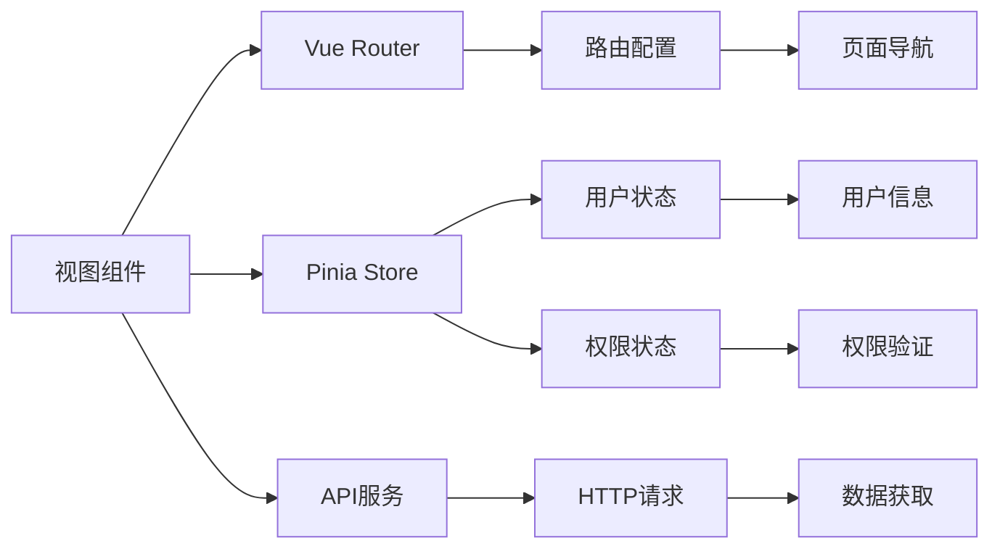
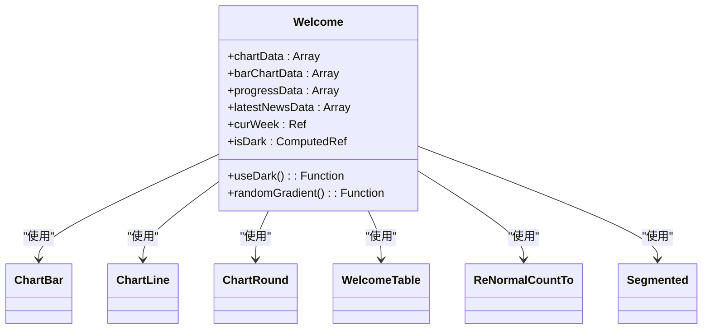
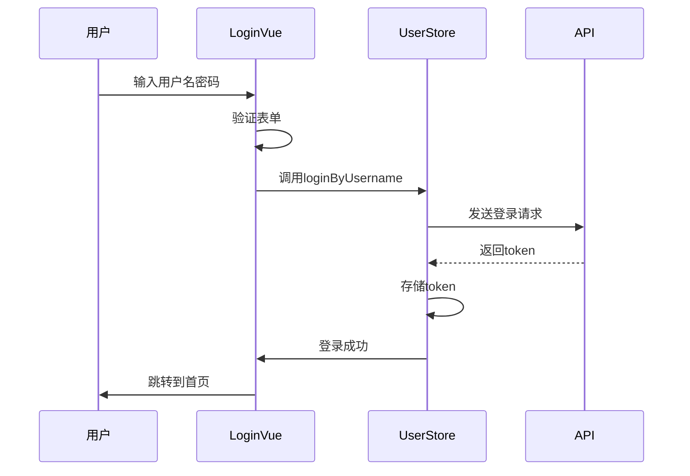
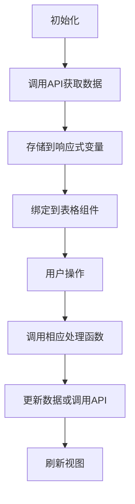
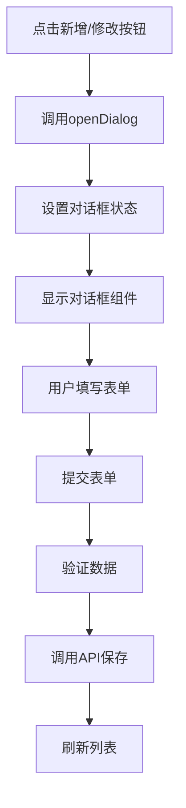
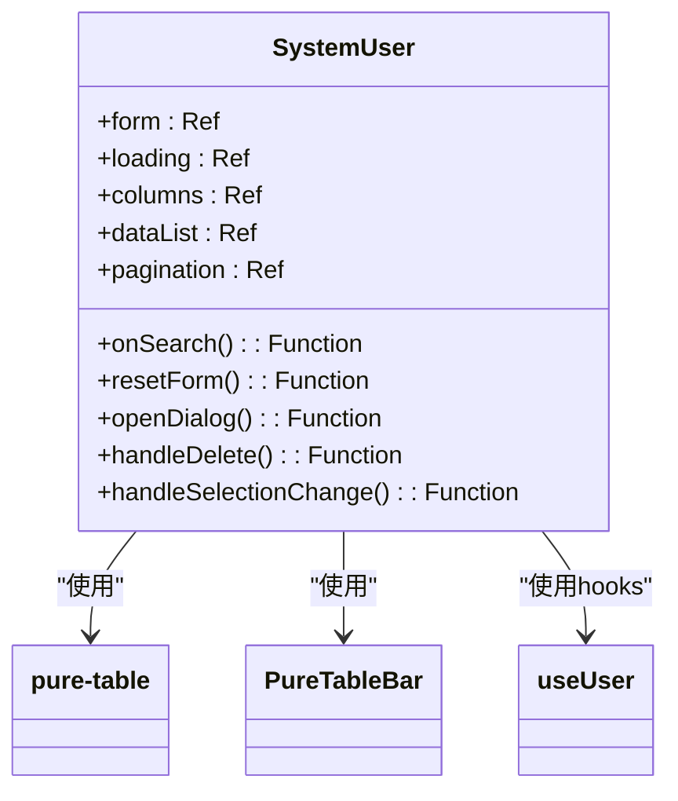
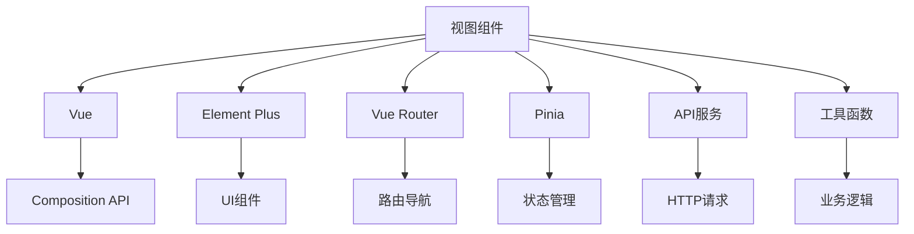

# 视图组件

<cite>
**本文档引用的文件**   
- [welcome/index.vue](file://web/src/views/welcome/index.vue)
- [login/index.vue](file://web/src/views/login/index.vue)
- [system/user/index.vue](file://web/src/views/system/user/index.vue)
- [system/dept/index.vue](file://web/src/views/system/dept/index.vue)
- [system/role/index.vue](file://web/src/views/system/role/index.vue)
- [system/menu/index.vue](file://web/src/views/system/menu/index.vue)
- [router/index.ts](file://web/src/router/index.ts)
- [user.ts](file://web/src/store/modules/user.ts)
- [user.ts](file://web/src/api/user.ts)
- [system.ts](file://web/src/api/system.ts)
</cite>

## 目录
1. [项目结构](#项目结构)
2. [核心组件](#核心组件)
3. [架构概述](#架构概述)
4. [详细组件分析](#详细组件分析)
5. [依赖分析](#依赖分析)
6. [性能考虑](#性能考虑)
7. [故障排除指南](#故障排除指南)
8. [结论](#结论)

## 项目结构

项目中的视图组件主要位于 `src/views` 目录下，采用模块化组织方式。核心视图包括欢迎页、登录页和系统管理模块。系统管理模块进一步细分为用户、部门、角色和菜单四个子模块，每个模块都有独立的目录结构，包含主视图文件和相关工具函数。

**图示来源**
- [welcome/index.vue](file://web/src/views/welcome/index.vue)
- [login/index.vue](file://web/src/views/login/index.vue)
- [system/user/index.vue](file://web/src/views/system/user/index.vue)
- [system/dept/index.vue](file://web/src/views/system/dept/index.vue)
- [system/role/index.vue](file://web/src/views/system/role/index.vue)
- [system/menu/index.vue](file://web/src/views/system/menu/index.vue)

**本节来源**
- [web/src/views](file://web/src/views)

## 核心组件

视图组件通过路由系统进行加载和管理，与状态管理(store)和API服务(api)紧密交互。欢迎页展示统计信息，登录页处理用户认证，系统管理模块提供用户、部门、角色和菜单的CRUD操作界面。所有视图组件都遵循一致的设计模式，使用Composition API组织逻辑，通过hooks封装可复用的功能。

**本节来源**
- [welcome/index.vue](file://web/src/views/welcome/index.vue#L1-L278)
- [login/index.vue](file://web/src/views/login/index.vue#L1-L378)
- [system/user/index.vue](file://web/src/views/system/user/index.vue#L1-L276)

## 架构概述

系统采用Vue 3 + TypeScript + Pinia的技术栈，视图组件通过Vue Router进行路由管理，使用Pinia进行状态管理。视图组件与业务逻辑分离，通过hooks和API服务进行数据交互。系统管理模块的各个子模块共享相似的架构模式，包括表格展示、表单处理和权限控制。

**图示来源**
- [router/index.ts](file://web/src/router/index.ts#L1-L229)
- [user.ts](file://web/src/store/modules/user.ts#L1-L122)
- [user.ts](file://web/src/api/user.ts#L1-L90)
- [system.ts](file://web/src/api/system.ts#L1-L86)

## 详细组件分析

### 欢迎页分析

欢迎页作为系统的首页，展示关键业务指标和统计数据。页面采用响应式布局，包含多个统计卡片，每个卡片显示不同的业务数据。

#### 组件结构

**图示来源**
- [welcome/index.vue](file://web/src/views/welcome/index.vue#L1-L278)

**本节来源**
- [welcome/index.vue](file://web/src/views/welcome/index.vue#L1-L278)

### 登录页分析

登录页提供多种登录方式，包括用户名密码登录、手机登录、二维码登录等。页面通过状态管理(store)维护当前显示的登录组件类型。

#### 登录流程

**图示来源**
- [login/index.vue](file://web/src/views/login/index.vue#L1-L378)
- [user.ts](file://web/src/store/modules/user.ts#L1-L122)
- [user.ts](file://web/src/api/user.ts#L1-L90)

**本节来源**
- [login/index.vue](file://web/src/views/login/index.vue#L1-L378)

### 系统管理模块分析

系统管理模块包含用户、部门、角色和菜单四个子模块，每个子模块都实现了标准的CRUD操作界面。

#### 数据绑定机制

**图示来源**
- [system/user/index.vue](file://web/src/views/system/user/index.vue#L1-L276)
- [system/dept/index.vue](file://web/src/views/system/dept/index.vue#L1-L173)
- [system/role/index.vue](file://web/src/views/system/role/index.vue#L1-L345)
- [system/menu/index.vue](file://web/src/views/system/menu/index.vue#L1-L164)

#### 表单处理机制
系统管理模块的表单处理采用统一的模式，通过`openDialog`函数打开对话框，传递操作类型和数据对象。

**图示来源**
- [system/user/index.vue](file://web/src/views/system/user/index.vue#L1-L276)
- [system/dept/index.vue](file://web/src/views/system/dept/index.vue#L1-L173)
- [system/role/index.vue](file://web/src/views/system/role/index.vue#L1-L345)
- [system/menu/index.vue](file://web/src/views/system/menu/index.vue#L1-L164)

#### 表格展示机制
表格展示使用`pure-table`组件，结合`PureTableBar`提供丰富的功能，包括分页、排序、筛选等。

**图示来源**
- [system/user/index.vue](file://web/src/views/system/user/index.vue#L1-L276)

**本节来源**
- [system/user/index.vue](file://web/src/views/system/user/index.vue#L1-L276)
- [system/dept/index.vue](file://web/src/views/system/dept/index.vue#L1-L173)
- [system/role/index.vue](file://web/src/views/system/role/index.vue#L1-L345)
- [system/menu/index.vue](file://web/src/views/system/menu/index.vue#L1-L164)

## 依赖分析

视图组件依赖于多个核心模块，包括路由、状态管理和API服务。这些依赖关系通过import语句建立，确保组件能够正常工作。

**图示来源**
- [welcome/index.vue](file://web/src/views/welcome/index.vue#L1-L278)
- [login/index.vue](file://web/src/views/login/index.vue#L1-L378)
- [system/user/index.vue](file://web/src/views/system/user/index.vue#L1-L276)

**本节来源**
- [web/src/views](file://web/src/views)
- [web/src/router](file://web/src/router)
- [web/src/store](file://web/src/store)
- [web/src/api](file://web/src/api)

## 性能考虑

视图组件在设计时考虑了性能优化，包括：
- 使用虚拟滚动处理大量数据
- 懒加载非关键资源
- 合理使用响应式系统，避免不必要的重新渲染
- 采用防抖技术处理频繁触发的事件

## 故障排除指南

常见问题及解决方案：
- **页面无法加载**：检查路由配置和组件导入路径
- **数据不显示**：确认API服务是否正常工作，检查网络请求
- **样式错乱**：验证CSS类名是否正确，检查样式文件导入
- **交互无响应**：检查事件绑定是否正确，确认相关函数已定义

**本节来源**
- [welcome/index.vue](file://web/src/views/welcome/index.vue#L1-L278)
- [login/index.vue](file://web/src/views/login/index.vue#L1-L378)
- [system/user/index.vue](file://web/src/views/system/user/index.vue#L1-L276)

## 结论

视图组件设计遵循一致的架构模式，通过Composition API组织逻辑，使用hooks封装可复用功能。系统管理模块的各个子模块共享相似的实现方式，便于维护和扩展。建议新开发的视图组件遵循现有模式，保持代码风格的一致性。