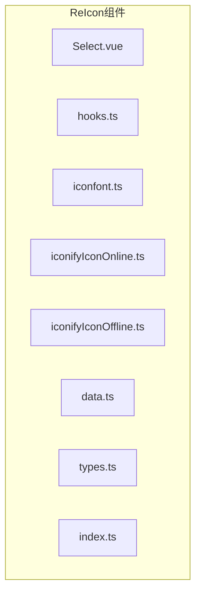
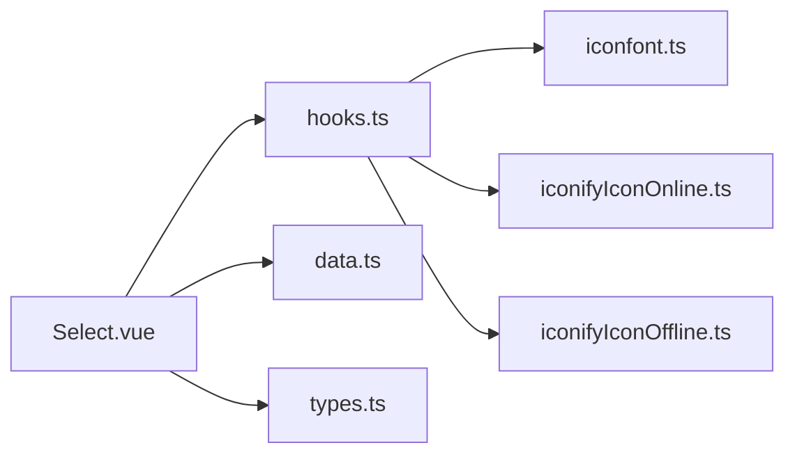
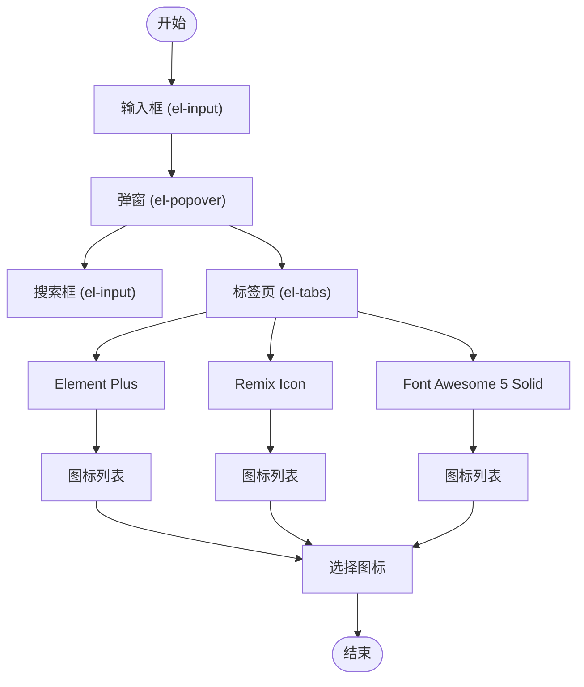
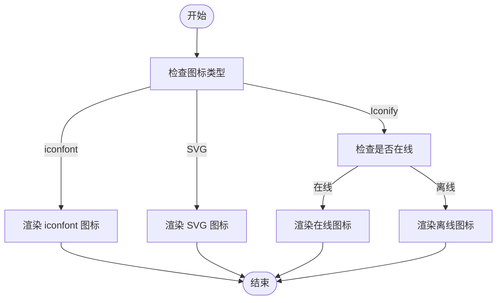

# 图标选择器组件 (ReIcon)

<cite>
**Referenced Files in This Document**   
- [Select.vue](file://web/src/components/ReIcon/src/Select.vue)
- [hooks.ts](file://web/src/components/ReIcon/src/hooks.ts)
- [iconfont.ts](file://web/src/components/ReIcon/src/iconfont.ts)
- [iconifyIconOnline.ts](file://web/src/components/ReIcon/src/iconifyIconOnline.ts)
- [iconifyIconOffline.ts](file://web/src/components/ReIcon/src/iconifyIconOffline.ts)
- [data.ts](file://web/src/components/ReIcon/data.ts)
- [types.ts](file://web/src/components/ReIcon/src/types.ts)
- [index.ts](file://web/src/components/ReIcon/index.ts)
- [iconfont.json](file://web/src/assets/iconfont/iconfont.json)
- [icon-select.vue](file://web/src/views/components/icon-select.vue)
</cite>

## 目录
1. [简介](#简介)
2. [项目结构](#项目结构)
3. [核心组件](#核心组件)
4. [架构概述](#架构概述)
5. [详细组件分析](#详细组件分析)
6. [依赖分析](#依赖分析)
7. [性能考虑](#性能考虑)
8. [故障排除指南](#故障排除指南)
9. [结论](#结论)

## 简介
ReIcon 是一个功能强大的图标选择器组件，专为 Vue.js 应用程序设计，支持多种图标来源。该组件允许开发者轻松集成和使用来自不同图标的图标，包括本地 iconfont 图标和在线 Iconify 图标。通过灵活的配置选项，ReIcon 能够满足各种应用场景的需求，无论是简单的表单元素还是复杂的菜单系统。

## 项目结构
ReIcon 组件位于 `web/src/components/ReIcon` 目录下，其结构清晰，便于维护和扩展。主要文件包括：
- `src/Select.vue`: 图标选择器的主界面。
- `src/hooks.ts`: 提供响应式图标操作方法的钩子函数。
- `src/iconfont.ts`: 封装 iconfont 组件。
- `src/iconifyIconOnline.ts`: 在线使用 Iconify 图标。
- `src/iconifyIconOffline.ts`: 本地使用 Iconify 图标。
- `data.ts`: 存储图标数据。
- `types.ts`: 定义类型接口。
- `index.ts`: 导出所有组件和工具。



**Diagram sources**
- [Select.vue](file://web/src/components/ReIcon/src/Select.vue)
- [hooks.ts](file://web/src/components/ReIcon/src/hooks.ts)
- [iconfont.ts](file://web/src/components/ReIcon/src/iconfont.ts)
- [iconifyIconOnline.ts](file://web/src/components/ReIcon/src/iconifyIconOnline.ts)
- [iconifyIconOffline.ts](file://web/src/components/ReIcon/src/iconifyIconOffline.ts)
- [data.ts](file://web/src/components/ReIcon/data.ts)
- [types.ts](file://web/src/components/ReIcon/src/types.ts)
- [index.ts](file://web/src/components/ReIcon/index.ts)

**Section sources**
- [Select.vue](file://web/src/components/ReIcon/src/Select.vue)
- [hooks.ts](file://web/src/components/ReIcon/src/hooks.ts)
- [iconfont.ts](file://web/src/components/ReIcon/src/iconfont.ts)
- [iconifyIconOnline.ts](file://web/src/components/ReIcon/src/iconifyIconOnline.ts)
- [iconifyIconOffline.ts](file://web/src/components/ReIcon/src/iconifyIconOffline.ts)
- [data.ts](file://web/src/components/ReIcon/data.ts)
- [types.ts](file://web/src/components/ReIcon/src/types.ts)
- [index.ts](file://web/src/components/ReIcon/index.ts)

## 核心组件
ReIcon 的核心组件主要包括 `Select.vue` 和 `hooks.ts`。`Select.vue` 负责提供用户界面，而 `hooks.ts` 则提供了响应式图标操作的方法。

**Section sources**
- [Select.vue](file://web/src/components/ReIcon/src/Select.vue)
- [hooks.ts](file://web/src/components/ReIcon/src/hooks.ts)

## 架构概述
ReIcon 组件采用模块化设计，每个部分都有明确的职责。`Select.vue` 作为用户界面，通过 `v-model` 双向绑定图标值。`hooks.ts` 中的 `useRenderIcon` 函数根据传入的图标类型动态渲染相应的图标组件。`iconfont.ts` 和 `iconifyIconOnline.ts` 分别处理本地和在线图标的渲染。



**Diagram sources**
- [Select.vue](file://web/src/components/ReIcon/src/Select.vue)
- [hooks.ts](file://web/src/components/ReIcon/src/hooks.ts)
- [iconfont.ts](file://web/src/components/ReIcon/src/iconfont.ts)
- [iconifyIconOnline.ts](file://web/src/components/ReIcon/src/iconifyIconOnline.ts)
- [iconifyIconOffline.ts](file://web/src/components/ReIcon/src/iconifyIconOffline.ts)
- [data.ts](file://web/src/components/ReIcon/data.ts)
- [types.ts](file://web/src/components/ReIcon/src/types.ts)

## 详细组件分析

### Select.vue 分析
`Select.vue` 是 ReIcon 组件的主界面，它使用了 Element Plus 的 `el-input` 和 `el-popover` 组件来构建用户交互界面。当用户点击输入框的附加部分时，会弹出一个包含图标列表的弹窗。用户可以通过搜索框过滤图标，并通过分页控件浏览更多图标。

#### UI 结构与交互逻辑
- **输入框**: 使用 `el-input` 组件，禁用输入，仅用于显示当前选中的图标。
- **弹窗**: 使用 `el-popover` 组件，包含搜索框、标签页和图标列表。
- **搜索框**: 用户可以输入关键词来过滤图标。
- **标签页**: 支持多个图标集，如 Element Plus、Remix Icon 和 Font Awesome 5 Solid。
- **图标列表**: 显示当前标签页下的图标，用户点击图标即可选择。



**Diagram sources**
- [Select.vue](file://web/src/components/ReIcon/src/Select.vue)

**Section sources**
- [Select.vue](file://web/src/components/ReIcon/src/Select.vue)

### hooks.ts 分析
`hooks.ts` 文件中定义了 `useRenderIcon` 函数，该函数根据传入的图标类型动态渲染相应的图标组件。支持的图标类型包括 iconfont、SVG 和 Iconify 图标。

#### 响应式图标操作方法
- **iconfont**: 通过正则表达式匹配 `IF-` 前缀，提取图标名称和类型。
- **SVG**: 直接返回传入的 SVG 组件。
- **Iconify**: 根据是否存在 `:` 符号判断是在线还是本地图标，分别使用 `IconifyIconOnline` 或 `IconifyIconOffline` 组件。



**Diagram sources**
- [hooks.ts](file://web/src/components/ReIcon/src/hooks.ts)

**Section sources**
- [hooks.ts](file://web/src/components/ReIcon/src/hooks.ts)

## 依赖分析
ReIcon 组件依赖于多个外部库和内部模块。主要依赖包括：
- `@pureadmin/utils`: 提供工具函数，如 `cloneDeep` 和 `isAllEmpty`。
- `@iconify/vue`: 用于在线和离线使用 Iconify 图标。
- `element-plus`: 提供 UI 组件，如 `el-input`、`el-popover`、`el-tabs` 等。

```mermaid
graph LR
A[ReIcon] --> B[@pureadmin/utils]
A --> C[@iconify/vue]
A --> D[element-plus]
```

**Diagram sources**
- [package.json](file://web/package.json)

**Section sources**
- [package.json](file://web/package.json)

## 性能考虑
ReIcon 组件在设计时考虑了性能优化。例如，图标数据在前端进行搜索，避免了频繁的网络请求。此外，图标列表使用分页控件，每次只加载一页的图标，减少了内存占用。

## 故障排除指南
如果遇到问题，可以参考以下建议：
- 确保 `iconfont.json` 文件正确配置，包含所需的图标。
- 检查 `data.ts` 文件中的图标数据是否完整。
- 确认 `@iconify/vue` 库已正确安装并配置。

**Section sources**
- [iconfont.json](file://web/src/assets/iconfont/iconfont.json)
- [data.ts](file://web/src/components/ReIcon/data.ts)

## 结论
ReIcon 组件是一个功能强大且易于使用的图标选择器，支持多种图标来源。通过模块化设计和灵活的配置选项，ReIcon 能够满足各种应用场景的需求。希望本文档能帮助开发者更好地理解和使用 ReIcon 组件。