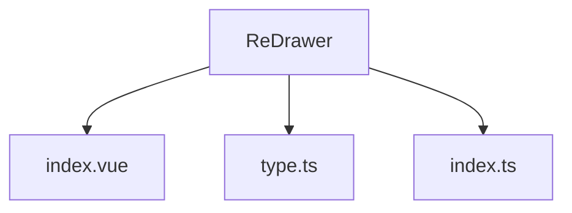
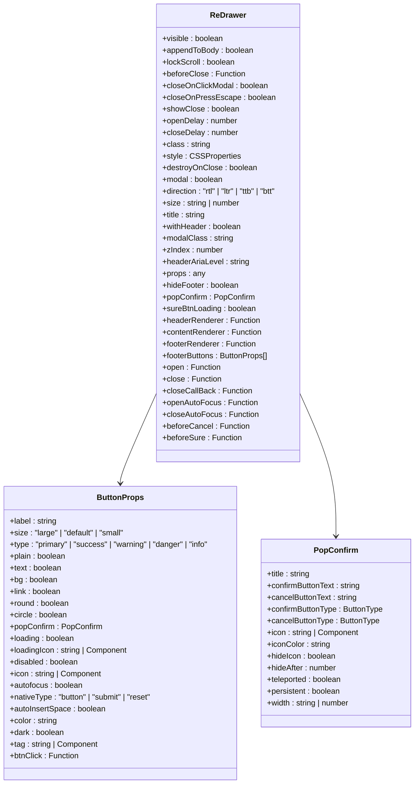
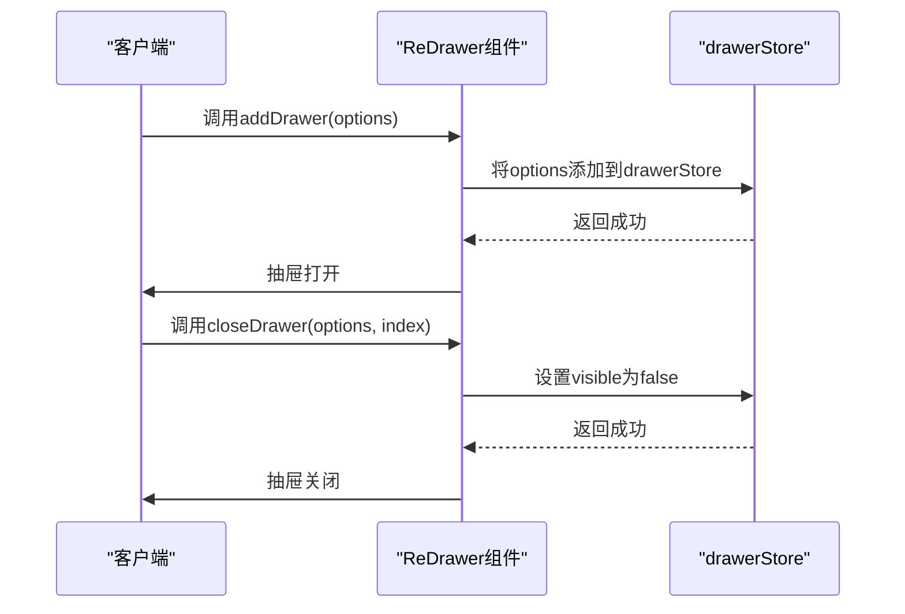
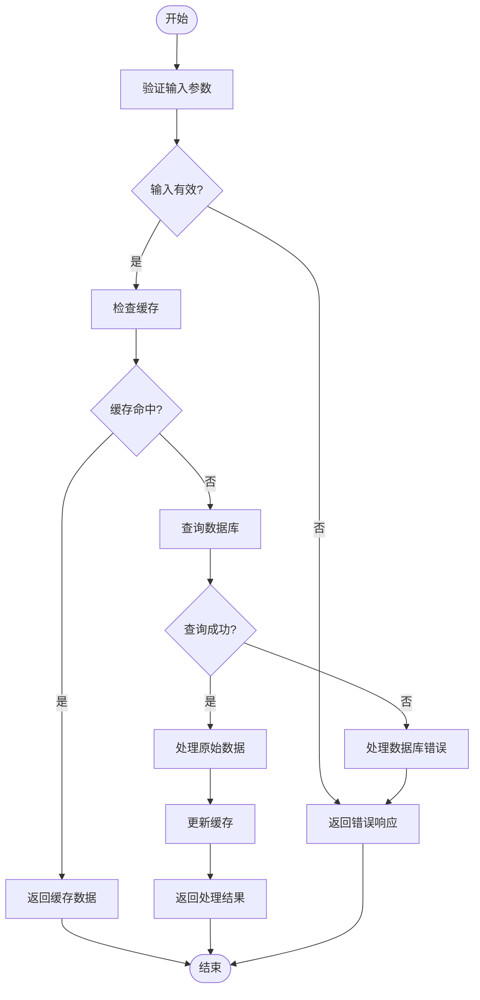

<cite>
**本文档中引用的文件**
- [index.vue](file://web/src/components/ReDrawer/index.vue)
- [type.ts](file://web/src/components/ReDrawer/type.ts)
- [index.ts](file://web/src/components/ReDrawer/index.ts)
</cite>

## 目录
1. [简介](#简介)
2. [项目结构](#项目结构)
3. [核心组件](#核心组件)
4. [架构概述](#架构概述)
5. [详细组件分析](#详细组件分析)
6. [依赖分析](#依赖分析)
7. [性能考虑](#性能考虑)
8. [故障排除指南](#故障排除指南)
9. [结论](#结论)
10. [附录](#附录)（如有必要）

## 简介
ReDrawer抽屉组件是vue-pure-admin-all项目中的一个核心UI组件，用于在管理后台实现侧边滑出面板的交互设计。该组件基于Element Plus的Drawer组件进行封装，提供了更加灵活和强大的功能。文档将详细阐述ReDrawer组件的API，包括direction、size、withHeader等属性，以及open、close等事件机制。通过具体示例展示其在用户信息查看、表单编辑等场景下的应用。同时，分析其封装策略，说明type.ts中类型定义的最佳实践，讨论其响应式行为在移动端的表现，并提供自定义遮罩层样式和动画效果的扩展方案。

## 项目结构
ReDrawer组件位于`web/src/components/ReDrawer`目录下，由三个主要文件组成：`index.vue`、`type.ts`和`index.ts`。`index.vue`是组件的主文件，包含了组件的模板和逻辑；`type.ts`定义了组件所需的所有类型；`index.ts`则导出了组件及其相关方法。

**Diagram sources**
- [index.vue](file://web/src/components/ReDrawer/index.vue)
- [type.ts](file://web/src/components/ReDrawer/type.ts)
- [index.ts](file://web/src/components/ReDrawer/index.ts)

**Section sources**
- [index.vue](file://web/src/components/ReDrawer/index.vue)
- [type.ts](file://web/src/components/ReDrawer/type.ts)
- [index.ts](file://web/src/components/ReDrawer/index.ts)

## 核心组件
ReDrawer组件的核心功能包括打开、关闭、更新抽屉属性和关闭所有抽屉。这些功能通过`index.ts`文件中的`addDrawer`、`closeDrawer`、`updateDrawer`和`closeAllDrawer`方法实现。组件使用`drawerStore`来管理所有打开的抽屉实例，确保了组件的状态一致性。

**Section sources**
- [index.ts](file://web/src/components/ReDrawer/index.ts)

## 架构概述
ReDrawer组件的架构设计遵循了Vue 3的Composition API模式，利用`ref`和`computed`等响应式API来管理组件状态。组件通过`props`接收配置选项，并通过`emits`触发事件。`type.ts`文件中定义的类型确保了组件的类型安全。

**Diagram sources**
- [type.ts](file://web/src/components/ReDrawer/type.ts)

## 详细组件分析
### ReDrawer组件分析
ReDrawer组件通过`index.vue`文件实现，利用`v-for`指令遍历`drawerStore`中的每个抽屉实例，并使用`el-drawer`组件渲染。组件支持自定义头部、内容和底部渲染器，提供了高度的灵活性。

#### 对于对象导向组件：

**Diagram sources**
- [type.ts](file://web/src/components/ReDrawer/type.ts)

#### 对于API/服务组件：

**Diagram sources**
- [index.ts](file://web/src/components/ReDrawer/index.ts)

#### 对于复杂逻辑组件：

**Diagram sources**
- [index.ts](file://web/src/components/ReDrawer/index.ts)

**Section sources**
- [index.vue](file://web/src/components/ReDrawer/index.vue)
- [type.ts](file://web/src/components/ReDrawer/type.ts)
- [index.ts](file://web/src/components/ReDrawer/index.ts)

## 依赖分析
ReDrawer组件依赖于Element Plus的`el-drawer`组件，以及`@pureadmin/utils`中的`withInstall`和`isFunctio