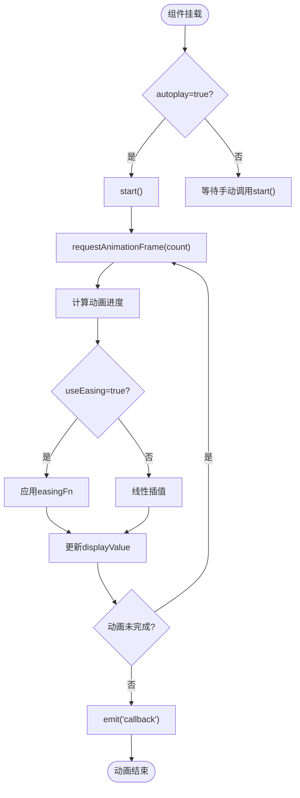
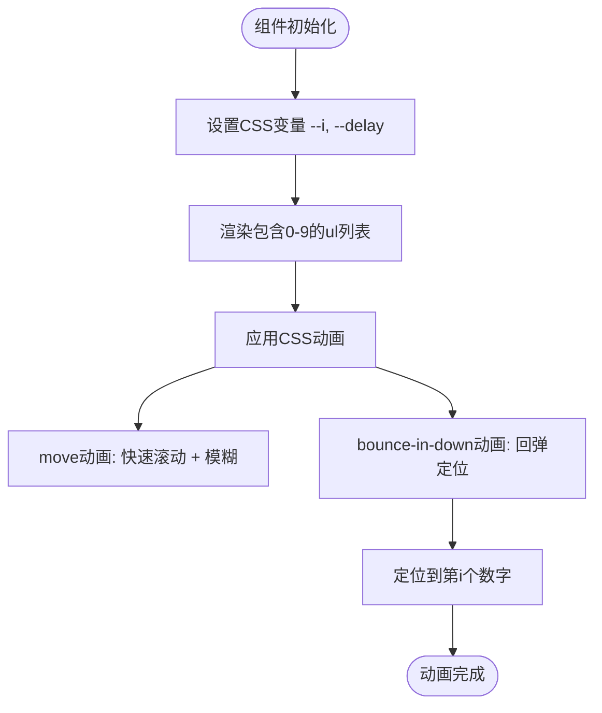
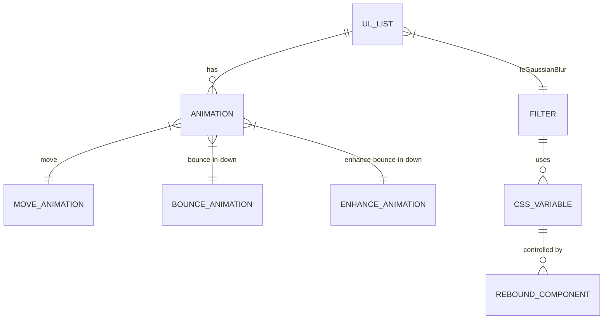

# 数字滚动组件 (ReCountTo)

<cite>
**本文档引用文件**  
- [normal/index.tsx](file://web/src/components/ReCountTo/src/normal/index.tsx)
- [normal/props.ts](file://web/src/components/ReCountTo/src/normal/props.ts)
- [rebound/index.tsx](file://web/src/components/ReCountTo/src/rebound/index.tsx)
- [rebound/props.ts](file://web/src/components/ReCountTo/src/rebound/props.ts)
- [rebound/rebound.css](file://web/src/components/ReCountTo/src/rebound/rebound.css)
- [index.ts](file://web/src/components/ReCountTo/index.ts)
- [README.md](file://web/src/components/ReCountTo/README.md)
- [count-to.vue](file://web/src/views/components/count-to.vue)
</cite>

## 目录
1. [简介](#简介)
2. [核心功能与模式对比](#核心功能与模式对比)
3. [普通模式详解](#普通模式详解)
4. [回弹模式详解](#回弹模式详解)
5. [Props 配置项说明](#props-配置项说明)
6. [在统计卡片中的集成示例](#在统计卡片中的集成示例)
7. [弹性动画实现原理](#弹性动画实现原理)
8. [扩展自定义动画效果](#扩展自定义动画效果)
9. [总结](#总结)

## 简介

`ReCountTo` 是一个用于数据可视化场景的数字滚动动画组件，提供两种视觉风格：`normal`（普通滚动）和 `rebound`（回弹式滚动）。该组件适用于仪表盘、统计面板、排行榜等需要动态展示数值变化的界面，通过平滑的动画增强用户体验。

组件封装了高性能的动画逻辑，支持灵活配置起始值、结束值、持续时间、小数位数、颜色、字体大小等参数，并可通过 CSS 变量和动画关键帧实现丰富的视觉效果。

**Section sources**  
- [README.md](file://web/src/components/ReCountTo/README.md#L1-L3)
- [index.ts](file://web/src/components/ReCountTo/index.ts#L1-L12)

## 核心功能与模式对比

`ReCountTo` 提供两种动画模式，分别适用于不同视觉需求的场景：

| 特性 | 普通模式 (ReNormalCountTo) | 回弹模式 (ReboundCountTo) |
|------|--------------------------|--------------------------|
| 动画类型 | 数值线性/缓动增长 | 数字滚轮式回弹动画 |
| 视觉效果 | 平滑递增或递减 | 类似老虎机的滚动后回弹定位 |
| 适用场景 | 通用数据展示、KPI 指标 | 强调型数据展示、抽奖、游戏化界面 |
| 技术实现 | JavaScript 动画驱动 + requestAnimationFrame | CSS 动画驱动 + transform + filter |
| 性能特点 | 高精度控制，支持暂停/恢复 | 利用 GPU 加速，动画更流畅 |
| 可配置性 | 高，支持 easing 函数自定义 | 中，主要通过 CSS 变量控制 |

**Section sources**  
- [README.md](file://web/src/components/ReCountTo/README.md#L1-L3)
- [index.ts](file://web/src/components/ReCountTo/index.ts#L5-L8)

## 普通模式详解

`ReNormalCountTo` 组件通过 JavaScript 实现数字的动态增长或减少。其核心逻辑基于 `requestAnimationFrame`，确保动画在不同设备上保持流畅。

组件通过 `startVal` 和 `endVal` 定义数值范围，`duration` 控制动画时长。内部使用 `easingFn` 实现缓动效果，默认采用指数缓入函数，使动画开始缓慢、结束迅速，符合自然运动规律。

当 `autoplay` 为 `true` 时，组件挂载后自动启动动画。支持 `pauseResume`、`reset` 等控制方法，适用于需要交互控制的场景。



**Diagram sources**  
- [normal/index.tsx](file://web/src/components/ReCountTo/src/normal/index.tsx#L50-L150)

**Section sources**  
- [normal/index.tsx](file://web/src/components/ReCountTo/src/normal/index.tsx#L1-L180)
- [normal/props.ts](file://web/src/components/ReCountTo/src/normal/props.ts#L1-L33)

## 回弹模式详解

`ReboundCountTo` 组件采用纯 CSS 实现数字的“滚轮回弹”动画效果。其原理是通过一个包含 0-9 数字的 `<ul>` 列表，利用 `transform: translateY` 控制列表滚动位置，配合关键帧动画实现回弹效果。

组件通过 `i` 属性指定目标数字（0-9），`delay` 控制动画延迟，`blur` 控制滚动过程中的模糊强度，增强动态感。动画分为两个阶段：
1. `move` 动画：持续快速滚动，配合模糊滤镜制造运动模糊。
2. `bounce-in-down` 动画：减速并回弹至目标位置，模拟物理惯性。

为兼容 Safari 浏览器，组件在 `onBeforeMount` 阶段添加了兼容性处理，避免动画异常。



**Diagram sources**  
- [rebound/index.tsx](file://web/src/components/ReCountTo/src/rebound/index.tsx#L1-L73)
- [rebound/rebound.css](file://web/src/components/ReCountTo/src/rebound/rebound.css#L1-L78)

**Section sources**  
- [rebound/index.tsx](file://web/src/components/ReCountTo/src/rebound/index.tsx#L1-L73)
- [rebound/props.ts](file://web/src/components/ReCountTo/src/rebound/props.ts#L1-L16)
- [rebound/rebound.css](file://web/src/components/ReCountTo/src/rebound/rebound.css#L1-L78)

## Props 配置项说明

### 普通模式 Props

| 参数 | 类型 | 默认值 | 说明 |
|------|------|--------|------|
| startVal | number | 0 | 起始数值 |
| endVal | number | 2020 | 目标数值 |
| duration | number | 1300 | 动画持续时间（毫秒） |
| autoplay | boolean | true | 是否自动播放 |
| decimals | number | 0 | 小数位数，必须 ≥ 0 |
| decimal | string | "." | 小数点符号 |
| separator | string | "," | 千分位分隔符 |
| prefix | string | "" | 数值前缀（如 "$"）|
| suffix | string | "" | 数值后缀（如 "%"）|
| color | string | - | 文字颜色 |
| fontSize | string | "16px" | 字体大小 |
| useEasing | boolean | true | 是否启用缓动效果 |
| easingFn | function | 指数缓入 | 自定义缓动函数 `(t, b, c, d) => number` |

### 回弹模式 Props

| 参数 | 类型 | 默认值 | 说明 |
|------|------|--------|------|
| i | number | 0 | 目标数字（0-9的整数）|
| delay | number | 1 | 动画延迟时间（秒）|
| blur | number | 2 | 滚动过程中的模糊强度 |

**Section sources**  
- [normal/props.ts](file://web/src/components/ReCountTo/src/normal/props.ts#L1-L33)
- [rebound/props.ts](file://web/src/components/ReCountTo/src/rebound/props.ts#L1-L16)

## 在统计卡片中的集成示例

`ReCountTo` 可轻松集成到统计卡片组件中，以下为在 `count-to.vue` 中的使用示例：

```tsx
<ReNormalCountTo
  prefix="$"
  :duration="1000"
  :color="'#409EFF'"
  :fontSize="'2em'"
  :startVal="1"
  :endVal="1000"
/>
<br />
<ul class="flex">
  <ReboundCountTo
    v-for="(num, inx) of [1, 6, 6, 6]"
    :key="inx"
    :i="num"
    :blur="inx"
    :delay="inx + 1"
  />
</ul>
```

该示例展示了：
- 使用 `ReNormalCountTo` 展示金额从 $1 增长到 $1000，蓝色大字体显示。
- 使用 `ReboundCountTo` 并列展示四位数字，通过 `v-for` 循环创建，每个数字具有不同的模糊和延迟效果，形成错落有致的动画序列。

**Section sources**  
- [count-to.vue](file://web/src/views/components/count-to.vue#L15-L30)

## 弹性动画实现原理

`rebound.css` 文件定义了回弹动画的核心样式，其关键技术点如下：

1. **CSS 变量控制**：通过 `--i` 控制目标位置（`transform: translateY(calc(var(--i) * -9.09%))`），每个数字高度约为容器的 9.09%。
2. **双动画叠加**：
   - `move` 动画：无限循环的快速上下移动，配合 `feGaussianBlur` 滤镜制造运动模糊。
   - `bounce-in-down` 动画：从偏移位置回弹至目标位置，关键帧包含多次微小反弹，模拟物理惯性。
3. **增强动画**：`enhance-bounce-in-down` 为容器添加整体弹入效果，提升视觉层次。
4. **Safari 兼容**：通过 `setTimeout` 延迟设置 `animation: none`，避免 Safari 中动画卡顿。



**Diagram sources**  
- [rebound/rebound.css](file://web/src/components/ReCountTo/src/rebound/rebound.css#L1-L78)

**Section sources**  
- [rebound/rebound.css](file://web/src/components/ReCountTo/src/rebound/rebound.css#L1-L78)
- [rebound/index.tsx](file://web/src/components/ReCountTo/src/rebound/index.tsx#L1-L73)

## 扩展自定义动画效果

开发者可通过以下方式扩展 `ReCountTo` 的动画效果：

1. **自定义缓动函数**（普通模式）：
   ```tsx
   <ReNormalCountTo
     :easingFn="(t, b, c, d) => c * (t /= d) * t * t + b"
     :useEasing="true"
   />
   ```
   替换为自定义的缓动算法，如三次方缓动。

2. **扩展 CSS 动画**（回弹模式）：
   - 在项目样式中覆盖 `@keyframes`，如定义 `@keyframes my-bounce`。
   - 修改 `.scroll-num ul` 的 `animation` 属性。
   - 通过 `--width`、`--height`、`--color` 等 CSS 变量调整外观。

3. **创建新组件**：
   基于 `ReCountTo` 的架构，创建 `flip`（翻牌）或 `slide`（滑动）等新动画模式，复用 `props` 定义和安装逻辑。

**Section sources**  
- [normal/index.tsx](file://web/src/components/ReCountTo/src/normal/index.tsx#L1-L180)
- [rebound/rebound.css](file://web/src/components/ReCountTo/src/rebound/rebound.css#L1-L78)

## 总结

`ReCountTo` 组件通过 `normal` 和 `rebound` 两种模式，满足了数据可视化中不同层次的动画需求。普通模式提供精确的数值动画控制，适用于大多数业务场景；回弹模式则通过 CSS 实现高性能的视觉冲击效果，适合强调型展示。

组件设计清晰，API 简洁，易于集成和扩展。开发者可根据项目需求选择合适的模式，并通过丰富的 `props` 和 CSS 变量进行个性化定制，有效提升数据展示的生动性和用户体验。