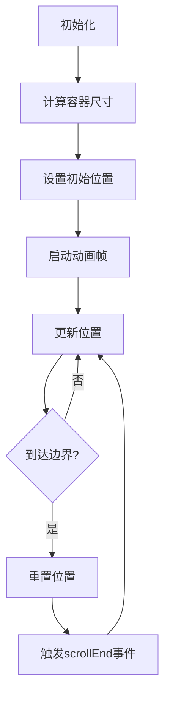
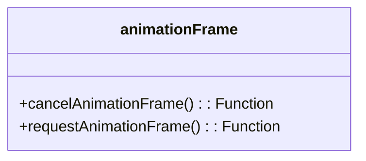
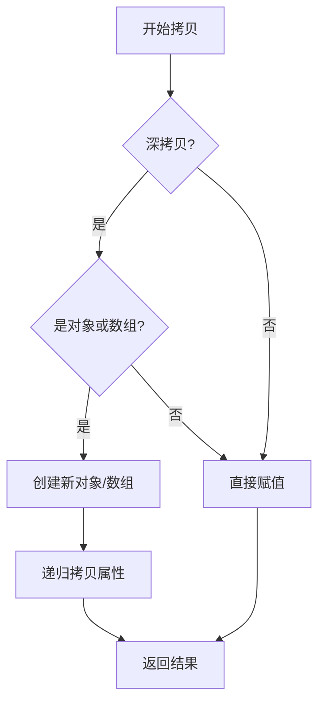
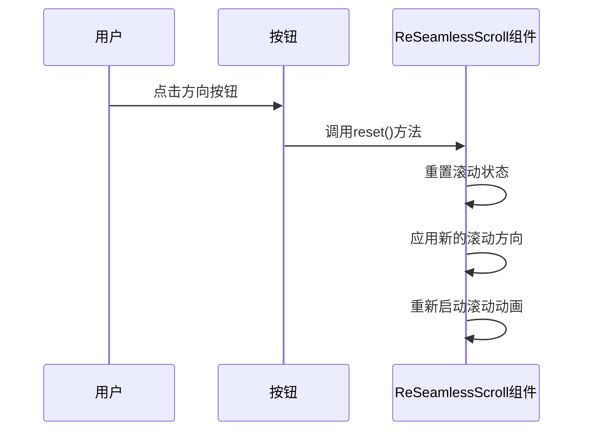
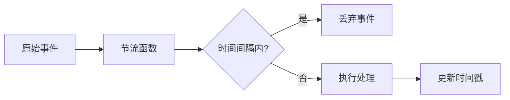

<cite>
**本文档引用文件**
- [index.vue](file://web/src/components/ReSeamlessScroll/src/index.vue)
- [utils.ts](file://web/src/components/ReSeamlessScroll/src/utils.ts)
- [seamless-scroll.vue](file://web/src/views/components/seamless-scroll.vue)
- [index.ts](file://web/src/components/ReSeamlessScroll/index.ts)
</cite>

# 无缝滚动组件 (ReSeamlessScroll)

## 目录
1. [简介](#简介)
2. [核心功能与应用场景](#核心功能与应用场景)
3. [实现机制](#实现机制)
4. [关键属性详解](#关键属性详解)
5. [使用示例](#使用示例)
6. [性能优化建议](#性能优化建议)
7. [自定义样式与交互](#自定义样式与交互)
8. [API参考](#api参考)

## 简介

`ReSeamlessScroll` 是一个功能强大的Vue 3组件，用于实现内容的无缝滚动效果。该组件广泛应用于公告栏、数据流展示、信息轮播等需要持续动态展示内容的场景。通过灵活的配置选项，开发者可以轻松实现垂直或水平方向的平滑滚动效果。

**Section sources**
- [index.ts](file://web/src/components/ReSeamlessScroll/index.ts#L4-L4)

## 核心功能与应用场景

`ReSeamlessScroll` 组件的核心功能是提供流畅、不间断的内容滚动体验。其主要应用场景包括：

- **公告栏展示**：在企业管理系统或门户网站中，用于滚动显示重要通知和公告。
- **数据流监控**：在监控系统中，实时滚动显示日志信息或传感器数据。
- **信息轮播**：在仪表盘或大屏展示中，循环播放关键业务指标或新闻资讯。
- **商品展示**：在电商平台中，水平滚动展示推荐商品或促销信息。

该组件支持多种滚动方向和交互模式，能够满足多样化的业务需求。

## 实现机制

`ReSeamlessScroll` 组件采用JavaScript定时器与CSS变换相结合的方式实现滚动效果，确保了良好的性能和兼容性。

### 滚动机制

组件主要通过 `requestAnimationFrame` API 实现平滑的动画效果。在 `scrollMove` 函数中，组件根据配置的滚动方向和步长，持续更新内容的变换位置（transform），从而实现视觉上的滚动效果。



**Diagram sources**
- [index.vue](file://web/src/components/ReSeamlessScroll/src/index.vue#L300-L380)

### 辅助函数设计

组件依赖 `utils.ts` 文件中的辅助函数来确保跨浏览器兼容性和数据处理能力。

#### animationFrame 函数

`animationFrame` 函数提供了 `requestAnimationFrame` 和 `cancelAnimationFrame` 的跨浏览器兼容实现，确保在不同浏览器环境下都能获得最佳的动画性能。



**Diagram sources**
- [utils.ts](file://web/src/components/ReSeamlessScroll/src/utils.ts#L3-L28)

#### copyObj 函数

`copyObj` 函数实现了深浅合并拷贝功能，用于安全地合并默认配置与用户自定义配置，避免了对象引用带来的意外修改。



**Diagram sources**
- [utils.ts](file://web/src/components/ReSeamlessScroll/src/utils.ts#L48-L118)

**Section sources**
- [utils.ts](file://web/src/components/ReSeamlessScroll/src/utils.ts#L3-L118)
- [index.vue](file://web/src/components/ReSeamlessScroll/src/index.vue#L15-L16)

## 关键属性详解

`ReSeamlessScroll` 组件通过 `classOption` 对象接收配置参数，以下是核心属性的详细说明：

### direction (滚动方向)

控制内容滚动的方向，支持四种模式：
- `"top"`：向上滚动（默认）
- `"bottom"`：向下滚动
- `"left"`：向左滚动
- `"right"`：向右滚动

### step (步长)

定义每次滚动的像素距离，数值越大滚动速度越快。建议根据内容高度或宽度合理设置步长，以获得最佳视觉效果。

### hoverStop (悬停停止)

布尔值，控制鼠标悬停时是否暂停滚动。当设置为 `true` 时，用户将鼠标悬停在滚动区域上会自动暂停滚动，便于阅读内容。

### limitMoveNum (最小滚动数量)

定义启动无缝滚动所需的最小数据条数。当数据条数少于该值时，组件将不启动滚动功能，避免不必要的动画。

### singleHeight/singleWidth (单步高度/宽度)

当需要实现"逐条滚动"效果时，可设置单条数据的高度或宽度。组件会在此基础上实现精准的单步滚动，并在每条数据显示完毕后暂停指定时间。

### waitTime (等待时间)

配合 `singleHeight` 或 `singleWidth` 使用，定义单条数据显示完毕后的暂停时间（毫秒）。

### autoPlay (自动播放)

控制组件是否在初始化后自动开始滚动。设置为 `false` 时，需要通过其他方式手动触发滚动。

### navigation (导航控制)

启用后显示左右/上下导航按钮，用户可通过点击按钮手动控制滚动方向和速度。

**Section sources**
- [index.vue](file://web/src/components/ReSeamlessScroll/src/index.vue#L100-L150)

## 使用示例

### 基本垂直滚动

以下示例展示了如何实现基本的垂直向上滚动效果：

```vue
<template>
  <ReSeamlessScroll :data="listData" :class-option="classOption">
    <ul class="item">
      <li v-for="(item, index) in listData" :key="index">
        <span class="title" v-text="item.title" />
      </li>
    </ul>
  </ReSeamlessScroll>
</template>

<script setup>
import { ref, reactive } from "vue";
import ReSeamlessScroll from "@/components/ReSeamlessScroll";

const listData = ref([
  { title: "第一条滚动内容" },
  { title: "第二条滚动内容" },
  { title: "第三条滚动内容" }
]);

const classOption = reactive({
  direction: "top",
  step: 1,
  hoverStop: true
});
</script>
```

### 水平滚动配置

实现水平滚动需要调整 `direction` 属性并确保容器有足够的宽度：

```javascript
const classOption = reactive({
  direction: "left",
  step: 2,
  singleWidth: 200, // 假设每条数据宽度为200px
  waitTime: 2000    // 每条数据显示2秒
});
```

### 动态方向切换

通过组件暴露的 `reset` 方法，可以实现在运行时动态改变滚动方向：

```javascript
function changeDirection(val) {
  scroll.value.reset();
  classOption.direction = val;
}
```



**Diagram sources**
- [seamless-scroll.vue](file://web/src/views/components/seamless-scroll.vue#L25-L35)
- [index.vue](file://web/src/components/ReSeamlessScroll/src/index.vue#L500-L520)

**Section sources**
- [seamless-scroll.vue](file://web/src/views/components/seamless-scroll.vue#L0-L164)

## 性能优化建议

### 大数据量处理

当处理大量数据时，建议采取以下优化措施：

1. **数据分页加载**：不要一次性加载所有数据，而是采用分页或懒加载的方式，只显示当前需要滚动的内容。
2. **虚拟滚动**：对于极大数据集，考虑结合虚拟滚动技术，只渲染可视区域内的元素。

### 节流处理

组件内部已使用 `useDebounceFn` 对鼠标滚轮事件进行节流处理，避免频繁触发导致性能问题。对于自定义事件，建议也采用类似的节流策略。



### 内存管理

组件在 `tryOnUnmounted` 钩子中正确清理了动画帧和定时器，防止内存泄漏：

```javascript
tryOnUnmounted(() => {
  scrollCancle();
  clearTimeout(singleWaitTime);
});
```

**Section sources**
- [index.vue](file://web/src/components/ReSeamlessScroll/src/index.vue#L510-L515)

## 自定义样式与交互

### 样式定制

通过CSS作用域样式，可以轻松定制滚动区域的外观：

```scss
.warp {
  width: 360px;
  height: 270px;
  margin: 0 auto;
  overflow: hidden;
  
  ul {
    padding: 0;
    margin: 0 auto;
    list-style: none;
    
    li {
      display: flex;
      justify-content: space-between;
      height: 30px;
      font-size: 15px;
      line-height: 30px;
    }
  }
}
```

### 交互扩展

组件支持多种交互方式：
- **鼠标悬停**：自动暂停滚动
- **触摸操作**：支持移动端触摸滑动
- **鼠标滚轮**：支持滚轮控制垂直滚动
- **导航按钮**：通过点击按钮手动控制

### 事件监听

组件提供 `scrollEnd` 事件，可在每次滚动循环结束时执行自定义逻辑：

```vue
<ReSeamlessScroll @scroll-end="handleScrollEnd">
  <!-- 内容 -->
</ReSeamlessScroll>
```

## API参考

### Props

| 属性 | 类型 | 默认值 | 说明 |
|------|------|--------|------|
| data | Array | - | 滚动的数据源 |
| classOption | Object | - | 滚动配置选项 |

### classOption 配置项

| 配置项 | 类型 | 默认值 | 说明 |
|--------|------|--------|------|
| direction | String | "top" | 滚动方向 |
| step | Number | 1 | 滚动步长 |
| hoverStop | Boolean | true | 鼠标悬停是否停止 |
| limitMoveNum | Number | 5 | 启动滚动的最小数据量 |
| singleHeight | Number | 0 | 单条数据高度 |
| singleWidth | Number | 0 | 单条数据宽度 |
| waitTime | Number | 1000 | 单步停止等待时间(ms) |
| autoPlay | Boolean | true | 是否自动播放 |
| navigation | Boolean | false | 是否显示导航 |

### 方法

| 方法 | 说明 |
|------|------|
| reset() | 重置滚动状态，可用于动态改变配置后重新初始化 |

### 事件

| 事件 | 说明 |
|------|------|
| scrollEnd | 每次滚动循环结束时触发 |

**Section sources**
- [index.vue](file://web/src/components/ReSeamlessScroll/src/index.vue#L50-L150)