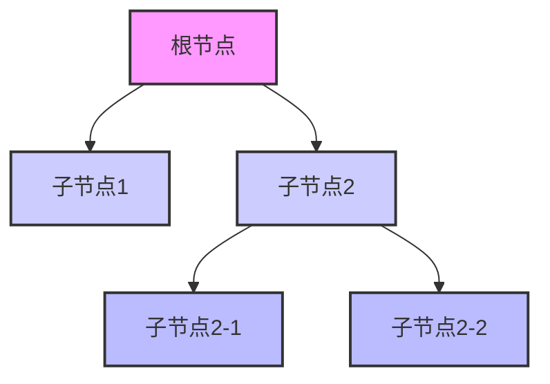

# 树形线条组件 (ReTreeLine)

<cite>
**本文档引用文件**  
- [index.ts](file://web/src/components/ReTreeLine/index.ts)
- [index.scss](file://web/src/components/ReTreeLine/index.scss)
- [line-tree.vue](file://web/src/views/able/line-tree.vue)
- [theme.scss](file://web/src/style/theme.scss)
- [index.scss](file://web/src/style/index.scss)
- [useDataThemeChange.ts](file://web/src/layout/hooks/useDataThemeChange.ts)
</cite>

## 目录
1. [简介](#简介)
2. [核心功能与视觉表现](#核心功能与视觉表现)
3. [SCSS样式配置项详解](#scss样式配置项详解)
4. [与Tree组件的集成使用](#与tree组件的集成使用)
5. [主题色联动方案](#主题色联动方案)
6. [复杂树形结构的性能优化建议](#复杂树形结构的性能优化建议)

## 简介

`ReTreeLine` 是一个用于 Vue 3 的树形连接线组件，旨在扩展 Element Plus 的 `el-tree` 和 `el-tree-v2`（虚拟树）组件，为其添加美观的连接线样式。该组件适用于组织架构图、权限树、菜单树等需要清晰层级关系展示的场景。通过灵活的插槽机制和可配置的 SCSS 变量，开发者可以轻松定制连接线的视觉效果，并实现与整体主题的联动。

**Section sources**  
- [index.ts](file://web/src/components/ReTreeLine/index.ts#L1-L20)

## 核心功能与视觉表现

`ReTreeLine` 组件的核心功能是为树形节点绘制垂直和水平的连接线，以直观地表示父子节点之间的层级关系。其视觉表现遵循以下规则：

- **垂直连接线**：从根节点到当前节点的每一层级都会绘制一条垂直线段。当某个节点是其父节点的最后一个子节点时，该层级的垂直线段将被隐藏，以避免在树的末尾出现不必要的线条。
- **水平连接线**：在每个非叶子节点的左侧绘制一条短水平线，与垂直线相连，形成“L”形连接。
- **标签横线**：可选地，在节点标签文本的右侧添加一条横线，用于进一步强调连接关系。

这种设计确保了树形结构的清晰可读，特别是在深度较大的树中，用户可以轻松追踪节点的归属路径。



[无来源，此图为概念性流程图]

## SCSS样式配置项详解

`ReTreeLine` 的样式通过 SCSS 变量进行配置，允许开发者在不修改组件源码的情况下自定义连接线的外观。主要配置项定义在 `index.scss` 文件中。

### 可配置变量

| 变量名 | 默认值 | 描述 |
| :--- | :--- | :--- |
| `$--element-tree-line-color` | `#dcdfe6` | 连接线的颜色 |
| `$--element-tree-line-style` | `dashed` | 连接线的样式（如 `solid`, `dashed`, `dotted`） |
| `$--element-tree-line-width` | `1px` | 连接线的粗细 |

### 样式类说明

- `.element-tree-node-line-ver`：垂直连接线的基类，通过 `border-left` 属性绘制。
- `.last-node-line`：应用于最后一个子节点的垂直线，将其边框颜色设为透明，从而实现隐藏效果。
- `.last-node-isLeaf-line`：应用于最后一个子节点且为叶子节点的垂直线，将其高度减半，形成更短的连接线。
- `.element-tree-node-line-hor`：水平连接线，通过 `border-bottom` 属性绘制。
- `.element-tree-node-label-line`：标签右侧的横线。

通过修改这些 SCSS 变量，可以快速改变整个树形组件的连接线风格，例如将其从虚线改为实线，或调整颜色以匹配品牌设计。

**Section sources**  
- [index.scss](file://web/src/components/ReTreeLine/index.scss#L1-L55)

## 与Tree组件的集成使用

`ReTreeLine` 组件通过作为 `el-tree` 或 `el-tree-v2` 的默认插槽内容来实现集成。它接收来自父树组件的节点信息，并据此渲染连接线。

### 基本用法

在 `el-tree` 的 `v-slot:default` 中使用 `ReTreeLine`，并传入必要的 `node` 和 `data` 属性。

```vue
<el-tree :data="treeData">
  <template #default="{ node }">
    <el-tree-line :node="node">
      <!-- 自定义节点内容 -->
      <span>{{ node.label }}</span>
    </el-tree-line>
  </template>
</el-tree>
```

### 高级用法：自定义标签

通过 `node-label` 插槽，可以完全自定义节点标签区域的内容，`ReTreeLine` 会自动在其后添加连接线。

```vue
<template #default="{ node }">
  <el-tree-line :node="node" :showLabelLine="true">
    <template #node-label>
      <span class="custom-label">{{ node.data.name }}</span>
    </template>
  </el-tree-line>
</template>
```

### 虚拟树兼容性

对于 `el-tree-v2`（虚拟树），由于其第一层节点没有 `parent` 属性，`ReTreeLine` 需要额外的 `treeData` prop 来构建虚拟的根节点，以正确计算连接线。

```vue
<el-tree-v2 :data="treeData">
  <template #default="{ node }">
    <el-tree-line :node="node" :treeData="treeData">
      <span>{{ node.label }}</span>
    </el-tree-line>
  </template>
</el-tree-v2>
```

**Section sources**  
- [index.ts](file://web/src/components/ReTreeLine/index.ts#L21-L155)
- [line-tree.vue](file://web/src/views/able/line-tree.vue#L41-L78)

## 主题色联动方案

`ReTreeLine` 的连接线颜色可以通过 SCSS 变量 `$--element-tree-line-color` 进行配置。为了实现与整体应用主题的联动，需要将此变量的值绑定到应用的主题色系统。

### 实现原理

1.  **定义主题变量**：在 `theme.scss` 中，为不同的主题（如 `light`, `default`, `pink` 等）定义了 `--pure-theme-menu-active-before` 等 CSS 变量，这些变量通常代表了主题的主色调。
2.  **SCSS 变量赋值**：在 `index.scss` 中，可以将 `$--element-tree-line-color` 的值设置为某个 CSS 变量，例如 `var(--pure-theme-menu-active-before)`。这样，当 HTML 根元素的 `data-theme` 属性改变时，CSS 变量的值会随之更新，进而影响 SCSS 变量计算出的实际颜色。
3.  **动态切换**：通过 `useDataThemeChange.ts` 中的 `setLayoutThemeColor` 函数，程序可以动态地修改 `document.documentElement` 上的 `data-theme` 属性和相关的 CSS 变量，从而触发整个应用（包括 `ReTreeLine`）的样式更新。

### 配置示例

```scss
// 在 index.scss 中
$--element-tree-line-color: var(--pure-theme-menu-active-before) !default;
```

这样配置后，`ReTreeLine` 的连接线颜色将与侧边栏菜单的激活前缀颜色（通常为主色）保持一致，实现无缝的主题联动。

**Section sources**  
- [index.scss](file://web/src/components/ReTreeLine/index.scss#L1-L5)
- [theme.scss](file://web/src/style/theme.scss#L1-L95)
- [index.scss](file://web/src/style/index.scss#L1-L37)
- [useDataThemeChange.ts](file://web/src/layout/hooks/useDataThemeChange.ts#L65-L105)

## 复杂树形结构的性能优化建议

在处理包含大量节点的复杂树形结构时，应考虑以下性能优化策略：

1.  **使用虚拟树（el-tree-v2）**：对于节点数量庞大的树，强烈建议使用 `el-tree-v2` 组件。它采用虚拟滚动技术，只渲染可视区域内的节点，极大地减少了 DOM 元素的数量，从而提升渲染性能和滚动流畅度。`ReTreeLine` 已兼容 `el-tree-v2`，只需正确传入 `treeData` 即可。

2.  **避免过度复杂的插槽内容**：在 `ReTreeLine` 的插槽（如 `node-label`）中，应尽量避免使用过于复杂的 Vue 组件或大量的计算逻辑。复杂的插槽内容会增加每个节点的渲染开销。

3.  **合理使用 `showLabelLine`**：如果不需要标签右侧的横线，可以将 `showLabelLine` 属性设置为 `false`，以减少不必要的 DOM 元素和样式计算。

4.  **优化数据结构**：确保传递给树组件的数据结构是扁平化的，并且包含必要的 `id` 和 `children` 字段，避免在渲染时进行昂贵的数据转换操作。

通过结合使用虚拟树和遵循上述建议，可以确保 `ReTreeLine` 在大型数据集下依然保持良好的性能表现。

**Section sources**  
- [index.ts](file://web/src/components/ReTreeLine/index.ts#L117-L154)
- [line-tree.vue](file://web/src/views/able/line-tree.vue#L41-L78)