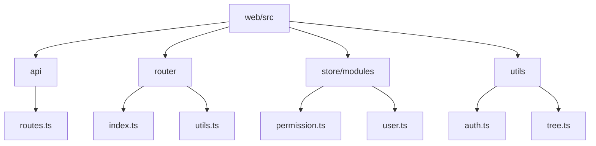
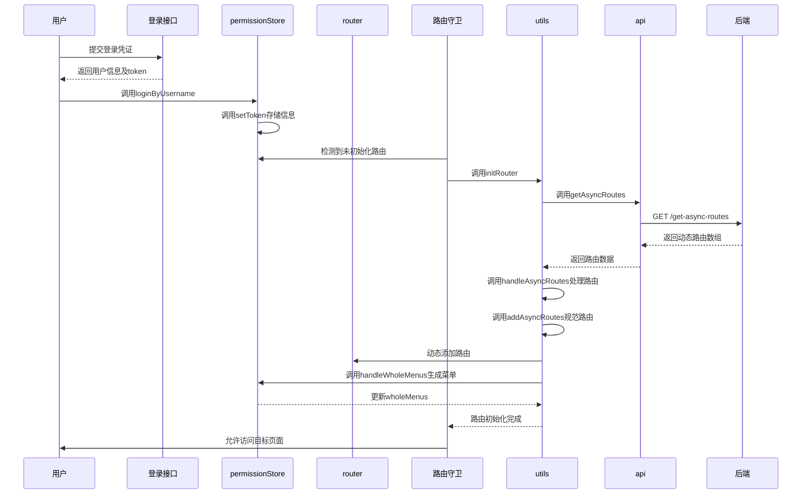
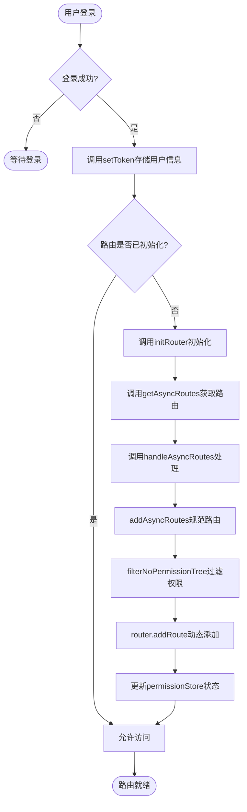
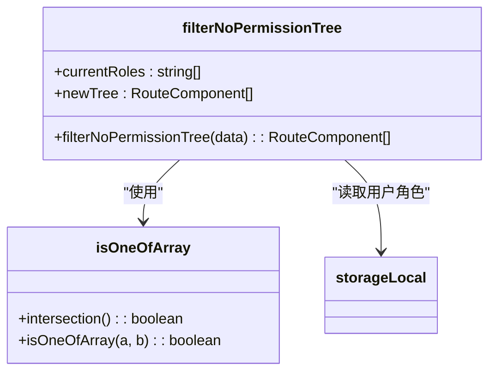
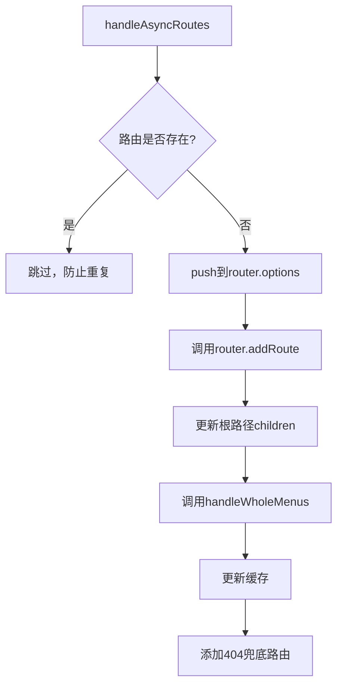

# 动态路由

<cite>
**本文档引用文件**  
- [asyncRoutes.ts](file://web/mock/asyncRoutes.ts)
- [routes.ts](file://web/src/api/routes.ts)
- [index.ts](file://web/src/router/index.ts)
- [utils.ts](file://web/src/router/utils.ts)
- [permission.ts](file://web/src/store/modules/permission.ts)
- [user.ts](file://web/src/store/modules/user.ts)
- [main.ts](file://web/src/main.ts)
- [types.ts](file://web/src/layout/types.ts)
</cite>

## 目录
1. [简介](#简介)
2. [项目结构](#项目结构)
3. [核心组件](#核心组件)
4. [架构概述](#架构概述)
5. [详细组件分析](#详细组件分析)
6. [依赖分析](#依赖分析)
7. [性能考虑](#性能考虑)
8. [故障排除指南](#故障排除指南)
9. [结论](#结论)

## 简介
本技术文档深入解析 `vue-pure-admin-all` 项目中基于用户权限的动态路由功能。该功能实现了从后端获取用户专属路由权限，并在前端动态生成和挂载路由的完整流程。系统通过精细化的权限控制，确保不同角色的用户只能访问其被授权的页面，从而构建了一个安全、灵活的前端路由体系。

## 项目结构
`vue-pure-admin-all` 项目的动态路由功能主要分布在 `web/src` 目录下的多个模块中，其结构设计清晰，职责分明。



**图示来源**  
- [routes.ts](file://web/src/api/routes.ts)
- [index.ts](file://web/src/router/index.ts)
- [utils.ts](file://web/src/router/utils.ts)
- [permission.ts](file://web/src/store/modules/permission.ts)
- [user.ts](file://web/src/store/modules/user.ts)

**本节来源**  
- [web/src](file://web/src)

## 核心组件
动态路由功能的核心在于几个关键组件的协同工作：`routes.ts` 负责与后端通信获取路由数据；`utils.ts` 中的 `initRouter` 和 `handleAsyncRoutes` 函数是动态路由处理的逻辑中枢；`permission.ts` 的 Pinia Store 负责存储和管理最终的路由菜单及缓存状态。

**本节来源**  
- [routes.ts](file://web/src/api/routes.ts#L7-L9)
- [utils.ts](file://web/src/router/utils.ts#L157-L226)
- [permission.ts](file://web/src/store/modules/permission.ts#L14-L69)

## 架构概述
整个动态路由的加载流程始于用户登录，通过一系列步骤最终完成路由的动态生成与挂载。



**图示来源**  
- [user.ts](file://web/src/store/modules/user.ts#L78-L88)
- [routes.ts](file://web/src/api/routes.ts#L7-L9)
- [utils.ts](file://web/src/router/utils.ts#L157-L226)
- [permission.ts](file://web/src/store/modules/permission.ts#L20-L35)

## 详细组件分析

### 动态路由加载流程分析
该流程是整个功能的核心，从用户登录到路由就绪，每一步都至关重要。

#### 流程图


**图示来源**  
- [user.ts](file://web/src/store/modules/user.ts#L78-L88)
- [routes.ts](file://web/src/api/routes.ts#L7-L9)
- [utils.ts](file://web/src/router/utils.ts#L157-L334)
- [permission.ts](file://web/src/store/modules/permission.ts#L20-L35)

**本节来源**  
- [user.ts](file://web/src/store/modules/user.ts#L78-L88)
- [routes.ts](file://web/src/api/routes.ts#L7-L9)
- [utils.ts](file://web/src/router/utils.ts#L157-L334)

### 路由过滤算法分析
路由过滤算法确保了用户只能看到和访问其角色所允许的路由。

#### 算法实现


**图示来源**  
- [utils.ts](file://web/src/router/utils.ts#L84-L94)
- [utils.ts](file://web/src/router/utils.ts#L70-L78)

**本节来源**  
- [utils.ts](file://web/src/router/utils.ts#L70-L94)

### 路由缓存与去重机制分析
该机制防止了路由的重复添加，并管理了页面的缓存状态。

#### 机制流程


**图示来源**  
- [utils.ts](file://web/src/router/utils.ts#L157-L196)

**本节来源**  
- [utils.ts](file://web/src/router/utils.ts#L157-L196)

## 依赖分析
动态路由功能依赖于多个模块和外部库，形成了一个紧密协作的系统。

```mermaid
graph TD
A[动态路由] --> B[vue-router]
A --> C[Pinia]
A --> D[@pureadmin/utils]
A --> E[js-cookie]
A --> F[localforage]
B --> G[路由实例管理]
C --> H[状态存储]
D --> I[工具函数]
E --> J[token存储]
F --> K[持久化存储]
```

**图示来源**  
- [index.ts](file://web/src/router/index.ts)
- [permission.ts](file://web/src/store/modules/permission.ts)
- [auth.ts](file://web/src/utils/auth.ts)

**本节来源**  
- [index.ts](file://web/src/router/index.ts)
- [permission.ts](file://web/src/store/modules/permission.ts)
- [auth.ts](file://web/src/utils/auth.ts)

## 性能考虑
系统在性能方面做了多项优化。通过 `initRouter` 中的 `CachingAsyncRoutes` 配置，可以将获取到的动态路由缓存到 `localStorage`，避免用户每次刷新页面都向后端发起请求，显著提升了二次加载的速度。同时，`debounce` 函数的使用确保了对缓存列表的监听不会过于频繁，减少了不必要的性能开销。

## 故障排除指南
当动态路由功能出现问题时，可按以下步骤排查：
1.  **检查登录状态**：确认 `Cookies` 中的 `authorized-token` 和 `localStorage` 中的 `user-info` 是否存在且数据正确。
2.  **检查网络请求**：在浏览器开发者工具中查看 `/get-async-routes` 接口是否成功返回了预期的路由数据。
3.  **检查路由守卫**：确认 `router.beforeEach` 守卫是否正常执行，特别是 `initRouter()` 的调用时机。
4.  **检查重复添加**：如果页面出现异常，检查 `router.options.routes[0].children` 中是否存在重复的路由，这通常是因为 `handleAsyncRoutes` 被多次调用所致。
5.  **检查权限过滤**：如果菜单项未显示，检查 `filterNoPermissionTree` 函数的逻辑，确认用户角色与路由 `meta.roles` 的匹配是否正确。

**本节来源**  
- [auth.ts](file://web/src/utils/auth.ts#L28-L49)
- [routes.ts](file://web/src/api/routes.ts#L7-L9)
- [index.ts](file://web/src/router/index.ts#L138-L145)
- [utils.ts](file://web/src/router/utils.ts#L157-L196)
- [utils.ts](file://web/src/router/utils.ts#L84-L94)

## 结论
`vue-pure-admin-all` 的动态路由功能是一个设计精良、实现稳健的权限控制系统。它通过清晰的模块划分和高效的异步处理，实现了从后端数据到前端路由的无缝转换。其核心的 `initRouter -> getAsyncRoutes -> handleAsyncRoutes -> addAsyncRoutes` 流程，配合 `permissionStore` 的状态管理，确保了路由生成的准确性和安全性。该方案不仅满足了基本的权限需求，还通过缓存和去重机制优化了用户体验，为构建复杂的后台管理系统提供了坚实的基础。