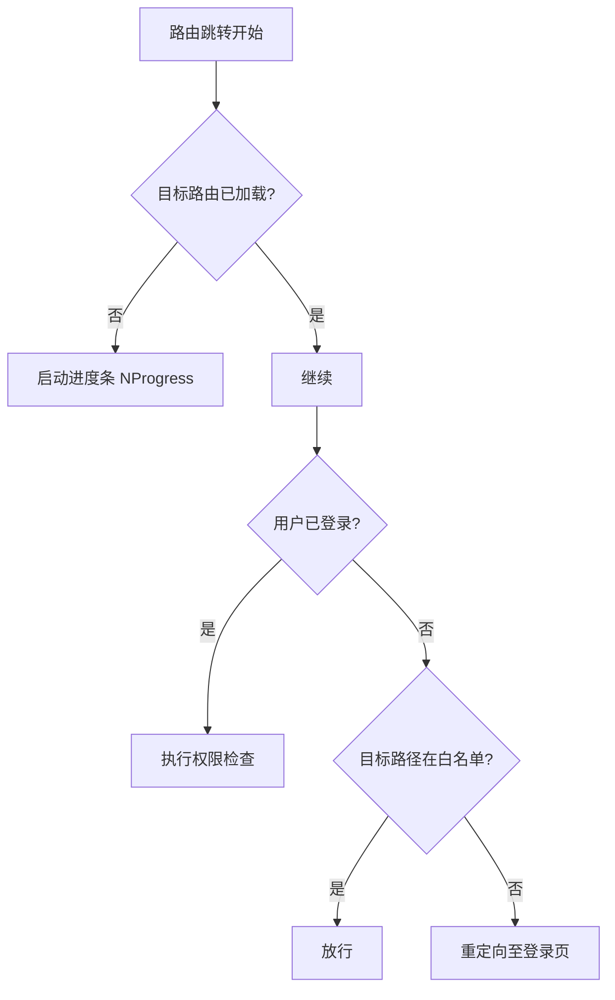
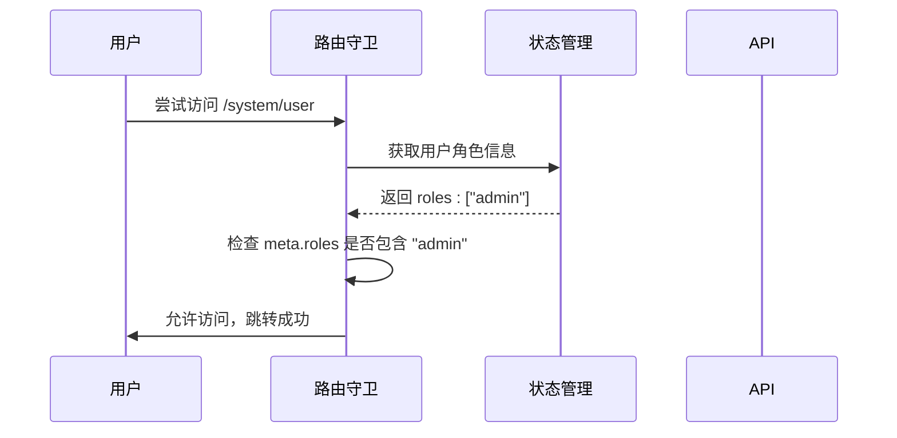
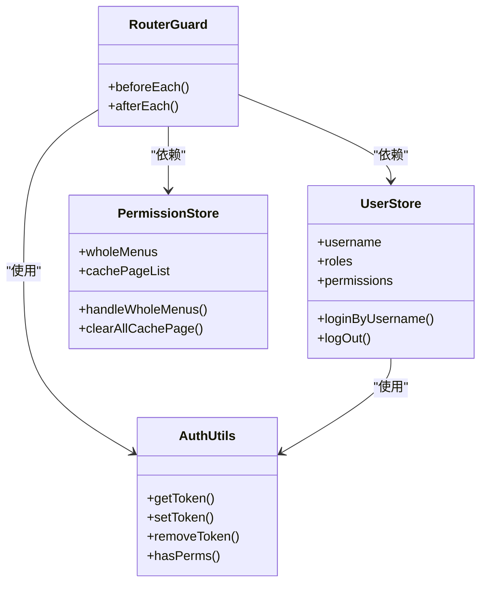

# 路由守卫

<cite>
**本文档中引用的文件**  
- [index.ts](file://web/src/router/index.ts)
- [user.ts](file://web/src/store/modules/user.ts)
- [auth.ts](file://web/src/utils/auth.ts)
- [permission.ts](file://web/src/store/modules/permission.ts)
</cite>

## 目录
1. [简介](#简介)
2. [全局前置守卫实现机制](#全局前置守卫实现机制)
3. [认证状态与权限验证流程](#认证状态与权限验证流程)
4. [白名单机制与未授权处理](#白名单机制与未授权处理)
5. [异步验证与错误处理策略](#异步验证与错误处理策略)
6. [与其他系统的集成](#与其他系统的集成)
7. [常见问题与解决方案](#常见问题与解决方案)
8. [总结](#总结)

## 简介
`vue-pure-admin-all` 是一个基于 Vue 3 和 Pinia 的现代化前端管理框架，其路由守卫系统是保障应用安全的核心组件。该系统通过全局前置守卫（`beforeEach`）拦截所有导航请求，确保用户在访问受保护页面前已完成身份验证并具备相应权限。本文档将深入解析该守卫机制的实现逻辑、流程控制、权限比对策略以及与其他模块的协同工作方式。

## 全局前置守卫实现机制

### 导航拦截与流程控制
全局前置守卫在 `web/src/router/index.ts` 中通过 `router.beforeEach` 注册，对每一次路由跳转进行拦截。守卫首先检查目标路由是否已被加载（通过 `loadedPaths` 集合记录），若未加载则启动进度条（`NProgress.start()`），为用户提供视觉反馈。

守卫的核心逻辑围绕用户认证状态展开。它通过 `storageLocal().getItem(userKey)` 从本地存储中读取用户信息，并结合 `Cookies.get(multipleTabsKey)` 判断用户是否处于已登录状态。这种双重校验机制支持多标签页间的无缝登录状态共享。

**Diagram sources**  
- [index.ts](file://web/src/router/index.ts#L168-L227)

**Section sources**  
- [index.ts](file://web/src/router/index.ts#L168-L227)

## 认证状态与权限验证流程

### Token有效性验证
用户认证状态的判断依赖于 `token` 的有效性。系统通过 `auth.ts` 中的 `getToken()` 函数从 Cookie 或本地存储中获取 `accessToken`、`refreshToken` 和过期时间戳。`setToken()` 函数在用户登录成功后，将这些信息持久化存储，并同步更新 Pinia 状态管理中的用户数据。

### 用户信息获取
用户信息的获取是权限验证的前提。`user.ts` 中的 `useUserStore` 使用 Pinia 定义了用户状态，包括头像、用户名、角色（`roles`）和按钮级权限（`permissions`）。这些信息在登录时由后端返回，并通过 `setToken()` 方法初始化到状态仓库中。

### 权限比对与页面跳转控制
权限检查在 `beforeEach` 守卫中进行。当目标路由的 `meta` 字段包含 `roles` 属性时，守卫会调用 `isOneOfArray()` 函数，将用户的角色与路由要求的角色进行比对。若用户角色不满足要求，则强制跳转至 `/error/403` 页面。

**Diagram sources**  
- [index.ts](file://web/src/router/index.ts#L145-L152)
- [user.ts](file://web/src/store/modules/user.ts#L10-L35)

**Section sources**  
- [index.ts](file://web/src/router/index.ts#L145-L152)
- [user.ts](file://web/src/store/modules/user.ts#L10-L35)

## 白名单机制与未授权处理

### 白名单实现方式
系统定义了一个路由白名单 `whiteList = ["/login"]`，用于标识无需认证即可访问的页面。在 `beforeEach` 守卫中，如果用户未登录且尝试访问的路径不在白名单内，系统会调用 `removeToken()` 清除残留的认证信息，并通过 `next({ path: "/login" })` 将用户重定向至登录页。

### 未授权访问的重定向逻辑
对于已登录但权限不足的用户，系统会将其重定向至 403 错误页面。此外，系统还包含一个特殊逻辑：当配置项 `VITE_HIDE_HOME` 为 `true` 时，直接访问 `/welcome` 首页会被重定向到 404 页面，这通常用于隐藏默认首页以增强安全性。

**Section sources**  
- [index.ts](file://web/src/router/index.ts#L130-L167)

## 异步验证过程和错误处理策略

### 动态路由的异步加载
在页面刷新时，如果动态路由尚未完全加载（`usePermissionStoreHook().wholeMenus.length === 0`），守卫会调用 `initRouter()` 异步初始化路由。此过程确保了动态路由能被正确添加到路由表中。守卫通过检查 `to.name` 是否为空来判断动态路由是否加载完成，避免了因路由未就绪而导致的导航失败。

### 错误处理策略
系统在关键操作中均采用了 Promise 包装和 try-catch 模式。例如，在 `user.ts` 的 `loginByUsername` 和 `handRefreshToken` 方法中，API 调用被包裹在 Promise 中，成功时调用 `resolve`，失败时调用 `reject`，确保了错误能被上层逻辑捕获和处理。同时，`NProgress.done()` 在 `afterEach` 钩子中被调用，确保无论导航成功或失败，进度条都能被正确关闭。

**Section sources**  
- [index.ts](file://web/src/router/index.ts#L196-L227)
- [user.ts](file://web/src/store/modules/user.ts#L75-L117)

## 与其他系统的集成

### 与状态管理（Pinia）的集成
路由守卫与 Pinia 状态管理深度集成。守卫通过 `useUserStoreHook()` 和 `usePermissionStoreHook()` 获取用户和权限状态。当用户登出时，`logOut()` 方法不仅会清除 token，还会重置路由（`resetRouter()`）并清空多标签页缓存，确保应用状态的一致性。

### 与认证服务的集成
认证服务由 `auth.ts` 提供核心功能。`setToken()` 和 `removeToken()` 函数负责 token 的存取和销毁，`hasPerms()` 函数则用于细粒度的按钮权限校验。路由守卫在权限检查时，会直接调用这些工具函数，实现了认证逻辑的复用和解耦。

**Diagram sources**  
- [index.ts](file://web/src/router/index.ts)
- [auth.ts](file://web/src/utils/auth.ts)
- [user.ts](file://web/src/store/modules/user.ts)
- [permission.ts](file://web/src/store/modules/permission.ts)

**Section sources**  
- [index.ts](file://web/src/router/index.ts)
- [auth.ts](file://web/src/utils/auth.ts)
- [user.ts](file://web/src/store/modules/user.ts)
- [permission.ts](file://web/src/store/modules/permission.ts)

## 常见问题与解决方案

### 守卫循环问题
**问题描述**：在 `beforeEach` 中错误地使用 `next()` 可能导致无限重定向循环。
**解决方案**：确保在所有逻辑分支中都调用 `next()`，并且避免在条件判断中产生自相矛盾的逻辑。例如，在重定向到登录页时，必须先检查当前路径是否已是 `/login`，以防止循环。

### 延迟加载问题
**问题描述**：动态路由加载完成前，`router.beforeEach` 可能触发两次，导致用户体验不佳。
**解决方案**：如代码所示，系统通过检查 `to.name` 是否存在来判断动态路由是否已加载。最佳实践是在 `beforeEach` 中仅对 `to.name` 存在的导航进行复杂判断，从而确保关键逻辑只执行一次。

## 总结
`vue-pure-admin-all` 的路由守卫系统设计精巧，通过 `beforeEach` 和 `afterEach` 钩子实现了全面的导航控制。它结合了 token 认证、角色权限、白名单机制和状态管理，构建了一个安全、可靠且用户体验良好的前端权限体系。其与 Pinia 和工具函数的紧密集成，体现了高内聚、低耦合的设计原则，为大型应用的权限管理提供了优秀的实践范例。