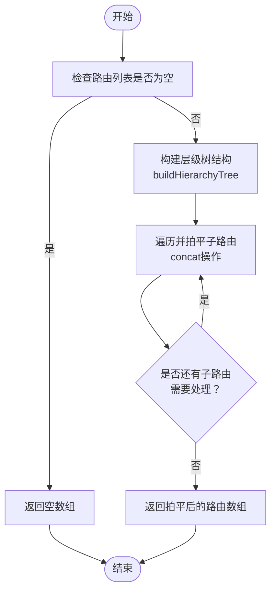
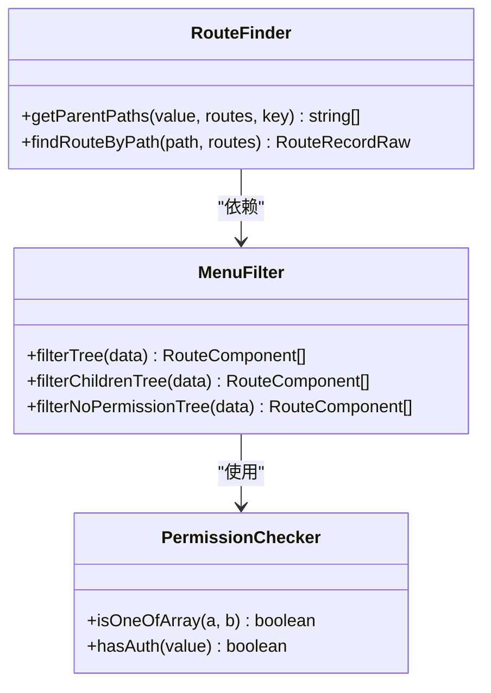
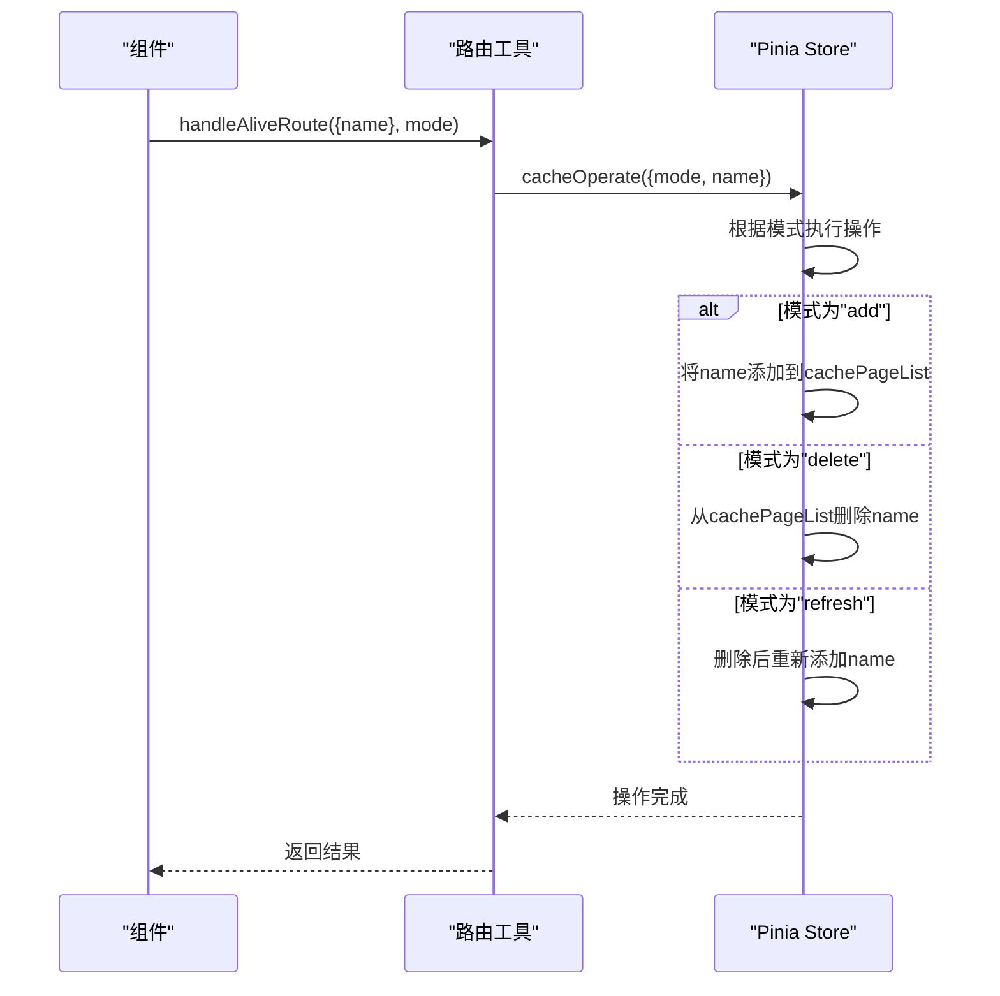
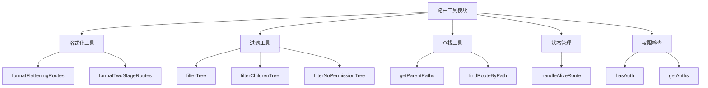
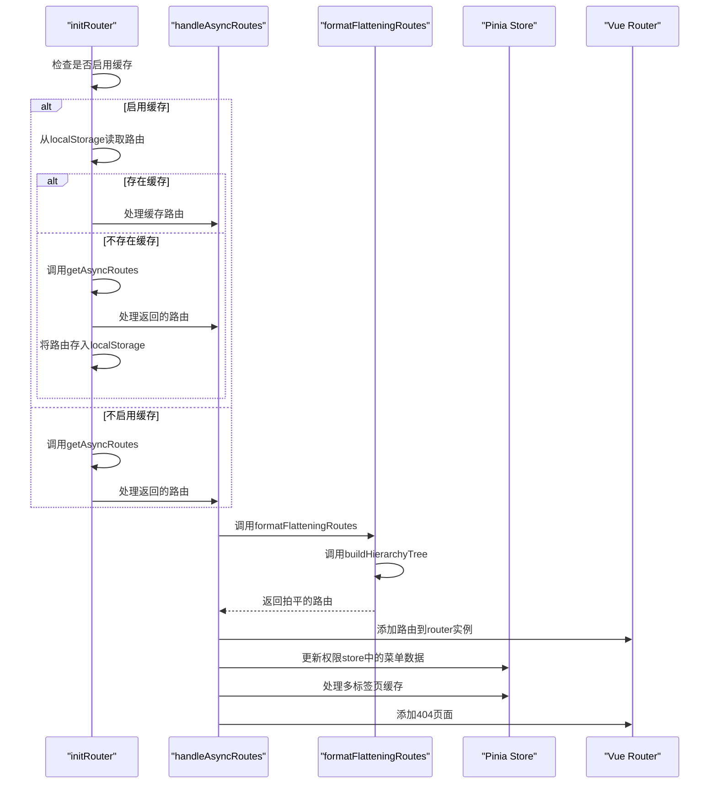

<cite>
**本文档中引用的文件**
- [utils.ts](file://web/src/router/utils.ts)
- [tree.ts](file://web/src/utils/tree.ts)
- [permission.ts](file://web/src/store/modules/permission.ts)
- [multiTags.ts](file://web/src/store/modules/multiTags.ts)
- [types.ts](file://web/src/layout/types.ts)
- [index.ts](file://web/src/config/index.ts)
- [index.ts](file://web/src/router/index.ts)
</cite>

## 目录
1. [路由工具函数](#路由工具函数)
2. [核心功能分析](#核心功能分析)
3. [工具函数设计原则](#工具函数设计原则)
4. [与核心路由系统的集成](#与核心路由系统的集成)
5. [性能优化考虑](#性能优化考虑)

## 路由工具函数

`vue-pure-admin-all`项目中的路由工具函数主要位于`src/router/utils.ts`文件中，提供了一系列用于路由处理、菜单生成和权限管理的实用函数。这些工具函数在项目中扮演着关键角色，负责将后端返回的动态路由数据转换为前端可用的路由结构，并处理路由相关的各种逻辑。

**Section sources**
- [utils.ts](file://web/src/router/utils.ts#L1-L416)

## 核心功能分析

### 路由格式化工具

路由格式化工具主要用于处理路由数据的结构转换，包括将多级嵌套路由拍平为一维数组，以及将一维数组重新组织为规定格式的二级路由结构。

**Diagram sources**
- [utils.ts](file://web/src/router/utils.ts#L233-L244)
- [tree.ts](file://web/src/utils/tree.ts#L55-L71)

#### 路由拍平函数

`formatFlatteningRoutes`函数将多级嵌套路由处理成一维数组，便于后续处理和查找。该函数首先调用`buildHierarchyTree`构建层级关系，然后通过循环遍历将所有子路由拍平到同一层级。

**Section sources**
- [utils.ts](file://web/src/router/utils.ts#L233-L244)
- [tree.ts](file://web/src/utils/tree.ts#L55-L71)

#### 二级路由格式化

`formatTwoStageRoutes`函数将一维数组处理成多级嵌套数组，但仅保留两级结构。这是为了兼容`keep-alive`组件的缓存机制，因为`keep-alive`只支持到二级缓存。

**Section sources**
- [utils.ts](file://web/src/router/utils.ts#L246-L267)

### 菜单处理工具

菜单处理工具负责过滤和处理菜单数据，确保只有用户有权限访问的菜单项才会显示。

**Diagram sources**
- [utils.ts](file://web/src/router/utils.ts#L60-L120)

#### 菜单权限过滤

`filterNoPermissionTree`函数从localStorage中取出当前登录用户的角色roles，然后过滤无权限的菜单。该函数递归遍历路由树，只保留用户角色有权限访问的菜单项。

**Section sources**
- [utils.ts](file://web/src/router/utils.ts#L108-L120)
- [permission.ts](file://web/src/store/modules/permission.ts#L1-L75)

### 路由状态管理

路由状态管理工具负责处理路由的缓存、刷新等操作，确保用户体验的一致性。

**Diagram sources**
- [utils.ts](file://web/src/router/utils.ts#L189-L208)
- [permission.ts](file://web/src/store/modules/permission.ts#L45-L69)

#### 路由缓存操作

`handleAliveRoute`函数处理缓存路由的添加、删除和刷新操作。该函数通过调用Pinia store中的`cacheOperate`方法来管理路由缓存状态。

**Section sources**
- [utils.ts](file://web/src/router/utils.ts#L189-L208)
- [permission.ts](file://web/src/store/modules/permission.ts#L45-L69)

## 工具函数设计原则

### 模块化设计

路由工具函数采用了模块化设计原则，将不同的功能分离到独立的函数中。这种设计使得代码更易于维护和测试，同时也提高了代码的可重用性。

**Diagram sources**
- [utils.ts](file://web/src/router/utils.ts#L1-L416)

### 函数式编程

工具函数大量采用了函数式编程的思想，如使用`cloneDeep`创建路由数据的深拷贝，避免直接修改原始数据。同时，许多函数都是纯函数，不产生副作用，只依赖输入参数并返回结果。

**Section sources**
- [utils.ts](file://web/src/router/utils.ts#L60-L120)

## 与核心路由系统的集成

### 路由初始化流程

路由工具函数与核心路由系统紧密集成，特别是在路由初始化过程中发挥着关键作用。

**Diagram sources**
- [utils.ts](file://web/src/router/utils.ts#L140-L187)
- [index.ts](file://web/src/router/index.ts#L1-L229)

### 在路由定义中的应用

路由工具函数在`src/router/index.ts`文件中被广泛使用，用于处理静态路由的初始化和格式化。

**Section sources**
- [index.ts](file://web/src/router/index.ts#L1-L229)

## 性能优化考虑

### 路由缓存机制

项目实现了路由缓存机制，通过配置`CachingAsyncRoutes`来决定是否将动态路由缓存到localStorage中，避免每次刷新页面时都重新请求路由数据。

**Section sources**
- [utils.ts](file://web/src/router/utils.ts#L140-L158)
- [index.ts](file://web/src/router/index.ts#L1-L229)

### 防抖处理

在多标签页管理中使用了防抖函数`debounce`，避免频繁的操作导致性能问题。

**Section sources**
- [permission.ts](file://web/src/store/modules/permission.ts#L60-L69)