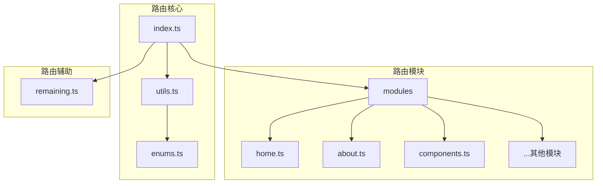
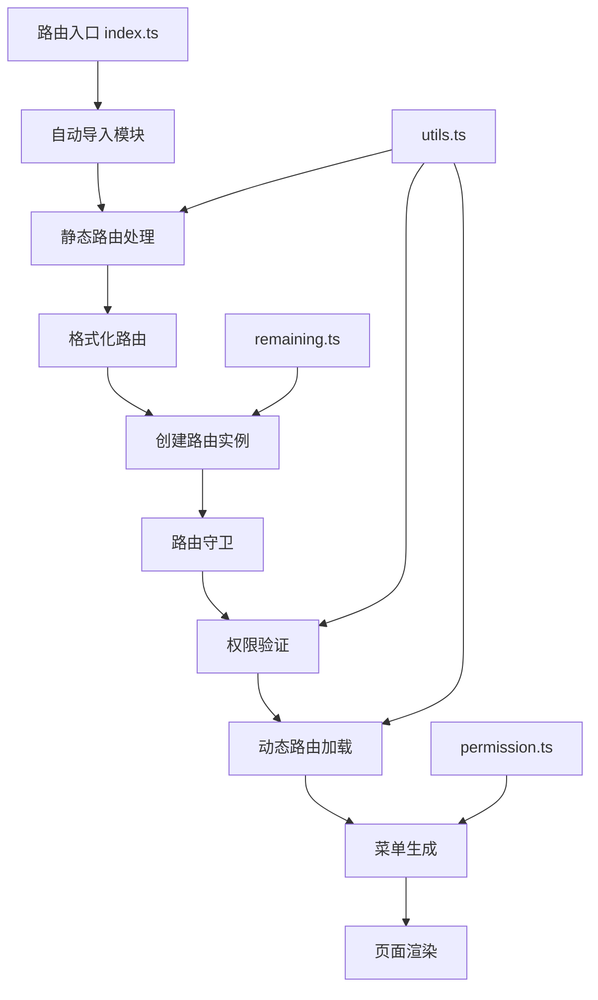
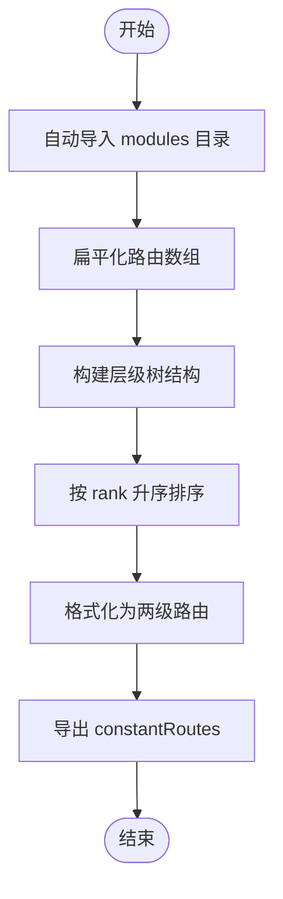
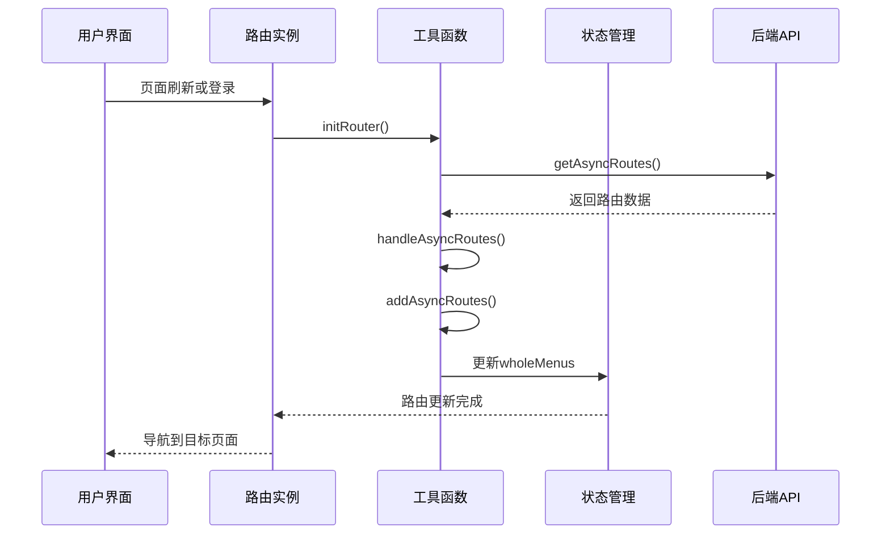
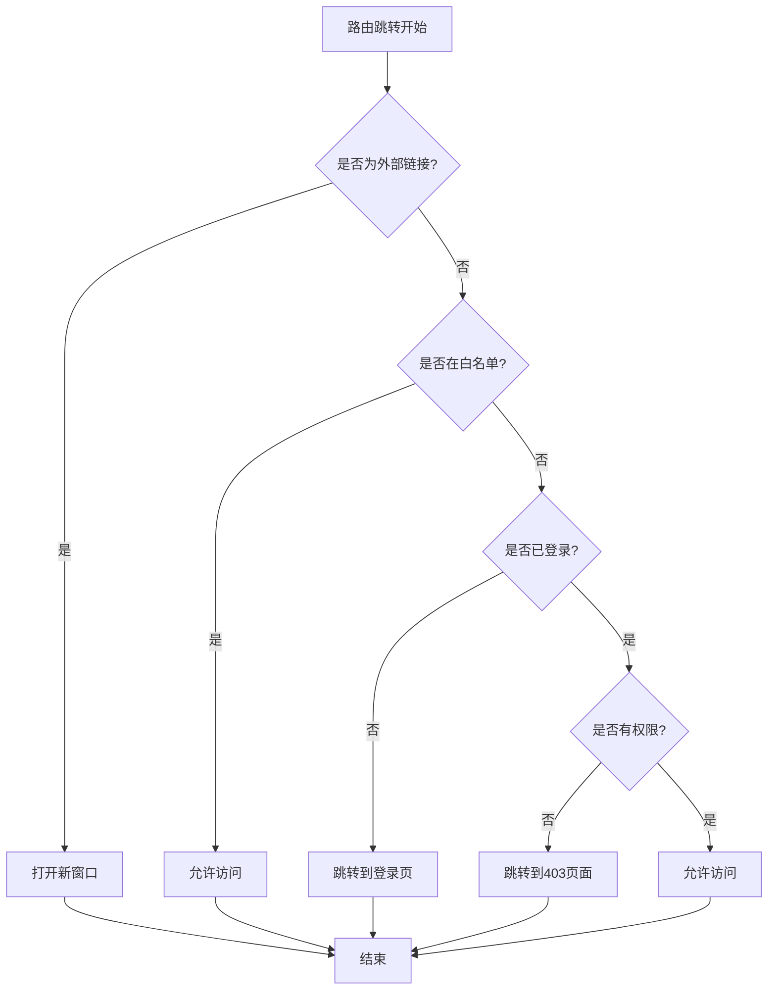
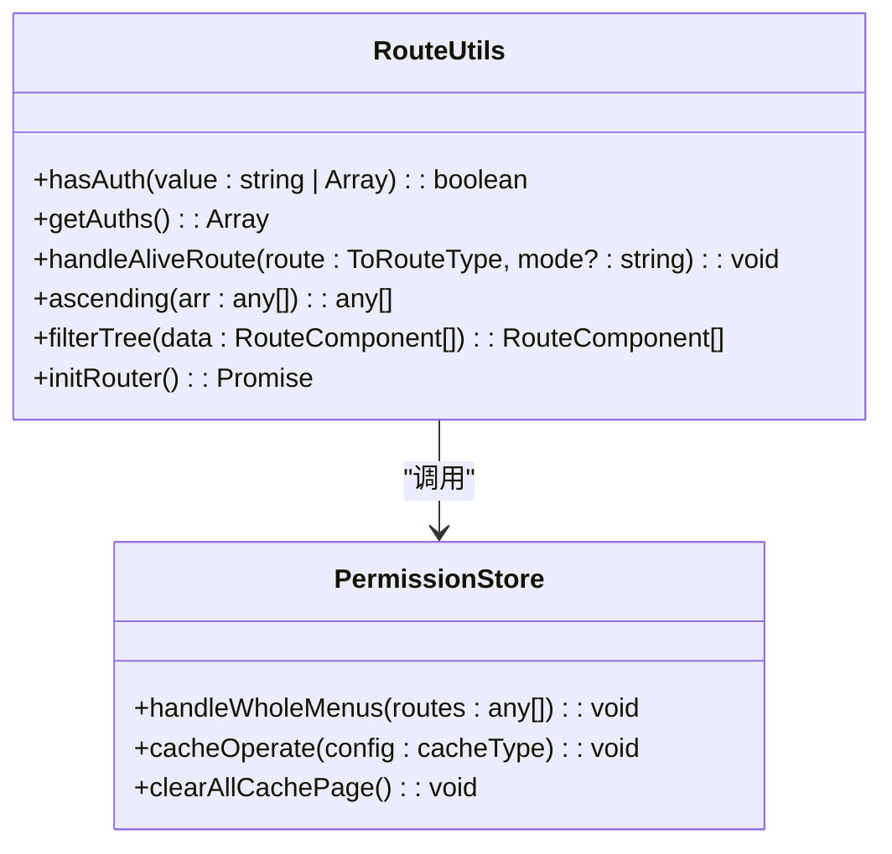

# 路由系统

<cite>
**本文档引用的文件**
- [index.ts](file://web/src/router/index.ts)
- [utils.ts](file://web/src/router/utils.ts)
- [permission.ts](file://web/src/store/modules/permission.ts)
- [home.ts](file://web/src/router/modules/home.ts)
- [remaining.ts](file://web/src/router/modules/remaining.ts)
- [types.ts](file://web/src/layout/types.ts)
</cite>

## 目录
1. [简介](#简介)
2. [项目结构](#项目结构)
3. [核心组件](#核心组件)
4. [架构概述](#架构概述)
5. [详细组件分析](#详细组件分析)
6. [依赖分析](#依赖分析)
7. [性能考虑](#性能考虑)
8. [故障排除指南](#故障排除指南)
9. [结论](#结论)

## 简介
vue-pure-admin-all 的路由系统基于 Vue Router 构建，采用模块化设计来管理应用的导航结构。该系统支持静态路由配置和动态路由生成，通过路由守卫实现权限控制。路由模块被组织在 `src/router/modules` 目录中，每个功能模块都有独立的路由配置文件。系统还集成了路由工具函数，用于处理路由相关的通用操作，如权限验证、菜单过滤和路由格式化。

## 项目结构



**Diagram sources**
- [index.ts](file://web/src/router/index.ts)
- [utils.ts](file://web/src/router/utils.ts)
- [remaining.ts](file://web/src/router/modules/remaining.ts)

**Section sources**
- [index.ts](file://web/src/router/index.ts)
- [modules](file://web/src/router/modules)

## 核心组件

路由系统的核心组件包括静态路由配置、动态路由生成和路由守卫机制。系统通过 `constantRoutes` 导出处理后的静态路由，这些路由在应用启动时就已经确定。`constantMenus` 用于渲染菜单，保持原始的层级结构。`remainingPaths` 定义了不参与菜单显示的特殊路由路径。路由守卫在 `router.beforeEach` 和 `router.afterEach` 中实现，用于处理权限验证、页面标题更新和进度条显示等逻辑。

**Section sources**
- [index.ts](file://web/src/router/index.ts#L59-L74)
- [utils.ts](file://web/src/router/utils.ts)

## 架构概述



**Diagram sources**
- [index.ts](file://web/src/router/index.ts)
- [utils.ts](file://web/src/router/utils.ts)
- [permission.ts](file://web/src/store/modules/permission.ts)
- [remaining.ts](file://web/src/router/modules/remaining.ts)

## 详细组件分析

### 静态路由配置

静态路由配置通过自动导入机制实现，系统会自动扫描 `src/router/modules` 目录下的所有 `.ts` 文件（除了 `remaining.ts`），并将它们合并成一个路由配置数组。这种设计使得添加新的功能模块变得非常简单，只需在 `modules` 目录中创建一个新的路由配置文件即可。



**Diagram sources**
- [index.ts](file://web/src/router/index.ts#L20-L61)
- [utils.ts](file://web/src/router/utils.ts)

**Section sources**
- [index.ts](file://web/src/router/index.ts#L20-L61)
- [home.ts](file://web/src/router/modules/home.ts)

### 动态路由生成

动态路由生成机制允许系统根据用户权限从后端获取个性化的路由配置。`initRouter` 函数负责初始化动态路由，它会调用 `getAsyncRoutes` API 获取路由数据，然后通过 `handleAsyncRoutes` 函数处理这些数据。处理过程包括添加异步路由、格式化路由结构和更新菜单状态。



**Diagram sources**
- [utils.ts](file://web/src/router/utils.ts#L199-L226)
- [utils.ts](file://web/src/router/utils.ts#L157-L196)
- [permission.ts](file://web/src/store/modules/permission.ts)

**Section sources**
- [utils.ts](file://web/src/router/utils.ts#L157-L226)
- [permission.ts](file://web/src/store/modules/permission.ts)

### 路由守卫与权限控制

路由守卫是路由系统的核心安全机制，它在每次路由跳转前执行权限验证。守卫会检查用户是否已登录、是否有访问目标路由的权限，并根据环境变量决定是否隐藏首页。对于外部链接，系统会直接打开新窗口。守卫还负责更新页面标题、显示进度条和管理标签页状态。



**Diagram sources**
- [index.ts](file://web/src/router/index.ts#L120-L210)

**Section sources**
- [index.ts](file://web/src/router/index.ts#L120-L210)

### 路由工具函数

路由系统提供了多个实用的工具函数，用于处理常见的路由操作。`hasAuth` 函数用于检查用户是否有执行特定操作的权限，`getAuths` 获取当前路由的权限列表，`handleAliveRoute` 管理页面缓存状态。这些函数被广泛应用于组件中，实现细粒度的权限控制。



**Diagram sources**
- [utils.ts](file://web/src/router/utils.ts#L360-L374)
- [permission.ts](file://web/src/store/modules/permission.ts)

**Section sources**
- [utils.ts](file://web/src/router/utils.ts#L273-L374)
- [permission.ts](file://web/src/store/modules/permission.ts)

## 依赖分析

```mermaid
graph TD
A[index.ts] --> B[utils.ts]
A --> C[remaining.ts]
A --> D[vue-router]
A --> E[@/config]
A --> F[@/utils/progress]
A --> G[@/plugins/i18n]
A --> H[@/utils/tree]
A --> I[@/store/modules/permission]
A --> J[@/store/modules/multiTags]
A --> K[@pureadmin/utils]
B --> L[vue-router]
B --> M[@pureadmin/utils]
B --> N[@/config]
B --> O[@/utils/tree]
B --> P[@/utils/auth]
B --> Q[@/layout/types]
B --> R[@/store/modules/multiTags]
B --> S[@/store/modules/permission]
I --> T[pinia]
I --> U[@/utils]
I --> V[@/store/modules/multiTags]
```

**Diagram sources**
- [index.ts](file://web/src/router/index.ts)
- [utils.ts](file://web/src/router/utils.ts)
- [permission.ts](file://web/src/store/modules/permission.ts)

**Section sources**
- [index.ts](file://web/src/router/index.ts)
- [utils.ts](file://web/src/router/utils.ts)
- [permission.ts](file://web/src/store/modules/permission.ts)

## 性能考虑
路由系统的性能优化主要体现在以下几个方面：首先，通过自动导入机制减少了手动引入路由模块的工作量，提高了开发效率。其次，路由数据被缓存在本地存储中，当启用动态路由缓存时，可以减少重复的API调用。此外，路由排序和格式化操作在初始化时完成，避免了运行时的重复计算。系统还使用了防抖技术来优化缓存页面的同步，减少了不必要的状态更新。

## 故障排除指南

当路由系统出现问题时，可以按照以下步骤进行排查：
1. 检查路由配置文件是否正确导出默认对象
2. 确认动态路由API返回的数据格式是否符合预期
3. 验证用户权限数据是否正确存储在本地
4. 检查路由守卫中的条件判断逻辑是否有误
5. 确认路由组件的路径是否正确，特别是异步组件的导入路径

常见问题包括：新添加的路由无法访问（可能是未正确导入或路径冲突）、权限验证失效（检查用户角色数据和路由meta中的roles配置）、页面缓存异常（检查handleAliveRoute的调用时机和参数）。

**Section sources**
- [index.ts](file://web/src/router/index.ts)
- [utils.ts](file://web/src/router/utils.ts)

## 结论
vue-pure-admin-all 的路由系统设计精良，采用了模块化、自动化的配置方式，大大简化了路由管理的复杂性。系统通过静态路由和动态路由的结合，既保证了基础功能的稳定性，又提供了灵活的权限控制能力。路由守卫机制完善，能够有效处理各种导航场景。工具函数的设计考虑周到，为开发者提供了便利的权限验证和路由操作接口。整体架构清晰，依赖关系明确，易于维护和扩展。