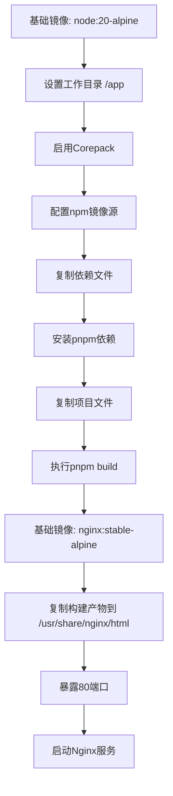
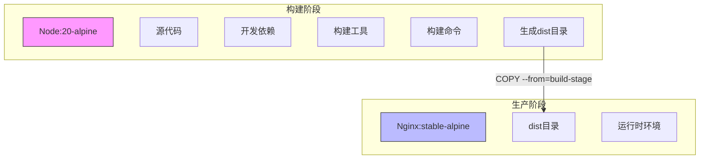
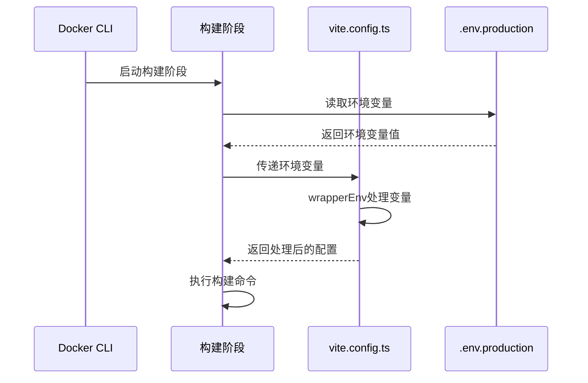

# 容器化部署

<cite>
**Referenced Files in This Document**   
- [Dockerfile](file://web/Dockerfile)
- [vite.config.ts](file://web/vite.config.ts)
- [utils.ts](file://web/build/utils.ts)
- [.env.production](file://web/.env.production)
</cite>

## 目录
1. [Docker部署流程](#docker部署流程)
2. [Dockerfile指令解析](#dockerfile指令解析)
3. [多阶段构建策略](#多阶段构建策略)
4. [环境变量集成](#环境变量集成)
5. [构建与运行命令](#构建与运行命令)
6. [部署环境配置](#部署环境配置)

## Docker部署流程

本项目采用Docker容器化部署方案，通过Dockerfile定义完整的构建和运行环境。部署流程分为两个主要阶段：构建阶段和生产阶段。构建阶段使用Node.js环境完成项目依赖安装和前端资源构建，生产阶段使用Nginx服务器托管构建后的静态资源。整个流程实现了从源代码到可运行容器的自动化构建，确保了开发、测试和生产环境的一致性。

**Section sources**
- [Dockerfile](file://web/Dockerfile#L1-L20)

## Dockerfile指令解析

### 基础镜像选择
Dockerfile采用多阶段构建策略，第一阶段以`node:20-alpine`作为基础镜像，这是一个轻量级的Node.js运行环境，基于Alpine Linux，具有较小的镜像体积和较高的安全性。第二阶段以`nginx:stable-alpine`作为基础镜像，用于托管构建后的前端应用。

### 工作目录设置
在构建阶段，通过`WORKDIR /app`指令设置容器内的工作目录为/app，所有后续操作都将在此目录下进行，确保了构建过程的目录一致性。

### 依赖安装
构建过程首先启用Corepack工具，然后配置npm镜像源为国内镜像站以加速依赖下载。通过复制package.json、pnpm-lock.yaml和.npmrc文件，然后执行`pnpm install --frozen-lockfile`命令安装项目依赖，确保依赖版本的确定性。

### 构建命令执行
在安装完依赖后，将项目所有文件复制到工作目录，并执行`pnpm build`命令进行前端资源构建。该命令会根据vite.config.ts中的配置生成优化后的静态资源。

### 静态资源复制
在生产阶段，从构建阶段的容器中复制/dist目录下的构建结果到Nginx的默认静态资源目录`/usr/share/nginx/html`，实现构建产物的传递。

### Nginx服务器配置
容器暴露80端口，并以守护进程模式启动Nginx服务，确保Web服务器持续运行并响应客户端请求。



**Diagram sources**
- [Dockerfile](file://web/Dockerfile#L1-L20)

**Section sources**
- [Dockerfile](file://web/Dockerfile#L1-L20)

## 多阶段构建策略

本项目采用多阶段构建策略优化镜像大小和安全性。构建过程分为`build-stage`和`production-stage`两个阶段：

1. **构建阶段(build-stage)**：包含完整的Node.js开发环境、源代码和构建工具，用于执行前端资源的编译和打包。此阶段的镜像体积较大，但仅用于构建过程。

2. **生产阶段(production-stage)**：仅包含Nginx服务器和构建后的静态资源，不包含任何开发工具和源代码，显著减小了最终镜像的体积。

通过`COPY --from=build-stage`指令，仅将构建阶段生成的/dist目录复制到生产阶段，实现了构建环境与运行环境的分离。这种策略不仅减小了最终镜像的体积（通常可减少70%以上），还提高了安全性，因为生产镜像中不包含任何构建工具和源代码，减少了攻击面。



**Diagram sources**
- [Dockerfile](file://web/Dockerfile#L1-L20)

**Section sources**
- [Dockerfile](file://web/Dockerfile#L1-L20)

## 环境变量集成

### vite.config.ts中的环境变量处理
vite.config.ts通过`loadEnv`函数加载环境变量，并通过`wrapperEnv`工具函数进行处理。该函数将环境变量字符串转换为相应的数据类型（如字符串、布尔值、数字），并设置默认值，确保配置的健壮性。

### 环境变量配置文件
项目通过`.env.production`文件定义生产环境的环境变量，包括：
- `VITE_PUBLIC_PATH`: 设置应用的公共路径
- `VITE_ROUTER_HISTORY`: 配置路由历史模式
- `VITE_CDN`: 控制是否使用CDN替换本地库
- `VITE_COMPRESSION`: 配置压缩选项

### 环境变量传递机制
在Docker构建过程中，环境变量通过构建上下文传递到容器内部。vite.config.ts在构建时读取这些环境变量，并根据其值调整构建行为。例如，当`VITE_CDN`设置为`true`时，构建过程会使用CDN链接替换本地依赖库。



**Diagram sources**
- [vite.config.ts](file://web/vite.config.ts#L1-L63)
- [utils.ts](file://web/build/utils.ts#L50-L77)
- [.env.production](file://web/.env.production#L1-L13)

**Section sources**
- [vite.config.ts](file://web/vite.config.ts#L1-L63)
- [utils.ts](file://web/build/utils.ts#L50-L77)
- [.env.production](file://web/.env.production#L1-L13)

## 构建与运行命令

### Docker构建命令
```bash
# 构建生产环境镜像
docker build -t vue-pure-admin:latest .

# 构建时指定构建参数（如有需要）
docker build --build-arg NODE_ENV=production -t vue-pure-admin:prod .
```

### 容器运行参数配置
```bash
# 基本运行命令
docker run -d -p 80:80 --name vue-admin vue-pure-admin:latest

# 带有环境变量覆盖的运行命令
docker run -d -p 80:80 -e VITE_PUBLIC_PATH=/admin/ --name vue-admin vue-pure-admin:latest

# 带有卷挂载的运行命令（用于配置热更新）
docker run -d -p 80:80 -v ./config/nginx.conf:/etc/nginx/nginx.conf:ro --name vue-admin vue-pure-admin:latest
```

### 构建优化参数
```bash
# 使用缓存优化构建速度
docker build --cache-from vue-pure-admin:latest -t vue-pure-admin:new .

# 多平台构建
docker buildx build --platform linux/amd64,linux/arm64 -t vue-pure-admin:multiarch .
```

**Section sources**
- [Dockerfile](file://web/Dockerfile#L1-L20)

## 部署环境配置

### 环境变量实现配置切换
通过环境变量实现不同部署环境的配置切换，主要机制包括：

1. **环境文件分离**：项目支持多种环境文件（如.env.development、.env.production），Docker构建时根据`--env`参数选择相应的环境文件。

2. **运行时覆盖**：在`docker run`命令中使用`-e`参数可以覆盖容器内的环境变量，实现灵活的配置调整。

3. **默认值机制**：vite.config.ts中的`wrapperEnv`函数为关键配置项设置默认值，确保即使环境变量未定义，应用也能正常运行。

### 配置灵活性设计
- **公共路径配置**：通过`VITE_PUBLIC_PATH`变量支持应用部署在子路径下
- **路由模式切换**：通过`VITE_ROUTER_HISTORY`变量支持Hash模式和HTML5 History模式
- **性能优化选项**：通过`VITE_COMPRESSION`变量控制是否启用gzip或brotli压缩
- **CDN集成**：通过`VITE_CDN`变量控制是否使用CDN加速第三方库加载

### 可维护性保障
- **配置集中管理**：所有环境相关配置集中在环境文件中，便于维护
- **构建确定性**：使用`--frozen-lockfile`确保依赖版本一致性
- **镜像版本控制**：通过Docker标签管理不同版本的镜像
- **配置验证**：在构建时验证关键配置项的有效性，防止配置错误

**Section sources**
- [vite.config.ts](file://web/vite.config.ts#L1-L63)
- [utils.ts](file://web/build/utils.ts#L50-L77)
- [.env.production](file://web/.env.production#L1-L13)