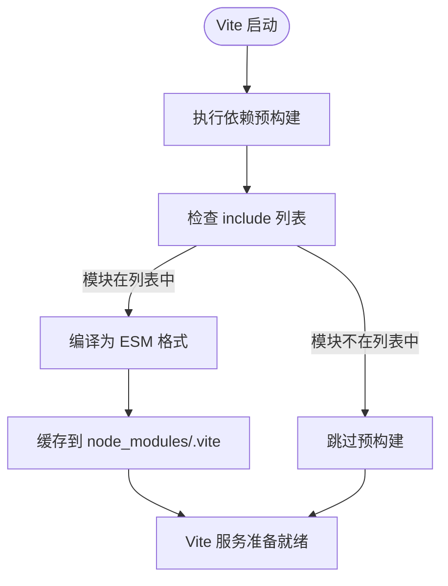
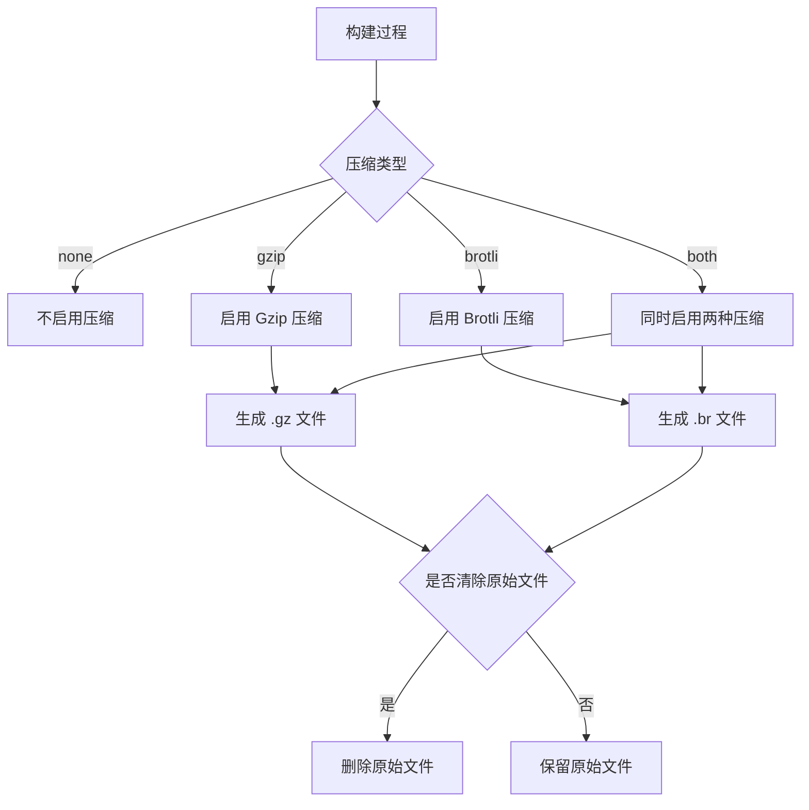
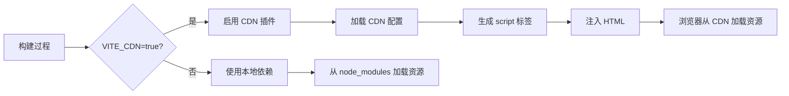
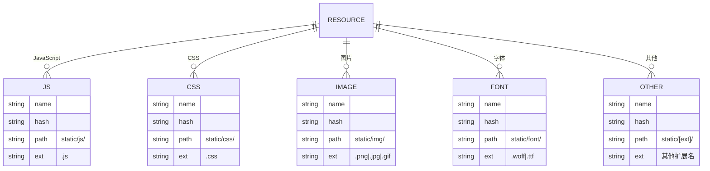

# 构建优化

<cite>
**Referenced Files in This Document**   
- [vite.config.ts](file://web/vite.config.ts)
- [optimize.ts](file://web/build/optimize.ts)
- [compress.ts](file://web/build/compress.ts)
- [cdn.ts](file://web/build/cdn.ts)
- [plugins.ts](file://web/build/plugins.ts)
</cite>

## 目录
1. [构建优化概述](#构建优化概述)
2. [依赖预构建优化](#依赖预构建优化)
3. [资源压缩策略](#资源压缩策略)
4. [CDN外链加载](#cdn外链加载)
5. [静态资源分类打包](#静态资源分类打包)
6. [构建结果分析](#构建结果分析)

## 构建优化概述

本项目采用 Vite 作为构建工具，通过一系列优化策略提升开发体验和生产环境性能。构建优化主要体现在依赖预构建、资源压缩、CDN外链加载和静态资源分类打包等方面。这些优化措施共同作用，显著提升了应用的启动速度和加载性能。

**Section sources**
- [vite.config.ts](file://web/vite.config.ts#L1-L63)

## 依赖预构建优化

### include 配置作用

`optimize.ts` 文件中的 `include` 配置项用于指定需要进行依赖预构建的模块列表。在 Vite 启动时，这些模块会被预先编译成 ES 模块（ESM）格式，并缓存到 `node_modules/.vite` 目录中。

当页面加载到对应模块时，Vite 会优先检查浏览器缓存，如果浏览器没有缓存，则会读取本地的预构建缓存并按需加载。这种机制特别重要，尤其是在禁用浏览器缓存的调试阶段。如果不将常用模块加入 `include` 列表，Vite 会认为每次都是新的依赖包，导致重新加载并强制刷新页面，从而造成开发环境切换页面时的卡顿问题。

值得注意的是，如果第三方库是全局引入（即在 `src/main.ts` 文件中引入），则不需要再添加到 `include` 列表中，因为 Vite 会自动将它们缓存到本地。

### exclude 配置作用

`exclude` 配置项用于在预构建过程中强制排除特定的依赖项。本项目中排除了 `@iconify/json`，因为平台推荐的使用方式是按需引入，而不是进行预构建。这样可以让浏览器直接加载所需的图标数据，避免不必要的预构建开销。

**Diagram sources**
- [optimize.ts](file://web/build/optimize.ts#L1-L65)

**Section sources**
- [optimize.ts](file://web/build/optimize.ts#L1-L65)
- [vite.config.ts](file://web/vite.config.ts#L1-L63)

## 资源压缩策略

### 压缩算法支持

`compress.ts` 文件实现了对多种压缩算法的支持，主要包括 Gzip 和 Brotli 两种高效的压缩算法：

- **Gzip**: 通过 `compression` 库实现，是广泛支持的传统压缩算法
- **Brotli**: 通过 Node.js 内置的 `zlib` 模块的 `brotliCompress` 算法实现，通常能提供比 Gzip 更好的压缩率

### 配置方式

压缩配置通过 `configCompressPlugin` 函数实现，该函数根据传入的压缩类型参数返回相应的 Vite 插件配置：

- `gzip`: 启用 Gzip 压缩
- `brotli`: 启用 Brotli 压缩
- `both`: 同时启用 Gzip 和 Brotli 压缩
- `none`: 不启用任何压缩
- `clear`: 在启用压缩的同时删除原始文件

压缩配置还包含以下参数：
- `ext`: 生成的压缩包后缀名
- `threshold`: 文件体积大于此阈值才会被压缩（本项目设置为 0，即压缩所有文件）
- `filter`: 过滤器函数，决定哪些文件需要压缩（本项目设置为压缩所有文件）
- `deleteOriginFile`: 压缩后是否删除原始文件

**Diagram sources**
- [compress.ts](file://web/build/compress.ts#L1-L64)

**Section sources**
- [compress.ts](file://web/build/compress.ts#L1-L64)
- [plugins.ts](file://web/build/plugins.ts#L1-L78)

## CDN外链加载

### 实现机制

`cdn.ts` 文件通过 `vite-plugin-cdn-import` 插件实现了第三方库的 CDN 外链加载功能。该功能默认不启用，需要在 `.env.production` 文件中将 `VITE_CDN` 设置为 `true` 才能激活。

项目采用国内 CDN 服务（bootcdn.cn），同时也支持 unpkg.com 或 jsdelivr.com 等国际 CDN 服务。这种设计既保证了国内用户的访问速度，又提供了灵活的配置选项。

### 配置方式

CDN 配置通过 `cdn` 常量定义，包含以下关键配置：

- `prodUrl`: 生产环境 CDN 基础 URL 模板，支持自动读取本地 `package.json` 中依赖的版本号
- `modules`: 需要通过 CDN 加载的模块列表，每个模块包含：
  - `name`: 包名
  - `var`: 全局变量名
  - `path`: CDN 上的文件路径
  - `css`: 可选的 CSS 文件路径

特别值得注意的是，由于 `pinia` 依赖 `vue-demi`，但项目中并未直接安装 `vue-demi`，因此需要在 `pinia` 之前显式引入 `vue-demi`，确保依赖关系的正确性。

**Diagram sources**
- [cdn.ts](file://web/build/cdn.ts#L1-L61)

**Section sources**
- [cdn.ts](file://web/build/cdn.ts#L1-L61)
- [plugins.ts](file://web/build/plugins.ts#L1-L78)

## 静态资源分类打包

### 打包策略

在 `vite.config.ts` 的 `rollupOptions` 配置中，通过 `output` 属性实现了静态资源的分类打包策略：

- **JavaScript 文件**: 输出到 `static/js/` 目录，文件名为 `[name]-[hash].js`
- **CSS 文件**: 输出到 `static/css/` 目录，文件名为 `[name]-[hash].css`
- **其他资源**: 按扩展名分类到 `static/[ext]/` 目录，文件名为 `[name]-[hash].[ext]`

这种分类策略具有以下优势：
1. **便于管理**: 不同类型的资源有明确的存放位置
2. **缓存优化**: 哈希值确保了资源更新后的缓存失效
3. **性能提升**: 按类型分离资源有利于 CDN 的缓存策略

### 配置细节

打包配置还包括：
- `target`: 设置为 `es2015`，确保兼容现代浏览器
- `chunkSizeWarningLimit`: 设置为 4000KB，消除大于 500KB 的打包警告
- `sourcemap`: 设置为 `false`，生产环境不生成源码映射文件以减小包体积

**Diagram sources**
- [vite.config.ts](file://web/vite.config.ts#L1-L63)

**Section sources**
- [vite.config.ts](file://web/vite.config.ts#L1-L63)

## 构建结果分析

通过上述优化策略的综合应用，项目构建效果显著提升：

1. **启动速度优化**: 依赖预构建减少了开发服务器的启动时间，特别是对于大型项目，启动速度提升明显
2. **打包体积减少**: CDN 外链加载将多个大型第三方库从打包结果中移除，显著减小了主包体积
3. **加载性能提升**: 资源压缩和分类打包策略优化了资源的加载顺序和缓存策略，提升了页面加载速度
4. **部署效率提高**: 通过 `vite-plugin-remove-console` 插件在生产环境自动删除 `console` 语句，减少了不必要的代码

这些优化措施共同作用，使得应用在开发和生产环境中都能获得良好的性能表现，为用户提供流畅的使用体验。

**Section sources**
- [vite.config.ts](file://web/vite.config.ts#L1-L63)
- [optimize.ts](file://web/build/optimize.ts#L1-L65)
- [compress.ts](file://web/build/compress.ts#L1-L64)
- [cdn.ts](file://web/build/cdn.ts#L1-L61)
- [plugins.ts](file://web/build/plugins.ts#L1-L78)