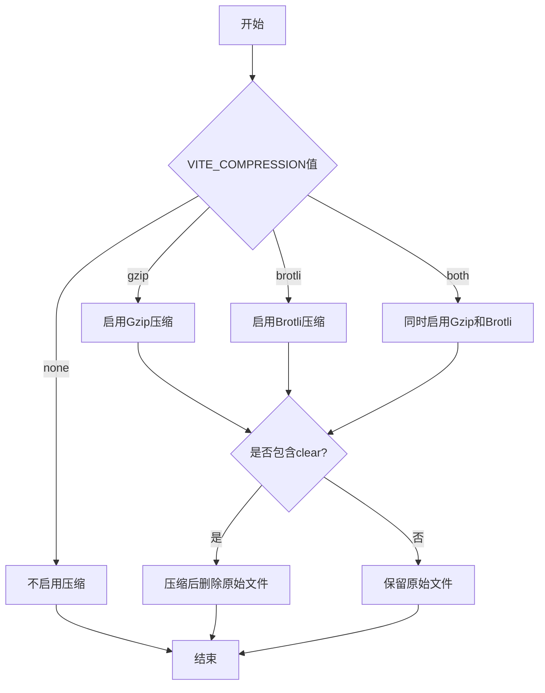
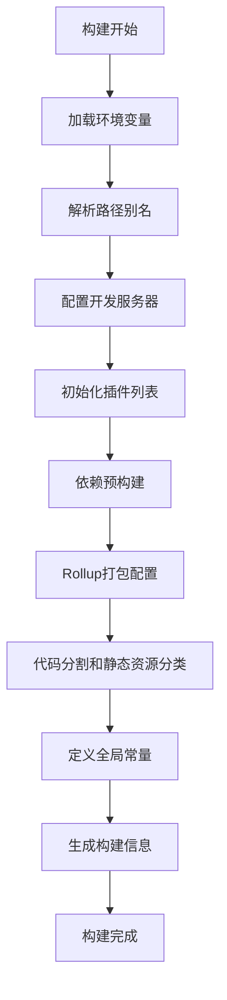
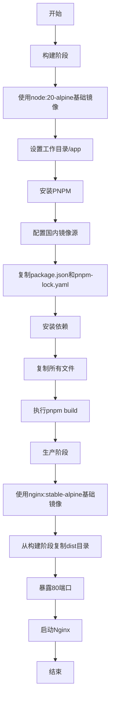

# 构建部署

<cite>
**Referenced Files in This Document**   
- [vite.config.ts](file://web/vite.config.ts)
- [Dockerfile](file://web/Dockerfile)
- [plugins.ts](file://web/build/plugins.ts)
- [optimize.ts](file://web/build/optimize.ts)
- [cdn.ts](file://web/build/cdn.ts)
- [compress.ts](file://web/build/compress.ts)
- [utils.ts](file://web/build/utils.ts)
- [.env.production](file://web/.env.production)
</cite>

## 目录
1. [构建部署](#构建部署)
2. [Vite构建配置详解](#vite构建配置详解)
3. [构建优化配置](#构建优化配置)
4. [生产环境构建流程](#生产环境构建流程)
5. [Docker容器化部署](#docker容器化部署)
6. [总结](#总结)

## Vite构建配置详解

Vite构建配置文件`vite.config.ts`是项目构建的核心配置文件，它定义了项目的构建行为、服务器配置、插件系统等关键设置。该配置文件通过导入`build`目录下的多个工具函数和配置项，实现了模块化的配置管理。

配置文件首先从`build/utils.ts`中导入了项目根目录、路径解析、别名配置等基础工具，然后通过`loadEnv`函数加载环境变量，并使用`wrapperEnv`函数对环境变量进行处理和转换。

### 环境变量配置

项目通过`.env.production`文件定义了生产环境的环境变量，这些变量在构建时被加载并应用到配置中。主要环境变量包括：

- `VITE_PUBLIC_PATH`: 定义了应用的公共路径，用于指定资源文件的基准路径
- `VITE_PORT`: 开发服务器端口
- `VITE_CDN`: 控制是否启用CDN模式
- `VITE_COMPRESSION`: 控制压缩选项

这些环境变量通过`wrapperEnv`函数进行处理，确保了类型安全和默认值的设置。

### 路径别名配置

项目配置了路径别名，简化了模块导入。主要别名包括：
- `@`: 指向`src`目录，方便从任何位置导入源代码文件
- `@build`: 指向`build`目录，方便导入构建相关的工具和配置

### 服务器配置

开发服务器配置了以下关键选项：
- 端口号由`VITE_PORT`环境变量控制，默认为8848
- 主机绑定为`0.0.0.0`，允许外部访问
- 配置了文件预热功能，提前转换和缓存`index.html`和`views`、`components`目录下的文件，以降低启动时的页面加载时间

**Section sources**
- [vite.config.ts](file://web/vite.config.ts#L1-L62)
- [utils.ts](file://web/build/utils.ts#L1-L110)

## 构建优化配置

项目在`build`目录下提供了多个优化配置文件，用于提升构建性能和最终包的大小。

### 依赖预构建优化

`optimize.ts`文件定义了`include`和`exclude`数组，用于配置Vite的依赖预构建行为。预构建是Vite的一个重要特性，它在启动时将指定的依赖项编译成ES模块格式并缓存，从而加快开发服务器的启动速度和页面加载速度。

`include`数组包含了项目中使用但未在`main.ts`中全局引入的第三方库，如`qs`、`mitt`、`xlsx`、`dayjs`、`axios`等。这些库被预先构建和缓存，避免了开发环境中因浏览器缓存问题导致的页面卡顿。

`exclude`数组则明确排除了`@iconify/json`，防止其被预构建。

**Section sources**
- [optimize.ts](file://web/build/optimize.ts#L1-L64)

### CDN集成配置

`cdn.ts`文件实现了CDN集成功能，通过`vite-plugin-cdn-import`插件，可以在构建时将指定的依赖项替换为CDN链接，从而减少打包体积并利用CDN的全球分发优势。

CDN配置包含了项目依赖的主要库：
- Vue及其生态系统（Vue, Vue Router, Vue I18n, Pinia）
- UI框架Element Plus
- 工具库（Axios, Day.js）
- 可视化库ECharts

当`VITE_CDN`环境变量设置为`true`时，这些库将从BootCDN加载，而不是打包到应用中。

**Section sources**
- [cdn.ts](file://web/build/cdn.ts#L1-L60)

### 压缩配置

`compress.ts`文件提供了灵活的压缩配置，通过`configCompressPlugin`函数根据`VITE_COMPRESSION`环境变量的值来决定启用哪种压缩方式。

支持的压缩选项包括：
- `none`: 不启用压缩
- `gzip`: 启用Gzip压缩
- `brotli`: 启用Brotli压缩
- `both`: 同时启用Gzip和Brotli压缩

此外，还支持`-clear`后缀，表示压缩后删除原始文件，进一步减少部署包的大小。

**Diagram sources**
- [compress.ts](file://web/build/compress.ts#L4-L62)

**Section sources**
- [compress.ts](file://web/build/compress.ts#L1-L64)

## 生产环境构建流程

生产环境的构建流程由`vite.config.ts`中的配置和`build`目录下的工具共同驱动，形成了一个完整的构建管道。

### 插件系统

`plugins.ts`文件中的`getPluginsList`函数是插件系统的核心，它根据环境变量动态组合不同的Vite插件。生产环境构建时，会启用以下关键插件：

- **Tailwind CSS**: 提供现代化的CSS实用类
- **Vue和Vue JSX**: 支持Vue单文件组件和JSX语法
- **Vue I18n**: 国际化支持
- **代码检查器**: 开发时按住组合键可定位到IDE中的代码位置
- **路由警告移除**: 移除不必要的Vue Router动态路由警告
- **Mock服务器**: 支持本地API模拟
- **SVG加载器**: 将SVG文件作为Vue组件使用
- **图标插件**: 自动按需加载图标
- **CDN插件**: 根据配置启用CDN模式
- **压缩插件**: 根据配置启用相应的压缩方式
- **控制台移除**: 生产环境移除console语句
- **打包分析器**: 当执行`report`命令时生成打包分析报告

**Diagram sources**
- [vite.config.ts](file://web/vite.config.ts#L1-L62)
- [plugins.ts](file://web/build/plugins.ts#L17-L76)

**Section sources**
- [plugins.ts](file://web/build/plugins.ts#L1-L77)
- [vite.config.ts](file://web/vite.config.ts#L1-L62)

### 构建输出配置

`vite.config.ts`中的`build`配置项定义了生产构建的详细行为：

- **目标浏览器**: 设置为`es2015`，确保兼容现代浏览器
- **Source Map**: 禁用以减少包大小
- **分块大小警告**: 设置为4000KB，消除大于500KB的警告
- **Rollup选项**: 配置了输入文件和输出文件的命名模式，将静态资源按类型分类打包

输出文件的命名模式确保了缓存友好性：
- JavaScript文件: `static/js/[name]-[hash].js`
- CSS和其他资源: `static/[ext]/[name]-[hash].[ext]`

## Docker容器化部署

项目提供了完整的Docker部署方案，通过`Dockerfile`实现了从构建到部署的完整流程。

### Dockerfile分析

Dockerfile采用多阶段构建策略，分为构建阶段和生产阶段：

1. **构建阶段**:
   - 基于`node:20-alpine`镜像
   - 设置工作目录并安装PNPM包管理器
   - 配置国内NPM镜像源以加速依赖安装
   - 复制项目文件并安装依赖
   - 复制所有文件并执行构建命令

2. **生产阶段**:
   - 基于`nginx:stable-alpine`镜像
   - 从构建阶段复制`dist`目录到Nginx的HTML目录
   - 暴露80端口
   - 启动Nginx服务

**Diagram sources**
- [Dockerfile](file://web/Dockerfile#L1-L20)

**Section sources**
- [Dockerfile](file://web/Dockerfile#L1-L20)

### 部署流程

完整的部署流程如下：

1. 开发人员提交代码到版本控制系统
2. CI/CD系统拉取代码
3. 执行Docker构建命令，自动完成依赖安装和项目构建
4. 生成包含静态文件的Docker镜像
5. 将镜像推送到镜像仓库
6. 在生产服务器上拉取镜像并运行容器

这种容器化部署方式确保了开发、测试和生产环境的一致性，避免了"在我机器上能运行"的问题。

## 总结

本项目提供了一套完整的构建和部署解决方案，涵盖了从开发配置到生产部署的各个环节。通过模块化的构建配置、灵活的优化选项和现代化的容器化部署，确保了项目能够高效、稳定地上线运行。

关键优势包括：
- **配置模块化**: 将复杂的构建配置分解到多个文件中，提高了可维护性
- **优化全面**: 提供了CDN集成、多种压缩方式、依赖预构建等多种优化手段
- **部署简单**: 通过Dockerfile实现了"一次构建，到处运行"的部署理念
- **环境隔离**: 使用环境变量区分不同环境的配置，确保了配置的安全性和灵活性

这套构建部署方案为运维和开发人员提供了清晰的指导，确保项目能够顺利上线并稳定运行。