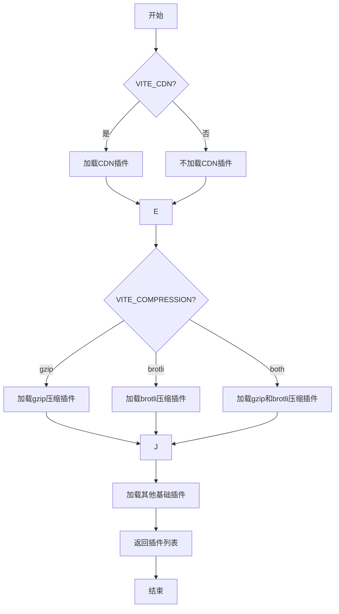

<cite>
**本文档中引用的文件**
- [vite.config.ts](file://web/vite.config.ts)
- [plugins.ts](file://web/build/plugins.ts)
- [utils.ts](file://web/build/utils.ts)
- [compress.ts](file://web/build/compress.ts)
- [cdn.ts](file://web/build/cdn.ts)
</cite>

## 目录
1. [项目根目录与别名配置](#项目根目录与别名配置)
2. [服务器设置](#服务器设置)
3. [构建选项配置](#构建选项配置)
4. [环境变量处理](#环境变量处理)
5. [插件动态加载机制](#插件动态加载机制)

## 项目根目录与别名配置

在vite.config.ts配置文件中，通过`root`常量定义了项目根目录，该值由`process.cwd()`获取，指向启动Node.js进程时的工作目录绝对路径。解析别名配置时，`pathResolve`函数确保了路径的正确性，特别是在`build`目录内外调用时的路径解析。

`resolve.alias`配置项定义了模块导入的别名映射，其中`@`指向`src`目录，`@build`指向`build`目录。这种别名配置简化了模块导入路径，提高了代码的可读性和可维护性。

**Section sources**
- [vite.config.ts](file://web/vite.config.ts#L1-L62)
- [utils.ts](file://web/build/utils.ts#L1-L110)

## 服务器设置

服务器配置包含端口、主机、代理和预热等关键设置。`server.port`从环境变量`VITE_PORT`中读取，默认值为8848，允许开发者在不同环境中灵活配置服务端口。`server.host`设置为`0.0.0.0`，使开发服务器能够监听所有网络接口，便于局域网内其他设备访问。

`server.proxy`配置项目前为空对象，预留了本地跨域代理的配置位置，可根据实际需求添加代理规则以解决开发环境下的跨域问题。`server.warmup`配置预热文件，通过`clientFiles`指定`index.html`和`src/views`、`src/components`目录下的文件，提前转换和缓存结果，有效降低初始页面加载时间并防止转换瀑布。

**Section sources**
- [vite.config.ts](file://web/vite.config.ts#L1-L62)

## 构建选项配置

构建配置定义了目标浏览器兼容性、源码地图、代码分割警告阈值等关键参数。`build.target`设置为`es2015`，确保生成的代码兼容现代浏览器。`build.sourcemap`设置为`false`，在生产环境中不生成源码地图，以减小打包体积并提高安全性。

`build.chunkSizeWarningLimit`设置为4000（单位为kb），消除了打包大小超过500kb的警告，适应大型应用的打包需求。`rollupOptions`配置了输入输出选项，`input`指定入口文件为`index.html`，`output`配置了静态资源的分类打包规则，JavaScript文件、入口文件和静态资源分别输出到`static/js/`和对应扩展名目录下，并添加哈希值以实现缓存控制。

**Section sources**
- [vite.config.ts](file://web/vite.config.ts#L1-L62)

## 环境变量处理

环境变量通过`loadEnv`函数从`.env`文件中加载，并通过`wrapperEnv`函数进行包装处理。`wrapperEnv`函数接收环境配置对象，遍历所有环境变量，处理换行符`\n`，并根据值的类型（字符串、布尔值、数字）进行转换。对于`VITE_PORT`等特定变量，进行类型转换（如转换为数字），并将处理后的值赋给返回对象和`process.env`环境变量。

该机制确保了环境变量的正确解析和类型转换，同时为未定义的环境变量提供了默认值，如`VITE_PORT`默认为8848，`VITE_CDN`默认为`false`，提高了配置的健壮性和灵活性。

**Section sources**
- [vite.config.ts](file://web/vite.config.ts#L1-L62)
- [utils.ts](file://web/build/utils.ts#L1-L110)

## 插件动态加载机制

`getPluginsList`函数根据CDN和压缩配置动态加载插件列表。该函数接收`VITE_CDN`和`VITE_COMPRESSION`两个参数，根据参数值决定加载哪些插件。插件列表包含Tailwind CSS、Vue、JSX支持、国际化、代码检查器、构建信息、路由警告移除、Mock服务、SVG加载、图标自动加载等基础插件。

当`VITE_CDN`为`true`时，加载`cdn`插件，将指定的依赖库（如Vue、Element Plus等）通过CDN引入，减少打包体积。`configCompressPlugin`函数根据`VITE_COMPRESSION`配置生成相应的压缩插件，支持`gzip`、`brotli`或两者同时使用，并可选择是否清除原始文件。此外，还包含删除生产环境`console`和打包分析等插件，根据生命周期事件动态加载。

**Diagram sources**
- [plugins.ts](file://web/build/plugins.ts#L17-L76)
- [compress.ts](file://web/build/compress.ts#L4-L62)
- [cdn.ts](file://web/build/cdn.ts#L7-L59)

**Section sources**
- [vite.config.ts](file://web/vite.config.ts#L1-L62)
- [plugins.ts](file://web/build/plugins.ts#L1-L77)
- [compress.ts](file://web/build/compress.ts#L1-L63)
- [cdn.ts](file://web/build/cdn.ts#L1-L60)