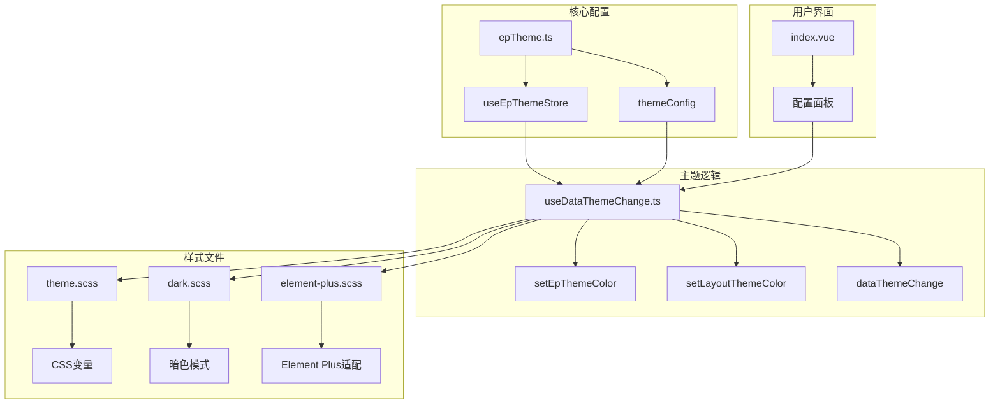
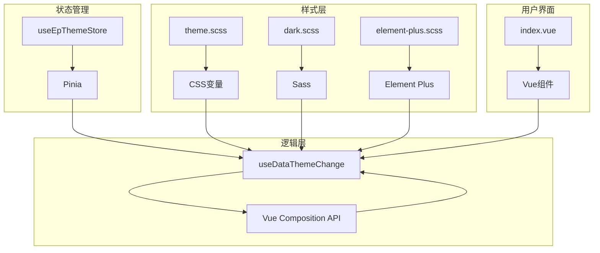
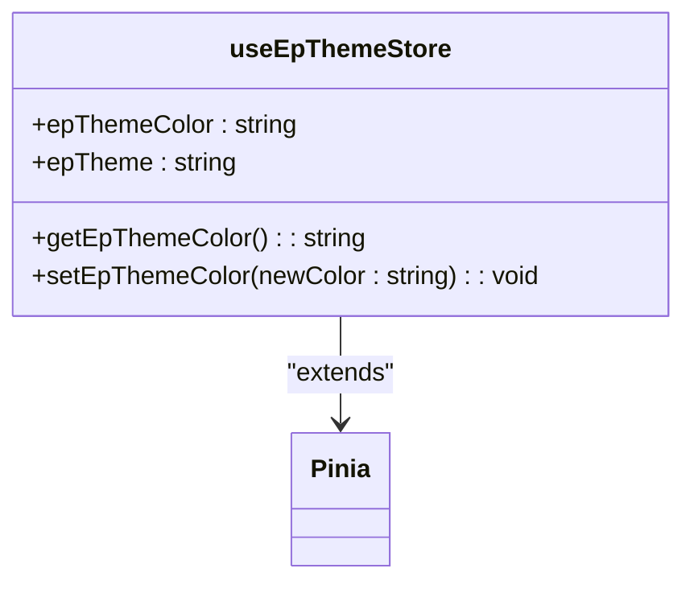
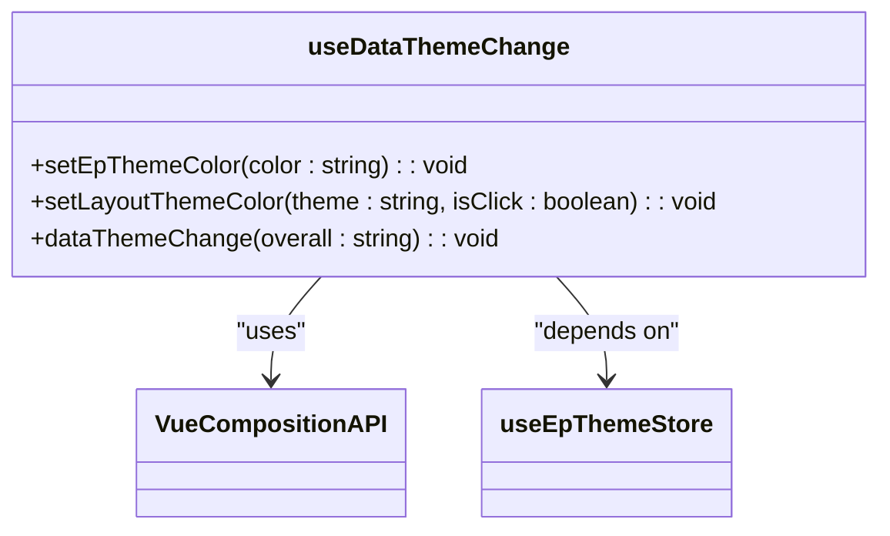
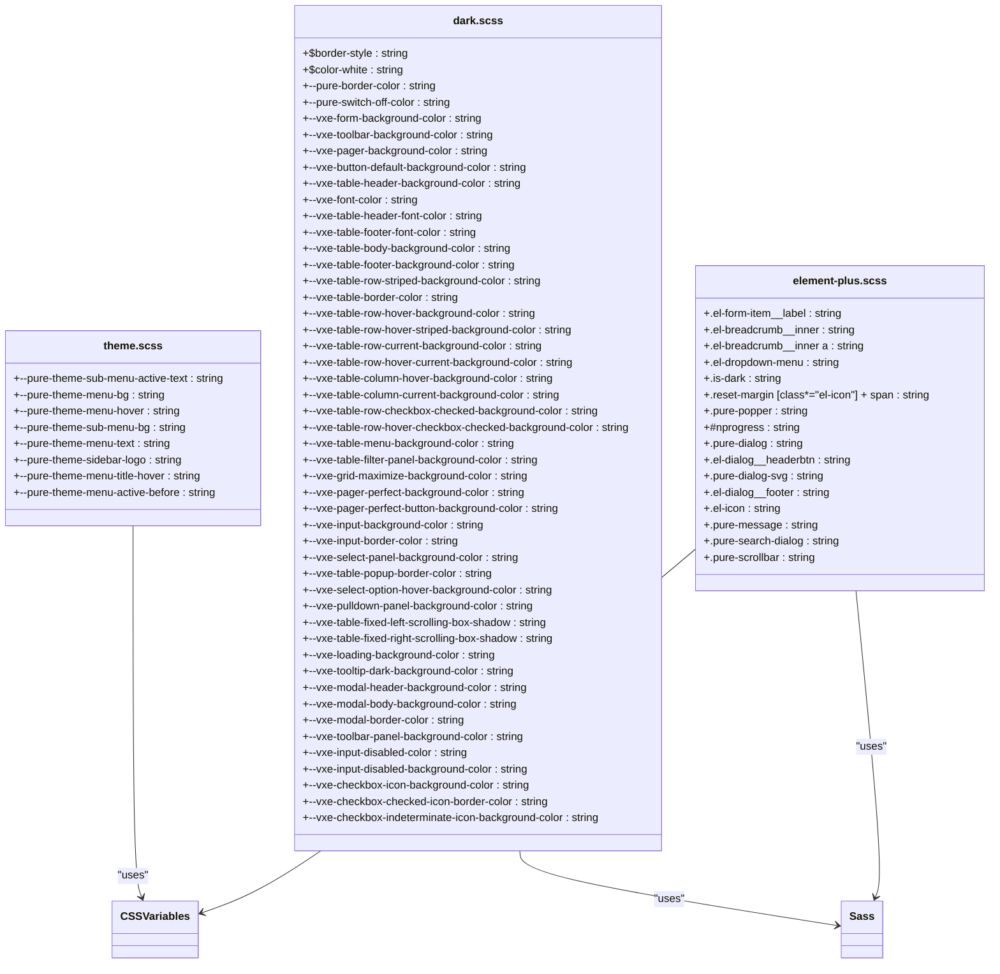
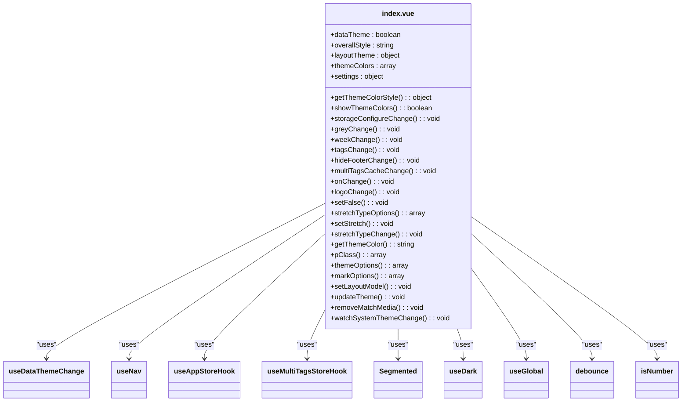
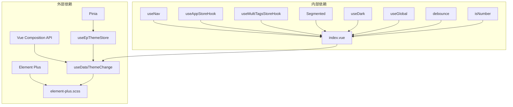

# 主题模块

<cite>
**Referenced Files in This Document**   
- [epTheme.ts](file://web/src/store/modules/epTheme.ts)
- [useDataThemeChange.ts](file://web/src/layout/hooks/useDataThemeChange.ts)
- [theme.scss](file://web/src/style/theme.scss)
- [dark.scss](file://web/src/style/dark.scss)
- [element-plus.scss](file://web/src/style/element-plus.scss)
- [index.vue](file://web/src/layout/components/lay-setting/index.vue)
- [elementPlus.ts](file://web/src/plugins/elementPlus.ts)
</cite>

## 目录
1. [简介](#简介)
2. [项目结构](#项目结构)
3. [核心组件](#核心组件)
4. [架构概述](#架构概述)
5. [详细组件分析](#详细组件分析)
6. [依赖分析](#依赖分析)
7. [性能考虑](#性能考虑)
8. [故障排除指南](#故障排除指南)
9. [结论](#结论)

## 简介
本文档详细阐述了vue-pure-admin-all项目中主题模块的实现机制，重点聚焦于Element Plus组件库的动态主题切换功能。文档深入解析了主题配置状态对象的结构，包括主题颜色、暗黑模式、布局颜色等配置项。同时，文档说明了`changePrimaryColor`、`toggleDarkMode`等操作如何修改主题配置并触发全局样式更新。此外，文档还阐述了CSS变量在主题切换中的应用机制，以及如何通过JavaScript动态注入样式。最后，文档提供了自定义主题颜色、持久化用户偏好设置的实现示例，并涵盖了主题热更新、与Element Plus组件库的深度集成以及性能优化策略，确保主题切换流畅无闪烁。

## 项目结构
主题模块的实现涉及多个文件和目录，主要分布在`web/src`目录下。核心的配置和状态管理位于`store/modules`目录下的`epTheme.ts`文件中，而主题切换的逻辑则封装在`layout/hooks`目录下的`useDataThemeChange.ts`文件中。样式文件则分散在`style`目录下的`theme.scss`、`dark.scss`和`element-plus.scss`文件中。用户界面的配置面板位于`layout/components/lay-setting`目录下的`index.vue`文件中。

**Diagram sources**
- [epTheme.ts](file://web/src/store/modules/epTheme.ts)
- [useDataThemeChange.ts](file://web/src/layout/hooks/useDataThemeChange.ts)
- [theme.scss](file://web/src/style/theme.scss)
- [dark.scss](file://web/src/style/dark.scss)
- [element-plus.scss](file://web/src/style/element-plus.scss)
- [index.vue](file://web/src/layout/components/lay-setting/index.vue)

**Section sources**
- [epTheme.ts](file://web/src/store/modules/epTheme.ts)
- [useDataThemeChange.ts](file://web/src/layout/hooks/useDataThemeChange.ts)
- [theme.scss](file://web/src/style/theme.scss)
- [dark.scss](file://web/src/style/dark.scss)
- [element-plus.scss](file://web/src/style/element-plus.scss)
- [index.vue](file://web/src/layout/components/lay-setting/index.vue)

## 核心组件
主题模块的核心组件包括`useEpThemeStore`、`useDataThemeChange`、`theme.scss`、`dark.scss`和`element-plus.scss`。`useEpThemeStore`是Pinia状态管理库中的一个store，用于管理主题相关的状态，如主题颜色和暗黑模式。`useDataThemeChange`是一个自定义的Vue Composition API hook，封装了主题切换的逻辑，包括设置主题颜色、切换暗黑模式等。`theme.scss`、`dark.scss`和`element-plus.scss`是三个样式文件，分别定义了亮色模式、暗色模式和Element Plus组件库的样式。

**Section sources**
- [epTheme.ts](file://web/src/store/modules/epTheme.ts)
- [useDataThemeChange.ts](file://web/src/layout/hooks/useDataThemeChange.ts)
- [theme.scss](file://web/src/style/theme.scss)
- [dark.scss](file://web/src/style/dark.scss)
- [element-plus.scss](file://web/src/style/element-plus.scss)

## 架构概述
主题模块的架构设计遵循了模块化和可扩展的原则。核心的配置和状态管理通过Pinia store实现，确保了状态的集中管理和可预测性。主题切换的逻辑通过自定义的Vue Composition API hook封装，提高了代码的复用性和可维护性。样式文件则通过CSS变量和Sass的特性实现了灵活的主题配置。用户界面的配置面板通过Vue组件实现，提供了直观的用户交互体验。

**Diagram sources**
- [epTheme.ts](file://web/src/store/modules/epTheme.ts)
- [useDataThemeChange.ts](file://web/src/layout/hooks/useDataThemeChange.ts)
- [theme.scss](file://web/src/style/theme.scss)
- [dark.scss](file://web/src/style/dark.scss)
- [element-plus.scss](file://web/src/style/element-plus.scss)
- [index.vue](file://web/src/layout/components/lay-setting/index.vue)

## 详细组件分析
### useEpThemeStore 分析
`useEpThemeStore`是Pinia状态管理库中的一个store，用于管理主题相关的状态。它定义了两个状态：`epThemeColor`和`epTheme`，分别表示主题颜色和主题模式。`epThemeColor`的初始值从本地存储中获取，如果不存在则使用默认值。`epTheme`的初始值同样从本地存储中获取，如果不存在则使用默认值。`useEpThemeStore`还定义了一个getter `getEpThemeColor`，用于获取当前的主题颜色。此外，`useEpThemeStore`还定义了一个action `setEpThemeColor`，用于设置新的主题颜色，并将新的主题颜色保存到本地存储中。

**Diagram sources**
- [epTheme.ts](file://web/src/store/modules/epTheme.ts)

**Section sources**
- [epTheme.ts](file://web/src/store/modules/epTheme.ts)

### useDataThemeChange 分析
`useDataThemeChange`是一个自定义的Vue Composition API hook，封装了主题切换的逻辑。它定义了多个函数，包括`setEpThemeColor`、`setLayoutThemeColor`、`dataThemeChange`等。`setEpThemeColor`函数用于设置新的主题颜色，并将新的主题颜色应用到Element Plus组件库中。`setLayoutThemeColor`函数用于设置导航主题色，并将新的主题色应用到页面的`data-theme`属性上。`dataThemeChange`函数用于切换浅色和深色整体风格，并根据当前的主题模式添加或移除`dark`类。

**Diagram sources**
- [useDataThemeChange.ts](file://web/src/layout/hooks/useDataThemeChange.ts)

**Section sources**
- [useDataThemeChange.ts](file://web/src/layout/hooks/useDataThemeChange.ts)

### 样式文件分析
`theme.scss`、`dark.scss`和`element-plus.scss`是三个样式文件，分别定义了亮色模式、暗色模式和Element Plus组件库的样式。`theme.scss`文件通过CSS变量定义了不同主题模式下的颜色值。`dark.scss`文件通过Sass的特性定义了暗色模式下的样式。`element-plus.scss`文件则通过CSS变量和Sass的特性定义了Element Plus组件库的样式。

**Diagram sources**
- [theme.scss](file://web/src/style/theme.scss)
- [dark.scss](file://web/src/style/dark.scss)
- [element-plus.scss](file://web/src/style/element-plus.scss)

**Section sources**
- [theme.scss](file://web/src/style/theme.scss)
- [dark.scss](file://web/src/style/dark.scss)
- [element-plus.scss](file://web/src/style/element-plus.scss)

### 用户界面分析
`index.vue`文件是用户界面的配置面板，通过Vue组件实现，提供了直观的用户交互体验。用户可以通过配置面板切换主题模式、设置主题颜色、开启或关闭灰色模式、色弱模式、隐藏标签页、隐藏页脚、持久化标签页等。

**Diagram sources**
- [index.vue](file://web/src/layout/components/lay-setting/index.vue)

**Section sources**
- [index.vue](file://web/src/layout/components/lay-setting/index.vue)

## 依赖分析
主题模块的实现依赖于多个外部库和内部模块。外部库包括Pinia、Vue Composition API、Element Plus等。内部模块包括`useNav`、`useAppStoreHook`、`useMultiTagsStoreHook`等。这些依赖关系确保了主题模块的正常运行和功能的完整性。

**Diagram sources**
- [epTheme.ts](file://web/src/store/modules/epTheme.ts)
- [useDataThemeChange.ts](file://web/src/layout/hooks/useDataThemeChange.ts)
- [element-plus.scss](file://web/src/style/element-plus.scss)
- [index.vue](file://web/src/layout/components/lay-setting/index.vue)

**Section sources**
- [epTheme.ts](file://web/src/store/modules/epTheme.ts)
- [useDataThemeChange.ts](file://web/src/layout/hooks/useDataThemeChange.ts)
- [element-plus.scss](file://web/src/style/element-plus.scss)
- [index.vue](file://web/src/layout/components/lay-setting/index.vue)

## 性能考虑
主题模块的实现考虑了性能优化，确保主题切换流畅无闪烁。通过使用CSS变量和Sass的特性，避免了频繁的DOM操作和样式重绘。同时，通过将主题配置持久化到本地存储中，减少了每次页面加载时的配置读取时间。此外，通过使用Vue Composition API的`ref`和`computed`，实现了响应式的数据绑定，提高了数据更新的效率。

## 故障排除指南
在使用主题模块时，可能会遇到一些常见问题。例如，主题切换后样式没有生效，可能是由于CSS变量没有正确应用到Element Plus组件库中。解决方法是检查`setEpThemeColor`函数是否正确调用了`useEpThemeStoreHook().setEpThemeColor(color)`。又如，暗色模式切换后页面背景没有变暗，可能是由于`dark`类没有正确添加到`document.documentElement`上。解决方法是检查`dataThemeChange`函数是否正确调用了`document.documentElement.classList.add("dark")`。

**Section sources**
- [useDataThemeChange.ts](file://web/src/layout/hooks/useDataThemeChange.ts)

## 结论
主题模块的实现通过模块化和可扩展的设计，确保了状态的集中管理和可预测性，提高了代码的复用性和可维护性。通过使用CSS变量和Sass的特性，实现了灵活的主题配置。通过将主题配置持久化到本地存储中，减少了每次页面加载时的配置读取时间。通过使用Vue Composition API的`ref`和`computed`，实现了响应式的数据绑定，提高了数据更新的效率。最终，主题模块的实现确保了主题切换流畅无闪烁，提供了良好的用户体验。