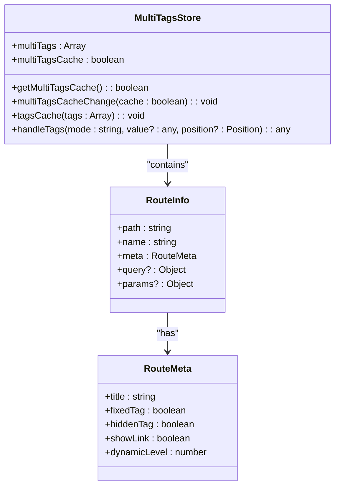
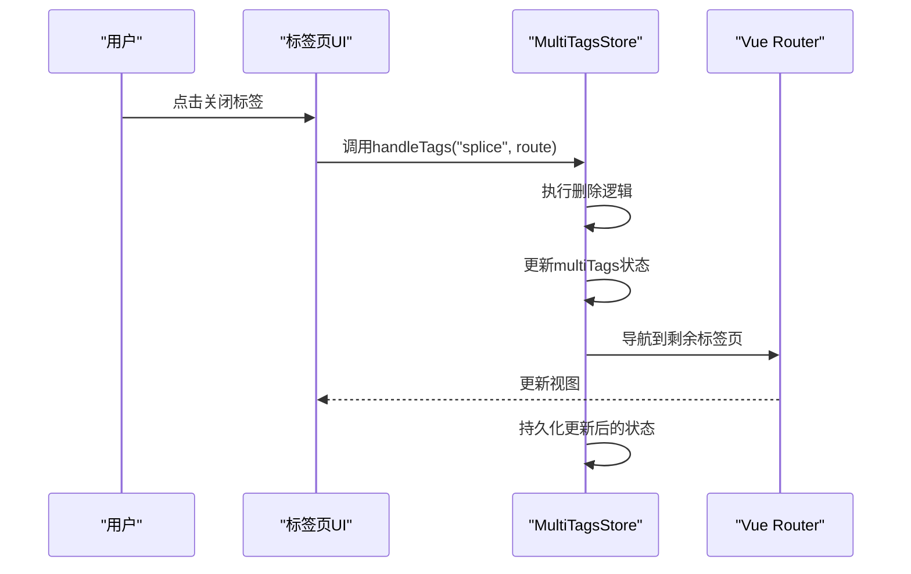
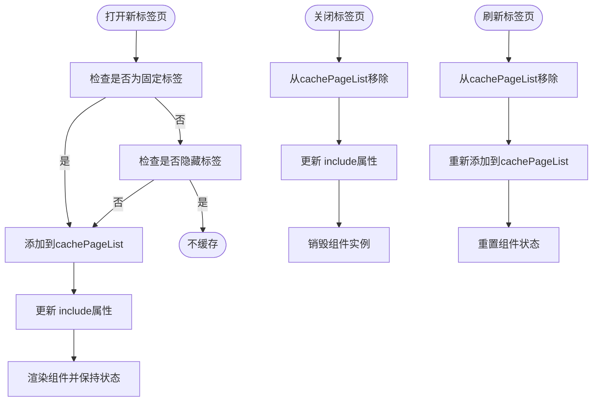

# 多标签模块

<cite>
**Referenced Files in This Document**   
- [multiTags.ts](file://web/src/store/modules/multiTags.ts)
- [lay-tag/index.vue](file://web/src/layout/components/lay-tag/index.vue)
- [useTag.ts](file://web/src/layout/hooks/useTag.ts)
- [permission.ts](file://web/src/store/modules/permission.ts)
- [utils.ts](file://web/src/router/utils.ts)
</cite>

## 目录
1. [简介](#简介)
2. [核心状态管理](#核心状态管理)
3. [标签页操作逻辑](#标签页操作逻辑)
4. [缓存机制与keep-alive集成](#缓存机制与keep-alive集成)
5. [UI渲染与交互实现](#ui渲染与交互实现)
6. [持久化策略](#持久化策略)
7. [边界情况处理](#边界情况处理)
8. [模块间协调机制](#模块间协调机制)
9. [实践示例](#实践示例)

## 简介

多标签模块是Vue Pure Admin系统中的核心导航组件，负责管理用户在应用中打开的多个路由视图。该模块通过`multiTags.ts`文件中的状态管理，实现了标签页的动态添加、删除、切换和持久化功能。系统通过`visitedViews`和`cachedViews`两个核心状态分别管理已访问的路由和需要缓存的视图组件，为用户提供流畅的多任务操作体验。

**Section sources**
- [multiTags.ts](file://web/src/store/modules/multiTags.ts#L1-L20)

## 核心状态管理

多标签模块的核心状态管理主要通过`multiTags.ts`文件中的Pinia store实现。该模块定义了两个关键状态：`multiTags`和`multiTagsCache`，分别对应已访问的路由视图和标签页缓存策略。

`multiTags`状态存储了所有已访问的路由信息，包括路径、名称、查询参数和路由元数据。这些信息用于在UI层渲染标签页，并支持用户在不同视图间快速切换。状态初始化时会包含固定的顶级菜单项和具有`fixedTag`属性的路由，确保核心功能始终可访问。

`multiTagsCache`状态则控制标签页的持久化行为。当该值为`true`时，系统会将标签页状态持久化到本地存储，用户刷新页面后可以恢复之前的标签页布局。这种设计平衡了用户体验和性能需求，允许用户根据实际场景选择是否启用标签页记忆功能。

**Diagram sources**
- [multiTags.ts](file://web/src/store/modules/multiTags.ts#L1-L50)

**Section sources**
- [multiTags.ts](file://web/src/store/modules/multiTags.ts#L1-L50)

## 标签页操作逻辑

多标签模块提供了丰富的标签页操作功能，包括添加、删除单个或多个标签页等。这些操作通过`handleTags`方法的不同模式参数实现，确保了代码的简洁性和可维护性。

### 添加视图操作

`addView`操作通过`handleTags`方法的`push`模式实现。当用户导航到新路由时，系统会执行一系列检查：验证路由是否允许显示在标签页中（通过`showLink`属性）、检查是否为外部链接、确保标题不为空，以及验证是否存在重复的路由实例。对于动态路由，系统还支持通过`dynamicLevel`属性限制同一动态路由的最大打开数量，超过限制时会自动替换最早的实例。

### 删除视图操作

`delView`操作通过`handleTags`方法的`splice`模式实现。系统支持多种删除策略：删除指定标签、删除左侧所有标签、删除右侧所有标签、删除其他标签以及删除全部标签。删除操作会自动更新缓存状态，并在删除当前激活标签时自动导航到剩余标签中的最后一个。

### 删除其他视图操作

`delOthersViews`操作是`delView`的特例，通过删除除固定标签和当前标签外的所有标签来实现。该操作会保留系统核心功能的访问路径，同时清理用户的临时工作空间，帮助用户专注于当前任务。

**Diagram sources**
- [multiTags.ts](file://web/src/store/modules/multiTags.ts#L50-L100)
- [lay-tag/index.vue](file://web/src/layout/components/lay-tag/index.vue#L200-L300)

**Section sources**
- [multiTags.ts](file://web/src/store/modules/multiTags.ts#L50-L100)
- [lay-tag/index.vue](file://web/src/layout/components/lay-tag/index.vue#L200-L300)

## 缓存机制与keep-alive集成

多标签模块的缓存机制通过与Vue的`<keep-alive>`组件深度集成实现。系统通过`permission.ts`文件中的`cachePageList`状态管理需要缓存的组件名称，`<keep-alive>`的`include`属性绑定到该状态，从而精确控制哪些视图组件需要保持活动状态。

当用户打开新标签页时，系统会调用`handleAliveRoute`函数，该函数通过`usePermissionStoreHook().cacheOperate`方法将组件名称添加到缓存列表中。当标签页被关闭时，相应的组件名称会从缓存列表中移除，触发`<keep-alive>`的销毁机制。对于标签页刷新操作，系统会先移除再重新添加组件名称，实现组件状态的重置。

这种设计确保了用户在标签页间切换时，组件状态得以保留，提升了用户体验。同时，通过精确的缓存管理，避免了不必要的内存占用，保证了应用的性能。

**Diagram sources**
- [permission.ts](file://web/src/store/modules/permission.ts#L50-L70)
- [utils.ts](file://web/src/router/utils.ts#L273-L305)

**Section sources**
- [permission.ts](file://web/src/store/modules/permission.ts#L50-L70)
- [utils.ts](file://web/src/router/utils.ts#L273-L305)

## UI渲染与交互实现

标签页的UI渲染由`lay-tag/index.vue`组件负责，该组件通过响应式数据绑定和事件处理机制，实现了丰富的用户交互功能。组件通过`useTags`钩子函数获取多标签模块的状态和操作方法，确保UI与状态管理的紧密耦合。

标签页支持多种显示模式，包括灵动模式、卡片模式和Chrome风格。用户可以通过右键菜单或下拉菜单执行各种操作，如刷新、关闭当前标签、关闭左侧/右侧标签、关闭其他标签等。组件还实现了标签页的滚动导航功能，当标签页数量超出容器宽度时，用户可以通过左右箭头按钮或鼠标滚轮进行导航。

交互方面，系统实现了平滑的滚动动画和视觉反馈效果。鼠标悬停时，标签页会显示激活状态的视觉效果，帮助用户确认操作目标。右键菜单的位置会根据鼠标位置动态调整，确保在各种屏幕尺寸下都能正常显示。

**Section sources**
- [lay-tag/index.vue](file://web/src/layout/components/lay-tag/index.vue#L1-L200)
- [useTag.ts](file://web/src/layout/hooks/useTag.ts#L1-L50)

## 持久化策略

多标签模块的持久化策略通过本地存储（localStorage）实现，确保用户刷新页面后能够恢复之前的标签页布局。持久化行为由`multiTagsCache`状态控制，用户可以在系统设置中启用或禁用此功能。

当`multiTagsCache`为`true`时，系统会在每次标签页状态变更后，将`multiTags`数组序列化并存储到`responsiveStorageNameSpace()tags`键下。存储的数据包含完整的路由信息，包括路径、名称、查询参数和路由元数据，确保恢复时能够精确重建标签页状态。

持久化策略还考虑了系统配置的同步。标签页显示模式（`showModel`）等UI相关设置也会被持久化，确保用户偏好设置在页面刷新后保持一致。这种全面的持久化设计为用户提供了无缝的使用体验。

**Section sources**
- [multiTags.ts](file://web/src/store/modules/multiTags.ts#L20-L40)
- [useTag.ts](file://web/src/layout/hooks/useTag.ts#L80-L100)

## 边界情况处理

多标签模块在设计时充分考虑了各种边界情况，确保系统的稳定性和用户体验。对于动态路由，系统通过`dynamicLevel`属性限制同一动态路由的最大实例数量，防止用户意外创建过多标签页导致性能问题。

当删除标签页导致当前路由不再存在时，系统会自动导航到剩余标签页中的最后一个，避免出现空白页面。对于固定标签（`fixedTag`为`true`的路由），系统禁止通过常规操作关闭，确保核心功能的可访问性。

系统还处理了路由参数的精确匹配问题。对于带有查询参数或路由参数的路由，系统会比较参数对象的相等性，而不是简单的路径匹配，确保具有不同参数的同一路径路由被视为不同的标签页实例。

**Section sources**
- [multiTags.ts](file://web/src/store/modules/multiTags.ts#L100-L130)
- [lay-tag/index.vue](file://web/src/layout/components/lay-tag/index.vue#L300-L400)

## 模块间协调机制

多标签模块通过事件总线和状态共享机制与其他模块保持协调。与路由模块的协调主要通过监听路由变化实现，当用户导航到新路由时，系统会自动更新标签页状态。

与权限模块的协调体现在标签页的显示控制上。系统会根据用户的权限动态调整可访问的路由，确保标签页只显示用户有权访问的视图。这种协调通过`usePermissionStoreHook().flatteningRoutes`实现，确保标签页状态与用户权限保持一致。

事件协调方面，系统使用mitt库实现跨组件通信。例如，侧边栏布局变化时会触发`changLayoutRoute`事件，通知标签页模块更新状态；标签页操作会触发`tagViewsChange`事件，通知其他组件响应标签页状态变化。

**Section sources**
- [multiTags.ts](file://web/src/store/modules/multiTags.ts#L140-L145)
- [lay-tag/index.vue](file://web/src/layout/components/lay-tag/index.vue#L500-L600)
- [utils.ts](file://web/src/router/utils.ts#L273-L305)

## 实践示例

在布局组件中使用多标签模块数据渲染标签栏的实践示例展示了如何将状态管理与UI渲染分离。`lay-tag/index.vue`组件通过`useTags`钩子获取`multiTags`状态，并使用`v-for`指令遍历渲染标签页。

每个标签页元素绑定点击事件处理函数`tagOnClick`，实现标签页切换功能。右键菜单通过`contextmenu`事件触发，显示操作选项。组件还实现了响应式设计，通过`useResizeObserver`监听容器尺寸变化，自动调整标签页布局。

对于复杂的交互逻辑，如标签页滚动和位置计算，系统封装了`moveToView`和`handleScroll`等辅助函数，确保代码的可维护性和复用性。这种分层设计模式使得多标签模块既功能强大又易于扩展和维护。

**Section sources**
- [lay-tag/index.vue](file://web/src/layout/components/lay-tag/index.vue#L400-L690)
- [useTag.ts](file://web/src/layout/hooks/useTag.ts#L150-L248)