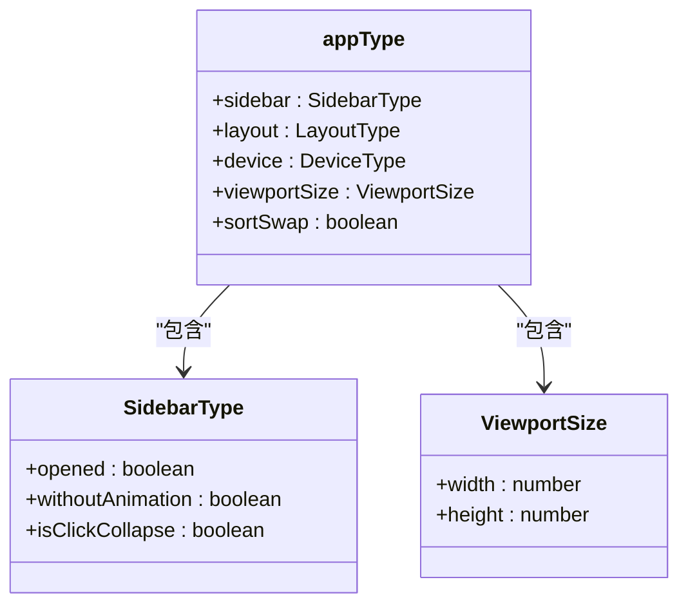
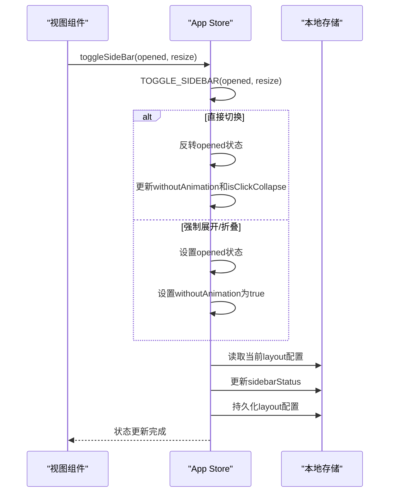
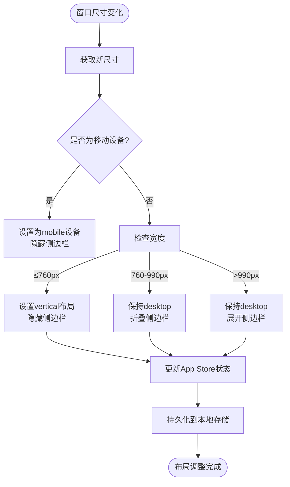
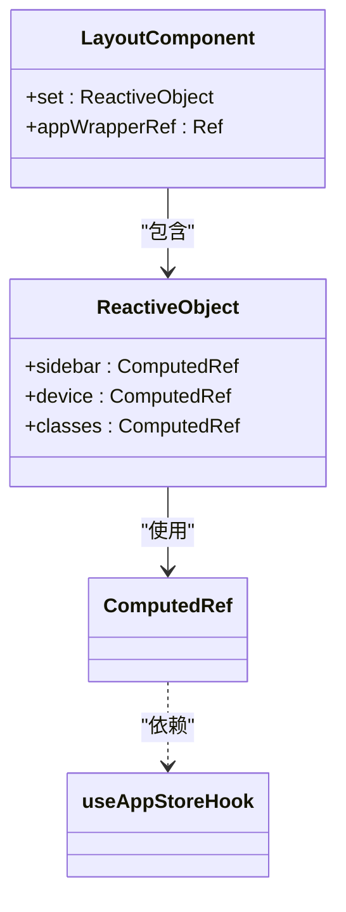

# 应用模块

<cite>
**Referenced Files in This Document**   
- [app.ts](file://src/store/modules/app.ts)
- [index.vue](file://src/layout/index.vue)
- [responsive.ts](file://src/utils/responsive.ts)
- [index.ts](file://src/config/index.ts)
</cite>

## 目录
1. [应用状态管理](#应用状态管理)
2. [核心Actions工作机制](#核心actions工作机制)
3. [响应式布局调整](#响应式布局调整)
4. [视图组件中的状态使用](#视图组件中的状态使用)
5. [副作用处理与模块交互](#副作用处理与模块交互)
6. [性能优化建议](#性能优化建议)

## 应用状态管理

应用模块通过Pinia状态管理库集中管理应用级UI状态。核心状态包括侧边栏展开状态、设备类型、界面动画控制以及视口尺寸等。

状态初始化时，从本地存储中读取持久化的布局配置，包括侧边栏的展开状态和当前布局模式。若存储中无配置，则使用默认配置。设备类型通过设备检测函数自动判断，初始化为"mobile"或"desktop"。视口尺寸则基于当前文档的可视区域大小进行初始化。

**Diagram sources**
- [app.ts](file://src/store/modules/app.ts#L10-L35)

**Section sources**
- [app.ts](file://src/store/modules/app.ts#L10-L35)

## 核心Actions工作机制

### toggleSidebar 机制

`toggleSideBar` action是控制侧边栏展开状态的核心方法，它通过调用内部的`TOGGLE_SIDEBAR`方法实现具体逻辑。该方法支持三种调用模式：

1. **直接切换模式**：当不传递参数时，执行常规的展开/折叠切换，同时更新动画状态和点击折叠标志。
2. **强制展开模式**：当传递`opened=true`和`resize="resize"`时，强制展开侧边栏且禁用动画效果。
3. **强制折叠模式**：当传递`opened=false`和`resize="resize"`时，强制折叠侧边栏且禁用动画效果。

每次状态变更后，新的侧边栏状态会被持久化到本地存储中，确保页面刷新后能恢复上次的状态。

**Diagram sources**
- [app.ts](file://src/store/modules/app.ts#L38-L65)

### toggleDevice 机制

`toggleDevice` action用于更新设备类型状态，接受一个字符串参数（"mobile"或"desktop"）并直接更新store中的device字段。此action主要用于响应窗口大小变化时的设备类型切换。

**Section sources**
- [app.ts](file://src/store/modules/app.ts#L75-L77)

## 响应式布局调整

应用模块通过监听窗口大小变化来驱动响应式布局调整。在布局根组件中，使用`useResizeObserver`监听应用容器的尺寸变化。

当检测到尺寸变化时，系统根据当前宽度执行不同的布局策略：
- **0-760px**：视为移动设备，隐藏侧边栏，切换为垂直布局。
- **760-990px**：中等屏幕，折叠侧边栏。
- **>990px**：大屏幕，展开侧边栏。

此过程通过调用`toggle`函数同时更新设备类型和侧边栏状态，确保UI与设备类型保持一致。

**Diagram sources**
- [index.vue](file://src/layout/index.vue#L83-L132)
- [app.ts](file://src/store/modules/app.ts#L75-L77)

**Section sources**
- [index.vue](file://src/layout/index.vue#L83-L132)

## 视图组件中的状态使用

在视图组件中，通过`useAppStoreHook`函数获取应用状态store的实例，然后可以访问状态、getter或调用actions。

### 状态监听示例

**Diagram sources**
- [index.vue](file://src/layout/index.vue#L36-L58)

### 最佳实践

1. **使用计算属性**：将store状态包装在计算属性中，确保响应式更新。
2. **批量状态更新**：当需要同时更新多个相关状态时，考虑创建组合函数。
3. **避免直接修改**：始终通过actions修改状态，而非直接修改state。

**Section sources**
- [index.vue](file://src/layout/index.vue#L36-L58)

## 副作用处理与模块交互

### 与布局模块的交互

应用状态模块与布局模块紧密协作。布局组件订阅应用状态的变化，并根据状态调整CSS类和布局行为。例如，当侧边栏状态变化时，布局组件会相应地添加或移除`hideSidebar`、`openSidebar`等CSS类。

### 持久化副作用

所有影响用户界面偏好的状态变更（如侧边栏状态、布局模式）都会触发持久化副作用，将最新配置保存到本地存储中。这通过`responsiveStorageNameSpace`函数确定存储命名空间，确保配置的隔离性和可管理性。

**Section sources**
- [app.ts](file://src/store/modules/app.ts#L50-L65)
- [responsive.ts](file://src/utils/responsive.ts#L5-L46)
- [index.ts](file://src/config/index.ts#L52-L52)

## 性能优化建议

1. **避免不必要的重渲染**：使用计算属性和`computed`包装store状态，利用Vue的响应式系统优化更新。
2. **节流窗口事件**：虽然当前使用`useResizeObserver`已较为高效，但在极端情况下可考虑添加节流。
3. **按需订阅**：组件只订阅所需的状态字段，避免订阅整个store对象。
4. **延迟初始化**：对于非关键状态，考虑延迟到需要时再初始化。
5. **批量更新**：当多个状态需要同时更新时，考虑在单个action中完成，减少触发更新的次数。

**Section sources**
- [app.ts](file://src/store/modules/app.ts)
- [index.vue](file://src/layout/index.vue)