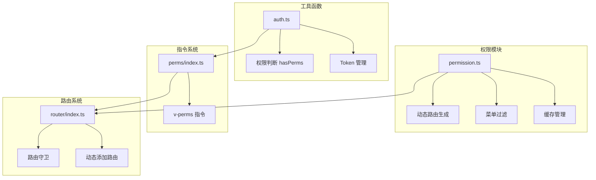
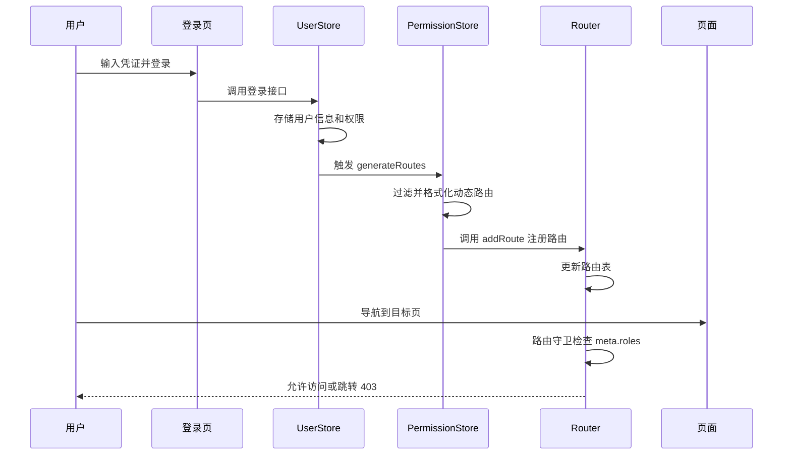
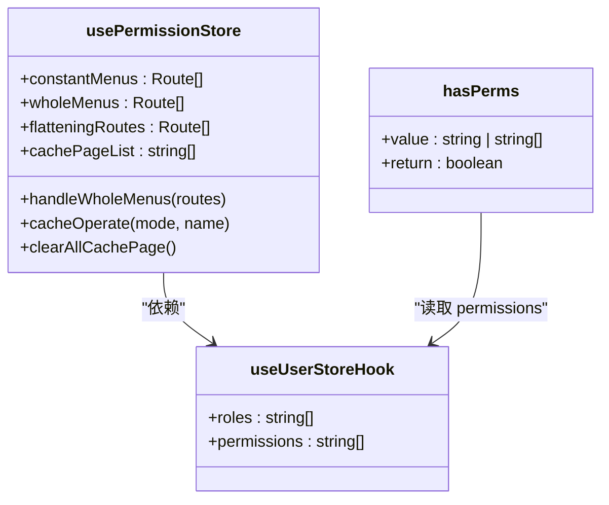
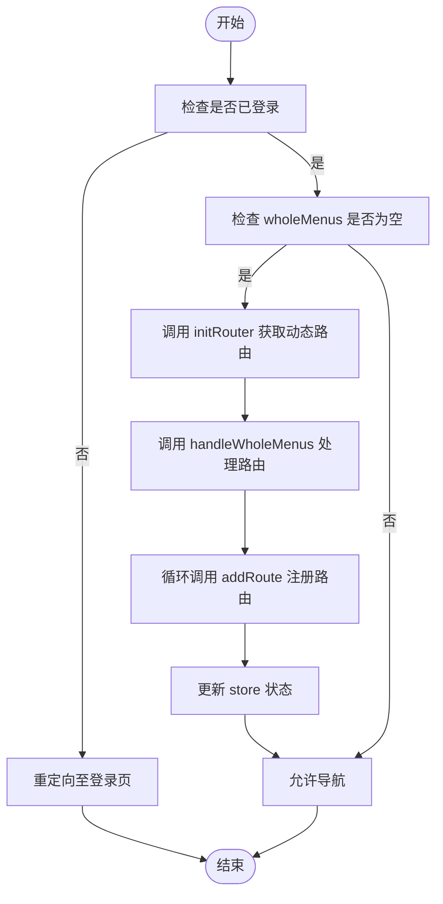
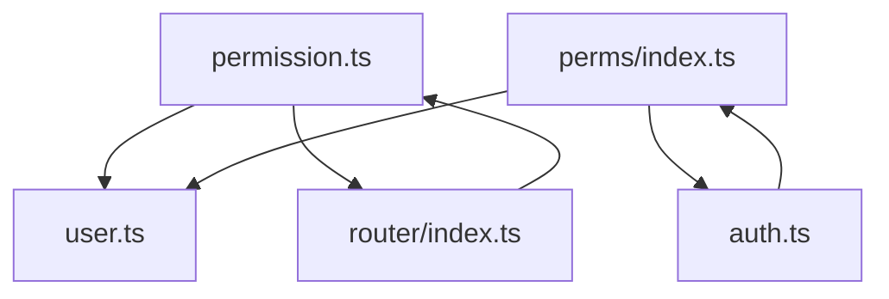

# 权限模块

<cite>
**本文档中引用的文件**  
- [permission.ts](file://web/src/store/modules/permission.ts)
- [auth.ts](file://web/src/utils/auth.ts)
- [index.ts](file://web/src/directives/perms/index.ts)
- [router/index.ts](file://web/src/router/index.ts)
- [asyncRoutes.ts](file://web/mock/asyncRoutes.ts)
</cite>

## 目录
1. [介绍](#介绍)
2. [项目结构](#项目结构)
3. [核心组件](#核心组件)
4. [架构概述](#架构概述)
5. [详细组件分析](#详细组件分析)
6. [依赖分析](#依赖分析)
7. [性能考虑](#性能考虑)
8. [故障排除指南](#故障排除指南)
9. [结论](#结论)

## 介绍
本项目是一个基于 Vue 的前端管理系统，重点在于实现细粒度的权限控制。权限模块是系统的核心部分，负责动态路由生成、页面级和按钮级访问控制。通过 `permission.ts` 中的状态管理与 Vue Router 深度集成，实现了基于角色的路由过滤和权限校验机制。同时，结合自定义指令 `v-perms` 实现了按钮级别的权限判断，确保用户只能看到其具备权限的操作项。

## 项目结构
项目采用模块化设计，权限相关逻辑主要分布在 `store/modules/permission.ts`、`utils/auth.ts` 和 `directives/perms/` 目录中。路由配置位于 `router/` 目录，静态路由通过自动导入 `modules/` 下的文件生成，动态路由由后端或 mock 数据提供。整体结构清晰，便于维护和扩展。

**Diagram sources**  
- [permission.ts](file://web/src/store/modules/permission.ts)
- [auth.ts](file://web/src/utils/auth.ts)
- [index.ts](file://web/src/directives/perms/index.ts)
- [router/index.ts](file://web/src/router/index.ts)

**Section sources**  
- [permission.ts](file://web/src/store/modules/permission.ts)
- [auth.ts](file://web/src/utils/auth.ts)

## 核心组件
权限模块的核心在于 `usePermissionStore` 的状态管理，包括 `routes` 和 `dynamicRoutes` 状态。`routes` 存储从服务端获取的原始动态路由数据，而 `dynamicRoutes` 则是经过权限过滤和格式化后可用于 Vue Router 的路由表。`generateRoutes` action 根据用户角色组装最终可访问的路由，并通过 `addRoute` 方法注册到 Vue Router 实例中。

**Section sources**  
- [permission.ts](file://web/src/store/modules/permission.ts)

## 架构概述
系统通过 Pinia 管理权限状态，结合 Vue Router 的导航守卫实现完整的权限控制流程。用户登录后，调用 `generateRoutes` 获取并处理动态路由，随后调用 `addRoute` 注册新路由。路由守卫在每次导航前检查目标路由的 `meta.roles` 字段，确保用户具有相应权限。按钮级权限通过 `v-perms` 指令调用 `hasPerms` 函数实现。

**Diagram sources**  
- [permission.ts](file://web/src/store/modules/permission.ts)
- [router/index.ts](file://web/src/router/index.ts)

## 详细组件分析
### 权限状态管理分析
`usePermissionStore` 定义了权限相关的状态和操作方法。`handleWholeMenus` 方法负责将静态和动态路由合并，并进行权限过滤和树形结构整理。`cacheOperate` 方法管理需要缓存的页面组件名称列表，支持添加、删除和刷新操作。`clearAllCachePage` 用于退出登录时清空所有缓存状态。

#### 类图

**Diagram sources**  
- [permission.ts](file://web/src/store/modules/permission.ts)
- [auth.ts](file://web/src/utils/auth.ts)

### 路由生成与注册流程
`generateRoutes` 并非直接暴露的方法，而是通过 `initRouter` 流程触发。当检测到 `wholeMenus` 为空且非登录页时，会调用 `initRouter` 异步获取动态路由并调用 `handleWholeMenus` 处理。处理后的路由通过 `router.addRoute` 逐个注册，确保 Vue Router 能识别新的路由路径。

#### 流程图

**Diagram sources**  
- [permission.ts](file://web/src/store/modules/permission.ts)
- [router/index.ts](file://web/src/router/index.ts)

## 依赖分析
权限模块高度依赖 `user` store 提供的用户角色和权限数据。`hasPerms` 工具函数是按钮权限判断的核心，被 `v-perms` 指令直接调用。路由系统通过 `router.beforeEach` 守卫依赖 `permission` store 的菜单数据进行权限校验。各模块之间职责分明，耦合度适中。

**Diagram sources**  
- [permission.ts](file://web/src/store/modules/permission.ts)
- [user.ts](file://web/src/store/modules/user.ts)
- [auth.ts](file://web/src/utils/auth.ts)
- [index.ts](file://web/src/directives/perms/index.ts)
- [router/index.ts](file://web/src/router/index.ts)

**Section sources**  
- [permission.ts](file://web/src/store/modules/permission.ts)
- [user.ts](file://web/src/store/modules/user.ts)
- [auth.ts](file://web/src/utils/auth.ts)
- [index.ts](file://web/src/directives/perms/index.ts)

## 性能考虑
路由处理过程中使用了 `debounce` 防抖函数来优化缓存页面的同步操作，避免频繁触发。`formatFlatteningRoutes` 和 `buildHierarchyTree` 等工具函数对路由数据进行高效转换，保证菜单渲染性能。建议在生产环境中控制动态路由数量，避免一次性加载过多路由导致初始化延迟。

## 故障排除指南
常见问题包括动态路由未显示、按钮权限不生效等。排查时应首先确认 `user` store 中的 `roles` 和 `permissions` 数据是否正确加载。检查 `meta.roles` 和 `meta.auths` 字段是否与用户权限匹配。若使用 `v-perms` 指令无效，需确认传入的权限码是否准确，且 `hasPerms` 函数能正确访问到用户权限数据。路由注册失败时，可检查 `addRoute` 调用时机是否在路由初始化之后。

**Section sources**  
- [auth.ts](file://web/src/utils/auth.ts)
- [index.ts](file://web/src/directives/perms/index.ts)
- [router/index.ts](file://web/src/router/index.ts)

## 结论
该权限模块设计合理，实现了从路由到按钮的全方位权限控制。通过 Pinia 状态管理、Vue Router 导航守卫和自定义指令的有机结合，构建了一个灵活且可扩展的权限体系。建议在实际使用中遵循最佳实践，如合理划分角色权限、避免过度嵌套路由、及时清理缓存状态等，以确保系统的稳定性和安全性。