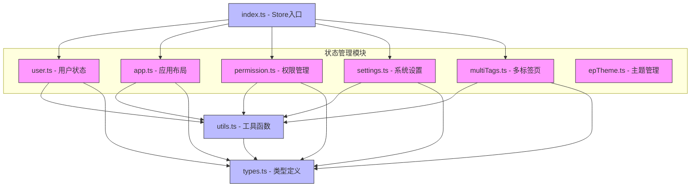
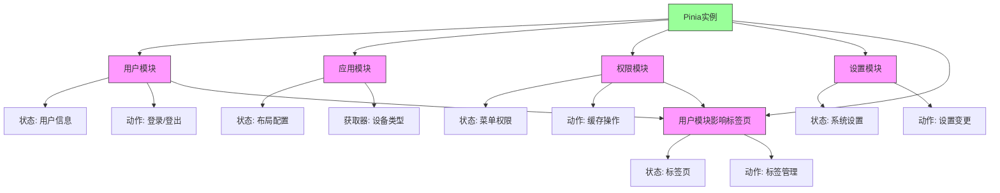
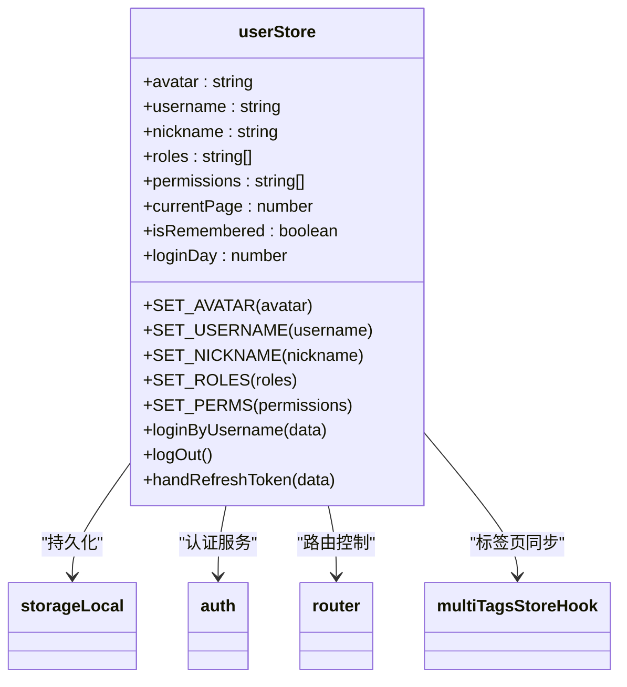
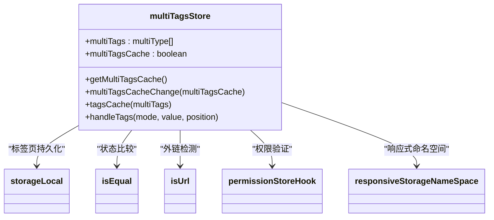
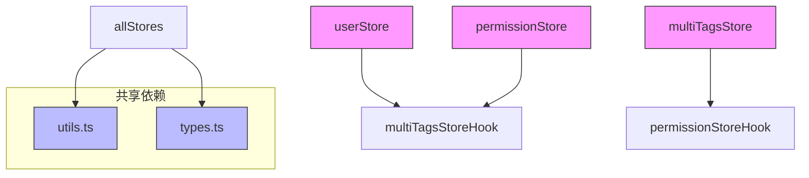

# 状态管理

<cite>
**本文档中引用的文件**  
- [user.ts](file://web/src/store/modules/user.ts)
- [app.ts](file://web/src/store/modules/app.ts)
- [permission.ts](file://web/src/store/modules/permission.ts)
- [settings.ts](file://web/src/store/modules/settings.ts)
- [multiTags.ts](file://web/src/store/modules/multiTags.ts)
- [index.ts](file://web/src/store/index.ts)
- [utils.ts](file://web/src/store/utils.ts)
- [types.ts](file://web/src/store/types.ts)
</cite>

## 目录
1. [项目结构](#项目结构)
2. [核心组件](#核心组件)
3. [架构概述](#架构概述)
4. [详细组件分析](#详细组件分析)
5. [依赖分析](#依赖分析)

## 项目结构

项目中的状态管理采用模块化设计，所有Pinia store模块集中存放在`src/store/modules`目录下，通过`src/store/index.ts`进行统一注册和初始化。这种结构实现了关注点分离，使每个模块专注于特定的业务功能。



**Diagram sources**
- [user.ts](file://web/src/store/modules/user.ts)
- [app.ts](file://web/src/store/modules/app.ts)
- [permission.ts](file://web/src/store/modules/permission.ts)
- [settings.ts](file://web/src/store/modules/settings.ts)
- [multiTags.ts](file://web/src/store/modules/multiTags.ts)
- [index.ts](file://web/src/store/index.ts)
- [utils.ts](file://web/src/store/utils.ts)
- [types.ts](file://web/src/store/types.ts)

**Section sources**
- [index.ts](file://web/src/store/index.ts)
- [modules](file://web/src/store/modules)

## 核心组件

项目采用Pinia作为状态管理解决方案，实现了模块化的store设计。核心组件包括用户(user)、应用(app)、权限(permission)、设置(settings)和多标签页(multiTags)等store模块，每个模块负责管理特定领域的状态。通过`setupStore`函数在应用启动时注册store实例，确保全局状态的统一管理和访问。

**Section sources**
- [index.ts](file://web/src/store/index.ts)
- [user.ts](file://web/src/store/modules/user.ts)
- [app.ts](file://web/src/store/modules/app.ts)
- [permission.ts](file://web/src/store/modules/permission.ts)
- [settings.ts](file://web/src/store/modules/settings.ts)
- [multiTags.ts](file://web/src/store/modules/multiTags.ts)

## 架构概述

系统的状态管理架构采用分层设计模式，顶层是Pinia实例，中间层是功能模块化的store，底层是类型定义和工具函数。各store模块通过定义清晰的状态(state)、动作(actions)和获取器(getters)来管理数据流。模块间通过导入和调用彼此的store hook函数实现通信，如权限模块依赖多标签页模块来同步标签页状态。



**Diagram sources**
- [index.ts](file://web/src/store/index.ts)
- [user.ts](file://web/src/store/modules/user.ts)
- [app.ts](file://web/src/store/modules/app.ts)
- [permission.ts](file://web/src/store/modules/permission.ts)
- [settings.ts](file://web/src/store/modules/settings.ts)
- [multiTags.ts](file://web/src/store/modules/multiTags.ts)

## 详细组件分析

### 用户模块分析

用户模块负责管理用户相关的状态信息，包括用户身份、权限和登录状态。该模块实现了完整的用户认证流程，从登录到登出的全生命周期管理。



**Diagram sources**
- [user.ts](file://web/src/store/modules/user.ts)

**Section sources**
- [user.ts](file://web/src/store/modules/user.ts)

### 应用模块分析

应用模块管理应用的UI布局和设备响应状态，包括侧边栏展开状态、设备类型和视口尺寸等。该模块实现了布局状态的持久化存储，确保用户设置在页面刷新后得以保留。

```mermaid
classDiagram
class appStore {
+sidebar : {opened, withoutAnimation, isClickCollapse}
+layout : string
+device : string
+viewportSize : {width, height}
+sortSwap : boolean
+getSidebarStatus()
+getDevice()
+getViewportWidth()
+getViewportHeight()
+TOGGLE_SIDEBAR(opened, resize)
+toggleSideBar(opened, resize)
+toggleDevice(device)
+setLayout(layout)
+setViewportSize(size)
+setSortSwap(val)
}
appStore --> storageLocal : "布局持久化"
appStore --> deviceDetection : "设备检测"
appStore --> responsiveStorageNameSpace : "响应式命名空间"
```

**Diagram sources**
- [app.ts](file://web/src/store/modules/app.ts)

**Section sources**
- [app.ts](file://web/src/store/modules/app.ts)

### 权限模块分析

权限模块负责路由权限和页面缓存的管理，根据用户角色动态生成菜单，并控制页面的缓存行为。该模块与多标签页模块紧密协作，确保权限变更时标签页状态的同步更新。

```mermaid
classDiagram
class permissionStore {
+constantMenus : any[]
+wholeMenus : any[]
+flatteningRoutes : any[]
+cachePageList : string[]
+handleWholeMenus(routes)
+cacheOperate({mode, name})
+clearAllCachePage()
}
permissionStore --> filterTree : "菜单过滤"
permissionStore --> ascending : "菜单排序"
permissionStore --> formatFlatteningRoutes : "路由扁平化"
permissionStore --> multiTagsStoreHook : "标签页同步"
permissionStore --> debounce : "防抖处理"
```

**Diagram sources**
- [permission.ts](file://web/src/store/modules/permission.ts)

**Section sources**
- [permission.ts](file://web/src/store/modules/permission.ts)

### 设置模块分析

设置模块管理应用的全局配置项，如页面标题、固定头部和侧边栏隐藏等UI设置。该模块提供了灵活的配置变更机制，支持动态修改应用外观。

```mermaid
classDiagram
class settingsStore {
+title : string
+fixedHeader : boolean
+hiddenSideBar : boolean
+getTitle()
+getFixedHeader()
+getHiddenSideBar()
+CHANGE_SETTING({key, value})
+changeSetting(data)
}
settingsStore --> getConfig : "获取默认配置"
```

**Diagram sources**
- [settings.ts](file://web/src/store/modules/settings.ts)

**Section sources**
- [settings.ts](file://web/src/store/modules/settings.ts)

### 多标签页模块分析

多标签页模块管理浏览器标签页的状态，支持标签页的增删改查操作和缓存功能。该模块实现了复杂的标签页管理逻辑，包括动态路由数量限制和缓存同步机制。



**Diagram sources**
- [multiTags.ts](file://web/src/store/modules/multiTags.ts)

**Section sources**
- [multiTags.ts](file://web/src/store/modules/multiTags.ts)

## 依赖分析

状态管理模块之间存在明确的依赖关系，形成了一个协作网络。通过分析模块间的导入和调用关系，可以清晰地看到数据流的走向和模块间的耦合程度。



**Diagram sources**
- [user.ts](file://web/src/store/modules/user.ts)
- [permission.ts](file://web/src/store/modules/permission.ts)
- [multiTags.ts](file://web/src/store/modules/multiTags.ts)
- [utils.ts](file://web/src/store/utils.ts)
- [types.ts](file://web/src/store/types.ts)

**Section sources**
- [user.ts](file://web/src/store/modules/user.ts)
- [permission.ts](file://web/src/store/modules/permission.ts)
- [multiTags.ts](file://web/src/store/modules/multiTags.ts)
- [utils.ts](file://web/src/store/utils.ts)
- [types.ts](file://web/src/store/types.ts)