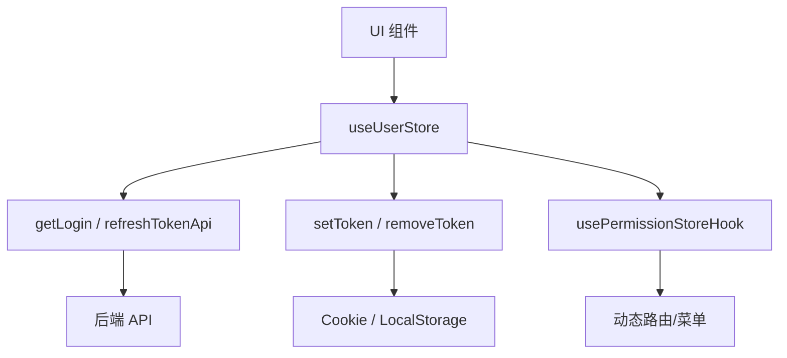
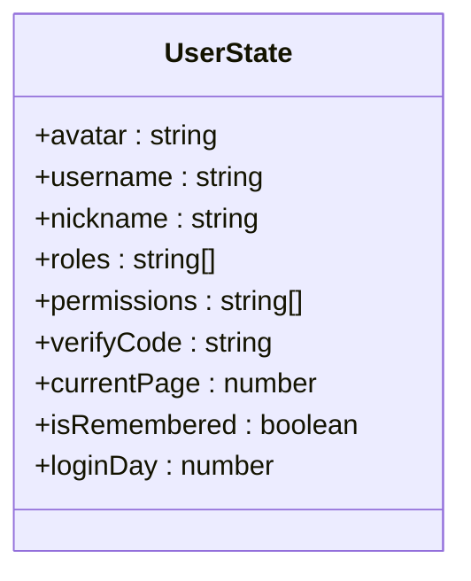
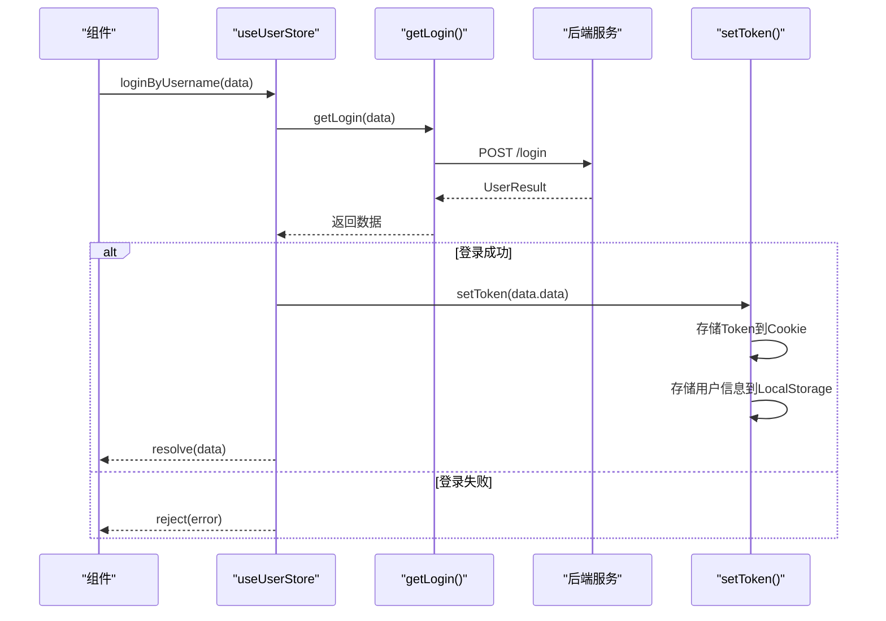
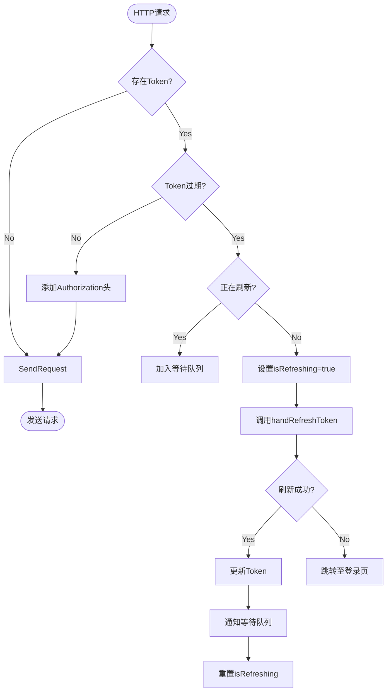
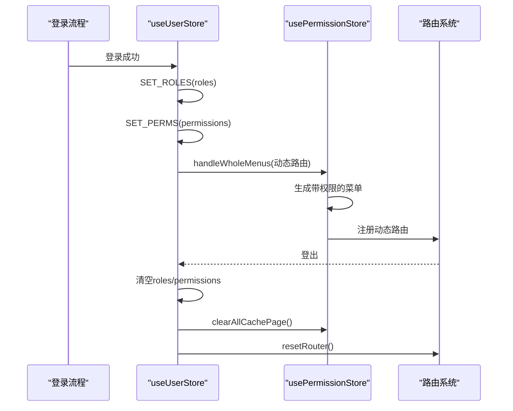
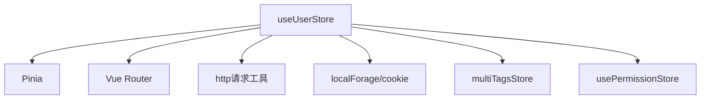

# 用户模块

<cite>
**本文档引用的文件**
- [user.ts](file://web/src/store/modules/user.ts)
- [user.ts](file://web/src/api/user.ts)
- [auth.ts](file://web/src/utils/auth.ts)
- [permission.ts](file://web/src/store/modules/permission.ts)
- [index.ts](file://web/src/store/index.ts)
</cite>

## 目录
1. [简介](#简介)
2. [项目结构](#项目结构)
3. [核心组件](#核心组件)
4. [架构概述](#架构概述)
5. [详细组件分析](#详细组件分析)
6. [依赖分析](#依赖分析)
7. [性能考虑](#性能考虑)
8. [故障排除指南](#故障排除指南)
9. [结论](#结论)

## 简介
本文档详细描述了基于 Pinia 的用户状态管理模块，重点分析 `user.ts` 中的 store 实现。涵盖用户信息、token、角色权限等状态字段的设计与用途，登录、登出、获取用户信息等核心 actions 的实现逻辑及其与 API 的交互方式，getters 在权限判断和用户数据派生中的应用，以及模块的初始化流程、持久化策略和与其他模块（如 permission）的协作关系。

## 项目结构
用户模块的状态管理实现位于 `web/src/store/modules/user.ts`，其 API 接口定义在 `web/src/api/user.ts`。用户相关工具函数（如 token 处理）封装在 `web/src/utils/auth.ts`。该模块与权限模块 `permission.ts` 协同工作，共同实现完整的用户认证与授权功能。

```mermaid
graph TB
subgraph "状态管理"
UserStore["user.ts (Pinia Store)"]
PermissionStore["permission.ts"]
end
subgraph "API 接口"
UserAPI["user.ts (API 定义)"]
end
subgraph "工具函数"
AuthUtils["auth.ts (Token/认证)"]
end
UserStore --> UserAPI : "调用"
UserStore --> AuthUtils : "依赖"
UserStore --> PermissionStore : "协作"
```

**Diagram sources**
- [user.ts](file://web/src/store/modules/user.ts)
- [user.ts](file://web/src/api/user.ts)
- [auth.ts](file://web/src/utils/auth.ts)
- [permission.ts](file://web/src/store/modules/permission.ts)

**Section sources**
- [user.ts](file://web/src/store/modules/user.ts)
- [user.ts](file://web/src/api/user.ts)

## 核心组件
用户模块的核心是 `useUserStore`，一个使用 Pinia 定义的状态管理 store。它负责管理用户登录状态、身份信息、权限数据，并提供登录、登出、刷新 token 等核心操作。该 store 与 API 层和本地存储紧密集成，确保了用户状态的持久化和安全性。

**Section sources**
- [user.ts](file://web/src/store/modules/user.ts)
- [auth.ts](file://web/src/utils/auth.ts)

## 架构概述
用户模块采用分层架构，上层为 Pinia Store，负责状态定义和业务逻辑；中层为 API 接口层，负责与后端通信；底层为工具函数层，提供通用的认证和存储功能。这种设计实现了关注点分离，提高了代码的可维护性和可测试性。



**Diagram sources**
- [user.ts](file://web/src/store/modules/user.ts)
- [user.ts](file://web/src/api/user.ts)
- [auth.ts](file://web/src/utils/auth.ts)
- [permission.ts](file://web/src/store/modules/permission.ts)

## 详细组件分析

### 用户状态管理分析
`useUserStore` 定义了用户相关的所有状态字段，并通过 actions 进行管理。

#### 状态字段定义


**Diagram sources**
- [user.ts](file://web/src/store/modules/user.ts#L10-L35)

**Section sources**
- [user.ts](file://web/src/store/modules/user.ts#L10-L35)

#### 核心 Actions 实现
核心 actions 负责与 API 交互并更新状态。



**Diagram sources**
- [user.ts](file://web/src/store/modules/user.ts#L82-L95)
- [user.ts](file://web/src/api/user.ts#L48-L51)
- [auth.ts](file://web/src/utils/auth.ts#L36-L57)

#### Token 刷新机制
当 token 过期时，系统会自动触发刷新流程。



**Diagram sources**
- [http/index.ts](file://web/src/utils/http/index.ts#L74-L108)
- [user.ts](file://web/src/store/modules/user.ts#L102-L120)

### 权限模块协作分析
用户模块与权限模块紧密协作，共同控制应用的访问权限。



**Diagram sources**
- [user.ts](file://web/src/store/modules/user.ts#L97-L100)
- [permission.ts](file://web/src/store/modules/permission.ts#L15-L25)

**Section sources**
- [user.ts](file://web/src/store/modules/user.ts)
- [permission.ts](file://web/src/store/modules/permission.ts)

## 依赖分析
用户模块依赖于多个内部和外部组件。



**Diagram sources**
- [user.ts](file://web/src/store/modules/user.ts#L2-L7)
- [index.ts](file://web/src/store/index.ts)
- [permission.ts](file://web/src/store/modules/permission.ts)

**Section sources**
- [user.ts](file://web/src/store/modules/user.ts)
- [index.ts](file://web/src/store/index.ts)

## 性能考虑
用户模块在性能方面主要考虑以下几点：
- **无感刷新**：通过拦截 HTTP 请求，自动处理 token 刷新，避免用户感知到登录失效。
- **状态持久化**：利用 Cookie 和 LocalStorage 实现免登录和用户信息持久化，减少重复请求。
- **内存管理**：登出时清空相关状态和缓存，避免内存泄漏。

## 故障排除指南
本节提供用户模块常见问题的解决方案。

**Section sources**
- [user.ts](file://web/src/store/modules/user.ts)
- [auth.ts](file://web/src/utils/auth.ts)
- [http/index.ts](file://web/src/utils/http/index.ts)

### 状态失效问题
**问题**：页面刷新后用户状态丢失。
**原因**：`storageLocal()` 或 `Cookies` 中的数据未正确读取。
**解决方案**：
1. 检查 `auth.ts` 中的 `getToken()` 和 `userKey` 是否正确。
2. 确认浏览器未禁用 Cookie 或 LocalStorage。
3. 验证 `user.ts` 中 state 的初始化逻辑。

### Token 刷新失败
**问题**：token 过期后无法自动刷新，用户被强制登出。
**原因**：
1. `refreshToken` 本身已过期或无效。
2. 后端 `/refresh-token` 接口返回失败。
3. 网络请求被拦截。
**解决方案**：
1. 检查 `refreshTokenApi` 调用的参数是否正确传递了 `refreshToken`。
2. 查看浏览器开发者工具的 Network 面板，确认请求和响应。
3. 确保后端服务正常运行，并检查相关日志。

## 结论
`user.ts` 中的 Pinia store 实现了一个功能完整、设计良好的用户状态管理系统。它通过清晰的状态定义、合理的 actions 逻辑、与 API 的有效交互以及与其他模块的紧密协作，为应用提供了稳定可靠的用户认证和授权基础。其无感刷新机制和持久化策略显著提升了用户体验。