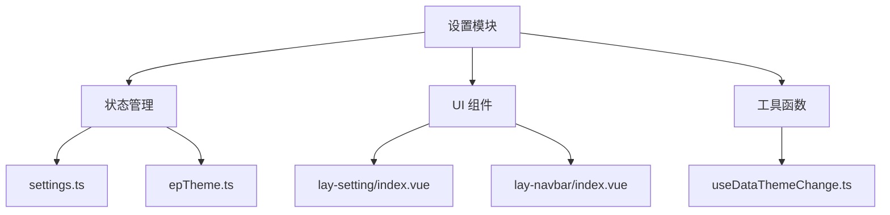
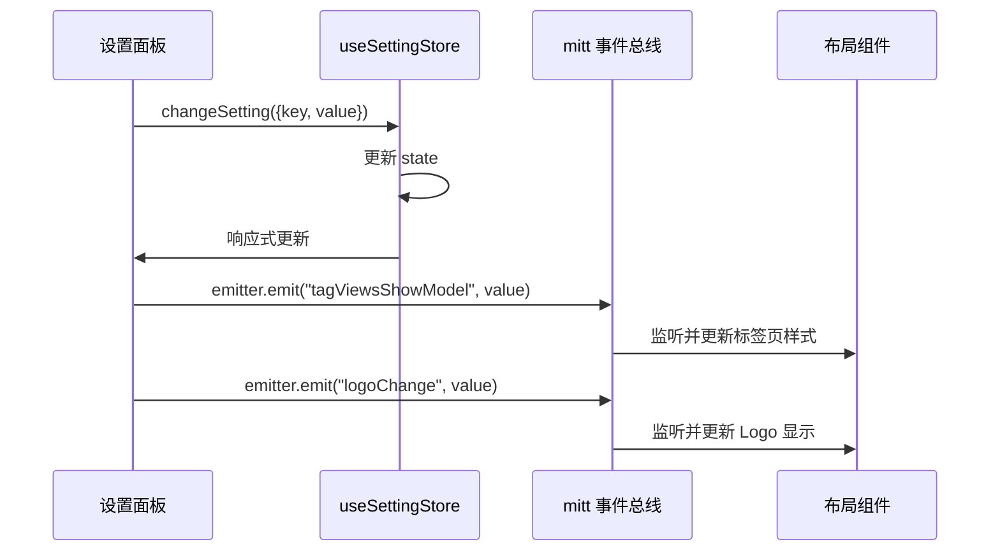
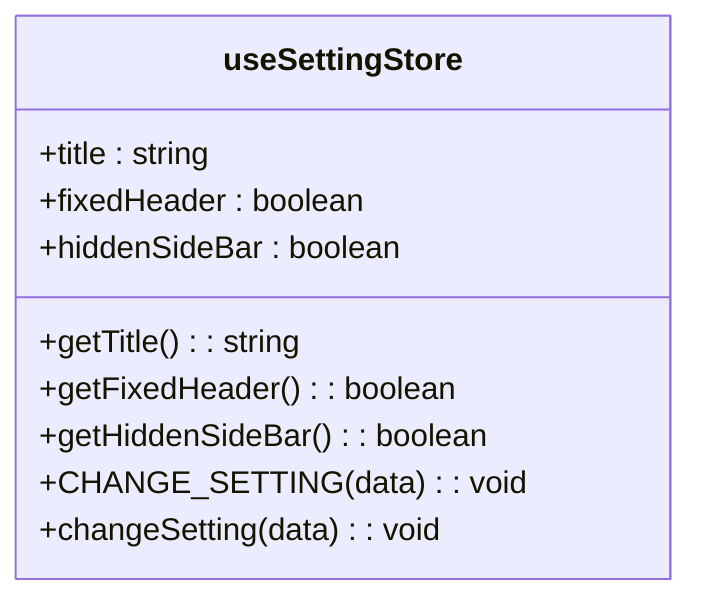
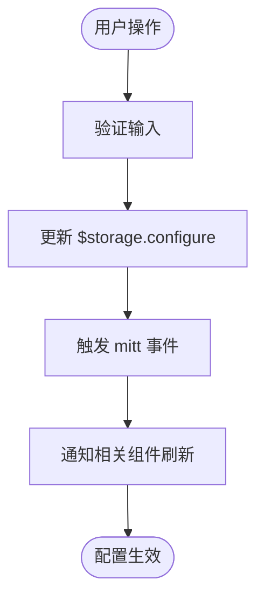
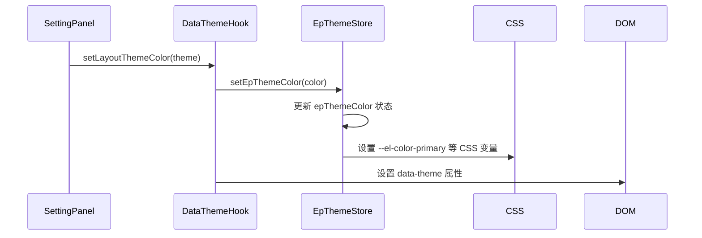

# 设置模块

<cite>
**本文档引用文件**  
- [settings.ts](file://web/src/store/modules/settings.ts)
- [epTheme.ts](file://web/src/store/modules/epTheme.ts)
- [lay-setting/index.vue](file://web/src/layout/components/lay-setting/index.vue)
- [lay-navbar/index.vue](file://web/src/layout/components/lay-navbar/index.vue)
- [index.vue](file://web/src/layout/index.vue)
- [useDataThemeChange.ts](file://web/src/layout/hooks/useDataThemeChange.ts)
</cite>

## 目录
1. [简介](#简介)
2. [项目结构](#项目结构)
3. [核心组件](#核心组件)
4. [架构概述](#架构概述)
5. [详细组件分析](#详细组件分析)
6. [依赖分析](#依赖分析)
7. [性能考虑](#性能考虑)
8. [故障排除指南](#故障排除指南)
9. [结论](#结论)

## 简介
本模块负责管理系统运行时的全局配置项，包括网站标题、布局模式、标签页样式、主题风格等。通过 Pinia 状态管理实现配置的集中存储与响应式更新，并结合本地存储实现持久化。配置变更后通过事件总线通知相关组件进行界面刷新，确保系统一致性。

## 项目结构
设置模块主要由状态管理、UI 组件和工具函数三部分构成，分布于 `store/modules`、`layout/components` 和 `layout/hooks` 目录中。



**图示来源**  
- [settings.ts](file://web/src/store/modules/settings.ts)
- [epTheme.ts](file://web/src/store/modules/epTheme.ts)
- [lay-setting/index.vue](file://web/src/layout/components/lay-setting/index.vue)
- [useDataThemeChange.ts](file://web/src/layout/hooks/useDataThemeChange.ts)

**本节来源**  
- [web/src/store/modules](file://web/src/store/modules)
- [web/src/layout/components](file://web/src/layout/components)
- [web/src/layout/hooks](file://web/src/layout/hooks)

## 核心组件
`settings.ts` 定义了系统核心配置项的状态模型，包括网站标题、头部固定、侧边栏隐藏等。这些配置通过 `getConfig()` 从项目配置文件初始化，并支持运行时动态更新。`epTheme.ts` 则专门管理 Element Plus 主题色，与整体布局主题协同工作。

**本节来源**  
- [settings.ts](file://web/src/store/modules/settings.ts#L3-L30)
- [epTheme.ts](file://web/src/store/modules/epTheme.ts#L3-L20)

## 架构概述
系统采用分层架构，上层 UI 组件（如设置面板、导航栏）通过 Pinia Store 访问和修改配置状态。状态变更自动触发视图更新，同时通过 mitt 事件总线广播关键配置变化（如标签页显示模式、Logo 显示状态），确保跨组件同步。



**图示来源**  
- [settings.ts](file://web/src/store/modules/settings.ts#L20-L30)
- [lay-setting/index.vue](file://web/src/layout/components/lay-setting/index.vue#L100-L150)
- [index.vue](file://web/src/layout/index.vue#L100-L120)

## 详细组件分析

### 设置状态管理分析
`useSettingStore` 使用 Pinia 定义全局配置状态，通过 `CHANGE_SETTING` action 实现安全的动态更新。该 action 使用 `Reflect.has` 检查属性存在性，防止非法写入。



**图示来源**  
- [settings.ts](file://web/src/store/modules/settings.ts#L3-L30)

### 设置面板组件分析
`lay-setting/index.vue` 是用户配置界面，提供可视化选项。它直接读取 `$storage.configure` 中的持久化配置，并在用户操作时通过 `storageConfigureChange` 函数更新本地存储，同时触发相应的事件通知其他组件。



**图示来源**  
- [lay-setting/index.vue](file://web/src/layout/components/lay-setting/index.vue#L50-L200)

### 主题与布局协同分析
`useDataThemeChange` 钩子函数桥接了布局主题与 Element Plus 主题。当用户更改布局主题时，不仅更新 `data-theme` 属性，还同步调用 `setEpThemeColor` 更新 Element Plus 的 CSS 变量，实现视觉风格的统一。



**图示来源**  
- [useDataThemeChange.ts](file://web/src/layout/hooks/useDataThemeChange.ts#L50-L100)
- [epTheme.ts](file://web/src/store/modules/epTheme.ts#L20-L30)

**本节来源**  
- [settings.ts](file://web/src/store/modules/settings.ts)
- [epTheme.ts](file://web/src/store/modules/epTheme.ts)
- [lay-setting/index.vue](file://web/src/layout/components/lay-setting/index.vue)
- [useDataThemeChange.ts](file://web/src/layout/hooks/useDataThemeChange.ts)

## 依赖分析
设置模块依赖于 Pinia 进行状态管理，依赖于 `@pureadmin/utils` 提供的 `mitt` 事件总线和 `storageLocal` 持久化工具。UI 组件依赖 Element Plus 和自定义组件库（如 ReSegmented）。各模块间通过清晰的接口（Store API、事件名）进行通信，耦合度低。

```mermaid
graph LR
A[设置模块] --> B[Pinia]
A --> C[@pureadmin/utils]
A --> D[Element Plus]
A --> E[ReSegmented]
C --> F[mitt]
C --> G[storageLocal]
```

**图示来源**  
- [settings.ts](file://web/src/store/modules/settings.ts#L1-L2)
- [lay-setting/index.vue](file://web/src/layout/components/lay-setting/index.vue#L1-L20)
- [useDataThemeChange.ts](file://web/src/layout/hooks/useDataThemeChange.ts#L1-L10)

**本节来源**  
- [settings.ts](file://web/src/store/modules/settings.ts)
- [lay-setting/index.vue](file://web/src/layout/components/lay-setting/index.vue)
- [useDataThemeChange.ts](file://web/src/layout/hooks/useDataThemeChange.ts)

## 性能考虑
配置项均采用响应式设计，确保视图高效更新。频繁触发的事件（如窗口大小变化）使用 `debounce` 防抖处理。主题色切换通过直接操作 CSS 变量实现，避免了全量样式重载，性能开销极小。

## 故障排除指南
- **配置不生效**：检查 `CHANGE_SETTING` action 中的 `key` 是否存在于 state 定义中。
- **主题色未更新**：确认 `setEpThemeColor` 是否被正确调用，并检查浏览器开发者工具中的 CSS 变量。
- **持久化失败**：验证 `storageLocal` 是否正常工作，检查浏览器本地存储权限。
- **事件未监听**：确保组件在 `onMounted` 或 `onBeforeMount` 钩子中正确注册了 mitt 事件监听器。

**本节来源**  
- [settings.ts](file://web/src/store/modules/settings.ts#L20-L30)
- [epTheme.ts](file://web/src/store/modules/epTheme.ts#L30-L40)
- [lay-setting/index.vue](file://web/src/layout/components/lay-setting/index.vue#L100-L200)

## 结论
设置模块通过 Pinia + mitt + localStorage 的组合，实现了配置管理的集中化、响应式和持久化。其清晰的分层和低耦合设计，使得开发者可以轻松扩展新的配置项或定制现有行为，是系统可配置性和用户体验的重要保障。