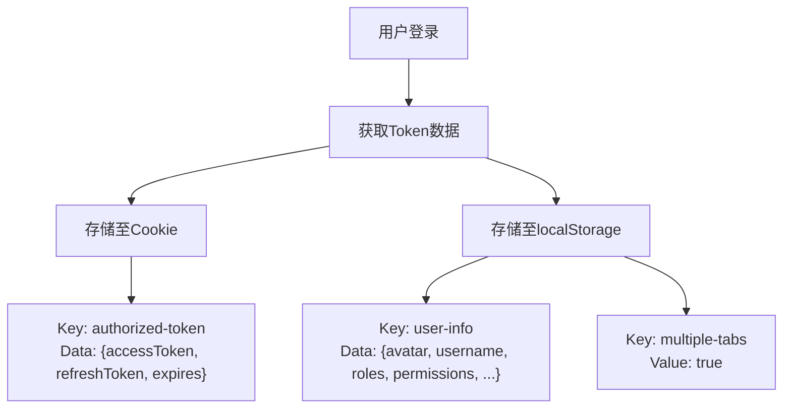
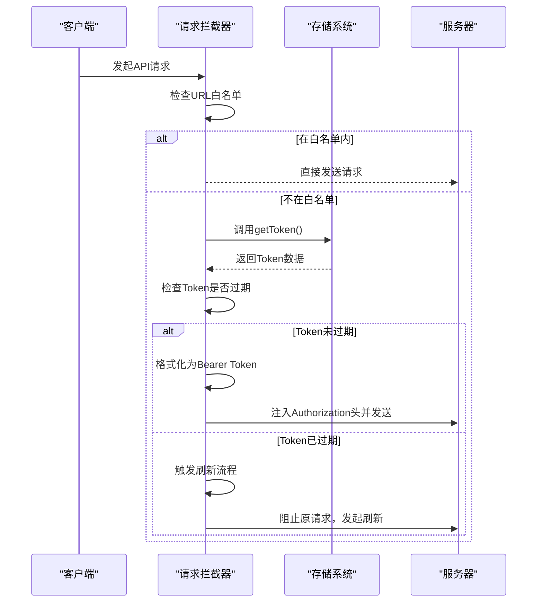
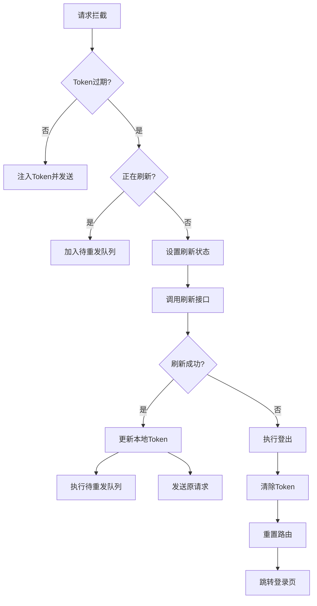
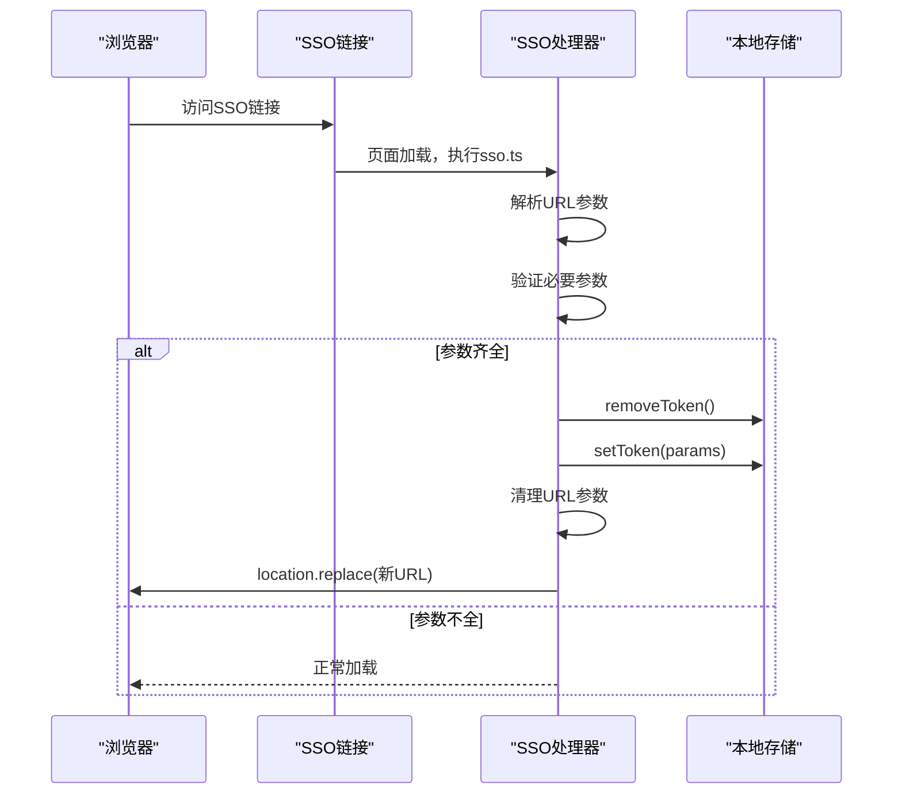

# Token管理

<cite>
**本文档引用文件**  
- [auth.ts](file://web/src/utils/auth.ts)
- [sso.ts](file://web/src/utils/sso.ts)
- [http/index.ts](file://web/src/utils/http/index.ts)
- [user.ts](file://web/src/store/modules/user.ts)
- [localforage/index.ts](file://web/src/utils/localforage/index.ts)
</cite>

## 目录
1. [引言](#引言)
2. [Token存储机制](#token存储机制)
3. [Token注入与请求拦截](#token注入与请求拦截)
4. [Token过期处理与静默刷新](#token过期处理与静默刷新)
5. [单点登录（SSO）支持](#单点登录sso支持)
6. [Token操作工具函数](#token操作工具函数)
7. [安全最佳实践](#安全最佳实践)
8. [总结](#总结)

## 引言
本文档详细说明了Vue Pure Admin项目中认证令牌（Token）的全生命周期管理策略。系统采用JWT（JSON Web Token）作为主要认证机制，结合`accessToken`和`refreshToken`实现安全、无感的用户会话管理。文档涵盖Token的存储、自动注入、过期处理、单点登录同步以及安全防护等核心方面，旨在为开发者提供清晰的实现逻辑和最佳实践指导。

## Token存储机制
系统采用混合存储策略，结合Cookie和本地存储（localStorage）的优势，实现Token的安全与持久化管理。

- **`accessToken` 存储于 Cookie**：  
  使用名为 `authorized-token` 的Cookie存储`accessToken`、`refreshToken`和过期时间戳。Cookie的自动过期机制确保Token在有效期内可用，过期后自动清除，避免长期驻留。

- **用户信息与Token元数据存储于 localStorage**：  
  用户头像、用户名、角色权限等敏感信息，以及`refreshToken`和过期时间，存储在名为 `user-info` 的localStorage条目中。通过`multiple-tabs` Cookie的存在与否来判断浏览器会话状态，支持多标签页免登录。

- **存储抽象层**：  
  通过 `@pureadmin/utils` 提供的 `storageLocal()` 工具，封装了对 `localforage` 的调用，支持IndexedDB优先、localStorage降级的持久化方案，并可设置数据过期时间。

**Diagram sources**
- [auth.ts](file://web/src/utils/auth.ts#L36-L57)
- [localforage/index.ts](file://web/src/utils/localforage/index.ts#L1-L110)

**Section sources**
- [auth.ts](file://web/src/utils/auth.ts#L1-L142)
- [localforage/index.ts](file://web/src/utils/localforage/index.ts#L1-L110)

## Token注入与请求拦截
系统通过Axios拦截器实现Token的自动注入，确保每次API请求都携带有效的认证信息。

- **请求拦截器**：  
  在发起请求前，检查请求URL是否在白名单（如`/login`, `/refresh-token`）中。若不在白名单，则从存储中获取当前Token。
- **Token有效性检查**：  
  拦截器会检查Token的`expires`时间戳，判断其是否已过期。
- **自动注入**：  
  若Token有效，将其格式化为 `Bearer <token>` 形式并注入到请求头的 `Authorization` 字段中。

**Diagram sources**
- [http/index.ts](file://web/src/utils/http/index.ts#L44-L108)

**Section sources**
- [http/index.ts](file://web/src/utils/http/index.ts#L1-L147)
- [auth.ts](file://web/src/utils/auth.ts#L125-L127)

## Token过期处理与静默刷新
系统实现了“静默刷新”（Silent Refresh）机制，当检测到`accessToken`过期时，自动使用`refreshToken`获取新的`accessToken`，而无需用户重新登录。

- **刷新流程**：
  1. 请求拦截器检测到`accessToken`过期。
  2. 检查是否已有刷新请求在进行中（防止重复刷新）。
  3. 调用 `handRefreshToken` API，传入`refreshToken`。
  4. 成功后，使用 `setToken` 更新本地存储中的新Token。
  5. 将之前被阻塞的请求用新Token重新发送。

- **刷新失败处理**：
  - 若刷新请求失败（如`refreshToken`也已过期或无效），系统将执行登出逻辑。
  - 清除所有本地存储的认证信息。
  - 重置路由状态。
  - 重定向用户至登录页面。

**Diagram sources**
- [http/index.ts](file://web/src/utils/http/index.ts#L74-L108)
- [user.ts](file://web/src/store/modules/user.ts#L108-L120)

**Section sources**
- [http/index.ts](file://web/src/utils/http/index.ts#L44-L147)
- [user.ts](file://web/src/store/modules/user.ts#L108-L120)

## 单点登录（SSO）支持
系统支持前端单点登录（SSO）场景，允许用户通过一个中心系统登录后，自动登录到本系统。

- **SSO流程**：
  1. 用户通过SSO链接访问系统，链接中包含`username`、`roles`、`accessToken`等参数。
  2. `sso.ts` 脚本在页面加载时立即执行，解析URL参数。
  3. 验证必要参数齐全后，判定为SSO登录。
  4. 调用 `removeToken()` 清除本地旧信息。
  5. 调用 `setToken()` 将SSO参数保存到本地存储。
  6. 从URL中移除敏感参数（如`accessToken`），防止信息泄露。
  7. 使用 `window.location.replace` 跳转到净化后的URL，完成登录。

**Diagram sources**
- [sso.ts](file://web/src/utils/sso.ts#L1-L60)

**Section sources**
- [sso.ts](file://web/src/utils/sso.ts#L1-L60)

## Token操作工具函数
`auth.ts` 文件提供了核心的Token管理工具函数，封装了底层存储逻辑。

- **`getToken()`**：  
  优先从Cookie读取，若不存在则从localStorage读取，提供容错机制。

- **`setToken(data)`**：  
  接收包含`accessToken`、`refreshToken`、`expires`等信息的对象，将其分别存储到Cookie和localStorage中，并同步更新Pinia状态。

- **`removeToken()`**：  
  清除Cookie中的`authorized-token`和`multiple-tabs`，以及localStorage中的`user-info`，实现完全登出。

- **`formatToken(token)`**：  
  将原始Token格式化为标准的 `Bearer` 认证头格式。

- **`hasPerms(value)`**：  
  基于用户权限列表，检查当前用户是否拥有指定的按钮级别权限。

**Section sources**
- [auth.ts](file://web/src/utils/auth.ts#L1-L142)

## 安全最佳实践
为确保认证信息的安全性，系统遵循以下安全实践：

- **防止XSS攻击**：
  - **避免在Cookie中存储敏感信息**：`accessToken`本身不包含敏感信息，真正的用户信息存储在localStorage中，且不通过Cookie传输。
  - **使用HttpOnly Cookie（建议）**：虽然当前代码未显式设置，但最佳实践是将`authorized-token` Cookie标记为`HttpOnly`，防止JavaScript访问，从而抵御XSS攻击。此功能需后端配合设置。
- **防止CSRF攻击**：
  - **使用同步令牌（Synchronizer Token Pattern）**：系统未在前端实现，但建议后端为每个会话生成CSRF Token，并在表单提交和敏感API调用时进行验证。
  - **SameSite Cookie属性（建议）**：建议将`authorized-token` Cookie的`SameSite`属性设置为`Strict`或`Lax`，防止跨站请求伪造。
- **Token管理**：
  - **短`accessToken`生命周期**：`accessToken`有效期较短（如2小时），降低泄露风险。
  - **长`refreshToken`生命周期与安全存储**：`refreshToken`有效期较长，但仅用于刷新，且存储在相对安全的localStorage中。
  - **`refreshToken`轮换**：理想情况下，每次使用`refreshToken`获取新`accessToken`时，应同时返回一个新的`refreshToken`并使旧的失效，防止`refreshToken`被盗用。此逻辑主要在后端实现。
- **前端登出**：`logOut`方法确保清除所有本地状态，防止残留信息。

**Section sources**
- [auth.ts](file://web/src/utils/auth.ts#L1-L142)
- [user.ts](file://web/src/store/modules/user.ts#L98-L106)

## 总结
本系统通过精心设计的Token管理策略，实现了安全、流畅的用户认证体验。结合Cookie和localStorage的混合存储、Axios请求拦截器的自动注入、静默刷新机制以及对SSO的支持，为现代Web应用提供了完整的认证解决方案。开发者在使用时，应重点关注安全最佳实践，特别是与后端协作，确保`HttpOnly`和`SameSite`等安全属性的正确配置，以构建更安全的应用。