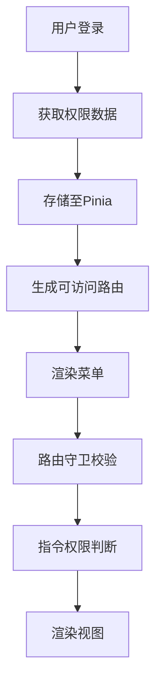
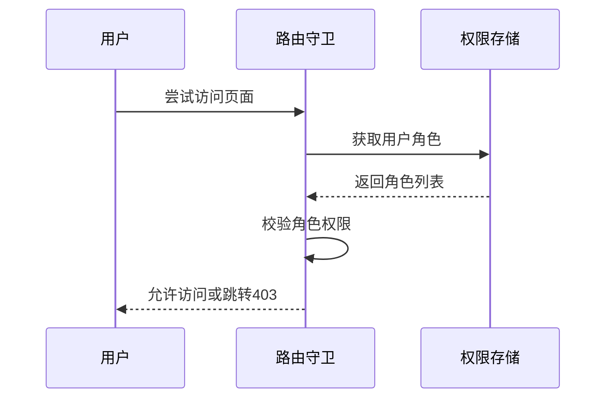
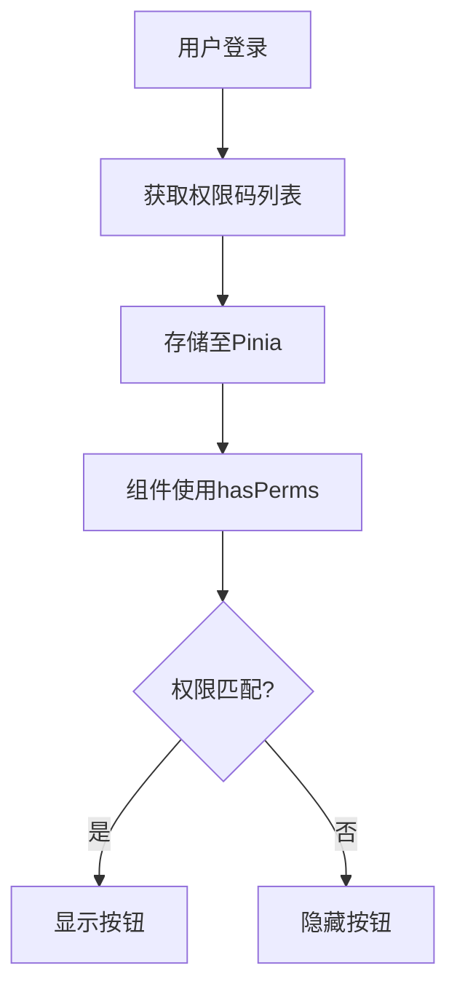
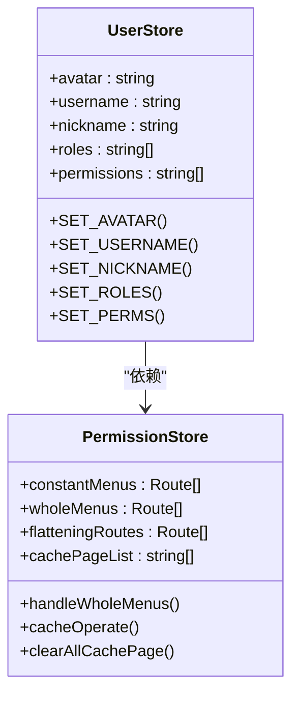
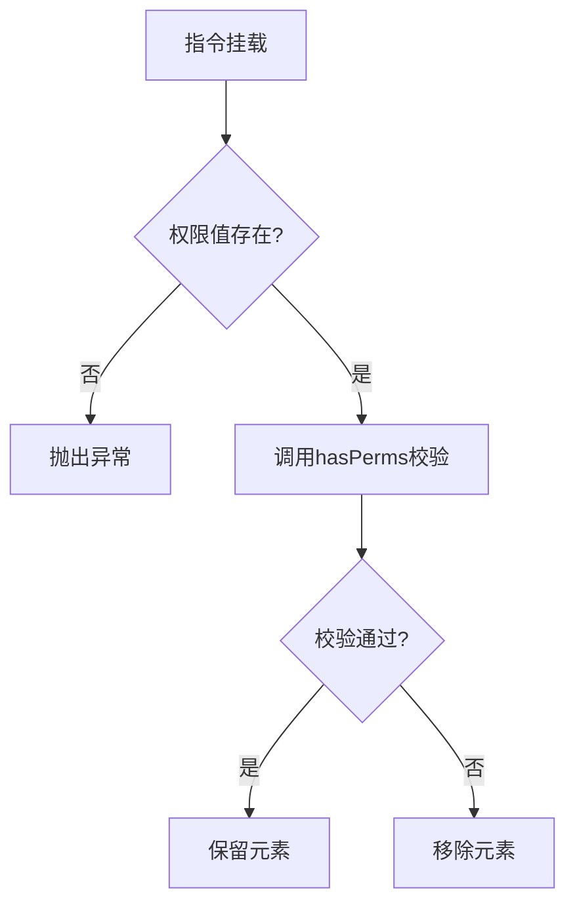
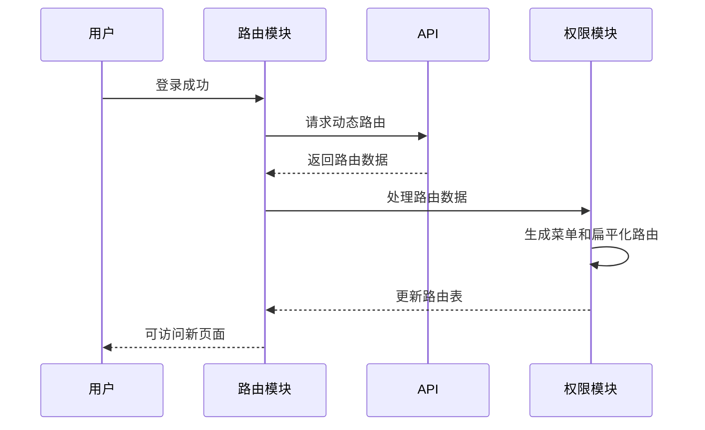

# 权限控制

<cite>
**本文档引用文件**  
- [perms.ts](file://web/src/directives/perms/index.ts)
- [permission.ts](file://web/src/store/modules/permission.ts)
- [router/index.ts](file://web/src/router/index.ts)
- [auth.ts](file://web/src/utils/auth.ts)
- [perms.vue](file://web/src/views/permission/button/perms.vue)
- [index.vue](file://web/src/views/permission/page/index.vue)
- [utils.ts](file://web/src/router/utils.ts)
- [asyncRoutes.ts](file://web/mock/asyncRoutes.ts)
</cite>

## 目录
1. [简介](#简介)
2. [权限模块架构](#权限模块架构)
3. [页面级权限控制](#页面级权限控制)
4. [按钮级权限控制](#按钮级权限控制)
5. [权限数据存储与状态管理](#权限数据存储与状态管理)
6. [自定义指令 v-perms 实现原理](#自定义指令-v-perms-实现原理)
7. [动态权限加载流程](#动态权限加载流程)
8. [视图组件中的权限使用示例](#视图组件中的权限使用示例)
9. [权限变更后的动态更新机制](#权限变更后的动态更新机制)
10. [常见权限问题排查方法](#常见权限问题排查方法)

## 简介
本文档详细阐述了基于 Vue 和 Pinia 的权限控制系统，涵盖页面级和按钮级权限的实现机制。系统通过路由守卫、状态管理、自定义指令等手段，实现了灵活的权限控制策略。用户角色决定可访问的路由和操作权限，权限数据在登录后持久化存储，并支持动态更新。

## 权限模块架构
权限系统由多个核心模块组成：路由模块负责权限校验和动态加载；状态管理模块（Pinia）存储权限数据；工具模块提供权限判断逻辑；指令模块实现 DOM 元素的权限控制。各模块协同工作，形成完整的权限控制闭环。

**Diagram sources**
- [permission.ts](file://web/src/store/modules/permission.ts)
- [router/index.ts](file://web/src/router/index.ts)
- [auth.ts](file://web/src/utils/auth.ts)

**Section sources**
- [permission.ts](file://web/src/store/modules/permission.ts)
- [router/index.ts](file://web/src/router/index.ts)

## 页面级权限控制
页面级权限通过路由元信息（meta.roles）实现。在路由定义中设置 roles 字段，指定允许访问该页面的角色列表。路由守卫在导航前进行角色校验，若当前用户角色不在允许列表中，则重定向至 403 页面。

**Diagram sources**
- [router/index.ts](file://web/src/router/index.ts)
- [asyncRoutes.ts](file://web/mock/asyncRoutes.ts)

**Section sources**
- [router/index.ts](file://web/src/router/index.ts#L150-L170)
- [asyncRoutes.ts](file://web/mock/asyncRoutes.ts#L109-L166)

## 按钮级权限控制
按钮级权限通过权限码（permissions）实现。用户登录后，后端返回其拥有的权限码列表。通过 `hasPerms` 函数或 `v-perms` 指令判断用户是否具备执行特定操作的权限，从而决定按钮的显示与否。

**Diagram sources**
- [auth.ts](file://web/src/utils/auth.ts)
- [perms.vue](file://web/src/views/permission/button/perms.vue)

**Section sources**
- [auth.ts](file://web/src/utils/auth.ts#L120-L140)
- [perms.vue](file://web/src/views/permission/button/perms.vue)

## 权限数据存储与状态管理
权限数据通过 Pinia 进行集中管理。用户信息（包括角色和权限码）存储在 `user` 模块中，而路由相关的权限数据（如可访问菜单）存储在 `permission` 模块中。数据通过 localStorage 和 cookie 双重持久化，确保多标签页间的同步。

**Diagram sources**
- [permission.ts](file://web/src/store/modules/permission.ts)
- [user.ts](file://web/src/store/modules/user.ts)

**Section sources**
- [permission.ts](file://web/src/store/modules/permission.ts)
- [auth.ts](file://web/src/utils/auth.ts)

## 自定义指令 v-perms 实现原理
`v-perms` 指令在元素挂载时执行权限判断。若用户不具备指定权限，则直接从父节点移除该元素，实现彻底的隐藏。指令支持单个权限码或权限码数组，通过 `hasPerms` 函数进行校验。

**Diagram sources**
- [perms.ts](file://web/src/directives/perms/index.ts)

**Section sources**
- [perms.ts](file://web/src/directives/perms/index.ts)

## 动态权限加载流程
系统启动时加载静态路由，用户登录后通过 `initRouter` 函数请求动态路由。后端根据用户角色返回可访问的路由列表，前端将其与静态路由合并，生成最终的可访问路由表，并更新菜单和缓存。

**Diagram sources**
- [router/index.ts](file://web/src/router/index.ts)
- [utils.ts](file://web/src/router/utils.ts)

**Section sources**
- [router/index.ts](file://web/src/router/index.ts#L200-L228)
- [utils.ts](file://web/src/router/utils.ts#L181-L229)

## 视图组件中的权限使用示例
在视图组件中，可通过多种方式使用权限控制：使用 `v-perms` 指令控制按钮显示，调用 `hasPerms` 函数进行条件渲染，或使用 `Perms` 组件包裹需要权限控制的内容。示例代码展示了三种方式的用法。

**Section sources**
- [perms.vue](file://web/src/views/permission/button/perms.vue)

## 权限变更后的动态更新机制
当用户权限发生变化（如切换角色），需重新初始化路由。通过调用 `initRouter` 函数重新获取动态路由，并清除相关缓存，确保权限变更立即生效。此过程包括清除异步路由缓存、清空页面缓存和重新生成路由表。

**Section sources**
- [index.vue](file://web/src/views/permission/page/index.vue#L50-L70)
- [utils.ts](file://web/src/router/utils.ts#L181-L229)

## 常见权限问题排查方法
1. 检查用户登录状态和 token 有效性
2. 确认后端返回的权限数据是否正确
3. 验证路由元信息中的 roles 和 auths 字段
4. 检查 `v-perms` 指令的权限码是否匹配
5. 查看浏览器控制台是否有相关错误信息
6. 确认 Pinia 中存储的权限数据是否更新

**Section sources**
- [auth.ts](file://web/src/utils/auth.ts)
- [router/index.ts](file://web/src/router/index.ts)
- [perms.ts](file://web/src/directives/perms/index.ts)