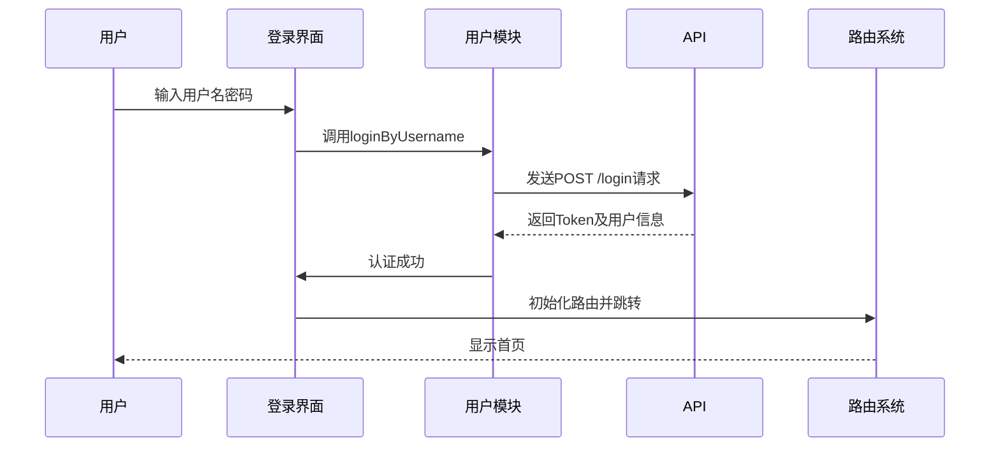
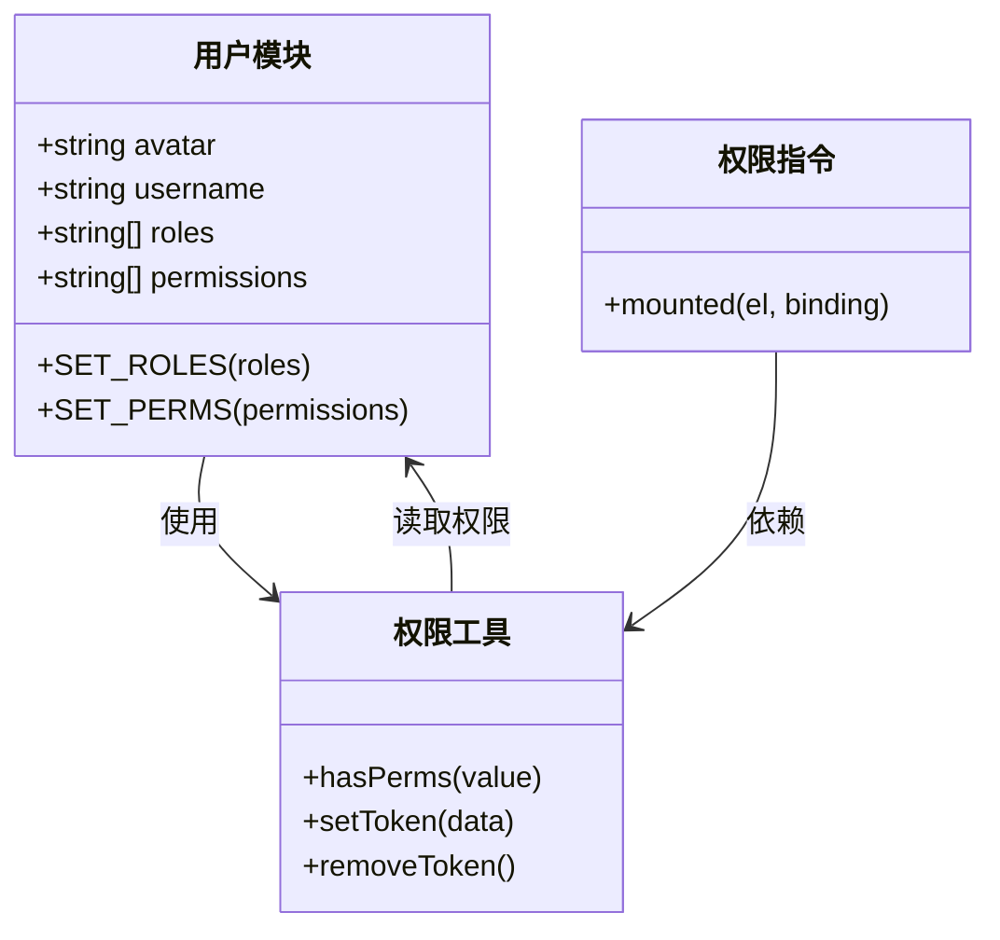
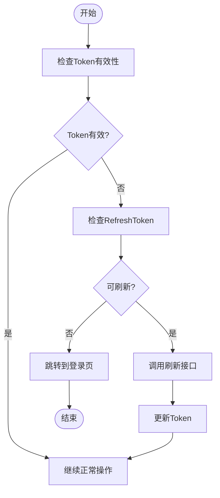

# 认证授权

<cite>
**本文档引用的文件**
- [user.ts](file://web/src/store/modules/user.ts)
- [auth.ts](file://web/src/utils/auth.ts)
- [user.ts](file://web/src/api/user.ts)
- [index.vue](file://web/src/views/login/index.vue)
- [index.ts](file://web/src/directives/perms/index.ts)
</cite>

## 目录
1. [简介](#简介)
2. [登录流程](#登录流程)
3. [权限验证机制](#权限验证机制)
4. [Token管理策略](#token管理策略)
5. [用户信息获取与更新](#用户信息获取与更新)
6. [开发者安全指南](#开发者安全指南)
7. [结论](#结论)

## 简介
本项目采用基于Token的认证授权机制，结合前端状态管理和后端接口验证，实现完整的用户身份认证和权限控制体系。系统支持多种登录方式，并通过精细化的权限管理确保不同角色用户只能访问其授权范围内的功能。

**Section sources**
- [index.vue](file://web/src/views/login/index.vue#L1-L378)

## 登录流程
用户登录流程从登录界面开始，经过表单验证、身份认证、路由初始化到最终跳转至首页，整个过程实现了无感跳转和状态持久化。

**Diagram sources**
- [index.vue](file://web/src/views/login/index.vue#L100-L130)
- [user.ts](file://web/src/store/modules/user.ts#L50-L75)

**Section sources**
- [index.vue](file://web/src/views/login/index.vue#L1-L378)
- [user.ts](file://web/src/store/modules/user.ts#L50-L75)

## 权限验证机制
系统实现了页面级和按钮级的双重权限控制机制，确保不同角色用户只能访问其授权的功能。

### 页面级权限
通过路由守卫和动态路由生成机制实现页面级权限控制。用户登录后，系统根据用户角色动态生成可访问的路由表。

### 按钮级权限
使用自定义指令`v-perms`实现按钮级别权限控制，根据用户权限列表决定是否显示特定操作按钮。

**Diagram sources**
- [auth.ts](file://web/src/utils/auth.ts#L60-L90)
- [index.ts](file://web/src/directives/perms/index.ts#L1-L15)
- [user.ts](file://web/src/store/modules/user.ts#L1-L121)

**Section sources**
- [auth.ts](file://web/src/utils/auth.ts#L60-L90)
- [index.ts](file://web/src/directives/perms/index.ts#L1-L15)

## Token管理策略
系统采用双Token机制，包含访问Token和刷新Token，实现安全的无感刷新体验。

### 存储策略
- **访问Token**：存储在Cookie中，设置过期时间
- **用户信息**：存储在localStorage中，包含角色、权限等敏感信息
- **多标签支持**：通过multiple-tabs标识支持多标签页免登录

### 刷新机制
当访问Token即将过期时，系统自动调用刷新接口获取新的Token，实现用户无感知的Token更新。

**Diagram sources**
- [auth.ts](file://web/src/utils/auth.ts#L20-L60)
- [user.ts](file://web/src/store/modules/user.ts#L90-L110)

**Section sources**
- [auth.ts](file://web/src/utils/auth.ts#L1-L141)
- [user.ts](file://web/src/store/modules/user.ts#L90-L110)

## 用户信息获取与更新
系统在用户登录后获取完整的用户信息，并在需要时进行更新，确保用户数据的实时性和准确性。

### 信息获取
用户登录成功后，系统从认证接口返回的数据中提取头像、用户名、角色、权限等关键信息，并存储到状态管理中。

### 信息更新
当用户修改个人信息或权限发生变化时，系统提供相应的API接口获取最新信息，并同步更新本地存储。

**Section sources**
- [user.ts](file://web/src/api/user.ts#L1-L90)
- [user.ts](file://web/src/store/modules/user.ts#L1-L121)

## 开发者安全指南
为确保系统的安全性，开发者在实现认证授权功能时应遵循以下最佳实践。

### 安全存储
- 敏感信息不应明文存储
- 使用HttpOnly Cookie防止XSS攻击
- 定期清理过期的认证信息

### 权限控制
- 所有敏感操作都应进行权限验证
- 前后端都应进行权限校验
- 避免权限提升漏洞

### 错误处理
- 不暴露敏感的错误信息
- 统一的认证失败处理机制
- 记录安全相关的日志

**Section sources**
- [auth.ts](file://web/src/utils/auth.ts#L1-L141)
- [user.ts](file://web/src/store/modules/user.ts#L1-L121)

## 结论
本项目的认证授权系统通过合理的架构设计和严格的安全控制，实现了高效、安全的用户身份验证和权限管理。系统支持灵活的权限配置，便于扩展和维护，为开发者提供了清晰的实现指南和最佳实践参考。