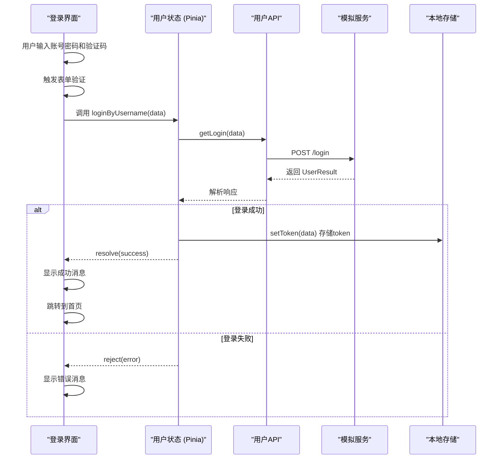
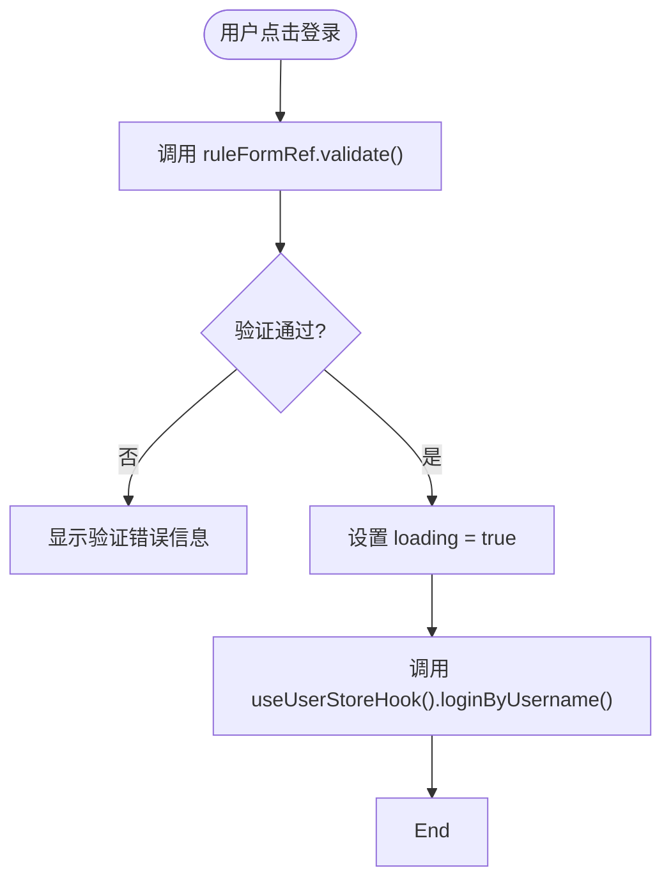
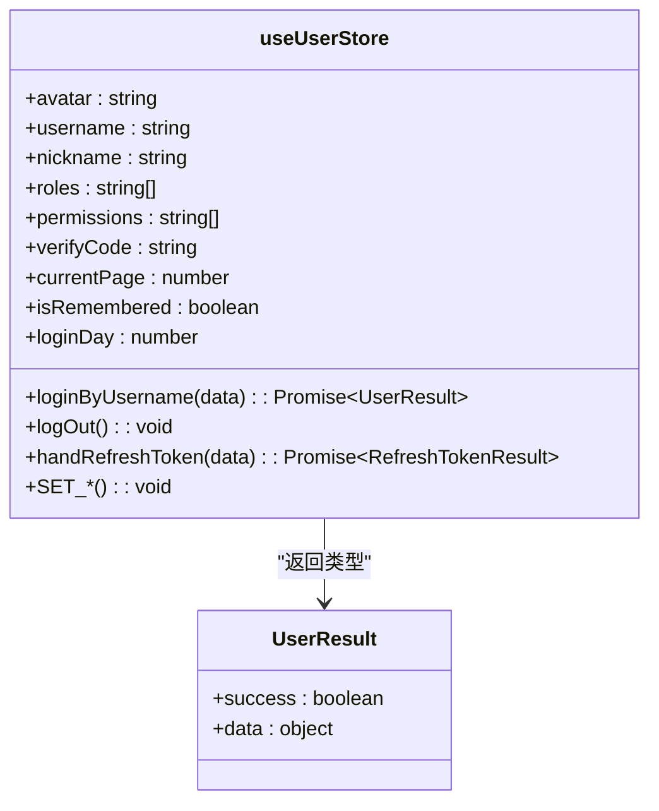
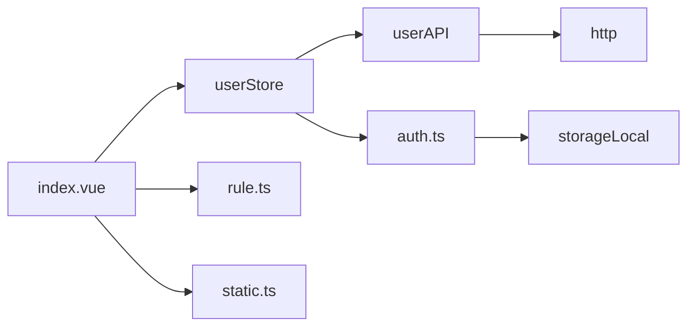

# 身份认证

<cite>
**本文档中引用的文件**  
- [index.vue](file://web/src/views/login/index.vue)
- [user.ts](file://web/src/api/user.ts)
- [user.ts](file://web/src/store/modules/user.ts)
- [rule.ts](file://web/src/views/login/utils/rule.ts)
- [login.ts](file://web/mock/login.ts)
</cite>

## 目录
1. [简介](#简介)
2. [项目结构](#项目结构)
3. [核心组件](#核心组件)
4. [架构概览](#架构概览)
5. [详细组件分析](#详细组件分析)
6. [依赖分析](#依赖分析)
7. [性能考虑](#性能考虑)
8. [故障排除指南](#故障排除指南)
9. [结论](#结论)

## 简介
本文件详细描述了 `vue-pure-admin-all` 项目中的身份认证流程，重点聚焦于用户登录系统的实现。文档涵盖从视图层到服务层的完整调用链路，包括登录界面的交互逻辑、表单验证、验证码处理、多种登录方式（账号密码、手机、二维码等）的实现机制、登录请求的发送与响应处理、用户信息和 token 的存储策略，以及登录失败场景下的错误处理。通过代码级分析和可视化图表，帮助开发者深入理解并定制登录流程。

## 项目结构

```mermaid
graph TD
subgraph "视图层"
LoginView["views/login/index.vue"]
LoginComponents["components/Login*.vue"]
end
subgraph "API 层"
UserAPI["api/user.ts"]
end
subgraph "状态管理"
UserStore["store/modules/user.ts"]
end
subgraph "工具与静态资源"
LoginUtils["views/login/utils/"]
MockLogin["mock/login.ts"]
end
LoginView --> UserStore : "调用登录方法"
LoginView --> LoginUtils : "导入规则与枚举"
UserStore --> UserAPI : "发起HTTP请求"
UserAPI --> MockLogin : "开发环境模拟数据"
```

**Diagram sources**
- [index.vue](file://web/src/views/login/index.vue#L1-L378)
- [user.ts](file://web/src/api/user.ts#L1-L90)
- [user.ts](file://web/src/store/modules/user.ts#L1-L122)
- [rule.ts](file://web/src/views/login/utils/rule.ts#L1-L127)
- [login.ts](file://web/mock/login.ts#L1-L43)

**Section sources**
- [index.vue](file://web/src/views/login/index.vue#L1-L378)
- [user.ts](file://web/src/api/user.ts#L1-L90)
- [user.ts](file://web/src/store/modules/user.ts#L1-L122)

## 核心组件

文档的核心组件包括登录视图 (`index.vue`)，它负责用户界面的渲染和交互；用户状态存储 (`user.ts` in store)，它管理用户认证状态和持久化逻辑；用户API模块 (`user.ts` in api)，它封装了与后端的身份验证接口；以及登录工具模块 (`rule.ts`)，它定义了表单验证规则。这些组件共同协作，实现了完整的身份认证流程。

**Section sources**
- [index.vue](file://web/src/views/login/index.vue#L1-L378)
- [user.ts](file://web/src/api/user.ts#L1-L90)
- [user.ts](file://web/src/store/modules/user.ts#L1-L122)
- [rule.ts](file://web/src/views/login/utils/rule.ts#L1-L127)

## 架构概览



**Diagram sources**
- [index.vue](file://web/src/views/login/index.vue#L1-L378)
- [user.ts](file://web/src/api/user.ts#L1-L90)
- [user.ts](file://web/src/store/modules/user.ts#L1-L122)
- [login.ts](file://web/mock/login.ts#L1-L43)

## 详细组件分析

### 登录视图分析

登录视图 (`index.vue`) 是整个流程的入口。它使用 Vue 3 的 Composition API 和 `<script setup>` 语法，通过 Pinia 的 `useUserStoreHook()` 获取用户状态，并绑定登录表单。

#### 交互逻辑与表单验证
登录表单的交互逻辑由 `onLogin` 函数驱动。该函数在点击登录按钮或按下回车键时被触发。它首先调用 Element Plus 的 `validate` 方法对表单进行前端验证。验证规则由 `loginRules` 提供，该规则定义在 `rule.ts` 文件中，确保密码符合复杂度要求（8-18位，包含数字、字母、符号中的至少两种），并验证用户输入的验证码与前端生成的验证码 (`verifyCode`) 一致。



**Diagram sources**
- [index.vue](file://web/src/views/login/index.vue#L1-L378)
- [rule.ts](file://web/src/views/login/utils/rule.ts#L1-L127)

#### 多种登录方式实现
登录界面通过 `currentPage` 状态变量实现多模式切换。初始状态 `currentPage = 0` 显示账号密码登录。界面上的其他按钮（如“手机登录”、“二维码登录”）会调用 `SET_CURRENTPAGE` 方法，将 `currentPage` 的值设置为 1、2 等，从而动态渲染 `LoginPhone`、`LoginQrCode` 等不同的子组件。这种设计实现了单一入口、多组件复用的灵活架构。

**Section sources**
- [index.vue](file://web/src/views/login/index.vue#L1-L378)

### 用户状态管理分析

用户状态模块 (`user.ts` in store) 是身份认证的核心逻辑中枢，使用 Pinia 进行状态管理。

#### 登录方法实现
`loginByUsername` 是一个异步 Action，它接收登录凭据作为参数。该方法调用 `getLogin` API 函数发起登录请求。如果后端返回 `success: true`，则调用 `setToken` 工具函数将返回的 `accessToken`、`refreshToken` 等信息持久化到本地存储（如 localStorage）。如果登录失败，则拒绝 Promise，错误信息将被传递到视图层进行提示。

#### 状态持久化与登出
该模块的 `state` 初始值会从 `storageLocal()`（封装了本地存储）中读取，实现了页面刷新后用户信息的恢复。`logOut` 方法用于前端登出，它会清空状态、移除 token、重置路由，并将用户重定向到登录页。



**Diagram sources**
- [user.ts](file://web/src/store/modules/user.ts#L1-L122)
- [user.ts](file://web/src/api/user.ts#L1-L90)

**Section sources**
- [user.ts](file://web/src/store/modules/user.ts#L1-L122)

### API 接口分析

API 模块 (`user.ts` in api) 定义了与后端通信的接口契约。

#### 类型定义
该文件使用 TypeScript 定义了 `UserResult` 和 `RefreshTokenResult` 等接口，清晰地描述了登录和刷新 token 接口的响应数据结构，包括 `accessToken`、`refreshToken`、`expires` 过期时间以及用户角色权限等信息。

#### 请求封装
`getLogin` 函数是一个通用的 HTTP 请求封装，它使用项目中的 `http` 实例（基于 Axios 或类似库）向 `/login` 端点发送 POST 请求。在开发环境中，该请求会被 `vite-plugin-fake-server` 拦截，由 `mock/login.ts` 提供模拟数据，无需依赖后端服务即可进行开发和测试。

**Section sources**
- [user.ts](file://web/src/api/user.ts#L1-L90)

### 模拟服务分析

模拟服务 (`login.ts`) 在开发阶段至关重要。它使用 `defineFakeRoute` 定义了一个拦截 `/login` POST 请求的规则。根据请求体中的 `username` 字段，返回预设的管理员或普通用户数据。这使得前端开发可以独立于后端进行，并能测试不同角色的权限表现。

**Section sources**
- [login.ts](file://web/mock/login.ts#L1-L43)

## 依赖分析



**Diagram sources**
- [index.vue](file://web/src/views/login/index.vue#L1-L378)
- [user.ts](file://web/src/store/modules/user.ts#L1-L122)
- [user.ts](file://web/src/api/user.ts#L1-L90)
- [rule.ts](file://web/src/views/login/utils/rule.ts#L1-L127)
- [auth.ts](file://web/src/utils/auth.ts#L1-L100)

## 性能考虑
登录流程的性能主要受网络请求和前端验证影响。前端验证（如密码复杂度、手机号格式）能立即反馈，提升用户体验。HTTP 请求的性能依赖于后端服务。使用 `debounce` 防抖函数处理回车键登录，可以防止用户快速多次按回车导致的重复请求。整体流程轻量，无明显性能瓶颈。

## 故障排除指南

### 登录失败场景
- **凭证错误**：后端返回 `success: false`，前端会显示“登录失败”消息。检查用户名密码是否正确。
- **验证码错误**：前端验证会直接提示“验证码不正确”，因为输入的验证码与 `verifyCode` state 不匹配。
- **网络异常**：HTTP 请求失败（如 404, 500 或超时），`getLogin` Promise 会被 reject，错误被捕获并可能导致用户无感知或显示通用错误。
- **表单验证未通过**：Element Plus 会高亮显示错误字段并显示相应提示，如“密码必须包含数字和字母”。
- **Token 过期**：当 `accessToken` 过期时，后续 API 请求会失败。系统应捕获此错误并调用 `handRefreshToken` 方法使用 `refreshToken` 获取新的 `accessToken`。

**Section sources**
- [index.vue](file://web/src/views/login/index.vue#L1-L378)
- [user.ts](file://web/src/store/modules/user.ts#L1-L122)
- [user.ts](file://web/src/api/user.ts#L1-L90)

## 结论
`vue-pure-admin-all` 的身份认证流程设计清晰，职责分离明确。视图层负责交互，状态层管理逻辑和状态，API 层封装通信，模拟层支持独立开发。通过 Pinia 管理状态，利用 TypeScript 保证类型安全，并结合 Element Plus 提供良好的用户体验。开发者可以基于此架构轻松扩展新的登录方式或修改验证规则。