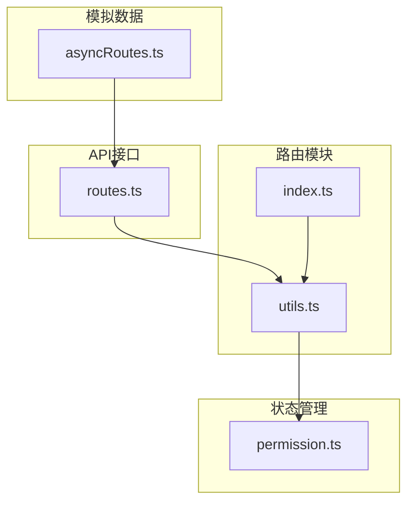
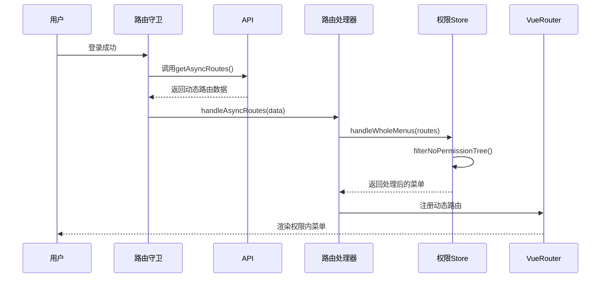
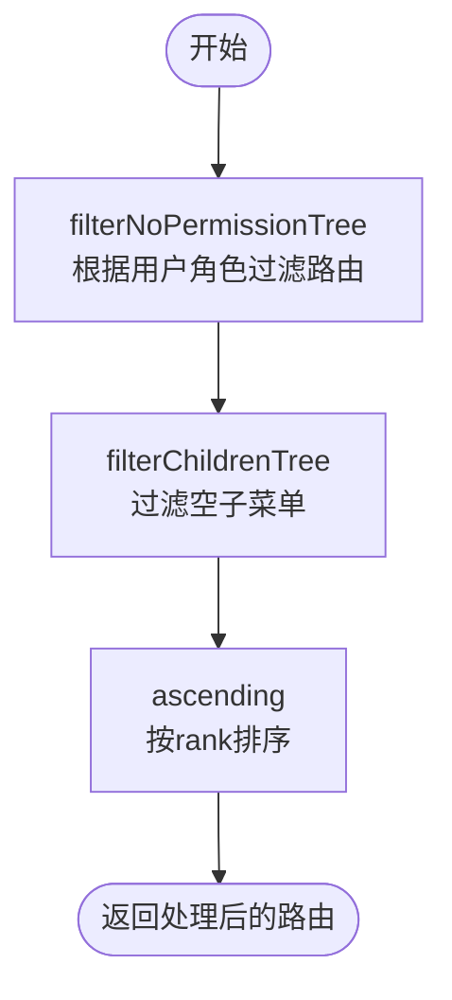
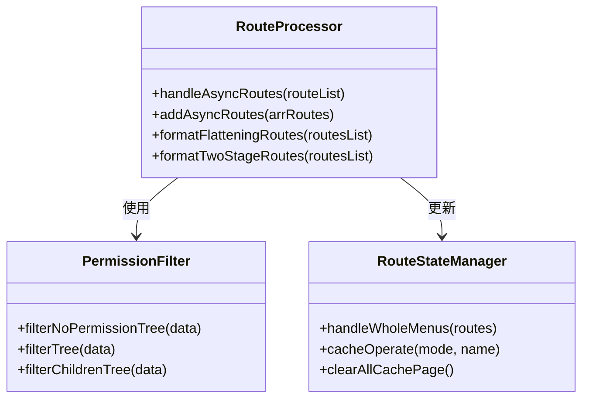
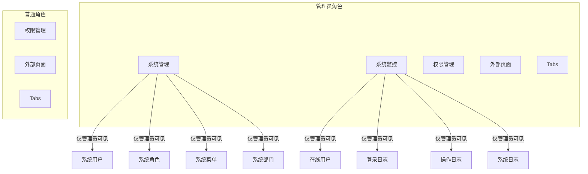

# 动态路由

<cite>
**本文档中引用的文件**  
- [utils.ts](file://web/src/router/utils.ts)
- [permission.ts](file://web/src/store/modules/permission.ts)
- [asyncRoutes.ts](file://web/mock/asyncRoutes.ts)
- [routes.ts](file://web/src/api/routes.ts)
- [index.ts](file://web/src/router/index.ts)
</cite>

## 目录
1. [简介](#简介)
2. [项目结构](#项目结构)
3. [核心组件](#核心组件)
4. [架构概述](#架构概述)
5. [详细组件分析](#详细组件分析)
6. [依赖分析](#依赖分析)
7. [性能考虑](#性能考虑)
8. [故障排除指南](#故障排除指南)
9. [结论](#结论)

## 简介
本文档深入解释了基于用户权限的动态路由生成机制。系统通过用户角色和权限信息，从后端或静态配置中筛选并生成可访问的路由表。重点分析了 `utils.ts` 中的路由处理工具函数（如 `filterAsyncRoutes`）的实现逻辑，包括路由过滤、权限匹配、菜单生成等关键步骤。结合 `permission` 模块的 store 状态管理，阐述了动态路由数据的存储和响应式更新机制。同时提供实际应用示例，并指导开发者如何扩展动态路由规则以支持新的权限模型。

## 项目结构
项目采用模块化结构，核心动态路由功能分布在 `router` 和 `store` 模块中。`router/utils.ts` 负责路由处理逻辑，`store/modules/permission.ts` 管理权限状态，`mock/asyncRoutes.ts` 提供模拟的动态路由数据，`api/routes.ts` 定义获取动态路由的接口。



**Diagram sources**
- [utils.ts](file://web/src/router/utils.ts)
- [permission.ts](file://web/src/store/modules/permission.ts)
- [routes.ts](file://web/src/api/routes.ts)
- [asyncRoutes.ts](file://web/mock/asyncRoutes.ts)

**Section sources**
- [utils.ts](file://web/src/router/utils.ts)
- [permission.ts](file://web/src/store/modules/permission.ts)

## 核心组件
核心组件包括动态路由生成器、权限过滤器和菜单处理器。`filterNoPermissionTree` 函数根据用户角色过滤无权限的菜单项，`handleAsyncRoutes` 处理后端返回的动态路由并注册到 Vue Router。`usePermissionStoreHook` 提供对权限状态的访问。

**Section sources**
- [utils.ts](file://web/src/router/utils.ts#L250-L300)
- [permission.ts](file://web/src/store/modules/permission.ts#L20-L40)

## 架构概述
系统在用户登录后，通过 `getAsyncRoutes` 接口获取动态路由数据，经 `handleAsyncRoutes` 处理后，使用 `filterNoPermissionTree` 进行权限过滤，最终生成用户可访问的菜单并存储在 `permission` store 中。



**Diagram sources**
- [index.ts](file://web/src/router/index.ts#L150-L200)
- [utils.ts](file://web/src/router/utils.ts#L300-L350)
- [permission.ts](file://web/src/store/modules/permission.ts#L20-L40)

## 详细组件分析

### 路由处理工具分析
`utils.ts` 中的工具函数负责动态路由的完整处理流程。

#### 路由过滤与权限匹配


**Diagram sources**
- [utils.ts](file://web/src/router/utils.ts#L150-L200)

#### 动态路由注册流程


**Diagram sources**
- [utils.ts](file://web/src/router/utils.ts#L250-L350)
- [permission.ts](file://web/src/store/modules/permission.ts#L20-L40)

**Section sources**
- [utils.ts](file://web/src/router/utils.ts#L100-L400)
- [permission.ts](file://web/src/store/modules/permission.ts#L10-L75)

### 实际应用示例
不同角色登录后看到的菜单存在明显差异。管理员角色可访问系统管理、系统监控等高级功能，而普通角色仅能访问基础权限页面和外部链接。



**Diagram sources**
- [asyncRoutes.ts](file://web/mock/asyncRoutes.ts#L10-L300)

**Section sources**
- [asyncRoutes.ts](file://web/mock/asyncRoutes.ts#L1-L340)

## 依赖分析
动态路由功能依赖多个核心模块的协同工作。

```mermaid
dependency-graph
"api/routes.ts" --> "router/utils.ts"
"mock/asyncRoutes.ts" --> "api/routes.ts"
"router/utils.ts" --> "store/modules/permission.ts"
"router/index.ts" --> "router/utils.ts"
"router/index.ts" --> "store/modules/permission.ts"
"store/modules/permission.ts" --> "@pureadmin/utils"
```

**Diagram sources**
- [routes.ts](file://web/src/api/routes.ts)
- [utils.ts](file://web/src/router/utils.ts)
- [permission.ts](file://web/src/store/modules/permission.ts)
- [index.ts](file://web/src/router/index.ts)

**Section sources**
- [routes.ts](file://web/src/api/routes.ts)
- [utils.ts](file://web/src/router/utils.ts)
- [permission.ts](file://web/src/store/modules/permission.ts)

## 性能考虑
系统通过多种机制优化动态路由性能：使用 `debounce` 防抖处理缓存操作，支持路由缓存到 `localStorage`，采用扁平化路由结构提升查找效率，并通过 `formatTwoStageRoutes` 将多级路由拍平为二级结构，确保 `keep-alive` 缓存的有效性。

## 故障排除指南
常见问题包括动态路由未正确加载、权限过滤失效、菜单显示异常等。检查要点：确保 `getAsyncRoutes` 接口返回正确的路由数据结构，验证用户 `roles` 信息是否正确存储，确认 `filterNoPermissionTree` 函数正确执行权限匹配，检查 `handleWholeMenus` 是否成功更新 store 状态。

**Section sources**
- [utils.ts](file://web/src/router/utils.ts#L200-L300)
- [permission.ts](file://web/src/store/modules/permission.ts#L30-L50)

## 结论
本系统实现了完整的基于角色的动态路由机制，通过后端返回路由数据、前端权限过滤、状态管理存储的完整流程，实现了灵活的权限控制。开发者可基于现有架构扩展权限模型，如增加更细粒度的权限控制、支持多租户路由隔离等高级功能。