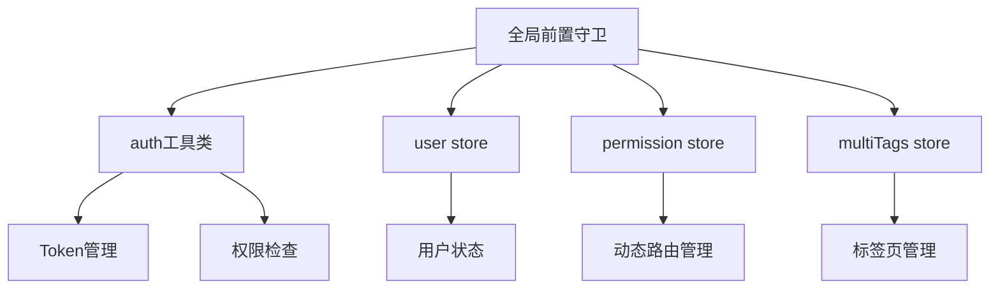
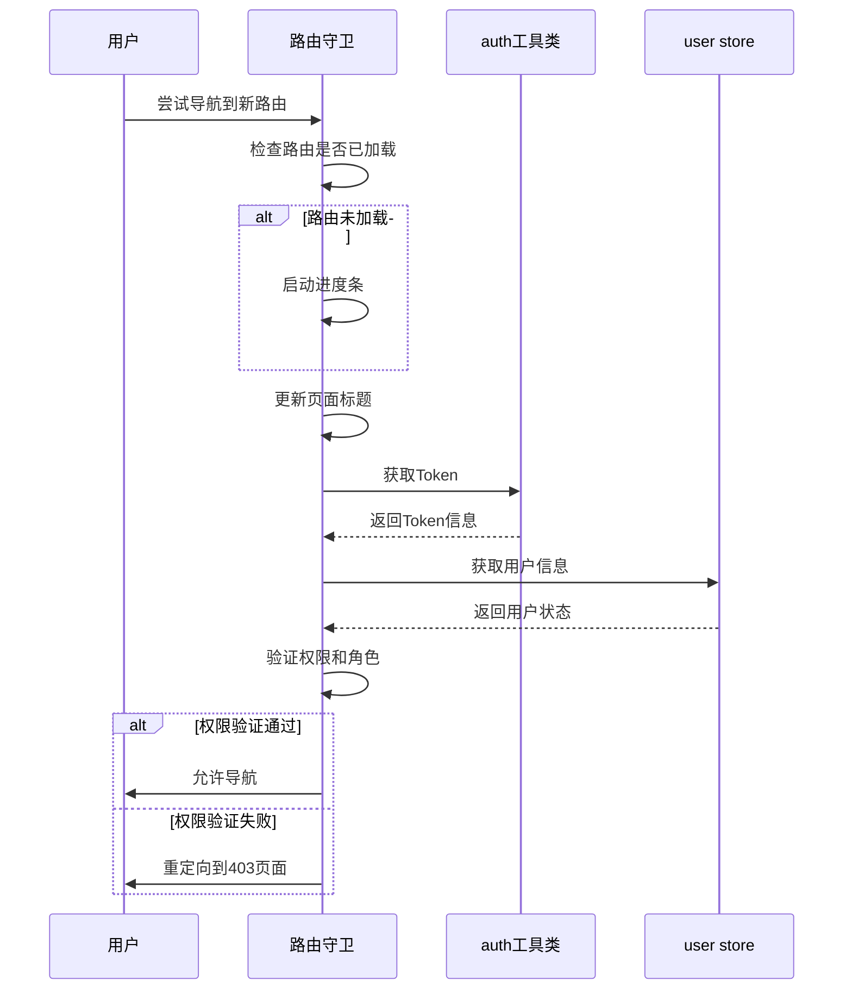
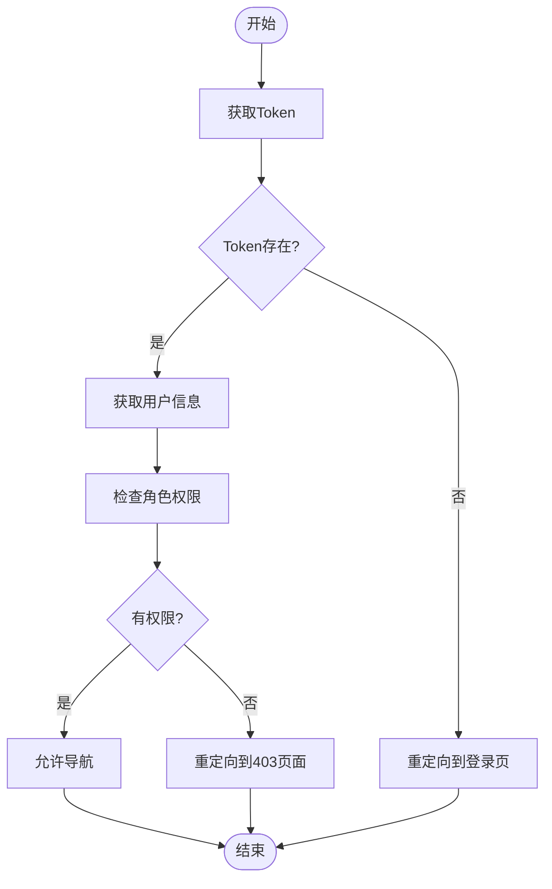
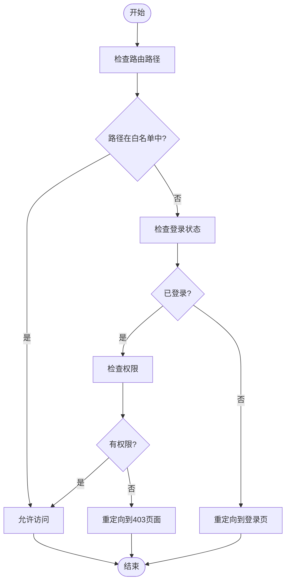
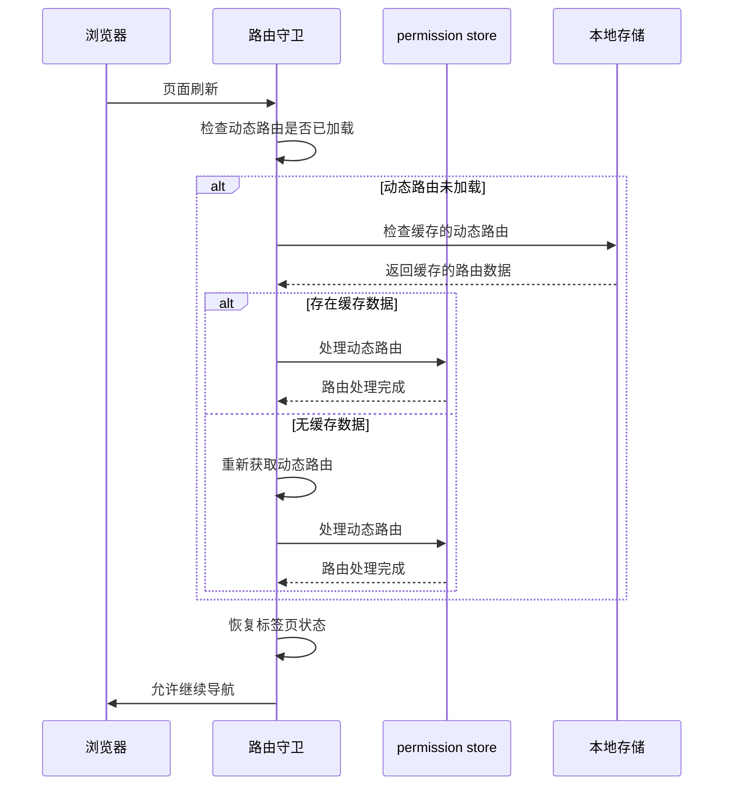
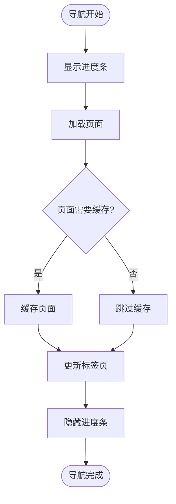
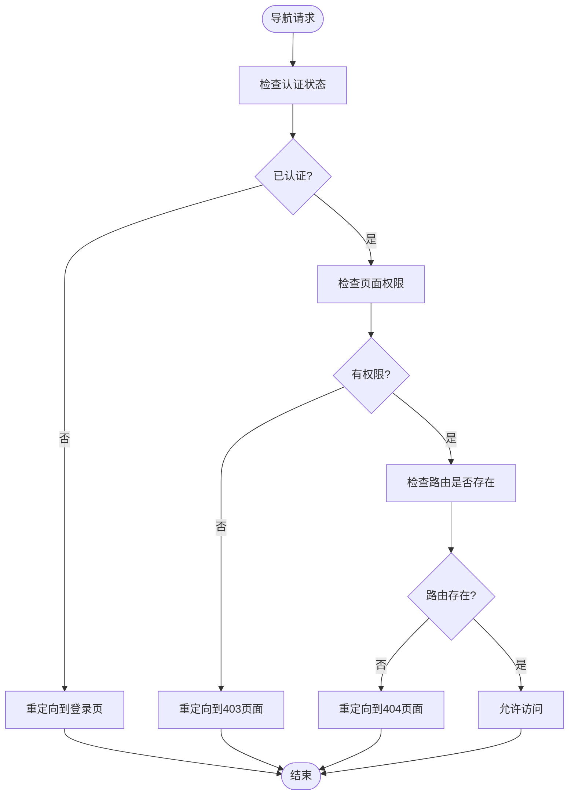

<cite>
**Referenced Files in This Document**   
- [router/index.ts](file://web/src/router/index.ts)
- [utils/auth.ts](file://web/src/utils/auth.ts)
- [store/modules/user.ts](file://web/src/store/modules/user.ts)
- [store/modules/permission.ts](file://web/src/store/modules/permission.ts)
- [store/modules/multiTags.ts](file://web/src/store/modules/multiTags.ts)
- [router/utils.ts](file://web/src/router/utils.ts)
</cite>

## 目录
1. [路由守卫概述](#路由守卫概述)
2. [核心组件与依赖关系](#核心组件与依赖关系)
3. [全局前置守卫执行流程](#全局前置守卫执行流程)
4. [权限验证与身份认证](#权限验证与身份认证)
5. [特殊路由处理策略](#特殊路由处理策略)
6. [页面刷新与权限恢复](#页面刷新与权限恢复)
7. [用户体验优化](#用户体验优化)
8. [错误处理与重定向](#错误处理与重定向)

## 路由守卫概述

路由守卫是Vue Pure Admin项目中用于控制页面导航的核心机制。它通过在`router/index.ts`文件中定义的全局前置守卫（`beforeEach`）实现，负责拦截所有路由跳转请求，执行权限验证、身份认证检查和页面访问控制。该守卫机制与`auth`工具类和`user` store紧密协作，确保只有经过授权的用户才能访问受保护的页面。守卫还负责处理特殊路由（如登录页、404页）的放行策略，并在页面刷新时恢复用户的权限状态。

**Section sources**
- [router/index.ts](file://web/src/router/index.ts#L1-L228)

## 核心组件与依赖关系

路由守卫功能的实现依赖于多个核心组件的协同工作。`router/index.ts`中的全局前置守卫是入口点，它调用`auth.ts`中的工具函数进行Token管理和权限检查，并通过`user.ts`中的store获取用户状态信息。同时，守卫还与`permission.ts`和`multiTags.ts`中的store模块交互，以管理动态路由和标签页状态。

**Diagram sources**
- [router/index.ts](file://web/src/router/index.ts#L1-L228)
- [utils/auth.ts](file://web/src/utils/auth.ts#L1-L141)
- [store/modules/user.ts](file://web/src/store/modules/user.ts#L1-L121)
- [store/modules/permission.ts](file://web/src/store/modules/permission.ts#L1-L74)
- [store/modules/multiTags.ts](file://web/src/store/modules/multiTags.ts#L1-L145)

**Section sources**
- [router/index.ts](file://web/src/router/index.ts#L1-L228)
- [utils/auth.ts](file://web/src/utils/auth.ts#L1-L141)
- [store/modules/user.ts](file://web/src/store/modules/user.ts#L1-L121)

## 全局前置守卫执行流程

全局前置守卫的执行流程始于`router/index.ts`文件中的`beforeEach`钩子函数。当用户尝试导航到新路由时，守卫首先检查目标路由是否已被加载，如果未加载则启动进度条。接着，守卫根据路由元信息更新页面标题，并检查用户登录状态和权限。

**Diagram sources**
- [router/index.ts](file://web/src/router/index.ts#L150-L228)

**Section sources**
- [router/index.ts](file://web/src/router/index.ts#L150-L228)

## 权限验证与身份认证

权限验证与身份认证是路由守卫的核心功能。守卫通过`auth.ts`文件中的`getToken`函数获取存储在Cookie中的Token信息，并从`user.ts`中的store获取用户角色和权限数据。对于需要特定角色访问的路由，守卫会检查用户角色是否包含在路由元信息的`roles`字段中。

**Diagram sources**
- [utils/auth.ts](file://web/src/utils/auth.ts#L1-L141)
- [store/modules/user.ts](file://web/src/store/modules/user.ts#L1-L121)
- [router/index.ts](file://web/src/router/index.ts#L150-L228)

**Section sources**
- [utils/auth.ts](file://web/src/utils/auth.ts#L1-L141)
- [store/modules/user.ts](file://web/src/store/modules/user.ts#L1-L121)
- [router/index.ts](file://web/src/router/index.ts#L150-L228)

## 特殊路由处理策略

路由守卫对特殊路由（如登录页、404页）采用特定的处理策略。这些路由被定义在路由白名单中，允许未登录用户访问。守卫通过检查目标路由路径是否在白名单中来决定是否放行。

**Diagram sources**
- [router/index.ts](file://web/src/router/index.ts#L150-L228)

**Section sources**
- [router/index.ts](file://web/src/router/index.ts#L150-L228)

## 页面刷新与权限恢复

当用户刷新页面时，路由守卫通过`initRouter`函数重新初始化动态路由，并从本地存储中恢复用户的权限状态。这一过程确保了用户在刷新后仍能保持登录状态和访问权限。

**Diagram sources**
- [router/index.ts](file://web/src/router/index.ts#L150-L228)
- [router/utils.ts](file://web/src/router/utils.ts#L199-L226)

**Section sources**
- [router/index.ts](file://web/src/router/index.ts#L150-L228)
- [router/utils.ts](file://web/src/router/utils.ts#L199-L226)

## 用户体验优化

路由守卫通过多种方式优化用户体验。首先，使用`NProgress`库在页面加载时显示进度条，提供视觉反馈。其次，通过`keep-alive`机制缓存已访问的页面，提高页面切换速度。最后，守卫在导航完成后更新标签页状态，确保用户操作的连续性。

**Diagram sources**
- [router/index.ts](file://web/src/router/index.ts#L150-L228)
- [router/utils.ts](file://web/src/router/utils.ts#L273-L305)

**Section sources**
- [router/index.ts](file://web/src/router/index.ts#L150-L228)
- [router/utils.ts](file://web/src/router/utils.ts#L273-L305)

## 错误处理与重定向

路由守卫实现了完善的错误处理机制。当用户尝试访问无权限的页面时，守卫会将其重定向到403页面。对于不存在的路由，守卫会重定向到404页面。此外，守卫还处理了登录状态失效的情况，自动将用户重定向到登录页。

**Diagram sources**
- [router/index.ts](file://web/src/router/index.ts#L150-L228)

**Section sources**
- [router/index.ts](file://web/src/router/index.ts#L150-L228)