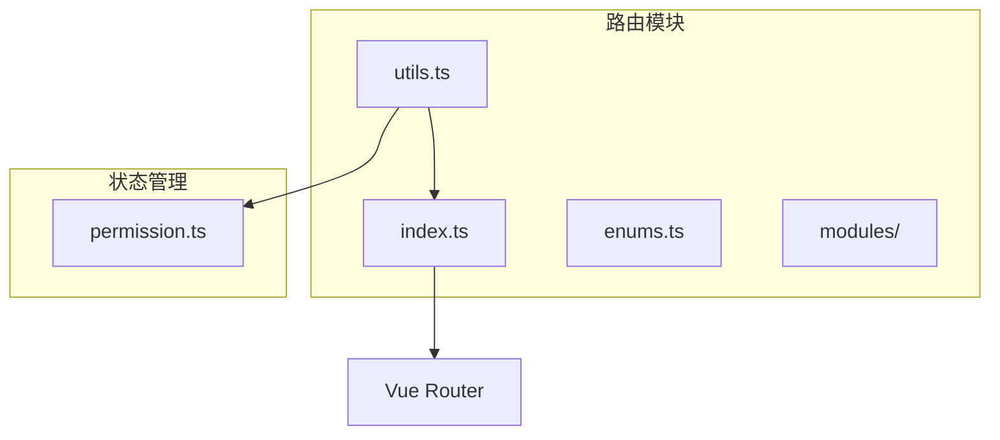
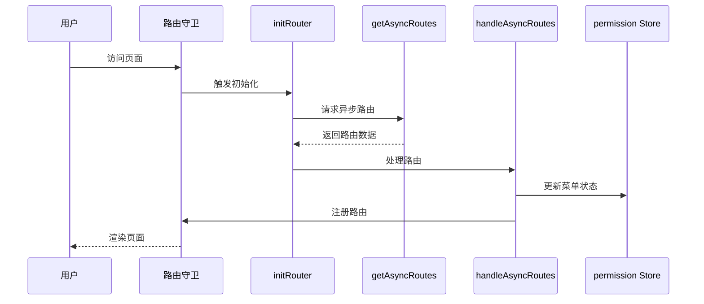
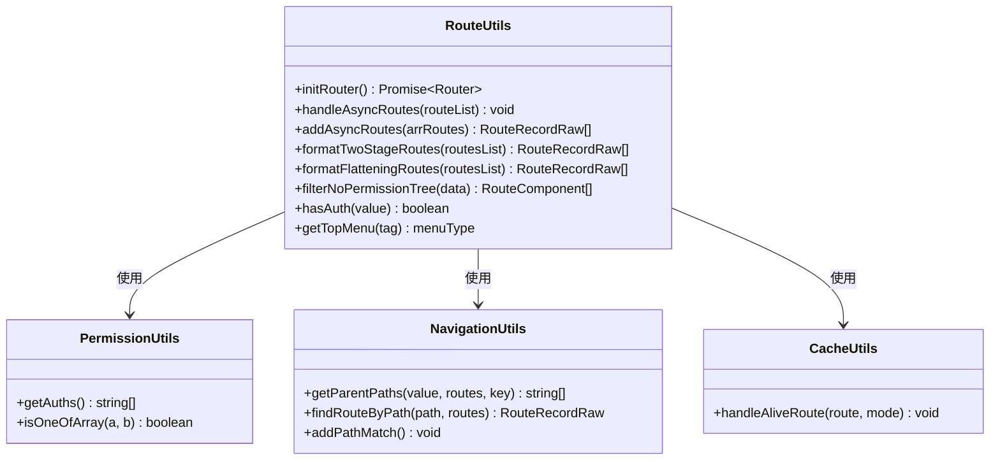
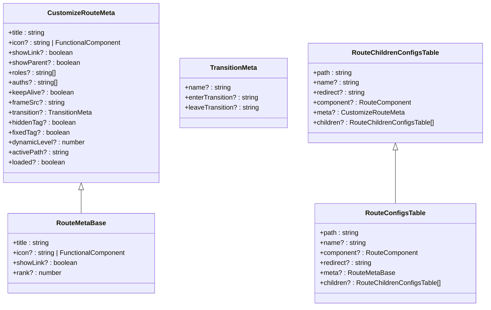
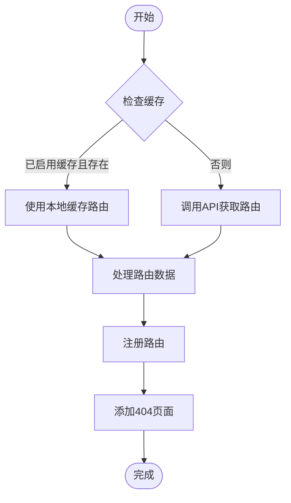
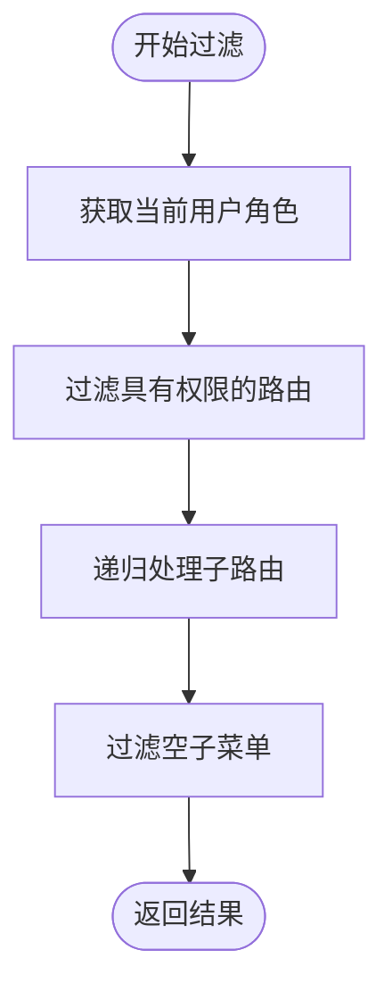
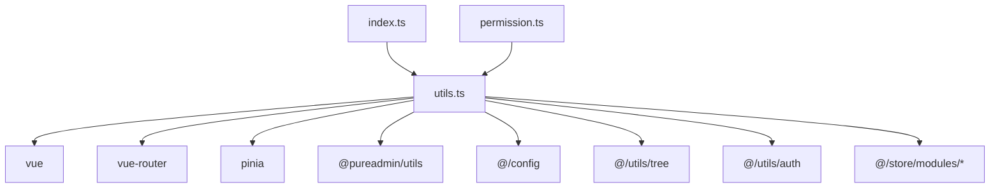

# 路由工具函数

<cite>
**本文档引用文件**  
- [utils.ts](file://web/src/router/utils.ts)
- [router.d.ts](file://web/types/router.d.ts)
- [index.ts](file://web/src/router/index.ts)
- [permission.ts](file://web/src/store/modules/permission.ts)
- [types.ts](file://web/src/layout/types.ts)
</cite>

## 目录
1. [简介](#简介)
2. [项目结构](#项目结构)
3. [核心组件](#核心组件)
4. [架构概述](#架构概述)
5. [详细组件分析](#详细组件分析)
6. [依赖分析](#依赖分析)
7. [性能考虑](#性能考虑)
8. [故障排除指南](#故障排除指南)
9. [结论](#结论)

## 简介
本文档系统介绍了 `vue-pure-admin` 项目中 `utils.ts` 文件提供的路由工具函数。这些工具函数用于处理动态路由生成、菜单渲染、权限控制等核心功能，是整个前端路由系统的重要组成部分。文档详细说明了各工具函数的职责、类型定义及其在实际场景中的应用。

## 项目结构
`vue-pure-admin` 是一个基于 Vue 3 和 Vue Router 的管理后台框架，其路由系统位于 `web/src/router` 目录下。核心路由工具函数集中定义在 `utils.ts` 文件中，通过模块化方式被主路由文件 `index.ts` 和权限状态管理文件 `permission.ts` 所引用。

**Diagram sources**
- [utils.ts](file://web/src/router/utils.ts)
- [index.ts](file://web/src/router/index.ts)
- [permission.ts](file://web/src/store/modules/permission.ts)

**Section sources**
- [utils.ts](file://web/src/router/utils.ts)
- [index.ts](file://web/src/router/index.ts)

## 核心组件
`utils.ts` 文件导出了多个关键的路由工具函数，包括：
- `initRouter`: 初始化动态路由
- `handleAsyncRoutes`: 处理异步路由数据
- `addAsyncRoutes`: 格式化后端返回的动态路由
- `formatTwoStageRoutes`: 将一维路由数组转换为两级嵌套结构
- `formatFlatteningRoutes`: 将多级嵌套路由拍平为一维数组
- `filterNoPermissionTree`: 根据用户角色过滤无权限的菜单
- `hasAuth`: 检查按钮级别的权限
- `getTopMenu`: 获取顶级菜单项

这些函数共同构成了动态路由处理的核心逻辑，确保了系统的灵活性和安全性。

**Section sources**
- [utils.ts](file://web/src/router/utils.ts)

## 架构概述
整个路由系统的架构围绕着静态路由和动态路由的整合展开。系统首先加载预定义的静态路由，然后通过 `initRouter` 函数从后端获取用户的动态路由权限，并使用一系列工具函数对其进行处理和注册。

**Diagram sources**
- [utils.ts](file://web/src/router/utils.ts)
- [index.ts](file://web/src/router/index.ts)

## 详细组件分析

### 路由处理工具函数分析

#### 工具函数职责与实现
`utils.ts` 中的工具函数主要负责以下职责：

**Diagram sources**
- [utils.ts](file://web/src/router/utils.ts)

#### 路由类型定义分析
系统定义了完整的路由类型体系，确保类型安全。

**Diagram sources**
- [router.d.ts](file://web/types/router.d.ts)

**Section sources**
- [router.d.ts](file://web/types/router.d.ts)

### 动态路由处理流程
系统通过 `initRouter` 函数启动动态路由的初始化流程，该函数返回一个 Promise，确保异步操作的正确执行顺序。

**Diagram sources**
- [utils.ts](file://web/src/router/utils.ts)

**Section sources**
- [utils.ts](file://web/src/router/utils.ts)

### 权限过滤机制
系统通过 `filterNoPermissionTree` 函数实现基于角色的菜单过滤。

**Diagram sources**
- [utils.ts](file://web/src/router/utils.ts)

## 依赖分析
路由工具函数依赖于多个外部模块和内部组件，形成了清晰的依赖关系。

**Diagram sources**
- [utils.ts](file://web/src/router/utils.ts)
- [index.ts](file://web/src/router/index.ts)
- [permission.ts](file://web/src/store/modules/permission.ts)

**Section sources**
- [utils.ts](file://web/src/router/utils.ts)

## 性能考虑
路由工具函数在设计时考虑了性能优化：
- 使用 `cloneDeep` 避免修改原始数据
- 通过 `Promise` 管理异步流程，防止阻塞
- 利用 `localStorage` 缓存动态路由，减少重复请求
- 采用扁平化和层级化转换算法，提高路由匹配效率

## 故障排除指南
常见问题及解决方案：

**Section sources**
- [utils.ts](file://web/src/router/utils.ts)
- [index.ts](file://web/src/router/index.ts)

## 结论
`utils.ts` 中的路由工具函数构成了 `vue-pure-admin` 路由系统的核心，提供了完整的动态路由处理、权限控制和菜单生成功能。通过合理的类型定义和模块化设计，这些工具函数既保证了系统的灵活性，又确保了代码的可维护性。开发者可以基于现有接口进行扩展，以满足特定业务需求。