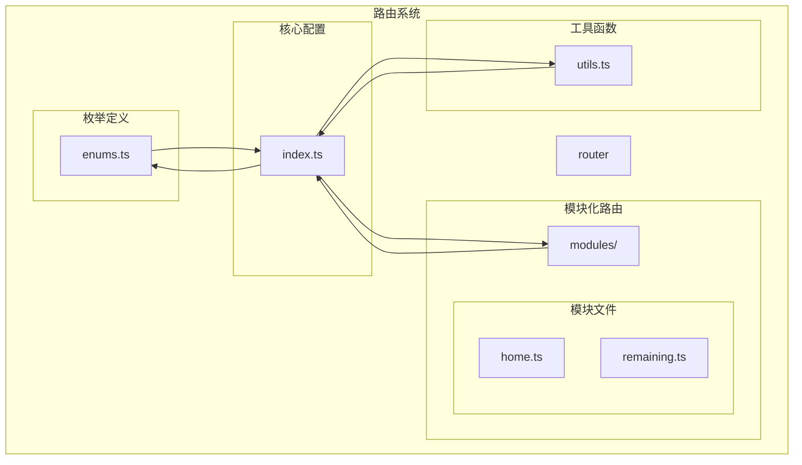
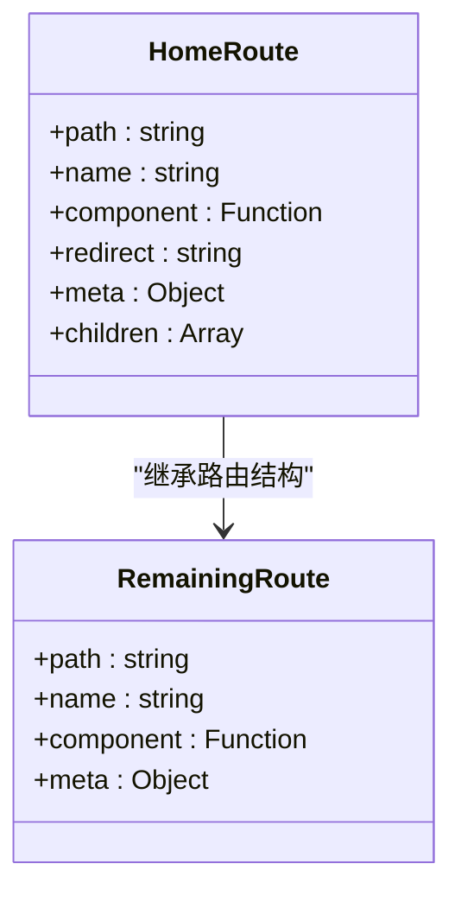
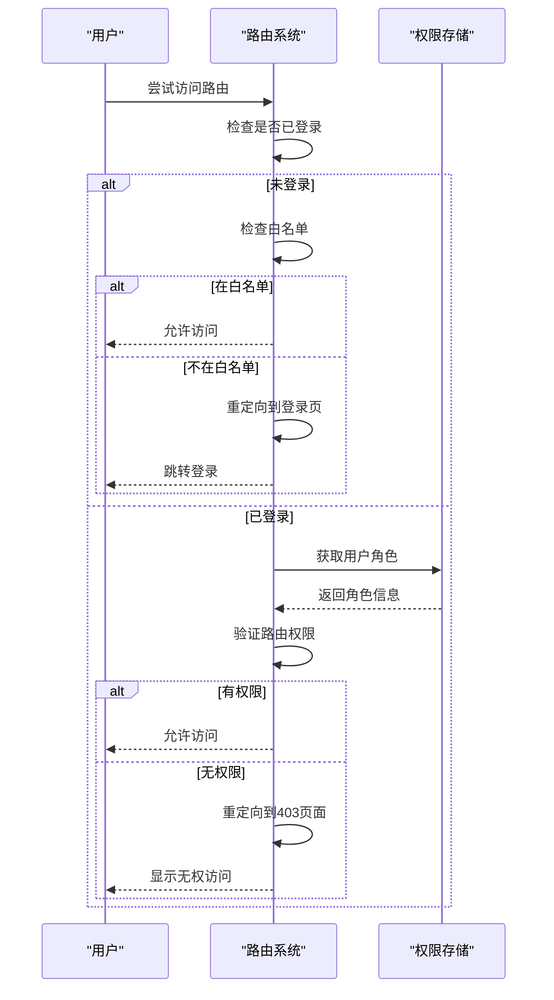
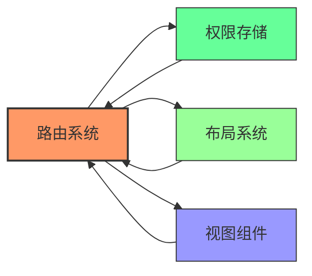

# 路由系统

<cite>
**Referenced Files in This Document**   
- [index.ts](file://web/src/router/index.ts)
- [utils.ts](file://web/src/router/utils.ts)
- [permission.ts](file://web/src/store/modules/permission.ts)
- [home.ts](file://web/src/router/modules/home.ts)
- [remaining.ts](file://web/src/router/modules/remaining.ts)
- [types.ts](file://web/src/layout/types.ts)
- [enums.ts](file://web/src/router/enums.ts)
</cite>

## 目录
1. [简介](#简介)
2. [项目结构](#项目结构)
3. [核心组件](#核心组件)
4. [架构概述](#架构概述)
5. [详细组件分析](#详细组件分析)
6. [依赖分析](#依赖分析)
7. [性能考虑](#性能考虑)
8. [故障排除指南](#故障排除指南)
9. [结论](#结论)

## 简介
本文档详细阐述了Vue Pure Admin项目中的路由系统设计与实现。该系统基于Vue Router构建，采用模块化管理策略，实现了静态路由与动态路由的有机结合。文档重点介绍了路由配置、权限控制、模块化组织以及相关工具函数的实现机制，为开发者提供了全面的路由系统理解和扩展指导。

## 项目结构
项目路由系统采用清晰的模块化结构，主要包含核心配置、工具函数、模块化路由和枚举定义四个部分。



**Diagram sources**
- [index.ts](file://web/src/router/index.ts)
- [utils.ts](file://web/src/router/utils.ts)
- [home.ts](file://web/src/router/modules/home.ts)
- [remaining.ts](file://web/src/router/modules/remaining.ts)
- [enums.ts](file://web/src/router/enums.ts)

**Section sources**
- [index.ts](file://web/src/router/index.ts)
- [utils.ts](file://web/src/router/utils.ts)

## 核心组件
路由系统的核心组件包括路由实例创建、静态路由处理、动态路由加载和权限控制等关键部分。系统通过`createRouter`函数创建路由实例，并利用`beforeEach`导航守卫实现权限验证和路由拦截。模块化路由设计使得不同功能的路由可以独立管理，提高了代码的可维护性。

**Section sources**
- [index.ts](file://web/src/router/index.ts#L100-L105)
- [utils.ts](file://web/src/router/utils.ts#L233-L270)

## 架构概述
路由系统采用分层架构设计，从底层的路由配置到上层的权限控制形成完整的处理链条。系统首先通过自动导入机制加载所有静态路由模块，然后通过工具函数进行路由格式化处理，最后结合动态路由实现完整的路由配置。


**Diagram sources**
- [index.ts](file://web/src/router/index.ts#L30-L105)
- [utils.ts](file://web/src/router/utils.ts#L233-L270)

## 详细组件分析

### 静态路由配置分析
静态路由配置采用模块化设计，每个功能模块都有独立的路由文件，便于维护和扩展。

#### 模块化路由实现


**Diagram sources**
- [home.ts](file://web/src/router/modules/home.ts)
- [remaining.ts](file://web/src/router/modules/remaining.ts)

**Section sources**
- [home.ts](file://web/src/router/modules/home.ts)
- [remaining.ts](file://web/src/router/modules/remaining.ts)

### 路由工具函数分析
路由工具函数提供了路由处理的核心逻辑，包括路由格式化、权限过滤等功能。

#### 路由格式化工具
```mermaid
flowchart TD
Start([开始]) --> FormatFlattening["扁平化路由处理"]
FormatFlattening --> BuildTree["构建层级树"]
BuildTree --> FormatTwoStage["二级路由格式化"]
FormatTwoStage --> End([完成])
Note over FormatFlattening,FormatTwoStage: 保持keep-alive支持到二级缓存
```

**Diagram sources**
- [utils.ts](file://web/src/router/utils.ts#L233-L270)

**Section sources**
- [utils.ts](file://web/src/router/utils.ts#L233-L270)

### 路由守卫分析
路由守卫实现了系统的权限控制和导航拦截功能，确保用户只能访问其有权限的页面。

#### 导航守卫逻辑


**Diagram sources**
- [index.ts](file://web/src/router/index.ts#L140-L220)

**Section sources**
- [index.ts](file://web/src/router/index.ts#L140-L220)
- [permission.ts](file://web/src/store/modules/permission.ts)

## 依赖分析
路由系统与其他模块存在紧密的依赖关系，形成了完整的功能闭环。



**Diagram sources**
- [index.ts](file://web/src/router/index.ts)
- [permission.ts](file://web/src/store/modules/permission.ts)
- [types.ts](file://web/src/layout/types.ts)

**Section sources**
- [index.ts](file://web/src/router/index.ts)
- [permission.ts](file://web/src/store/modules/permission.ts)

## 性能考虑
路由系统在设计时充分考虑了性能优化，通过多种机制确保系统的高效运行。

1. **路由缓存**：系统支持动态路由缓存到localStorage，减少重复的API请求
2. **懒加载**：所有路由组件都采用异步加载方式，减少初始加载时间
3. **路由格式化优化**：通过`formatTwoStageRoutes`函数将多级路由拍平为二级，提高路由匹配效率
4. **权限过滤优化**：使用`filterNoPermissionTree`函数在初始化时过滤无权限菜单，减少运行时判断

这些优化措施共同确保了路由系统在大型应用中的高性能表现。

## 故障排除指南
在使用路由系统时可能会遇到一些常见问题，以下是相应的解决方案：

**Section sources**
- [index.ts](file://web/src/router/index.ts#L140-L220)
- [utils.ts](file://web/src/router/utils.ts#L233-L270)

## 结论
Vue Pure Admin的路由系统设计精巧，功能完备。通过模块化路由管理、灵活的权限控制和高效的性能优化，为大型管理后台应用提供了可靠的路由解决方案。开发者可以基于此系统轻松扩展新的功能模块，同时确保系统的安全性和稳定性。建议在扩展路由时遵循现有的模块化规范，保持代码的一致性和可维护性。