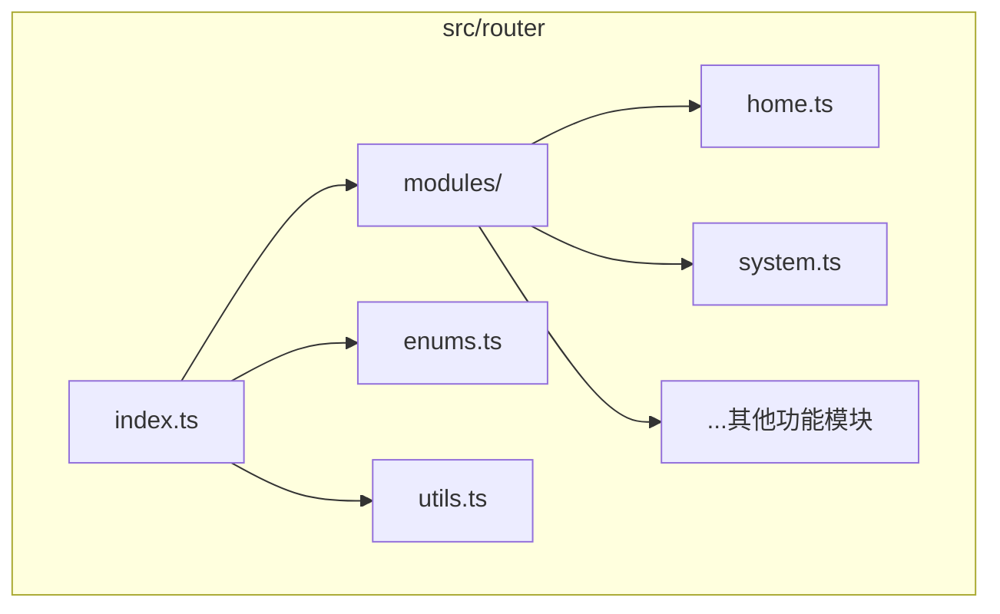
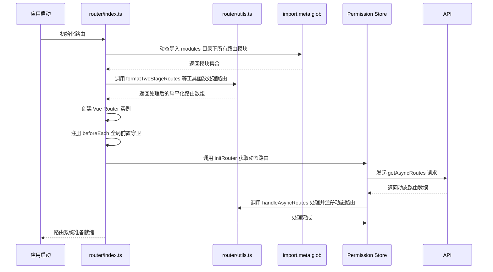
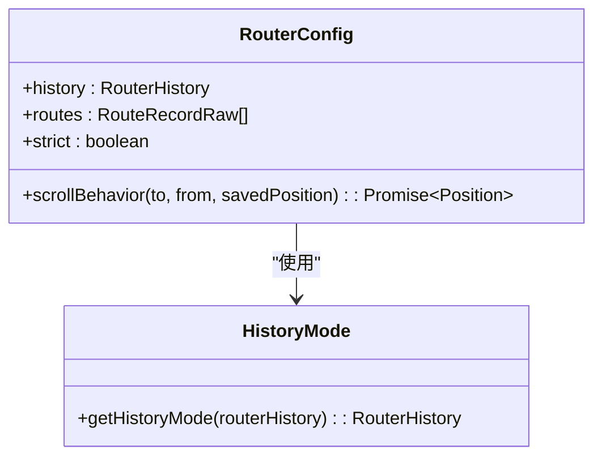
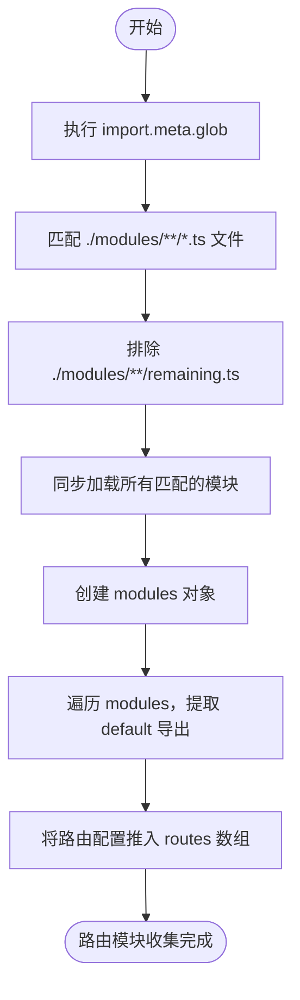
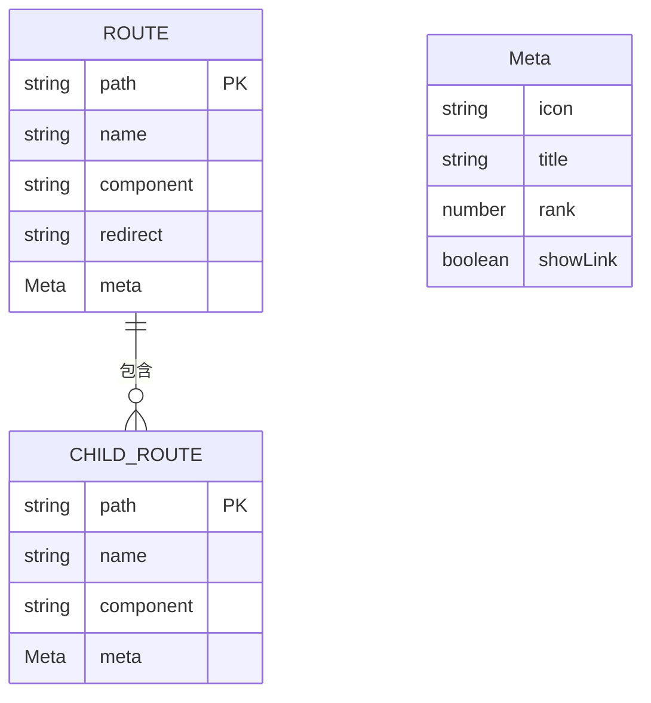
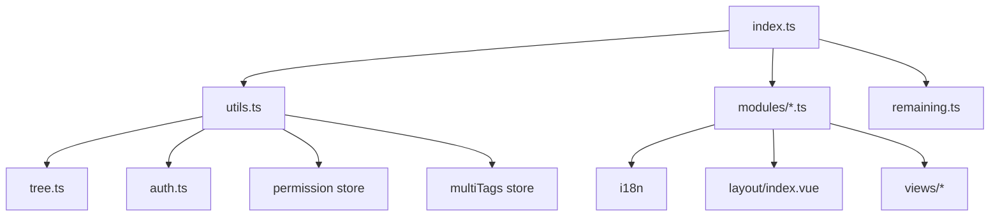

# 路由配置

<cite>
**本文档引用文件**  
- [router/index.ts](file://web/src/router/index.ts)
- [router/enums.ts](file://web/src/router/enums.ts)
- [router/utils.ts](file://web/src/router/utils.ts)
- [router/modules/home.ts](file://web/src/router/modules/home.ts)
- [router/modules/system.ts](file://web/src/router/modules/system.ts)
</cite>

## 目录
1. [简介](#简介)
2. [项目结构](#项目结构)
3. [核心组件](#核心组件)
4. [架构概述](#架构概述)
5. [详细组件分析](#详细组件分析)
6. [依赖分析](#依赖分析)
7. [性能考虑](#性能考虑)
8. [故障排除指南](#故障排除指南)
9. [结论](#结论)

## 简介
本文档详细说明了 `vue-pure-admin` 项目中 Vue Router 的初始化与配置机制。重点介绍路由实例的创建过程、基础配置（如 history 模式）、模块化管理策略，以及通过 `import.meta.glob` 实现的动态路由导入机制。同时，阐述了静态路由的定义规范、路由枚举类型的设计目的，并为开发者提供添加新路由的最佳实践指导。

## 项目结构

Vue Router 相关代码集中于 `src/router` 目录下，采用模块化设计，结构清晰。



**Diagram sources**
- [index.ts](file://web/src/router/index.ts)
- [modules](file://web/src/router/modules)

**Section sources**
- [index.ts](file://web/src/router/index.ts)
- [modules](file://web/src/router/modules)

## 核心组件

核心组件包括路由主入口 `index.ts`、路由枚举定义 `enums.ts`、路由工具函数 `utils.ts` 以及按功能划分的路由模块文件（如 `home.ts`、`system.ts`）。这些文件共同协作，实现了灵活、可扩展的路由系统。

**Section sources**
- [index.ts](file://web/src/router/index.ts)
- [enums.ts](file://web/src/router/enums.ts)
- [utils.ts](file://web/src/router/utils.ts)
- [home.ts](file://web/src/router/modules/home.ts)

## 架构概述

系统采用静态路由与动态路由相结合的架构。静态路由在构建时通过 `import.meta.glob` 自动收集并注册，动态路由则在用户登录后根据权限从后端获取并动态添加。整个流程由 `index.ts` 统一协调，`utils.ts` 提供核心处理逻辑。



**Diagram sources**
- [index.ts](file://web/src/router/index.ts)
- [utils.ts](file://web/src/router/utils.ts)

## 详细组件分析

### 路由初始化与配置分析

`router/index.ts` 是路由系统的入口文件，负责创建路由实例和配置全局守卫。

#### 路由实例创建与基础配置
该文件通过 `createRouter` 函数创建路由实例。`history` 模式由 `getHistoryMode` 工具函数根据环境变量 `VITE_ROUTER_HISTORY` 决定，支持 hash 和 history 两种模式。`scrollBehavior` 配置了页面滚动行为，支持保存滚动位置。



**Diagram sources**
- [index.ts](file://web/src/router/index.ts#L200-L220)
- [utils.ts](file://web/src/router/utils.ts#L370-L390)

**Section sources**
- [index.ts](file://web/src/router/index.ts#L1-L228)
- [utils.ts](file://web/src/router/utils.ts#L370-L390)

### 路由模块化管理机制分析

系统通过 `import.meta.glob` 实现了路由的模块化管理，这是一种基于 Vite 的编译时功能。

#### 动态导入路由模块
`import.meta.glob(["./modules/**/*.ts", "!./modules/**/remaining.ts"], { eager: true })` 语句会同步地、立即地（`eager: true`）导入 `modules` 目录下所有 `.ts` 文件（排除 `remaining.ts`），并将它们作为一个对象返回，键为文件路径，值为模块导出内容。这使得新增路由模块时无需手动修改 `index.ts` 文件。



**Diagram sources**
- [index.ts](file://web/src/router/index.ts#L43-L55)

**Section sources**
- [index.ts](file://web/src/router/index.ts#L43-L85)

### 静态路由定义与结构规范分析

以 `home.ts` 和 `system.ts` 为例，展示了静态路由的定义方式。

#### 静态路由结构
每个路由模块文件默认导出一个符合 `RouteRecordRaw` 类型的路由配置对象。该对象包含 `path`、`name`、`component`、`redirect` 和 `meta` 等核心属性。`meta` 字段用于存储页面元信息，如图标 `icon`、标题 `title` 和排序 `rank`。



**Diagram sources**
- [home.ts](file://web/src/router/modules/home.ts#L1-L28)
- [system.ts](file://web/src/router/modules/system.ts)

**Section sources**
- [home.ts](file://web/src/router/modules/home.ts#L1-L28)

### 路由枚举类型设计分析

`enums.ts` 文件定义了一系列常量，用于统一管理路由的 `rank` 值。

#### 路由枚举设计目的
`RouteEnums`（在代码中体现为 `home`, `system` 等常量）的设计目的是为了集中维护路由的排序等级（`rank`）。通过将 `rank` 值抽离到一个独立的文件中，避免了在各个路由模块中硬编码数字，提高了代码的可维护性和一致性。当需要调整菜单顺序时，只需修改 `enums.ts` 中的常量值即可。

```mermaid
classDiagram
class RouteEnums {
+home : number = 0
+system : number = 14
+monitor : number = 15
+permission : number = 13
+... : ...
}
class HomeModule {
+meta : { rank : home }
}
class SystemModule {
+meta : { rank : system }
}
RouteEnums <|-- HomeModule : "引用"
RouteEnums <|-- SystemModule : "引用"
```

**Diagram sources**
- [enums.ts](file://web/src/router/enums.ts#L1-L62)
- [home.ts](file://web/src/router/modules/home.ts#L1-L28)

**Section sources**
- [enums.ts](file://web/src/router/enums.ts#L1-L62)

## 依赖分析

路由系统依赖于多个内部和外部模块。



**Diagram sources**
- [index.ts](file://web/src/router/index.ts)
- [utils.ts](file://web/src/router/utils.ts)

**Section sources**
- [index.ts](file://web/src/router/index.ts)
- [utils.ts](file://web/src/router/utils.ts)

## 性能考虑

使用 `import.meta.glob` 的 `eager: true` 模式会将所有路由模块在应用启动时同步加载，这可能会增加首屏加载时间。但对于管理后台这类应用，通常路由数量可控，且需要快速响应，此方案是可接受的。对于大型应用，可考虑使用 `eager: false` 实现路由的懒加载。

## 故障排除指南

- **新增路由模块后不显示**：检查文件是否位于 `modules` 目录下，文件扩展名是否为 `.ts`，以及文件是否正确导出了默认的路由配置对象。
- **路由跳转404**：检查 `path` 是否正确，是否与 `views` 目录下的组件路径匹配。动态路由需确保用户有相应权限。
- **菜单排序不正确**：检查 `meta.rank` 是否引用了 `enums.ts` 中的常量，或常量值是否设置正确。

**Section sources**
- [index.ts](file://web/src/router/index.ts)
- [utils.ts](file://web/src/router/utils.ts)

## 结论

`vue-pure-admin` 的路由配置系统设计精良，通过 `import.meta.glob` 实现了路由的自动化和模块化管理，极大地提升了开发效率和可维护性。结合 `enums.ts` 的枚举设计，保证了菜单排序的统一管理。清晰的代码结构和完善的工具函数为开发者提供了良好的扩展基础。