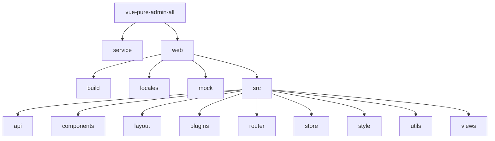
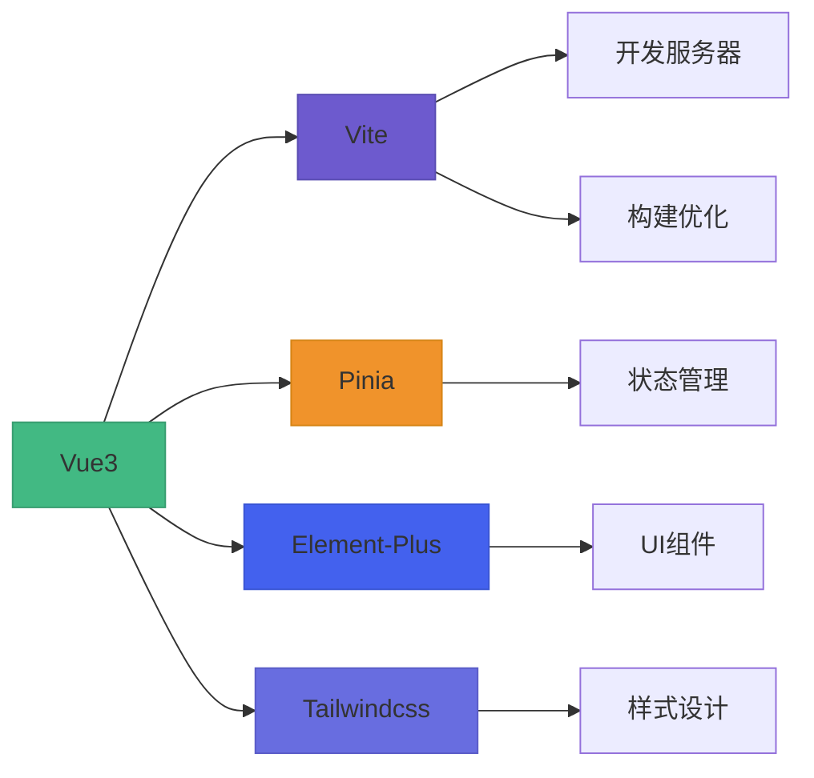
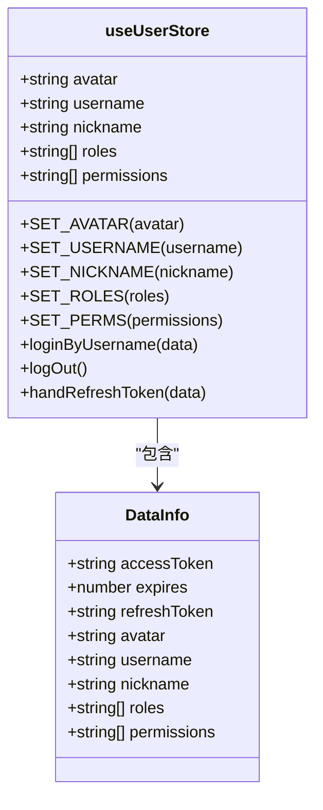
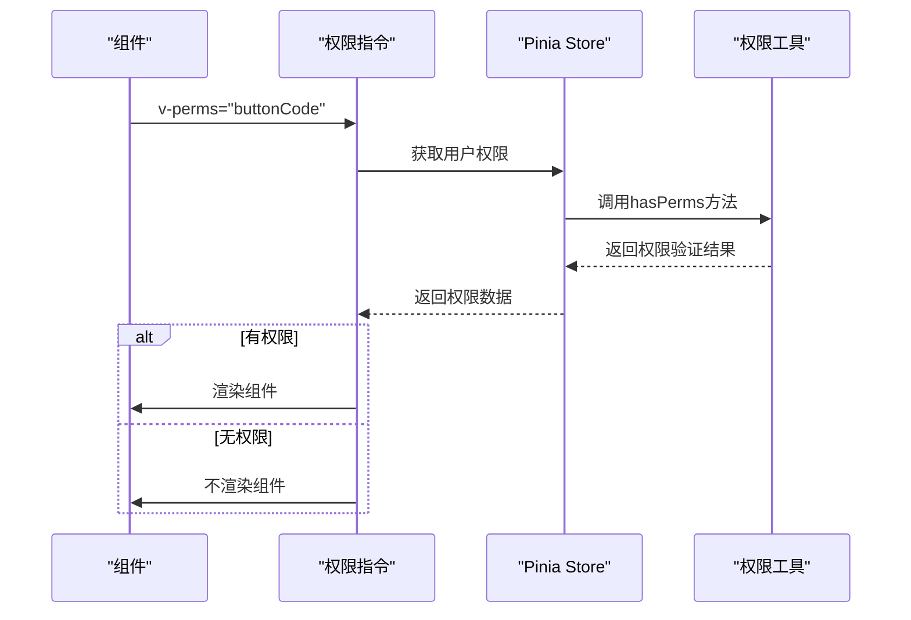
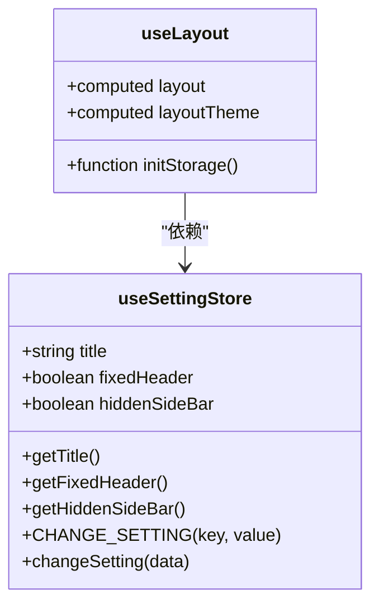
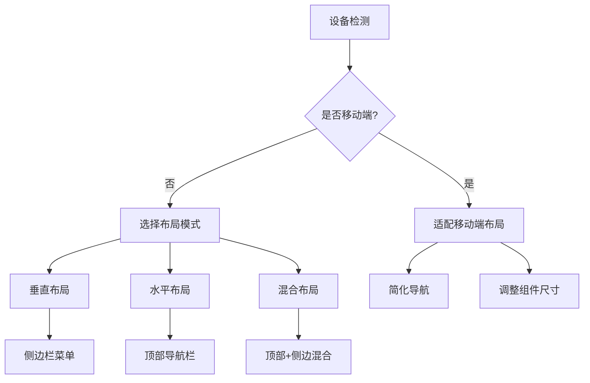
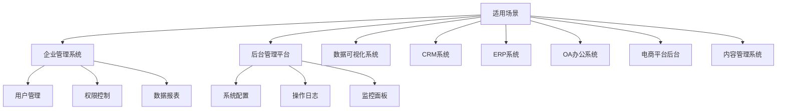

# 项目概述

<cite>
**本文档引用的文件**
- [README.md](file://web/README.md)
- [package.json](file://web/package.json)
- [main.ts](file://web/src/main.ts)
- [App.vue](file://web/src/App.vue)
- [user.ts](file://web/src/store/modules/user.ts)
- [permission.ts](file://web/src/store/modules/permission.ts)
- [settings.ts](file://web/src/store/modules/settings.ts)
- [elementPlus.ts](file://web/src/plugins/elementPlus.ts)
- [i18n.ts](file://web/src/plugins/i18n.ts)
- [useLayout.ts](file://web/src/layout/hooks/useLayout.ts)
- [auth.ts](file://web/src/utils/auth.ts)
- [ReAuth/index.ts](file://web/src/components/ReAuth/index.ts)
- [RePerms/index.ts](file://web/src/components/RePerms/index.ts)
</cite>

## 目录
1. [简介](#简介)
2. [项目结构](#项目结构)
3. [核心特性](#核心特性)
4. [技术栈构成](#技术栈构成)
5. [权限管理机制](#权限管理机制)
6. [多主题与国际化支持](#多主题与国际化支持)
7. [响应式布局实现](#响应式布局实现)
8. [适用场景](#适用场景)
9. [总结](#总结)

## 简介
vue-pure-admin-all 是一个开箱即用的中后台管理系统模板，旨在为开发者提供一个功能完整、结构清晰、易于扩展的企业级前端解决方案。该项目基于现代前端技术栈构建，集成了权限控制、多主题切换、国际化、响应式布局等核心功能，适用于各类企业管理系统和后台管理平台的快速开发。

**Section sources**
- [README.md](file://web/README.md)

## 项目结构
项目采用模块化设计，主要分为 `service`（后端服务）和 `web`（前端应用）两个目录。前端部分基于 Vue3 和 Vite 构建，使用 Pinia 进行状态管理，Element-Plus 作为 UI 组件库，并通过 Tailwindcss 实现现代化样式设计。项目结构清晰，遵循功能划分原则，便于维护和扩展。



**Diagram sources**
- [project_structure](file://web)

## 核心特性
vue-pure-admin-all 提供了丰富的核心特性，包括但不限于：
- **权限管理**：支持页面级别和按钮级别的权限控制
- **多主题支持**：提供多种布局模式和主题切换功能
- **国际化**：内置多语言支持，可轻松实现中英文切换
- **响应式布局**：适配不同设备屏幕尺寸
- **组件丰富**：集成大量常用 UI 组件和业务组件
- **代码规范**：采用 TypeScript 和 ESLint 确保代码质量

**Section sources**
- [README.md](file://web/README.md)

## 技术栈构成
项目采用现代化前端技术栈，各组件协同工作，形成高效开发体系：



**Diagram sources**
- [package.json](file://web/package.json)
- [main.ts](file://web/src/main.ts)

## 权限管理机制
项目实现了完善的权限管理体系，包含用户角色和按钮权限的双重控制机制。

### 用户权限存储
用户权限信息存储在 Pinia 状态管理中，通过 `useUserStore` 模块进行管理：



**Diagram sources**
- [user.ts](file://web/src/store/modules/user.ts)
- [auth.ts](file://web/src/utils/auth.ts)

### 权限验证实现
通过自定义指令和组件实现权限控制：



**Diagram sources**
- [RePerms/index.ts](file://web/src/components/RePerms/index.ts)
- [auth.ts](file://web/src/utils/auth.ts)

**Section sources**
- [user.ts](file://web/src/store/modules/user.ts)
- [permission.ts](file://web/src/store/modules/permission.ts)
- [auth.ts](file://web/src/utils/auth.ts)

## 多主题与国际化支持
项目提供了灵活的主题切换和国际化支持能力。

### 主题布局管理
通过 `useLayout` 钩子和 `useSettingStore` 状态管理实现主题控制：



**Diagram sources**
- [useLayout.ts](file://web/src/layout/hooks/useLayout.ts)
- [settings.ts](file://web/src/store/modules/settings.ts)

### 国际化实现
采用 vue-i18n 实现多语言支持，通过插件方式集成：

```mermaid
flowchart TD
A[初始化] --> B[加载语言包]
B --> C[zh-CN.yaml]
B --> D[en.yaml]
B --> E[element-plus语言包]
C --> F[合并中文配置]
D --> G[合并英文配置]
E --> H[合并组件库语言]
F --> I[创建i18n实例]
G --> I
H --> I
I --> J[应用到Vue实例]
J --> K[全局使用$t()]
```

**Diagram sources**
- [i18n.ts](file://web/src/plugins/i18n.ts)
- [locales](file://web/locales)

**Section sources**
- [i18n.ts](file://web/src/plugins/i18n.ts)
- [useTranslationLang.ts](file://web/src/layout/hooks/useTranslationLang.ts)

## 响应式布局实现
项目通过多种技术手段实现响应式布局，适配不同设备。

### 布局模式
支持三种主要布局模式：
- 垂直布局（vertical）
- 水平布局（horizontal）
- 混合布局（mix）



**Diagram sources**
- [lay-setting/index.vue](file://web/src/layout/components/lay-setting/index.vue)
- [useLayout.ts](file://web/src/layout/hooks/useLayout.ts)

## 适用场景
vue-pure-admin-all 适用于多种企业级应用场景：



**Section sources**
- [README.md](file://web/README.md)

## 总结
vue-pure-admin-all 作为一个功能完备的中后台管理系统模板，通过 Vue3、Vite、Element-Plus、Pinia 和 Tailwindcss 等现代前端技术的有机结合，为开发者提供了高效、稳定、可扩展的开发基础。其完善的权限管理、多主题支持、国际化和响应式布局特性，使其能够满足各类企业级应用的开发需求，大大缩短了项目开发周期，提高了开发效率。