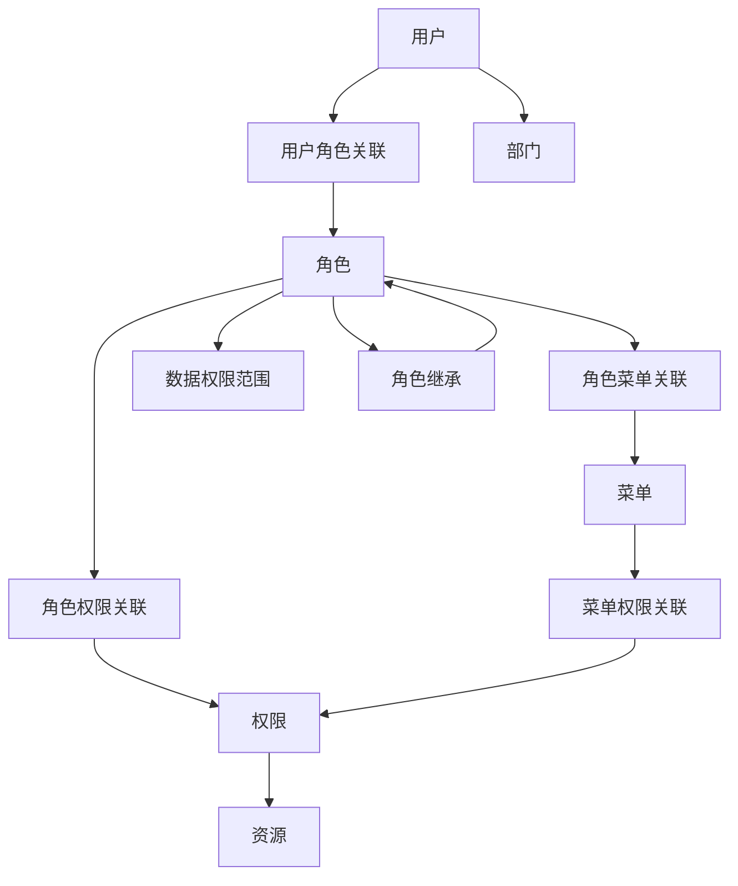

# DDD架构设计与RBAC权限管理系统

## 📋 架构概览

本系统采用领域驱动设计(DDD)架构，结合基于角色的访问控制(RBAC)模式，构建了一个完整的企业级权限管理系统。

### 🏗️ 架构层次

```
┌─────────────────────────────────────────────────────────────┐
│                    Presentation Layer                       │
│                      (表现层)                               │
├─────────────────────────────────────────────────────────────┤
│                   Application Layer                         │
│                      (应用层)                               │
├─────────────────────────────────────────────────────────────┤
│                    Domain Layer                             │
│                      (领域层)                               │
├─────────────────────────────────────────────────────────────┤
│                 Infrastructure Layer                        │
│                    (基础设施层)                             │
└─────────────────────────────────────────────────────────────┘
```

## 🎯 领域模型设计

### 核心领域

#### 1. 用户领域 (User Domain)
- **用户聚合根** (UserAggregate)
  - 用户实体 (User)
  - 用户档案 (UserProfile)
  - 用户会话 (UserSession)
  - 用户角色关联 (UserRole)

#### 2. RBAC权限领域 (RBAC Domain)
- **权限实体** (Permission)
- **资源实体** (Resource)
- **数据权限范围** (DataScope)
- **角色权限关联** (RolePermission)

#### 3. 角色领域 (Role Domain)
- **角色聚合根** (RoleAggregate)
  - 角色实体 (Role)
  - 角色继承关系 (RoleInheritance)
  - 角色菜单关联 (RoleMenu)

#### 4. 菜单领域 (Menu Domain)
- **菜单聚合根** (MenuAggregate)
  - 菜单实体 (Menu)
  - 菜单权限关联 (MenuPermission)
  - 菜单操作记录 (MenuOperation)

#### 5. 组织架构领域 (Organization Domain)
- **部门聚合根** (DepartmentAggregate)
  - 部门实体 (Department)
  - 职位实体 (Position)
  - 用户职位关联 (UserPosition)
  - 部门变更历史 (DepartmentHistory)

#### 6. 审计日志领域 (Audit Domain)
- **日志聚合根** (LogAggregate)
  - 登录日志 (LoginLog)
  - 操作日志 (OperationLog)
  - 系统日志 (SystemLog)
  - 审计日志 (AuditLog)
  - 安全事件 (SecurityEvent)

## 🔐 RBAC权限模型

### 权限模型结构



### 权限控制粒度

1. **功能权限**: 控制用户可以访问哪些功能
2. **数据权限**: 控制用户可以访问哪些数据
3. **字段权限**: 控制用户可以查看/编辑哪些字段
4. **操作权限**: 控制用户可以执行哪些操作

### 数据权限范围

- **全部数据** (ALL): 可访问所有数据
- **自定义数据** (CUSTOM): 可访问指定的数据
- **本部门数据** (DEPT): 只能访问本部门数据
- **本部门及子部门数据** (DEPT_AND_CHILD): 可访问本部门及下级部门数据
- **仅本人数据** (SELF): 只能访问自己的数据

## 📁 目录结构

```
app/
├── domain/                          # 领域层
│   ├── user/                       # 用户领域
│   │   ├── entities/               # 实体
│   │   │   ├── user.py            # 用户实体
│   │   │   └── __init__.py
│   │   ├── aggregates/             # 聚合根
│   │   │   ├── user_aggregate.py  # 用户聚合根
│   │   │   └── __init__.py
│   │   ├── repositories/           # 仓储接口
│   │   │   ├── user_repository.py # 用户仓储接口
│   │   │   └── __init__.py
│   │   ├── services/               # 领域服务
│   │   │   ├── user_service.py    # 用户领域服务
│   │   │   └── __init__.py
│   │   └── __init__.py
│   ├── rbac/                       # RBAC权限领域
│   │   ├── entities/               # 权限实体
│   │   │   ├── permission.py      # 权限实体
│   │   │   └── __init__.py
│   │   ├── value_objects/          # 值对象
│   │   │   ├── permission.py      # 权限值对象
│   │   │   └── __init__.py
│   │   ├── services/               # 权限领域服务
│   │   │   ├── permission_service.py
│   │   │   └── __init__.py
│   │   └── __init__.py
│   ├── role/                       # 角色领域
│   │   ├── entities/
│   │   │   ├── role.py
│   │   │   └── __init__.py
│   │   └── __init__.py
│   ├── menu/                       # 菜单领域
│   │   ├── entities/
│   │   │   ├── menu.py
│   │   │   └── __init__.py
│   │   └── __init__.py
│   ├── organization/               # 组织架构领域
│   │   ├── entities/
│   │   │   ├── department.py
│   │   │   └── __init__.py
│   │   └── __init__.py
│   └── audit/                      # 审计日志领域
│       ├── entities/
│       │   ├── log.py
│       │   └── __init__.py
│       └── __init__.py
├── application/                     # 应用层
│   └── services/                   # 应用服务
├── infrastructure/                  # 基础设施层
│   ├── database/                   # 数据库
│   ├── security/                   # 安全组件
│   │   ├── permission_decorator.py # 权限装饰器
│   │   └── __init__.py
│   └── utils/                      # 工具类
└── presentation/                   # 表现层
    ├── api/                        # API接口
    └── schemas/                    # 数据模式
```

## 🛡️ 权限控制实现

### 权限装饰器

```python
# 权限检查装饰器
@require_permission("user", "read")
async def get_users():
    pass

# 角色检查装饰器  
@require_role("admin")
async def admin_function():
    pass

# 数据权限过滤装饰器
@data_permission_filter("user")
async def get_filtered_users():
    pass
```

### 权限检查流程

1. **用户登录** → 生成JWT令牌
2. **接口调用** → 验证令牌有效性
3. **权限检查** → 检查用户是否有相应权限
4. **数据过滤** → 根据数据权限范围过滤数据
5. **审计日志** → 记录操作日志

## 🎨 领域事件

### 用户领域事件
- 用户创建 (user_created)
- 用户登录成功 (user_login_success)
- 用户登录失败 (user_login_failed)
- 用户锁定 (user_locked)
- 用户解锁 (user_unlocked)
- 密码修改 (user_password_changed)
- 角色变更 (user_roles_changed)

### 权限领域事件
- 权限分配 (permission_granted)
- 权限撤销 (permission_revoked)
- 角色创建 (role_created)
- 角色删除 (role_deleted)

## 📊 数据模型关系

### 核心关系
- User 1:N UserRole N:1 Role (用户-角色多对多)
- Role 1:N RolePermission N:1 Permission (角色-权限多对多)
- Role 1:N RoleMenu N:1 Menu (角色-菜单多对多)
- User N:1 Department (用户-部门多对一)
- Department 1:N Department (部门层级)
- Role 1:N DataScope (角色-数据权限一对多)

## 🔧 扩展性设计

### 插件化权限
- 支持自定义权限类型
- 支持动态权限规则
- 支持权限表达式

### 多租户支持
- 租户隔离
- 租户级别的权限配置
- 跨租户权限管理

### 审计合规
- 完整的审计日志
- 权限变更追踪
- 合规性报告

## 🚀 最佳实践

### 权限设计原则
1. **最小权限原则**: 用户只获得完成工作所需的最小权限
2. **职责分离**: 关键操作需要多个角色协作
3. **定期审查**: 定期审查和清理不必要的权限
4. **权限继承**: 合理使用角色继承减少配置复杂度

### 性能优化
1. **权限缓存**: 缓存用户权限信息
2. **批量查询**: 批量获取权限数据
3. **索引优化**: 为权限查询字段建立索引
4. **异步处理**: 权限变更异步通知

### 安全考虑
1. **权限验证**: 所有敏感操作都要进行权限验证
2. **数据加密**: 敏感数据加密存储
3. **访问日志**: 详细记录权限相关操作
4. **异常监控**: 监控异常权限访问

## 📈 监控与告警

### 关键指标
- 用户登录成功率
- 权限检查耗时
- 异常权限访问次数
- 角色使用分布

### 告警规则
- 连续登录失败告警
- 权限异常访问告警
- 系统错误率告警
- 性能指标异常告警

这个DDD架构设计提供了完整的RBAC权限管理系统，具有高度的可扩展性和可维护性，能够满足企业级应用的复杂权限管理需求。